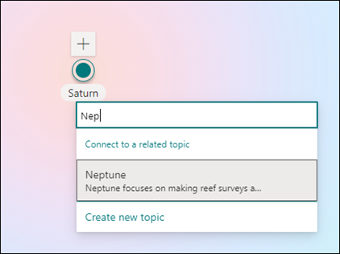

# Изменение существующей темыEdit an existing topic 

 

> [!VIDEO https://www.microsoft.com/videoplayer/embed/RE4LA4n]  

 

В Viva Topics можно изменить существующую тему.In Viva Topics, you can edit an existing topic. Это может потребоваться для исправления или добавления дополнительных сведений на существующую страницу темы.You may need to do this if you want to correct or add additional information to an existing topic page. 

> [!Note] 
> Хотя сведения в теме, собираемой ИИ, обрезаются, обратите внимание, что описание темы и сведения о пользователях, которые вы добавляете вручную при редактировании существующей темы, видны всем пользователям, у которых есть разрешения на просмотр тем.While information in a topic that is gathered by AI is [security trimmed](topic-experiences-security-trimming.md), note that topic description and people information that you manually add when editing an existing topic is visible to all users who have permissions to view topics. 

## ТребованияRequirements

Чтобы изменить существующую тему, необходимо:To edit an existing topic, you need to:
- Лицензия Viva Topics.Have a Viva Topics license.
- Есть разрешения для [**тех, кто может создавать или изменять темы.**](https://docs.microsoft.com/microsoft-365/knowledge/topic-experiences-user-permissions)Have permissions to [**Who can create or edit topics**](https://docs.microsoft.com/microsoft-365/knowledge/topic-experiences-user-permissions). Администраторы знаний могут предоставить пользователям это разрешение в настройках разрешений темы Viva Topics.Knowledge admins can give users this permission in the Viva Topics topic permissions settings. 

> [!Note] 
> Пользователи, у которых есть разрешение на управление темами в Центре тем (менеджеры знаний), уже имеют разрешения на создание и редактирование тем.Users who have permission to manage topics in the Topic center (knowledge managers) already have permissions to create and edit topics.

## Редактирование страницы темыHow to edit a topic page

Пользователи, у которых есть разрешение who **can create or edit topics,** могут изменить тему, открыв страницу темы из выделенной темы, а затем выбрав кнопку <b>Изменить</b> в правом верхнем справа от страницы темы.Users who have the **Who can create or edit topics** permission can edit a topic by opening the topic page from a topic highlight, and then selecting the <b>Edit</b> button on the top right of the topic page. Страница темы также может быть открыта на домашней странице центра тем, на которой можно найти все темы, к которые вы подключены.The topic page can also be opened from the topic center home page where you can find all the topics that you have a connection to.

      

Менеджеры знаний также могут редактировать разделы непосредственно со страницы Управление темами, выбрав тему, а затем выбрав <b>изменить</b> в панели инструментов.Knowledge managers can also edit topics directly from the Manage Topics page by selecting the topic, and then selecting <b>Edit</b> in the toolbar.

      

### Изменение страницы темыTo edit a topic page

1. На странице темы выберите **Изменить**.On the topic page, select **Edit**. Это позволяет вносить изменения по мере необходимости на страницу темы.This lets you make changes as needed to the topic page.

       

2. В разделе <b>Альтернативные имена</b> введите любые другие имена, на которые может быть передана тема.In the <b>Alternate Names</b> section, type any other names that the topic might be referred to. 

       
3. В разделе <b>Описание</b> введите несколько предложений, описывая тему.In the <b>Description</b> section, type a couple of sentences that describes the topic. Или если описание уже существует, при необходимости обнови его.Or if a description already exists, update it if needed.

     

4. В разделе <b>Pinned people</b> можно "приколоть" человека, чтобы показать его в качестве эксперта по теме.In the <b>Pinned people</b> section, you can "pin" a person to show them as a subject matter expert on the topic. Начните с ввода имени или адреса электронной почты в поле <b>Добавление</b> нового пользовательского окна, а затем выберите пользователя, которого вы хотите добавить из результатов поиска.Begin by typing their name or email address in the <b>Add a new user</b> box, and then selecting the user you want to add from the search results. Их можно также "открепить", выбрав значок <b>Remove from list</b> на карточке пользователя.You can also "unpin" them by selecting the <b>Remove from list</b> icon on the user card.
 
     

    В <b>разделе Предлагаемые люди</b> показаны пользователи, которые считают, что ИИ может быть предметом экспертов по этой теме от их подключения к ресурсам по этой теме.The <b>Suggested people</b> section shows users that AI thinks might be subject matter experts on the topic from their connection to resources about the topic. Их состояние можно изменить с "Предложено" на Pinned, выбрав значок пин-кода на карточке пользователя.You can change their status from Suggested to Pinned by selecting the pin icon on the user card.

    

5. В разделе <b>Pinned files and pages</b> можно добавить или "закрепить" файл или страницу сайта SharePoint, связанную с этой темой.In the <b>Pinned files and pages</b> section, you can add or "pin" a file or SharePoint site page that is associated to the topic.

    
 
    Чтобы добавить новый файл, выберите <b>Добавить,</b>выберите сайт SharePoint на своих сайтах Frequent или Followed, а затем выберите файл из библиотеки документов сайта.To add a new file, select <b>Add</b>, select the SharePoint site from your Frequent or Followed sites, and then select the file from the site's document library.

    Вы также можете использовать параметр <b>"Из</b> ссылки", чтобы добавить файл или страницу, предоставив URL-адрес.You can also use the <b>From a link</b> option to add a file or page by providing the URL. 

   > [!Note] 
   > Файлы и страницы, которые вы добавляете, должны располагаться в одном клиенте Microsoft 365.Files and pages that you add must be located within the same Microsoft 365 tenant. Если вы хотите добавить ссылку на внешний ресурс в этой теме, вы можете добавить ее через значок холста на шаге 9.If you want to add a link to an external resource in the topic, you can add it through the canvas icon in step 9.

6. В <b>разделе Рекомендуемые файлы</b> и страницы показаны файлы и страницы, которые ИИ предлагает связывать с этой темой.The <b>Suggested files and pages</b> section shows files and pages that AI suggests to be associated to the topic.

    

    Вы можете изменить предложенный файл или страницу на закрепленный файл или страницу, выбрав закрепленный значок.You can change a suggested file or page to a pinned file or page by selecting the pinned icon.

7.  В <b>разделе Связанные сайты</b> показаны сайты, на которые есть сведения по этой теме.The <b>Related sites</b> section shows sites that have information about the topic. 

     

    Вы можете добавить соответствующий сайт, выбрав <b>Добавить,</b> а затем либо поискать сайт, либо выбрать его из списка частых или недавних сайтов.You can add a related site by selecting <b>Add</b> and then either searching for the site, or selecting it from your list of Frequent or Recent sites. 
    
     

8. В <b>разделе Связанные темы</b> показаны подключения, которые существуют между темами.The <b>Related topics</b> section shows connections that exists between topics. Вы можете добавить подключение к другой теме, выбрав кнопку <b>Подключение</b> к связанной теме, а затем введя имя связанной темы и выбрав ее из результатов поиска.You can add a connection to a different topic by selecting the <b>Connect to a related topic</b> button, and then typing the name of the related topic, and selecting it from the search results. 

      

    Затем можно дать описание того, как связаны темы, и выбрать <b>обновление.</b>You can then give a description of how the topics are related, and select <b>Update</b>. 

     

   Добавленная вами связанная тема будет отображаться в качестве связанной темы.The related topic you added will display as a connected topic.

     

   Чтобы удалить связанную тему, выберите раздел, который необходимо удалить, а затем выберите значок <b>Удалить тему.</b>To remove a related topic, select the topic you want to remove, then select the <b>Remove topic</b> icon. 
 
      

   Затем выберите <b>Удалить</b>.Then select <b>Remove</b>. 

     

9. Вы также можете добавить на страницу статические элементы , такие как текст, изображения или ссылки, выбрав значок холста, который можно найти ниже краткого описания.You can also add static items to the page — such as text, images, or links - by selecting the canvas icon, which you can find below the short description. При его выборе откроется ящик инструментов SharePoint, из которого можно выбрать элемент, который необходимо добавить на страницу.Selecting it will open the SharePoint toolbox from which you can choose the item you want to add to the page.

     

10. Чтобы **сохранить** **изменения,** выберите Публикацию или Переопубликовка.Select **Publish** or **Republish** to save your changes. **Переопубликовка** будет вашим доступным вариантом, если тема была опубликована ранее.**Republish** will be your available option if the topic has been published previously.

## См. такжеSee also

  

