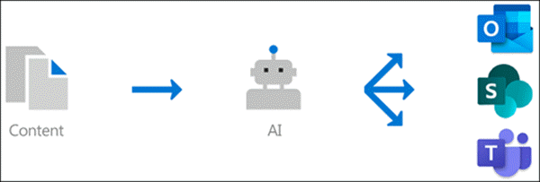

# Центр управления знаниями 0verview (Предварительная версия)Knowledge management 0verview (Preview)

> [!Note] 
> Содержимое этой статьи предназначено для Кортексного предварительного просмотра Project.The content in this article is for Project Cortex Private Preview. [Узнайте больше о Project КортексFind out more about Project Cortex](https://aka.ms/projectcortex) 

Управление знаниями использует технологию Microsoft AI, Microsoft 365, delve, Поиск и другие компоненты и службы для создания сети знаний в среде Microsoft 365.Knowledge management uses Microsoft AI technology, Microsoft 365, Delve, Search, and other components and services to build a knowledge network in your Microsoft 365 environment. 

      

Цель состоит в том, чтобы предоставить пользователям сведения в приложениях, которые используются ежедневно, например Outlook, Teams и SharePoint.It's goal is to deliver information to you users in apps they use everyday, such as Outlook, Teams, and SharePoint.

Например, пользователи видят незнакомые термины в своих электронных письмах, сайтах SharePoint или в беседах Teams, которые им нужно знать.For example, users see unfamiliar terms in their emails, SharePoint sites, or in Teams conversations, that they want to know more about. Элемент управления знаниями использует AI для автоматического поиска и идентификации этих **разделов**, а также для компиляции сведений о них, таких как краткое описание темы и сайтов, файлов и связанных с ними страниц.Knowledge management uses AI to automatically searches for and identifies these **topics**, and compiles information about them, such as a short description, subject matter experts on the topic, and sites, files, and pages that are related to it. При необходимости можно выбрать обновление сведений о разделах.You can choose to update the topic information as needed. После этого можно сделать доступными для пользователей темы, что означает, что для каждого экземпляра раздела, который отображается в приложениях, таких как Outlook, Teams и SharePoint, текст будет выделен.You can then make the topics available to your users, which means that for every instance of the topic that appears in apps such as Outlook, Teams, and SharePoint, the text will be highlighted. Пользователи могут выбрать раздел, чтобы узнать больше о нем с помощью подробных сведений о теме.Users can choose to select the topic to learn more about it through the topic details.

## Обнаружение разделовTopic discovery

Управление знаниями использует технологию Microsoft AI для поиска **разделов** в среде Office 365.Knowledge Management uses Microsoft AI technology to search for **topics** in your Office 365 environment.

Тема — это фраза или термин, который является важным или важным для Организации.A topic is a phrase or term that is organizationally significant or important. Он имеет определенное значение для Организации и имеет связанные с ней ресурсы, которые помогут людям узнать, что это такое, и получить дополнительные сведения о ней.It has a specific meaning to the organization, and has resources related to it that can help people understand what it is and find more information about it.

При обнаружении раздела создается **страница раздела** , содержащая сведения, собранные по обнаружению разделов, например:When a topic is discovered, a **topic page** is created for it that contains information that was gathered through topic discovery, such as:

- Краткое описание статьи.A short description of the topic.
- Пользователи, которые могут быть знаниями о теме.Users who might be knowledgeable about the topic.
- Файлы, страницы и сайты, связанные с темой.Files, pages, and sites that are related to the topic.

## Управление разделамиTopic management

Управление разделами выполняется в **центре темы**Организации.Topic management is done in your organization's **topic center**. Сайт центра разделов создается во время установки и выступает в качестве центра знаний для вашей организации.The topic center site is created during setup and serves as your center of knowledge for your organization. Он будет содержать список всех разделов, обнаруженных в вашей среде, а также все темы, созданные для этих разделов.It will contain a list of all topics that were discovered in your environment, as well as all topic pages that were created for these topics. 

Пользователи, которым предоставлены правильные разрешения, смогут выполнять указанные ниже действия в центре разделов.Users who are provided the correct permissions will be able to do the following in the topic center:

- Подтвердите или отклоните темы, обнаруженные в клиенте.Confirm or reject topics that were discovered in your tenant.
- При необходимости создайте новые разделы вручную (например, если было предоставлено недостаточно сведений для обнаружения с помощью AI).Create new topics manually as needed (for example, if not enough information was provided for it to be discovered through AI).
- Редактирование существующих тематических страниц.Edit existing topic pages. 

Для получения дополнительных сведений ознакомьтесь со статьей ["работать с темой" в центре справки](work-with-topics.md) .See [Work with topic in the topic center](work-with-topics.md) for more information.  

## Элементы управления администратораAdmin controls

Элементы управления администратора в центре администрирования Microsoft 365 позволяют управлять сетью знаний.Admin controls in the Microsoft 365 admin center  allow you to manage your knowledge network. Они позволяют глобальному администратору Microsoft 365 или администратору SharePoint:They allow a Microsoft 365 global or SharePoint admin to:

- Управление тем, какие пользователи в организации могут просматривать темы в своих клиентских приложениях или в результатах поиска SharePoint.Control which users in your organization are allowed to see topics in their client apps or in SharePoint search results.
- Управление тем, какие сайты SharePoint будут обходиться при поиске разделов.Control which SharePoint sites will be crawled to search for topics.
- Настройка обнаружения разделов для исключения определенных терминов, которые не должны быть темой.Configure topic discovery to exclude specific terms that you don't want to be a topic.
- Определять, какие пользователи могут подтверждать или отклонять темы в центре разделов.Control which users can to confirm or reject topics in the topic center.
- Определять, какие пользователи могут создавать и редактировать темы в центре разделов.Control which users can create and edit topics in the topic center.

Для [получения](manage-knowledge-network.md) дополнительных сведений см.See [Manage your knowledge network](manage-knowledge-network.md) for more information. 

## Раздел куратионTopic curation

AI постоянно работает над предоставлением предложений по улучшению тем, как в вашей среде.AI will continually work to provide you suggestions to improve your topics as changes occur in your environment.

Пользователи, которым разрешен доступ к, видят темы в повседневной работе, могут делать предложения по их улучшению.Users who you allow access to see topics in their daily work are allowed to make suggestions to improve them. Например, если пользователь просматривает страницу темы и видит неправильные сведения или необходимо добавить, ссылка на странице темы позволяет отправить запрос на обновление сведений.For example, if a user views the topic page and sees information that is incorrect or needs to be added, a link on the topic page allows them to submit a request to update the information.

Кроме того, пользователи с соответствующими разрешениями могут замечать такие элементы, как беседа в Teams, которые относятся к теме, и добавлять их в определенный раздел.Additionally, users with proper permissions can tag items such as Teams conversation that are relevant to a topic, and add them to a specific topic.

## См. такжеSee also
[Настройка управления знаниямиSet up knowledge management](set-up-knowledge-network.md) 
[Обзор центра разделовTopic center overview](topic-center-overview.md)
