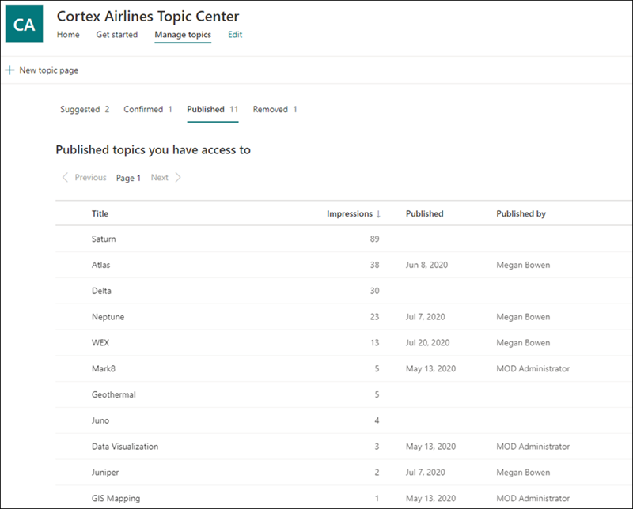
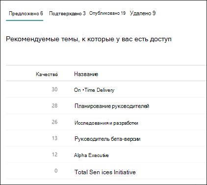
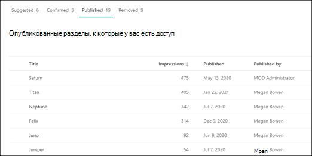

# Управление темами в Центре темManage topics in the Topic center 

 

> [!VIDEO https://www.microsoft.com/videoplayer/embed/RE4LxDx]  

 

В Центре тем Viva Topics менеджер по  анализу может просмотреть страницу "Управление темами", чтобы просмотреть разделы, выявленные в расположениях источников SharePoint, указанные вашим администратором знаний.In the Viva Topics Topic center, a knowledge manager can view the **Manage topics** page to review topics that have been identified in SharePoint source locations as specified by your knowledge admin.  

      

Диспетчеры знаний помогают направлять обнаруженные темы по жизненному циклу тем, в которых данная тема:Knowledge managers help to guide discovered topics through the topic lifecycle in which topics are:

- Рекомендуемый: тема определена ИИ и имеет достаточно вспомогательных ресурсов, подключений и свойств.Suggested: A topic has been identified by AI and has enough supporting resources, connections, and properties.
- Подтверждено: проверена тема, предложенная ИИ.Confirmed: A topic that has been suggested by AI is validated. Проверка делается путем подтверждения от руководителя знаний.Validation is done by confirmation from a knowledge manager. Кроме того, можно подтвердить тему, если хотя бы два пользователя дают положительный отзыв с помощью вопроса об отзывах в карточке темы.Additionally, a topic can be confirmed if at least two users give positive feedback through the feedback question on the topic card.
- Опубликовано: подтвержденный раздел, который был изменен вручную для улучшения качества.Published: A confirmed topic that has been curated: manual edits have been made to improve its quality.
- Удалено: тема отклоняется менеджером по знаниям и больше не будет видна для посетителей.Removed: A topic is rejected by a knowledge manager and will no longer be visible to viewers. Тема может быть в любом состоянии при удалении (рекомендуемой, подтвержденной или опубликованной).The topic can be in any state when it is removed (suggested, confirmed or published). При удалении опубликованного раздела страницу с данными необходимо удалить вручную через библиотеку страниц в центре тем.When a published topic is removed, the page with the curated details will need to be deleted manually through the Pages Library of the topic center.

      

> [!Note] 
> На странице "Управление разделами" каждый менеджер по знаниям сможет видеть только те темы, в которых у них есть доступ к файлам и страницам темы.In the Manage Topics page, each knowledge manager will only be able to see topics where they have access to the files and pages of the topic. Это будет отражено в темах, перечисленных на вкладке "Предложено", "Подтверждено", "Удалено" и "Опубликовано".This will be reflected in the topics that are listed under the Suggested, Confirmed, Removed, and Published tabs. Тем не менее, в этом разделе показывается общее число в организации.The topic counts, however, show the total counts in the organization.

## ТребованияRequirements

Для управления темами в Центре тем необходимо:To manage topics in the Topic center, you need to:
- Лицензия На Viva Topics.Have a Viva Topics license.

- Разрешение [**"Кто может управлять темами".**](https://docs.microsoft.com/microsoft-365/knowledge/topic-experiences-user-permissions)Have the [**Who can manage topics**](https://docs.microsoft.com/microsoft-365/knowledge/topic-experiences-user-permissions) permission. Администраторы знаний могут предоставить пользователям это разрешение в параметрах разрешений раздела Viva Topics.Knowledge admins can give users this permission in the Viva Topics topic permissions settings. 

Вы не сможете просмотреть страницу "Управление разделами" в Центре тем, если у вас нет разрешения "Кто **может управлять темами".**You will not be able to view the Manage Topics page in the Topic Center unless you have the **Who can manage topics** permission.

В центре тем менеджер по анализу может просмотреть разделы, указанные в указанных вами источниках SharePoint, и подтвердить или отклонить их.In the topic center, a knowledge manager can review topics that have been identified in the SharePoint source locations you specified, and can either confirm or reject them. Менеджер по знаниям также может создавать и публиковать новые страницы тем, если они не найдены в обнаружении тем, или редактировать существующие, если их нужно обновить.A knowledge manager can also create and publish new topic pages if one was not found in topic discovery, or edit existing ones if they need to be updated.

## Обзор рекомендуемых разделовReview suggested topics

На странице "Управление разделами в центре тем" разделы, обнаруженные в указанных исходных расположениях SharePoint, будут перечислены на вкладке **"Рекомендуемые".** При необходимости менеджер по анализу может просмотреть неподтвержденные темы и подтвердить или отклонить их.On the Topic center Manage Topics page, topics that were discovered in your specified SharePoint source locations will be listed in the **Suggested** tab. If needed, a knowledge manager can review unconfirmed topics and choose to confirm or reject them.

      

Чтобы просмотреть рекомендуемый раздел:To review a suggested topic:

1. На странице **"Управление темами"** выберите вкладку "Предлагаемые", выберите раздел, чтобы открыть страницу темы. On the **Manage topics** page, select the **Suggested** tab, select the topic to open the topic page. 

2. На странице темы просмотрите страницу  темы и выберите "Изменить", если необходимо внести какие-либо изменения в страницу.On the topic page, review the topic page, and select **Edit** if you need to make any changes to the page. Публикация любых изменений переместит этот раздел на вкладку **"Опубликовано".**Publishing any edits will move this topic to the **Published** tab.

3. После просмотра этой темы снова перейдите на страницу "Управление темами".After reviewing the topic, go back to the Manage topics page. Для выбранного раздела вы можете:For the selected topic, you can:

   - Чтобы подтвердить раздел, выберите этот контрольный знак.Select the check mark to confirm the topic.
    
   - Выберите **x,** если нужно отклонить раздел.Select the **x** if you want to reject the topic.

    Подтвержденные разделы будут удалены из списка **"Предложенные"** и теперь отображаются в списке **"Подтверждено".**Confirmed topics will be removed from the **Suggested** list and will now display in the **Confirmed** list.

    Отклоненные темы будут удалены из списка **"Рекомендуемые"** и теперь отображаются на вкладке **"Удалено".**Rejected topics will be removed from the **Suggested** list and will now display in the **Removed** tab.

     

### Оценка качестваQuality score

Каждому разделу, который отображается на <b></b> странице "Рекомендуемые темы", назначена оценка качества.Each topic that appears in your Suggested Topics page has a <b>Quality</b> score assigned to it. Оценка качества отражает объем информации, которую среднестатистического пользователя будет видеть для информации по этой теме, у учетом того, что каждый пользователь может видеть больше или меньше информации из-за разрешений, которые он может или не иметь для информации в разделе.The Quality score is a reflection of the amount of information that the average user will see for the information on the topic, keeping in mind that each user may see more or less information because of the permissions they may or may not have on the information in a topic. 

Оценка качества помогает получить представление о темах с наибольшей информацией и может быть полезна для поиска разделов, которые могут потребоваться изменить вручную.The Quality score can help give insight to the topics with the most information and can be useful for finding topics that may need to be manually edited.  Например, тема с более низким показателем качества может быть результатом того, что у некоторых пользователей нет разрешений SharePoint на доступ к файлам или сайтам, включенным в эту статью.For example, a topic with a lower quality score may be the result of some users not having SharePoint permissions to pertinent files or sites that AI has included in the topic. Затем участник может изменить раздел, включив в него сведения (если это необходимо), которые затем будут просматриваться для всех пользователей, которые могут просматривать этот раздел.A contributor could then edit the topic to include the information (when appropriate), which will then be viewable to all users who can view the topic.

Оценка качества может варьироваться от 1 до 100.The Quality score could range from 1 to 100. Новый обнаруженный раздел будет иметь оценку качества 0, пока ее не просмотрет два или более пользователей.A newly discovered topic will have a quality score of 0 until two or more users have viewed it. Каждый показатель качества пользователей определяется рядом факторов, таких как объем контента, отображаемого для конкретного пользователя, который управляет разрешениями пользователя, так как на каждой странице темы имеется триммер безопасности для контента, сгенерированного ИИ.Each users quality score is determined by a number of factors, such as the amount of content displayed for the specific user, which is controlled the user's permissions as each topic page has security trimming in place for AI-generated content. Показатель качества, показанный на вкладке "Рекомендуемые темы", является средним для каждого пользователя.The Quality score shown on the Suggested topics tab is an average of each users individual score.

### ПросмотрыImpressions

В <b>столбце</b> "Просмотры" отображается количество просмотров темы для конечных пользователей.The <b>Impressions</b> column displays the number of times a topic has been shown to end users. Это относится к представлениям через карточки темы в поиске, с помощью выделений тем и представлений Центра тем.This includes views through topic cards in search, through topic highlights, and through Topic center views. В нем не отражены основные разделы по этим темам, но они отображаются.It does not reflect the click-through on these topics, but that the topic has been displayed. Столбец "Просмотры" будет показываться для разделов на вкладке "Предложенные", "Подтверждено", "Опубликовано" и "Удалено" на странице "Управление темами".The Impressions column will show for topics in the Suggested, Confirmed, Published, and Removed tabs in the Manage Topics page.

## Подтвержденные разделыConfirmed topics

На странице "Управление темами" на вкладке "Подтверждение" будут перечислены разделы, обнаруженные в указанных источниках SharePoint и подтвержденные менеджером по  знаниям или "крауд-источником", которые были подтверждены двумя или более людьми с помощью механизма обратной связи с карточкой. При необходимости пользователь с разрешениями на управление темами может просмотреть подтвержденные темы и отклонить их.On the Manage topics page, topics that were discovered in your specified SharePoint source locations and have been confirmed by a knowledge manager or "crowd-sourced" confirmed by two or more people through the card feedback mechanism will be listed in the **Confirmed** tab. If needed, a user with permissions to manage topics can review confirmed topics and choose to reject them.

Чтобы просмотреть подтвержденный раздел:To review a confirmed topic:

1. На **вкладке "Подтверждено"** выберите раздел, чтобы открыть страницу темы.On the **Confirmed** tab, select the topic to open the topic page. 

2. На странице темы просмотрите страницу  темы и выберите "Изменить", если необходимо внести какие-либо изменения в страницу.On the topic page, review the topic page, and select **Edit** if you need to make any changes to the page.

Обратите внимание, что вы по-прежнему можете отклонить подтвержденную тему.Note that you can still chose to reject a confirmed topic.  Для этого перейдите к выбранному разделу в списке "Подтверждено" и выберите **x,** если нужно отклонить этот раздел.To do this, go to the selected topic in the Confirmed list, and select the **x** if you want to reject the topic.

## Опубликованные разделыPublished topics
Опубликованные разделы были изменены таким образом, чтобы определенная информация всегда появлялась на странице.Published topics have been edited so that specific information will always appear to whoever encounters the page. Здесь также перечислены темы, созданные вручную.Manually created topics are listed here as well.

      

