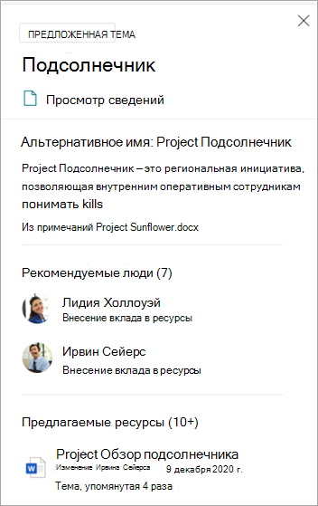
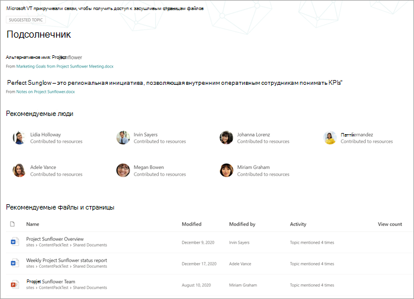
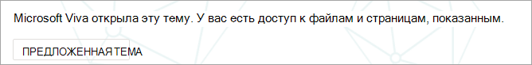
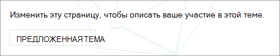
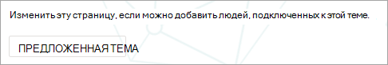
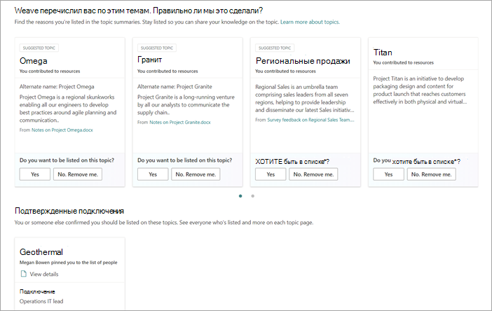

# Управление темами в масштабе в Microsoft Viva Topics

При индексации SharePoint сайтов или всей организации для Viva Topics может возникнуть множество тем. Когда это произойдет, и вы увидите тысячи предлагаемых тем на странице **Управление** темами, может быть сложно узнать, с чего начать. В этой статье описывается, как Viva Topics помогает оптимизировать, какие темы и сведения показаны пользователям, которые ищут информацию, даже в крупных организациях с большим количеством тем.

Во-первых, напоминание о [четырех этапах для тем:](manage-topics.md#topic-stages)

- **Рекомендуемые**. Тема определена с помощью ИИ и содержит достаточно вспомогательных ресурсов, связей и свойств. (Они помечены как **рекомендуемая тема** в пользовательском интерфейсе.)

- **Подтверждено.** Тема, предложенная ИИ, должна быть проверена. Проверка темы возникает, когда либо:
   - Руководитель знаний подтверждает тему. Руководитель знаний [подтверждает тему на](manage-topics.md#confirmed-topics) странице Управление **темами.** 
   - Несколько пользователей подтверждают тему. Должна быть сеть из двух положительных голосов, полученных от пользователей, голосовавших с помощью механизма обратной связи на карточке темы. Например, если один пользователь голосовал положительно, а один — отрицательный для определенной темы, для подтверждения этой темы по-прежнему потребуется еще два положительных голоса.
 
- **Опубликовано:** подтвержденная тема, которая была куратором. Вручную были сделаны изменения, чтобы повысить его качество.

- **Удалено.** Тема отклоняется менеджером знаний и больше не будет видна зрителям. Тема может быть удалена в любом состоянии (предложено, подтверждено или опубликовано). Для удаления темы должна быть сеть из двух отрицательных голосов, полученных от пользователей, голосовавших с помощью механизмов обратной связи на карточке темы. Например, если один пользователь голосовал отрицательно, а один — положительно для определенной темы, для удаления темы по-прежнему потребуется еще два отрицательных голоса. После удаления опубликованной темы страницу с кураторами необходимо удалять вручную через Библиотеку страниц центра темы.

## Роль диспетчера знаний 

При настройке Viva Topics вы добавите группу пользователей, которым предоставлены разрешения, чтобы увидеть страницу **Управление** темами в центре тем. Он появится только для тех пользователей, которые занимают роль основного куратора для тем. Они будут иметь доступ к данным по темам и смогут видеть списки всех тем, которые они имеют доступ к обзору и куратору.

Сотрудники в этой роли должны иметь широкие разрешения на просмотр широкого спектра тем. Если разрешения сегментировать, может потребоваться выбрать группу пользователей, которые представляют различные области бизнеса и могут курировать для своих областей.

При первом просмотре тем в центре темы предлагаемые темы являются чисто ИИ-определением. Руководителям знаний может потребоваться просмотреть каждый из них перед развертыванием Viva Topics для широкого сообщества пользователей. При работе в масштабе этот подход редко является практическим из-за тысяч тем.

Рекомендуемый подход — найти баланс наиболее актуальных или важных тем для первоначального набора пользователей и сосредоточиться на курированиях этих тем перед выкатом Viva Topics. Начните собирать отзывы пользователей и разрешать краудсорсингу определять шаблоны использования и вклада пользователей для информирования о стратегиях, предложенных в этой статье.

Важно признать, что система будет выявлять и показывать всем пользователям опубликованные темы, предложенные ИИ, и опубликованные под куратором человека. Однако это не означает, что каждая предлагаемая тема будет показана всем конечным пользователям. В установленных параметрах безопасности будут показываться только те темы, к которые каждый сотрудник может получить доступ на основе разрешений, установленных на самом содержимом.

В качестве менеджера знаний с  разрешениями на просмотр страницы Управление темами можно увидеть гораздо большее число тем, перечисленных из-за собственных повышенных разрешений, в зависимости от роли в организации и уровня доступа. Вы также будете иметь доступ к представлениям, которые позволяют видеть темы, перечисленные в одном расположении, а не получать к ним доступ с помощью выделенок или поиска.

Кроме того, существует, скорее всего, меньший процент тем, которые будут рассматриваться большинством пользователей, и больший набор других тем, которые будут рассматриваться гораздо реже из-за разрешений. В результате следует сначала сосредоточить любые задачи куратора на наиболее важных для вашей организации темах, которые, скорее всего, будут рассматриваться более широко.

В этой статье описывается несколько стратегий для курирования. Эти стратегии могут означать, что менее частые или менее распространенные темы не могут быть полностью курированы руководителями знаний. Тем не менее, эти предложенные темы остаются полезными и могут предоставить человеку представление или указатель, что может сохранить часы работы сотрудника в поиске отправной точки. Разрешение краудсорсингом обновлений темам полезно и обеспечивает больше контента и освещения для менее распространенных тем.

В этой статье данная статья содержит рекомендации и рекомендации по подходу к управлению темами и курации.

## Понимание предложенных тем

Когда темы обнаруживаются ИИ, они помечены как рекомендуемая **тема,** как на странице **Управление** темами, так и в карточках тем, которые представлены пользователям. Любая тема, которая не была помечена как удалена, будет показана пользователям, включая подтвержденные, опубликованные и предложенные темы. Темы во всех трех штатах доступны конечным пользователям.

В карточке или странице темы мы используем различные подсказки, чтобы показать, как ИИ сгенерирует информацию. Система использует различные доказательства для добавления ресурсов, в первую очередь с помощью самого контента.

- Метки показывают, что тема предлагается и что она была обнаружена в Viva Topics.  

   

- Сведения о карте указывают, откуда пришло определение, указав ее источник.

- Предлагаемые люди получают путем агрегации людей, которые написали или отредактировали документы с доказательствами темы. Если человек пишет документ с именем темы в заголовке и имеет много представлений, может потребоваться только один документ, чтобы установить его как связанное. Однако во многих случаях больше доказательств лучше, и указанные в списке люди работали над несколькими документами.  

   

- Для показанных файлов и страниц система определяет, сколько раз тема упоминалась в документе, но эта тема также должна быть упомянута в определенном контексте, который определяет ссылку на тему определенного типа (например, проект или группа). Это то, что считается доказательством для ИИ. Система также рассматривает появление имени темы в заголовках документов, типов документов и других функций аналитики (например, представления).

   

   

   

Эти атрибуты показывают, что содержимое было добавлено ИИ, и как ИИ сделал это определение.

### Коммуникации

При общении с пользователями о Viva Topics важно уточнить разницу между темами и контентом, предложенными ИИ, и их кураторными эквивалентами.

Как читатель, вы должны просматривать предлагаемые темы с более критическим глазом. Они не должны восприниматься как авторитетные источники организационной истины. Скорее, это средство поиска способов получения доступа к молчаливому знанию, которое представлено через контент, к который вы имеете доступ. AI обнаружил тему и имеет достаточно доказательств, чтобы показать его вам, но его значение не было подтверждено человеком.

### Элементы управления crowdsourced

Предлагаемые темы можно улучшить путем курирования страницы и с помощью краудсорсирования отзывов по этой теме.

Когда пользователи взаимодействуют с предложенной темой, им может быть задан простой вопрос в пользовательском интерфейсе. Например: *Была ли эта тема актуальной для страницы?* *Является ли этот человек актуальным для этой темы?* *Было ли это определение точным?* С помощью обратной связи с такими вопросами точность тем может повыситься без необходимости курировать страницу имени человека.

Домашняя страница центра тем является еще одним местом, где собираются отзывы по предложенным темам. В центре тем пользователь может увидеть связанные с ним темы и получить возможность либо подтвердить эту связь, либо удалить ее.

   

Если вы разрешаете широкое краудсорсинг тем, следует учитывать следующие факторы:

-   Пользователи увидят параметр **Edit** на страницах темы и смогут изменять страницы в том же опыте, что и другие современные SharePoint страниц.

-   Некоторые **веб-части рекомендуемой** темы не могут быть удалены. Имя темы, альтернативные имена, определение, предложенные люди и предлагаемые ресурсы удалить нельзя.

-   Может занять некоторое время, чтобы предлагаемая или подтвержденная тема,  опубликованная, была перенесена в опубликованный список на странице **Управление темами.**

    -   Предполагаемое время появления темы в поиске, выделениях, хэштегах или аннотациях — 2 часа.

    -   Предполагаемое время появления темы  в опубликованном списке на странице **Управляемые** темы в большинстве случаев не превышает 24 часов. Вы должны видеть их в течение 2 часов, но так как синхронизация будет полностью синхронизирована каждые 24 часа, ожидание не должно быть дольше 24 часов.

-   Возможно, пользователь может оставить опубликованную тему в состоянии проверки или редактирования. Менеджер знаний может увидеть эти сведения в библиотеке страниц центра темы и отменить изменения пользователя, чтобы переиздание темы, или связаться с этим пользователем, чтобы попросить его проверить в этой теме.

### Видимость и содержимое тем основаны на разрешениях пользователя

При просмотре списка предлагаемых тем в качестве менеджера знаний имейте в виду, что содержимое по предложенной теме будет динамически основано на разрешениях. Предлагаемый контент и люди, которые показаны вам, могут быть не теми, которые представлены любому пользователю или другому менеджеру знаний.

На основании разрешений на просмотр контента, связанного с темой, каждый пользователь может видеть различные наборы предлагаемых ресурсов, людей, альтернативных имен и определений.

## Приоритеты тем для курирования

Вы можете использовать следующие стратегии для определения тем, которые могут быть заметными, и поэтому являются хорошими кандидатами для курирования. 

### Таксономии

Использование существующих таксономий может предоставить список тем, которые могут быть видны для пользователей. Например, это могут быть:

-   Продукты и службы, которые предоставляет организация

-   Teams организации

-   Проекты с высоким профилем

Этот подход можно также использовать на уровне департамента или на функциональном уровне с помощью специалистов по темам, которые понимают эту область организации. Цель состоит не в том, чтобы они рассмотрели выбор или все темы. Вместо этого они привнося свой собственный опыт в области домена, чтобы направлять выборочное кураторирование.

### Поиск

Общие термины поиска часто обнаруживаются в качестве тем. С помощью [верхних отчетов о запросах](/sharepoint/view-search-usage-reports)в Microsoft Search можно определить наиболее частые термины поиска в организации. Если для этих терминов были открыты темы, они могут быть хорошими кандидатами для курирования. Эти темы могут быть представлены как карточки ответа в Microsoft Search.

Если вы в настоящее время используете [закладки Microsoft Search,](/microsoftsearch/manage-bookmarks)рассмотрите, какие из них можно заменить темой. Карточка ответов закладки содержит название, описание и URL-адрес. В некоторых случаях карточка темы может быть более полезной для пользователя, а в карточке темы также показаны ресурсы и люди.

В опытом поиска пользователя, когда пользователь ищет термин, такой как *путешествия,* результаты поиска отображаются в следующем порядке приоритета в Microsoft Search:

1.  Опубликованные или подтвержденные темы

2.  Закладки

3.  Предлагаемые темы

### Впечатления и оценка качества

Количество [показов](manage-topics.md#impressions) и [оценка качества](manage-topics.md#quality-score) — важные показатели для понимания поведения темы. Значение этих показателей будет ограничено, если только руководители знаний или ИТ-группы имеют доступ к темам. В результате передачи тем пилотной группе пользователей будут создаваться более представительные данные для этих мер.

Темы с высоким количеством показов, скорее всего, будут чаще взаимодействовать. Оценка качества для этих тем даст ощущение того, насколько богаты эти темы. Темы с высоким количеством показов и низкой оценкой качества являются хорошими целями для курирования.

### Ключевые термины из информационной архитектуры крупных организационных сайтов

Крупные сайты порталов в организации, возможно, вложили время в организацию своей информационной архитектуры и навигации своего сайта вокруг ключевых областей тем для своих бизнес-подразделений, продуктовых линий, крупных проектов и так далее. Анализ этих терминов и определение и кураторирование тем для этих терминов могут помочь пользователям, которые ищут информацию по этим областям.

### Использование внутренних баз знаний или сайтов вики-сайтов

Если ваша организация вложила средства в базы знаний или сайты вики-сайтов, они могут предоставить список тем, которые можно использовать для первоначальных усилий по кураторской работе. Если они особенно крупные, выберите в качестве отправной точки наиболее просматриваемые или измененные темы.

## См. также

[Управление темами в центре тем](manage-topics.md)

[Обзор центра тем](topic-center-overview.md)
