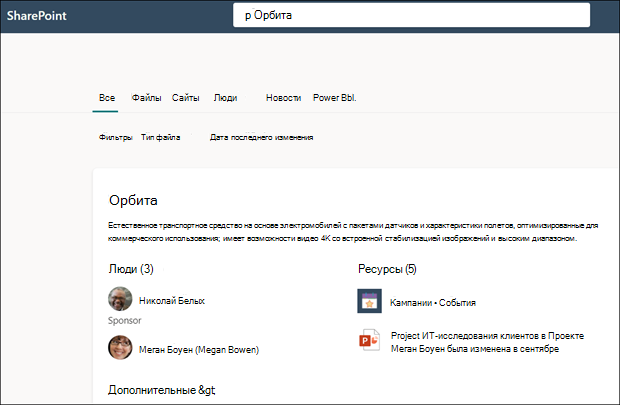

# Поиск в Microsoft Search используется для поиска тем в темах Microsoft Viva

Несмотря на то, что пользователи Viva Topics могут находить темы через основные темы на SharePoint сайтах, они также могут найти их через Microsoft Search. 

## Ответ на тему

При поиске определенной темы в Microsoft Search (например, "Сатурн"), если тема существует и найдена, она будет отображать результат в формате предложения ответа на тему.

В ответе на тему будет отображаться:
- Название темы
- Альтернативные названия: альтернативные названия или акронимы для темы.
- Определение: описание темы, предоставленной ИИ или вручную добавленной человеком.
- Предложенные или закрепленные люди: люди, предложенные ИИ или прикрепив к этой теме человека
- Предлагаемые или закрепленные ресурсы: Файлы, страницы или сайты, предложенные ИИ или прикрепимые к этой теме человеком. 

    

Страница темы может отображаться в результатах поиска, даже если карточка ответа на эту тему не отображается.

Результаты поиска в Word, PowerPoint, Outlook и Excel также будут показывать ответ на тему при обнаружении.

## Акронимы

В Viva Topics можно вручную редактировать тему, чтобы включить аббревиатуру в качестве <b>альтернативного имени.</b> Это позволяет пользователю, который ищет только аббревиатура темы, найти ответ на эту тему с помощью Microsoft Search.

[Ответы на аббревиатуру](/microsoftsearch/manage-acronyms) — это функция, предоставляемая, хотя Microsoft Search и управляется отдельно от Viva Topics.

## Закладки и темы

[Закладки](/microsoftsearch/manage-bookmarks) — это функция поиска Майкрософт, которая помогает людям быстро находить важные сайты и средства только с помощью поиска (например, средства бронирования путешествий на внешнем сайте за пределами Microsoft 365 клиента). Они создаются администраторами поиска в центре Microsoft 365 администрирования. 

Для пользователей, которые ищут сведения о бронировании поездки для работы:

- Если некоторые пользователи знают имя средства перемещения (например, "Concur"), проще создать закладки, чтобы перейти непосредственно на внешний сайт.
- Для пользователей, которые обычно ищут "путешествия", создайте тему на тему "Путешествие", которая имеет сведения, которые они ожидают увидеть. В описании темы рассмотрите возможность добавления ссылки на внешний сайт Concur. Если ссылка вместо этого находится на внутреннем сайте бронирования путешествий, который Microsoft 365 клиенте, вы можете добавить его в "Закрепленные ресурсы".
 
### Приоритет результатов поиска 

В случае поиска пользователя при поиске термина "путешествие", если закладки доступны, на месте темы появится закладки.
