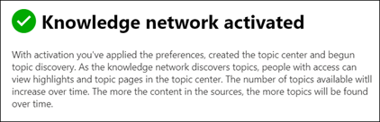

# Настройка управления знаниями (Предварительная версия)Set up Knowledge Management (Preview)

> [!Note] 
> Содержимое этой статьи предназначено для Кортексного предварительного просмотра Project.The content in this article is for Project Cortex Private Preview. [Узнайте больше о Кортекс Project](https://aka.ms/projectcortex).[Find out more about Project Cortex](https://aka.ms/projectcortex).

Вы можете использовать центр администрирования Microsoft 365 для установки и настройки [управления знаниями](knowledge-management-overview.md).You can use the Microsoft 365 admin center to set up and configure [Knowledge Management](knowledge-management-overview.md). 

> [!Important]
> Важно спланировать лучший способ установки и настройки управления знаниями в вашей среде.It is important to plan the best way to set up and configure Knowledge Management in your environment. Например, необходимо принять во внимание следующее:For example, you will need to make considerations about the following:
- Какие сайты SharePoint вы хотите проанализировать для разделов.Which SharePoint sites you want to analyze for topics.
- Сведения о пользователях, которым вы хотите сделать темы видимыми.Which users you want to make topics visible to.
- Пользователи, которым вы хотите предоставить разрешения на управление разделами в центре разделов.Which users you want to give permissions to manage topics in the topic center.
- Пользователи, которым вы хотите предоставить разрешения на создание или Редактирование разделов в центре разделов.Which users you want to give permissions to create or edit topics in the topic center.
- Имя, которое вы хотите присвоить вашему центру справки.What name you want to give your topic center.

> [!Note]
> Для назначения пользователям разрешений, необходимых для просмотра разделов, управления темой и создания и редактирования разделов, может потребоваться создать группы безопасности.You may find it useful to create security groups to assign your users the permissions needed to view topics, manage topic, and create and edit topics.

Администратор также может [вносить изменения в выбранные параметры в любое время после установки](manage-knowledge-network.md) с помощью параметров управления знаниями в центре администрирования Microsoft 365.An admin can also [make changes to your selected settings anytime after setup](manage-knowledge-network.md) through the Knowledge Management settings in the Microsoft 365 admin center.

## ТребованияRequirements 
Чтобы получить доступ к центру администрирования Microsoft 365 и настроить задачи организационной информации, необходимо иметь разрешения глобального администратора или администратора SharePoint.You must have Global Admin or SharePoint admin permissions to be able to access the Microsoft 365 admin center and set up Organizational knowledge tasks.

## Настройка сети знанийSet up your knowledge network

Настройка сети знаний поможет вам выполнить следующие действия:Setting up your knowledge network walks you through the following:

- Обнаружение разделов: выбор источников разделов и разделов, исключаемых из обнаружения.Topic discovery: Selecting topic sources and topics to  exclude from discovery.
- Видимость разделов: Выбор пользователей, которые могут просматривать темы в виде выделенных фрагментов, на страницах поиска и разделов.Topic visibility: Selecting who can view topics as highlights, in search and topic pages.
- Разрешения для разделов: Выбор пользователей, которые могут создавать, изменять и управлять разделами.Topic permissions: Selecting who can create, edit, and manage topics.
- В центре разделов: создание тематического центра.Topic center: Create your topic center.
- Проверка: Проверьте и примените свои параметры.Review: Check and apply your settings.

Чтобы настроить сеть знаний:To set up your knowledge network:

1. В центре администрирования Microsoft 365 (admin.microsoft.com) выберите пункт **Настройка**, а затем просмотрите раздел **сведения о организации** .In the Microsoft 365 admin center (admin.microsoft.com), select **Setup**, and then view the **Organizational Knowledge** section.
2. В разделе " **сведения о организации** " щелкните **подключить пользователей к набору знаний**.In the **Organizational Knowledge** section, click **Connect people to knowledge**. 

      

3. На странице **подключить людей к сведениям** нажмите кнопку Начало **работы** , чтобы проанализировать процесс установки.On the **Connect people to knowledge** page, click **Get started** to walk you through the setup process. 

      

4. На странице **Выбор способа поиска тем в сети базы знаний** можно настроить обнаружение разделов.On the **Choose how the knowledge network can find topics** page, you will configure topic discovery. В разделе **Выбор источников разделов SharePoint** выберите сайты SharePoint, которые будут обходиться в качестве источников для разделов во время обнаружения.In the **Select SharePoint topic sources** section, select which SharePoint sites will be crawled as sources for your topics during discovery. К ним относятся:This includes: 
    а.a. **Все сайты**: все сайты SharePoint в клиенте.**All sites**: All SharePoint sites in your tenant. Это записывает текущие и будущие сайты.This captures current and future sites. 
    б.b. **Все, кроме выбранных сайтов**: введите имена сайтов, которые вы хотите исключить.**All, except selected sites**: Type the names of the sites you want to exclude.  Вы также можете отправить список сайтов, которые вы хотите отказаться от обнаружения.You can also upload a list of sites that you want to opt out from discovery. Сайты, созданные в будущем, будут включены в качестве источников для обнаружения разделов.Sites created in future will be included as sources for topic discovery.  
    в.c. **Только выбранные сайты**: введите имена сайтов, которые необходимо включить в список.**Only selected sites**: Type the names of the sites you want to include. Вы также можете отправить список сайтов.You can also upload a list of sites. Сайты, созданные в будущем, не будут включены в качестве источников для обнаружения разделов.Sites created in the future will not be included as sources for topic discovery.  

      
   
5. В разделе **исключить темы по имени** можно указать имена тем, которые не должны находиться в обнаруженных результатах.In the **Exclude topics by name** section, you can choose to includes names of topics you don't want to be in the discovered results. Используйте этот параметр, чтобы предотвратить включение конфиденциальных разделов в составе сети знаний.Use this setting to prevent sensitive topics from being included as part of the knowledge network. Возможные варианты:Your options include: 
    а.a. **Не исключите темы****Don't exclude any topics**  
    б.b. **Исключение раздела, содержащего эти термины**: если у вас есть темы, которые не нужно показывать пользователям как часть сети знаний.**Exclude topic that contain these terms**:  If you have topics you don’t want shown to users as part of the knowledge network.
   — Скачайте указанный шаблон.- Download the provided template.
   — Введите имена разделов, которые вы хотите исключить.- Enter the topic names you want to exclude. Необходимо указать точный или частичный тип совпадения.You must indicate the match type as exact or partial. Точное совпадение означает, что разделы, соответствующие точному термину, будут исключены.Exact match means that topics that fit the exact term will be excluded. Частичное сравнение является более четким и означает, что разделы, содержащие этот термин, будут исключены.Partial match is stricter and means that topics that contain the term will be excluded. Например, если ввести в качестве имени статьи имя *документа* , *Сборка doc* будет исключена, а *закрепление* не будет.For example, if you enter *Doc* as the topic name, *Doc assembly* will be excluded while *Docker* won't. В именах тем регистр не учитывается.Topic names are case insensitive.  
        -Выберите  **+**   , чтобы импортировать завершенный CSV-файл.- Select **+** to import your completed CSV file. Затем нажмите кнопку **Отправить**.Then select **Upload**. Если файл был обработан успешно, появится зеленая галочка.You’ll see a green check mark if your file has been processed successfully. Нажмите кнопку **Далее**.Select **Next**. 

6. Сведения о том, **кто может видеть темы и где они могут видеть их** , будут настраивать видимость разделов.On the **Who can see topics and where they can see them** page, you will configure topic visibility. В разделе сведения о том, **кто может просматривать разделы в параметрах сети знаний** , вы можете выбрать, кто будет иметь доступ к сведениям о темах, таким как разделы, карточки, темы в поиске и страницы разделов.In the **Who can see topics in the knowledge network** setting, you choose who will have access to topic details, such as highlighted topics, topic cards, topic answers in search, and topic pages. Можно выбрать:You can select: 
    а.a. **Все в организации****Everyone in your organization** 
    б.b. **Только выбранные пользователи или группы безопасности****Only selected people or security groups** 
    в.c. **Никто****No one** 

       

 > [!Note] 
 > Несмотря на то, что этот параметр позволяет выбрать любого пользователя в Организации, будут доступны только те пользователи, которым назначены лицензии управления знаниями.While this setting allows you to select any user in your organization, only users who have knowledge management licenses assigned to them will be able to view topics. 

7. На странице " **разрешения для управления** темами" вы можете выбрать, кто будет иметь возможность создавать, изменять и управлять разделами.In the **Permissions for topic management** page, you choose who will be able to create, edit, or manage topics. В разделе **пользователи могут создавать и изменять разделы** можно выбрать:In the **Who can create and edit topics** section, you can select: 
    а.a. **Все в организации****Everyone in your organization** 
    б.b. **Только выбранные пользователи или группы безопасности****Only selected people or security groups** 
8. В разделе **кто может управлять** разделами можно выбрать:In the **Who can manage topics** section, you can select: 
    а.a. **Все в организации****Everyone in your organization** 
    б.b. **Выбранные пользователи или группы безопасности****Selected people or security groups** 

      

    Нажмите кнопку **Далее**.Select **Next**. 
9. На странице " **Создание центра разделов** " можно создать сайт центра разделов, в котором можно просматривать страницы разделов, а также управлять разделами.On the **Create Topic  Center** page, you can create your topic center site in which topic pages can be viewed and topics can be managed.  В поле **Название центра разделов** введите имя для своего центра справки.In the **Topic center name** box, type a name for your Topic center. При необходимости можно ввести краткое описание в поле **Описание сайта** .You can optionally type a short description in the **Site description** box.  

Нажмите кнопку **Далее**.Select **Next**. 

      

10. На странице **"Проверка и завершение"** можно просмотреть выбранный параметр и внести изменения.On the **Review and finish** page, you can look at your selected setting and choose to make changes. Если вы удовлетворены выбранными параметрами, нажмите кнопку **активировать**.If you are satisfied with your selections, select **Activate**.

       

11. Откроется страница **базы знаний "активированная сеть** ", в результате чего система начнет анализировать выбранные сайты для разделов и создания сайта центра знаний.The **Knowledge network activated** page will display, confirming that the system will now start analyzing your selected sites for topics and creating the Knowledge Center site. Нажмите кнопку **Готово**.Select **Done**. 

       

12. Вы вернетесь на страницу **Connect People to a Knowledge** .You'll be returned to your **Connect people to knowledge** page. На этой странице можно выбрать пункт **Управление** , чтобы внести изменения в параметры конфигурации.From this page, you can select **Manage** to make any changes to your configuration settings. 

         

> [!Note]
> После установки администратор может изменить [Выбранные параметры управления знаниями](manage-knowledge-network.md) в любое время, вернувшись на эту страницу.After setup, an admin can [make changes to your selected knowledge management settings](manage-knowledge-network.md) any time by returning to this page.

## См. такжеSee also

  

