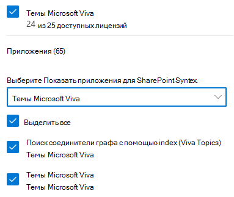

# Настройка тем Microsoft VivaSet up Microsoft Viva Topics

Вы можете использовать центр администрирования Microsoft 365 для настройки и настройки [Темы.](topic-experiences-overview.md)You can use the Microsoft 365 admin center to set up and configure [Topics](topic-experiences-overview.md). 

Важно спланировать оптимальный способ настройки и настройки тем в среде.It is important to plan the best way to set up and configure topics in your environment. Прежде чем приступить к процедурам в этой статье, ознакомьтесь с разделом [Plan for Microsoft Viva Topics.](plan-topic-experiences.md)Be sure to read [Plan for Microsoft Viva Topics](plan-topic-experiences.md) before you begin the procedures in this article.

Вы должны [подписаться на Viva Topics](https://www.microsoft.com/microsoft-viva/topics) и быть глобальным администратором или администратором SharePoint, чтобы получить доступ к центру администрирования Microsoft 365 и настроить Разделы.You must be [subscribed to Viva Topics](https://www.microsoft.com/microsoft-viva/topics) and be a global administrator or SharePoint administrator to access the Microsoft 365 admin center and set up Topics.

Если вы настроили SharePoint на управляемые [устройства,](/sharepoint/control-access-from-unmanaged-devices)не забудьте настроить Разделы с управляемого устройства.If you have configured SharePoint to [require managed devices](/sharepoint/control-access-from-unmanaged-devices), be sure to set up Topics from a managed device.

## ВидеодемонстрацияVideo demonstration

В этом видео показан процесс настройки Разделы в Microsoft 365.This video shows the process for setting up Topics in Microsoft 365.

 

> [!VIDEO https://www.microsoft.com/videoplayer/embed/RE4Li0E]  

 

## Настройка темSet up Topics

Настройка РазделовTo set up Topics

1. В центре [администрирования Microsoft 365](https://admin.microsoft.com)выберите **установку,** а затем просмотреть **раздел Файлы и контент.**In the [Microsoft 365 admin center](https://admin.microsoft.com), select **Setup**, and then view the **Files and content** section.
2. В разделе **Файлы и контент** нажмите кнопку Подключение людей к **знаниям.**In the **Files and content** section, click **Connect people to knowledge**.

     

3. На странице **Подключение людей к знаниям** нажмите **кнопку Начало** ходить вас через процесс установки.On the **Connect people to knowledge** page, click **Get started** to walk you through the setup process.

     

4. На странице **Выбор способов поиска тем Viva Topics** вы настроите обнаружение темы.On the **Choose how Viva Topics can find topics** page, you will configure topic discovery. В разделе **Выбор источников темы SharePoint** выберите, какие сайты SharePoint будут обходиться в качестве источников для ваших тем во время обнаружения.In the **Select SharePoint topic sources** section, select which SharePoint sites will be crawled as sources for your topics during discovery. Варианты:Choose from:
    - **Все сайты.** Все сайты SharePoint в вашей организации.**All sites**: All SharePoint sites in your organization. Это включает текущие и будущие сайты.This includes current and future sites.
    - **Все, кроме выбранных сайтов:** введите имена сайтов, которые необходимо исключить.**All, except selected sites**: Type the names of the sites you want to exclude.  Вы также можете загрузить список сайтов, которые вы хотите отказаться от обнаружения.You can also upload a list of sites that you want to opt out from discovery. Сайты, созданные в будущем, будут включены в качестве источников для обнаружения тем.Sites created in future will be included as sources for topic discovery. 
    - **Только выбранные сайты:** введите имена сайтов, которые вы хотите включить.**Only selected sites**: Type the names of the sites you want to include. Вы также можете загрузить список сайтов.You can also upload a list of sites. Сайты, созданные в будущем, не будут включены в качестве источников для обнаружения тем.Sites created in the future will not be included as sources for topic discovery.
    - **Нет сайтов.** Не включай сайты SharePoint.**No sites**: Do not include any SharePoint sites.

     
   
5. В разделе **Исключить темы по имени** можно добавить имена тем, которые необходимо исключить из обнаружения тем.In the **Exclude topics by name** section, you can add names of topics you want to exclude from topic discovery. Используйте этот параметр, чтобы предотвратить включение конфиденциальной информации в качестве тем.Use this setting to prevent sensitive information from being included as topics. Доступны следующие варианты:The options are:
    - **Не исключайте любые темы****Don't exclude any topics** 
    - **Исключение тем по имени****Exclude topics by name**

     

    (Руководители знаний также могут исключать темы в центре тем после обнаружения.)(Knowledge managers can also exclude topics in the topic center after discovery.)

    #### Как исключить темы по имениHow to exclude topics by name    

    Если необходимо исключить темы, после выбора разделов **Exclude** по имени скачайте шаблон csv и обновите его списком тем, которые необходимо исключить из результатов обнаружения.If you need to exclude topics, after selecting **Exclude topics by name**, download the .csv template and update it with the list of topics that you want to exclude from your discovery results.

     

    В шаблоне CSV введите следующую информацию о темах, которые необходимо исключить:In the CSV template, enter the following information about the topics you want to exclude:

    - **Имя.** Введите имя темы, которая вы хотите исключить.**Name**: Type the name of the topic you want to exclude. Это можно сделать двумя способами:There are two ways to do this:
        - Точное совпадение. Вы можете включить точное имя или аббревиатура (например, *Contoso* или *ATL).*Exact match: You can include the exact name or acronym (for example, *Contoso* or *ATL*).
        - Частичное совпадение. Вы можете исключить все темы, в них есть определенное слово.Partial match: You can exclude all topics that have a specific word in it.  Например, *дуга* исключает все темы со *словом* дуга в нем, такие как круг *дуги,* сварка плазменной дуги или *дуга обучения.* Обратите внимание, что не исключены темы, в которые текст включен как часть слова, например *Архитектура.*For example, *arc* will exclude all topics with the word *arc* in it, such as *Arc circle*, *Plasma arc welding*, or *Training arc*. Note that it will not exclude topics in which the text is included as part of a word, such as *Architecture*.
    - **Означает (необязательно).** Если вы хотите исключить аббревиатура, введите слова, которые обозначает аббревиатура.**Stands for (optional)**: If you want to exclude an acronym, type the words the acronym stands for.
    - **MatchType-Exact/Partial**. Введите, было ли вписано имя *точным* или *частичным типом* совпадения.**MatchType-Exact/Partial**: Type whether the name you entered was an *exact* or *partial* match type.

    После завершения и сэкономленного файла .csv выберите **Просмотр,** чтобы найти и выбрать его.After you've completed and saved your .csv file, select **Browse** to locate and select it.
    
    Нажмите кнопку **Далее**.Select **Next**.

6. На странице **Кто может видеть темы** и где они могут их видеть, будет настроена видимость темы.On the **Who can see topics and where can they see them** page, you will configure topic visibility. В разделе **Кто может** видеть разделы, вы выбираете, у кого будет доступ к деталям темы, например к выделенным темам, карточкам тем, ответам на темы в поиске и страницам тем.In the **Who can see topics** setting, you choose who will have access to topic details, such as highlighted topics, topic cards, topic answers in search, and topic pages. Можно выбрать:You can select:
    - **Все в моей организации****Everyone in my organization**
    - **Только выбранные люди или группы безопасности****Only selected people or security groups**
    - **Никто****No one**

      

    > [!Note] 
    > Хотя этот параметр позволяет выбрать любого пользователя в организации, просматривать темы смогут только пользователи, которым назначены лицензии на раздел Experiences.While this setting allows you to select any user in your organization, only users who have Topic Experiences licenses assigned to them will be able to view topics.

7. На странице **Разрешения для управления темами** вы выбираете, кто сможет создавать, редактировать или управлять темами.In the **Permissions for topic management** page, you choose who will be able to create, edit, or manage topics. В разделе **Кто может создавать и редактировать темы,** можно выбрать:In the **Who can create and edit topics** section, you can select:
    - **Все в моей организации****Everyone in my organization**
    - **Только выбранные люди или группы безопасности****Only selected people or security groups**
    - **Никто****No one**

     

8. В разделе **Кто может управлять темами,** можно выбрать:In the **Who can manage topics** section, you can select:
    - **Все в моей организации****Everyone in my organization**
    - **Только выбранные люди или группы безопасности****Only selected people or security groups**

     

    Нажмите кнопку **Далее**.Select **Next**.

9. На странице **Создание центра тем** можно создать сайт центра тем, на котором можно просматривать страницы тем и управлять темами.On the **Create topic center** page, you can create your topic center site in which topic pages can be viewed and topics can be managed. В поле **имя сайта** введите имя для центра темы.In the **Site name** box, type a name for your topic center. Вы можете дополнительно ввести краткое описание в поле **Описание.**You can optionally type a short description in the **Description** box. 

   Нажмите кнопку **Далее**.Select **Next**.

     

10. На странице **Проверка и завершение** можно просмотреть выбранный параметр и внести в него изменения.On the **Review and finish** page, you can look at your selected setting and choose to make changes. Если выбор вас устраивает, нажмите кнопку **Активировать**.If you are satisfied with your selections, select **Activate**.

11. **Активированная страница Viva Topics** будет отображаться, что подтверждает, что система теперь начнет анализировать выбранные сайты для тем и создавать сайт центра тем.The **Viva Topics activated** page will display, confirming that the system will now start analyzing your selected sites for topics and creating the topic center site. Нажмите кнопку **Готово**.Select **Done**.

12. Вы будете возвращены на страницу **Подключение людей к знаниям.**You'll be returned to your **Connect people to knowledge** page. На этой странице можно выбрать **Управлять**, чтобы внести изменения в параметры настройки.From this page, you can select **Manage** to make any changes to your configuration settings. 

        

Обратите внимание, что при первом открытии темы может потребоваться до двух недель, чтобы все предложенные темы появились в представлении Manage Topics.Note that the first time topic discovery is enabled, it may take up to two weeks for all suggested topics to appear in the Manage Topics view. Обнаружение темы продолжается по мере того, как будут сделаны новые материалы или обновления контента.Topic discovery continues as new content or updates to content are made. В вашей организации обычно имеются колебания числа предлагаемых тем, поскольку Viva Topics оценивает новые сведения.It is normal to have fluctuations in the number of suggested topics in your organization as Viva Topics evaluates new information.

## Назначение лицензийAssign licenses

После настройки темы необходимо назначить лицензии пользователям, которые будут использовать Разделы.Once you have configured topic experiences, you must assign licenses for the users who will be using Topics. Только пользователи с лицензией могут видеть сведения по темам, включая основные моменты, карточки темы, страницы темы и центр тем.Only users with a license can see information on topics including highlights, topic cards, topic pages and the topic center. 

Чтобы назначить лицензии, выполните следующие действия:To assign licenses:

1. В Центре администрирования Microsoft 365 в разделе **Пользователи**, щелкните **Активные пользователи**.In the Microsoft 365 admin center, under **Users**, click **Active users**.

2. Выберите пользователей, которые необходимо лицензировать, и нажмите **кнопку Лицензии и приложения.**Select the users that you want to license, and click **Licenses and apps**.

3. В **соответствии с лицензиями** выберите **Разделы Viva**.Under **Licenses**, select **Viva Topics**.

4. В **приложениях** убедитесь, что **выбраны графовые соединители с помощью Index (Viva Topics)** и **Viva Topics.**Under **Apps**, make sure **Graph Connectors Search with Index (Viva Topics)** and **Viva Topics** are both selected.

   > [!div class="mx-imgBorder"]
   > 

5. Нажмите кнопку **Сохранить изменения**.Click **Save changes**.

## Управление опытом темыManage topic experiences

После настройки Разделы можно изменить параметры, выбранные во время установки в [центре администрирования Microsoft 365.](https://admin.microsoft.com/AdminPortal#/featureexplorer/csi/KnowledgeManagement)Once you have set up Topics, you can change the settings that you chose during setup in the [Microsoft 365 admin center](https://admin.microsoft.com/AdminPortal#/featureexplorer/csi/KnowledgeManagement). См. следующие справочные материалы:See the following references:

- [Управление обнаружением тем в Microsoft Viva TopicsManage topic discovery in Microsoft Viva Topics](topic-experiences-discovery.md)
- [Управление обзором тем в Разделах Microsoft VivaManage topic visibility in Microsoft Viva Topics](topic-experiences-knowledge-rules.md)
- [Управление разрешениями тем в Разделах Microsoft VivaManage topic permissions in Microsoft Viva Topics](topic-experiences-user-permissions.md)
- [Изменение имени центра темы в Разделе Microsoft Viva TopicsChange the name of the topic center in Microsoft Viva Topics](topic-experiences-administration.md)

## См. такжеSee also

[Обзор опытом темыTopic Experiences Overview](topic-experiences-overview.md)
