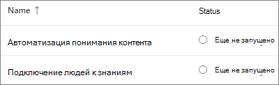
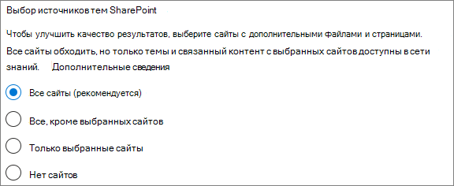
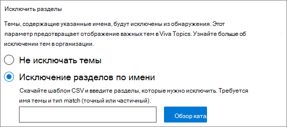
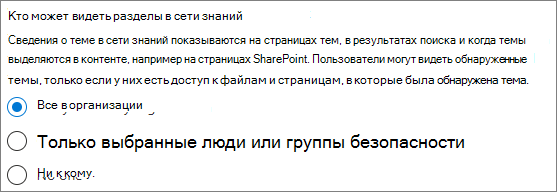
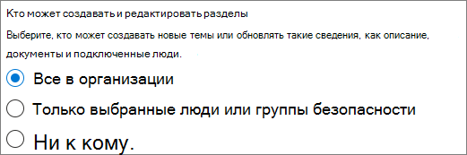
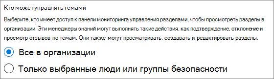
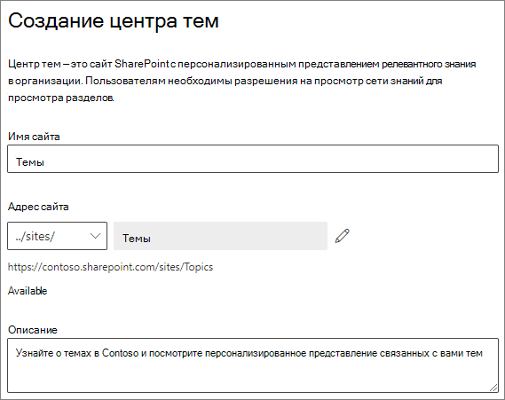
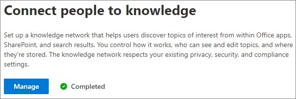

# Настройка Microsoft Viva Topics

Для настройки и настройки разделов можно использовать Центр администрирования [Microsoft](topic-experiences-overview.md)365. 

Важно спланировать лучший способ настройки тем в среде. Прежде чем приступить к процедурам из этой статьи, ознакомьтесь с разделами "Планирование microsoft [Viva".](plan-topic-experiences.md)

Чтобы получить доступ к Центру администрирования Microsoft 365 и настроить разделы, необходимо подписаться на [Viva Topics](https://www.microsoft.com/microsoft-viva/topics) и быть глобальным администратором или администратором SharePoint.

## Видеодемонстрация

В этом видео показан процесс настройки разделов в Microsoft 365.

 

> [!VIDEO https://www.microsoft.com/videoplayer/embed/RE4Li0E]  

 

## Настройка тем

Настройка разделов

1. В Центре [администрирования Microsoft 365](https://admin.microsoft.com)выберите "Программа установки" **и** выберите раздел "Файлы **и содержимое".**
2. В разделе **"Файлы и содержимое"** щелкните **"Подключить людей к знаниям".**

     

3. На странице **"Подключение людей к знаниям"** нажмите кнопку **"Начало** работы", чтобы начать настройку.

     

4. On the **Choose how Viva Topics can find topics** page, you will configure topic discovery. В разделе **"Выбор источников тем SharePoint"** выберите, какие сайты SharePoint будут обходиться в качестве источников для разделов во время обнаружения. Варианты:
    - **Все сайты**: все сайты SharePoint в организации. К ним относятся текущие и будущие сайты.
    - **Все, кроме выбранных сайтов:** введите имена сайтов, которые нужно исключить.  Вы также можете отправить список сайтов, от обнаружения на которые вы хотите отказаться. Сайты, созданные в будущем, будут включены в качестве источников для обнаружения тем. 
    - **Только выбранные сайты:** введите имена сайтов, которые вы хотите включить. Вы также можете отправить список сайтов. Сайты, созданные в будущем, не будут включены в качестве источников для обнаружения тем.
    - **Нет сайтов:** не включать сайты SharePoint.

     
   
5. В разделе **"Исключить разделы** по имени" можно добавить имена разделов, которые нужно исключить из обнаружения тем. Используйте этот параметр, чтобы не включать конфиденциальную информацию в качестве разделов. Доступны следующие варианты:
    - **Не исключать темы** 
    - **Исключение разделов по имени**

     

    (Менеджеры по знаниям также могут исключать темы в центре тем после обнаружения.)

    #### Как исключить темы по имени    

    Если нужно исключить темы, после выбора разделов "Исключить" по имени скачайте шаблон CSV и обновите его, выбрав список тем, которые нужно исключить из результатов обнаружения.

     

    В шаблоне CSV введите следующие сведения о темах, которые необходимо исключить:

    - **Name**: Type the name of the topic you want to exclude. Это можно сделать двумя способами:
        - Точное совпадение: можно включить точное имя или аббревиатуру (например, *Contoso* или *ATL).*
        - Частичное совпадение: можно исключить все темы, в них есть определенное слово.  Например,  arc исключит все темы со словом *arc* в нем, такие как "Arc *circle",* *"Arc arc welding"* или *"Training arc".* Обратите внимание, что он не будет исключать темы, в которых текст включается как часть слова, например *"Архитектура".*
    - **Означает (необязательно).** Если вы хотите исключить аббревиатуру, введите слова, за которые стоит аббревиатура.
    - **MatchType-Exact/Partial**: Type whether the name you entered was an *exact* or *partial* match type.

    После завершения и с сохранения CSV-файла выберите  "Обзор", чтобы найти и выбрать его.
    
    Нажмите кнопку **Далее**.

6. На странице **"Кто может видеть разделы и** где они могут их видеть", вы настроите видимость темы. В разделе **"Кто может** видеть разделы" вы выбираете, кто будет иметь доступ к сведениям о темах, таким как разделы, карточки тем, ответы на темы в поиске и страницы тем. Можно выбрать:
    - **Все в моей организации**
    - **Только выбранные люди или группы безопасности**
    - **Никто**

      

    > [!Note] 
    > Хотя этот параметр позволяет выбрать любого пользователя в организации, только пользователи, которым назначены лицензии на возможности работы с разделами, смогут просматривать разделы.

7. На странице **"Разрешения для управления** темами" выберите, кто сможет создавать, редактировать и управлять темами. В разделе **"Кто может создавать и редактировать разделы"** можно выбрать:
    - **Все в моей организации**
    - **Только выбранные люди или группы безопасности**
    - **Никто**

     

8. В разделе **"Кто может управлять темами"** можно выбрать:
    - **Все в моей организации**
    - **Только выбранные люди или группы безопасности**

     

    Нажмите кнопку **Далее**.

9. На странице **"Создание центра тем"** можно создать сайт центра тем, на котором можно просматривать страницы тем и управлять темами. В поле **"Имя сайта"** введите имя центра тем. При желании можно ввести краткое описание в **поле "Описание".** 

   Нажмите кнопку **Далее**.

     

10. На странице **Проверка и завершение** можно просмотреть выбранный параметр и внести в него изменения. Если выбор вас устраивает, нажмите кнопку **Активировать**.

11. Отобразит активированную страницу **Viva Topics,** подтверждая, что система начнет анализировать выбранные сайты для разделов и создавать сайт центра тем. Нажмите кнопку **Готово**.

12. You'll be returned to your **Connect people to knowledge** page. На этой странице можно выбрать **Управлять**, чтобы внести изменения в параметры настройки. 

        

## Назначение лицензий

После настройки тем необходимо назначить лицензии пользователям, которые будут использовать разделы. Только пользователи с лицензией могут видеть информацию по темам, включая выделения, карточки тем, страницы тем и центр тем. 

Чтобы назначить лицензии, выполните следующие действия:

1. В Центре администрирования Microsoft 365 в разделе **Пользователи**, щелкните **Активные пользователи**.

2. Выберите пользователей, которые вы хотите лицензировать, и щелкните **"Лицензии и приложения".**

3. В **разделе "Приложения"** убедитесь, что **выбраны соединители Graph Search с помощью index** и Topic **Experiences.**

4. Нажмите кнопку **Сохранить изменения**.

## Управление темами

Настроив разделы, вы можете изменить параметры, выбранные во время настройки в Центре администрирования [Microsoft 365.](https://admin.microsoft.com/AdminPortal#/featureexplorer/csi/KnowledgeManagement) См. следующие ссылки:

- [Управление обнаружением тем в Microsoft Viva Topics](topic-experiences-discovery.md)
- [Управление видимостью тем в microsoft Viva Topics](topic-experiences-knowledge-rules.md)
- [Управление разрешениями тем в microsoft Viva Topics](topic-experiences-user-permissions.md)
- [Изменение имени центра тем в Microsoft Viva Topics](topic-experiences-administration.md)

## См. также

[Обзор работы с разделами](topic-experiences-overview.md)
