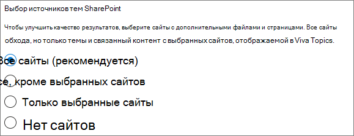
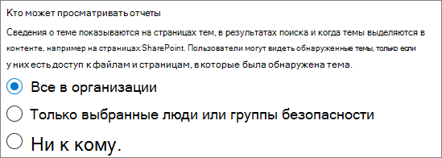

# Настройка тем Microsoft Viva

Вы можете использовать Центр администрирования Microsoft 365 для настройки и настройки [Разделы](topic-experiences-overview.md). 

Важно спланировать оптимальный способ настройки и настройки тем в среде. Прежде чем приступить к процедурам в этой статье, ознакомьтесь с разделом [Plan for Microsoft Viva Topics.](plan-topic-experiences.md)

Вы должны быть подписаны на [Viva Topics](https://www.microsoft.com/microsoft-viva/topics) и быть глобальным администратором или администратором SharePoint, чтобы получить доступ к Центр администрирования Microsoft 365 и настроить Разделы.

Если вы настроили SharePoint для [управляемых устройств,](/sharepoint/control-access-from-unmanaged-devices)не забудьте настроить Разделы с управляемого устройства.

## Видеодемонстрация

В этом видео показан процесс настройки разделов в Microsoft 365.

 

> [!VIDEO https://www.microsoft.com/videoplayer/embed/RE4Li0E]  

 

## Назначение лицензий

Необходимо назначить лицензии пользователям, которые будут использовать Разделы. Только пользователи с лицензией могут видеть информацию по темам, включая ключевые моменты, карточки тем, страницы тем и центр тем. 

Чтобы назначить лицензии, выполните следующие действия:

1. В Центре администрирования Microsoft 365 в разделе **Пользователи**, щелкните **Активные пользователи**.

2. Выберите пользователей, которые необходимо лицензировать, и нажмите **кнопку Лицензии и приложения.**

3. В **соответствии с лицензиями** выберите **Разделы Viva**.

4. В **приложениях** убедитесь, что Graph соединители поиск с **помощью Index (Viva Topics)** и **Viva Topics.**

   > [!div class="mx-imgBorder"]
   > 

5. Нажмите кнопку **Сохранить изменения**.

После присвоения лицензий пользователям может потребоваться до часа.

## Настройка тем

> [!Note]
> При первом открытии темы может потребоваться до двух недель, чтобы все предложенные темы появились в представлении Manage Topics. Обнаружение темы продолжается по мере того, как будут сделаны новые материалы или обновления контента. Количество предлагаемых тем в вашей организации может меняться, так как Viva Темы оценивает новые сведения.

Настройка Разделов
1. В [Центр администрирования Microsoft 365](https://admin.microsoft.com)выберите **установку,** а затем просмотреть **раздел Файлы и контент.**
2. В разделе **Файлы и контент** нажмите **кнопку Подключение для получения знаний.**

     

3. На странице **Подключение людей к знаниям** нажмите кнопку **Начало** ходить по процессу установки.

     

4. На странице **Выбор способов поиска тем Viva Topics** вы настроите обнаружение темы. В разделе **Выбор SharePoint** темы выберите, какие SharePoint будут обхода в качестве источников для ваших тем во время обнаружения. Варианты:
    - **Все сайты**: все сайты SharePoint в организации. К ним относятся существующие и будущие сайты.
    - **Все, кроме выбранных сайтов:** введите имена сайтов, которые необходимо исключить.  Вы также можете загрузить список сайтов, которые вы хотите отказаться от обнаружения. Сайты, созданные в будущем, будут включены в качестве источников для обнаружения тем. 
    - **Только выбранные сайты:** введите имена сайтов, которые вы хотите включить. Вы также можете загрузить список сайтов. Сайты, созданные в будущем, не будут включены в качестве источников для обнаружения тем.
    - **Без сайтов**: сайты SharePoint включены не будут.

     
   
5. В разделе **Исключить темы по имени** можно добавить имена тем, которые необходимо исключить из обнаружения тем. Используйте этот параметр, чтобы предотвратить включение конфиденциальной информации в качестве тем. Доступны следующие варианты.
    - **Не исключайте любые темы** 
    - **Исключить темы по имени**

     

    (Руководители знаний также могут исключать темы в центре тем после обнаружения.)

    #### Как исключить темы по имени    

    Если необходимо исключить темы, после выбора разделов Exclude по имени скачайте шаблон .csv и обновите его списком тем, которые необходимо исключить из результатов обнаружения.

     

    В шаблоне CSV введите следующие сведения о темах, которые хотите исключить:

    - **Имя**: введите имя темы, которую хотите исключить. Это можно сделать двумя способами:
        - Точное совпадение. Вы можете включить точное имя или аббревиатура (например, *Contoso* или *ATL).*
        - Частичное совпадение. Вы можете исключить все темы, в них есть определенное слово.  Например, *дуга* исключает все темы со *словом* дуга в нем, такие как круг *дуги,* сварка плазменной дуги или *дуга обучения.* Обратите внимание, что не исключены темы, в которые текст включен как часть слова, например *Архитектура.*
    - **Означает (необязательно).** Если вы хотите исключить аббревиатура, введите слова, которые обозначает аббревиатура.
    - **MatchType-Exact/Partial**. Введите, было ли вписано имя *точным* или *частичным типом* совпадения.

    После завершения и сэкономленного файла .csv выберите **Просмотр,** чтобы найти и выбрать его.
    
    Нажмите кнопку **Далее**.

6. На Кто **можно увидеть темы** и где они могут видеть их страницу, вы настроите видимость темы. В **Кто** можно увидеть параметры тем, вы выбираете, у кого будет доступ к деталям темы, например к выделенным темам, карточкам тем, ответам на темы в поиске и страницам тем. Можно выбрать:
    - **Все в моей организации**
    - **Только выбранные люди или группы безопасности**
    - **Никто**

      

    > [!Note] 
    > Хотя этот параметр позволяет выбрать любого пользователя в организации, просматривать темы смогут только пользователи, которым назначены лицензии на раздел Experiences.

7. На странице **Разрешения для управления темами** вы выбираете, кто сможет создавать, редактировать или управлять темами. В разделе Кто можно создавать и **редактировать** разделы, можно выбрать:
    - **Все в моей организации**
    - **Только выбранные люди или группы безопасности**
    - **Никто**

     

8. В разделе **Кто тем можно** выбрать:
    - **Все в моей организации**
    - **Только выбранные люди или группы безопасности**

     

    Нажмите кнопку **Далее**.

9. На странице **Создание центра тем** можно создать сайт центра тем, на котором можно просматривать страницы тем и управлять темами. В поле **имя сайта** введите имя для центра темы. Вы можете щелкнуть значок карандаша, если вы хотите изменить URL-адрес. Необязательно введите краткое описание в поле **Описание.** 

   > [!Important]
   > Вы можете изменить имя сайта позже, но вы не можете изменить URL-адрес после завершения мастера.

   Нажмите кнопку **Далее**.

     

10. На странице **Проверка и завершение** можно просмотреть выбранный параметр и внести в него изменения. Если выбор вас устраивает, нажмите кнопку **Активировать**.

11. **Активированная страница Viva Topics** будет отображаться, что подтверждает, что система теперь начнет анализировать выбранные сайты для тем и создавать сайт центра тем. Нажмите кнопку **Готово**.

12. Вы будете возвращены на страницу Подключение **на страницу знаний.** На этой странице можно выбрать **Управлять**, чтобы внести изменения в параметры настройки. 

        

## Управление опытом темы

После настройки Разделы можно изменить параметры, выбранные во время установки [в Центр администрирования Microsoft 365.](https://admin.microsoft.com/AdminPortal#/featureexplorer/csi/KnowledgeManagement) См. следующие справочные материалы:

- [Управление обнаружением тем в Microsoft Viva Topics](topic-experiences-discovery.md)
- [Управление обзором тем в Разделах Microsoft Viva](topic-experiences-knowledge-rules.md)
- [Управление разрешениями тем в Разделах Microsoft Viva](topic-experiences-user-permissions.md)
- [Изменение имени центра темы в Разделе Microsoft Viva Topics](topic-experiences-administration.md)

## См. также

[Обзор опытом темы](topic-experiences-overview.md)
