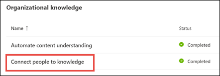

# Обзор центра разделов (Предварительная версия)Topic center overview (Preview)

> [!Note] 
> Содержимое этой статьи предназначено для Кортексного предварительного просмотра Project.The content in this article is for Project Cortex Private Preview. [Узнайте больше о работе с Project Cortex](https://aka.ms/projectcortex).[Find out more about Project Cortex](https://aka.ms/projectcortex).

Центр разделов — это современный сайт SharePoint, который служит в качестве центра знаний для вашей организации.The topic center is a Modern SharePoint site that serves as a center of knowledge for your organization. Он создается во время [настройки управления знаниями](set-up-topic-experiences.md) в центре администрирования Microsoft 365.It is created during [Knowledge Management setup](set-up-topic-experiences.md) in the Microsoft 365 admin center.

В центре разделов есть домашняя страница по умолчанию, на которой можно просмотреть разделы, к которым вы подключены или которые были предложены для подключения.The topic center has a default home page where you can see the topics to which you have been connected or suggested to be connected. Пользователи с соответствующими разрешениями также могут:Users with the proper permissions can also:

- Создание новой страницы разделаCreate a new topic page
- Подтверждение или отклонение рекомендуемых разделовConfirm or reject suggested topics
- Редактирование и публикация изменений на странице темыEdit and publish changes to a topic page

> [!Note] 
> Дополнительные сведения о каждой задаче можно узнать в [разделе "работает с разделами в центре справки"](work-with-topics.md).You can learn more about each task in [Work with topics in the topic center](work-with-topics.md).

## Где находится центр разделовWhere is the topic center

В процессе настройки управления знаниями создается ваш центр разделов.Your topic center is created during Knowledge Management setup. После завершения установки администратор может найти URL-адрес на [странице "Управление центром знаний](topic-experiences-discovery.md)".After setup completes, an admin can find the URL on the [knowledge center management page](topic-experiences-discovery.md).

1. В центре администрирования Microsoft 365 выберите пункт **Настройка** в области навигации, а затем в разделе **сведения о организации** выберите **подключить людей к набору знаний**.In the Microsoft 365 admin center, select **Setup** in the navigation pane, and in the **Organizational Knowledge** section, select **Connect people to knowledge**.

     

2. На странице **подключить людей к сведениям** в разделе " **краткий обзор** " щелкните **адрес в центре разделов** для URL-адреса сайта.On the **Connect people to knowledge** page, in the **At a glance** section, see **Topic center address** for the site URL.

## Домашняя страницаHome page

Для просмотра разделов необходимо иметь разрешения на просмотр разделов и темы.To see the topic center, you need to have permissions to view topics and the topic experiences. Администратор может назначать эти разрешения пользователям в ходе [настройки управления знаниями](set-up-topic-experiences.md), а новые пользователи могут [добавляться](give-user-permissions-to-the-topic-center.md) администратором через центр администрирования Microsoft 365.Your admin can assign these permissions to users during [knowledge management setup](set-up-topic-experiences.md), or new users can be [added afterwards](give-user-permissions-to-the-topic-center.md) by an admin through the Microsoft 365 admin center.

На домашней страницеOn the home page 
- **Просмотр разделов** : Просмотр тематических интерфейсов.**View topics** : view topic experiences. Таким образом, вы можете увидеть темы в Организации и отправить свои отзывы по темам, с которыми вы подключены:So you can see topics in the organization and give feedback on topics where you have been connected:
1. Рекомендуемые подключения — ниже представлены разделы, в которых было предложено мое подключение.Suggested connections - these are topics where my connection has been suggested
2. Подтвержденные подключения — это разделы, в которых я закреплен на теме или подтвердил, что при подтверждении предлагаемого подключения будут перемещены разделы "предложено" и "подтверждено".Confirmed connections - these are topics where I am pinned on the topic or I've confirmed my connection Topics will move from the suggested to confirmed section when I confirm a suggested connection.
После того как я закреплять, изменения, внесенные в страницу, можно выполнить для проверения подключения.Once I'm pinned, edits to the topic page can be done to curate my connection.

- **Создание и редактирование разделов** : "создать раздел", "вы можете редактировать страницы"**Create and edit topics** : New topic is available and you can edit pages

## Разрешения для использования центра управления разделами возможностей управления темамиPermissions to use the Manage Topics capability topic center

Для работы с разделами "Управление разделами" в центре разделов необходимы необходимые разрешения.To work in the Manage Topics section of topic center, you need to have the required permissions. Администратор может назначать эти разрешения пользователям в ходе [настройки управления знаниями](set-up-topic-experiences.md), а новые пользователи могут [добавляться](give-user-permissions-to-the-topic-center.md) администратором через центр администрирования Microsoft 365.Your admin can assign these permissions to users during [knowledge management setup](set-up-topic-experiences.md), or new users can be [added afterwards](give-user-permissions-to-the-topic-center.md) by an admin through the Microsoft 365 admin center.

Пользователям центра разделов могут быть предоставлены два набора разрешений:Topic center users can be given two sets of permissions:

- **Управление разделами** : Используйте панель мониторинга разделов для просмотра тем в Организации.**Manage topics** : Use the topic dashboard to review topics across the organization. Пользователи могут выполнять такие действия, как подтверждение и отклонение неподтвержденных разделов.Users can perform actions such as confirming and rejecting unconfirmed topics.

При необходимости пользователю могут быть предоставлены оба набора разрешений или только один из них.A user can be given both sets of permissions, or only one if needed. 

## Просмотр разделов на панели мониторинга разделовReviewing topics in the topic dashboard

В панели мониторинга темы Показаны темы, которые были mined из указанных исходных расположений.The topic dashboard shows topics that were mined from your specified source locations. В каждом разделе будет представлена дата обнаружения раздела и, если на него есть обратные отзывы.Each topic will show the date the topic was discovered and if any feedback has been provided on it. Пользователь, которому назначены разрешения **Управление разделами** , может просматривать неподтвержденные разделы и выбирать:A user who was assigned **Manage topics** permissions can review the unconfirmed topics and choose to:
- Подтвердите тему: выделяет раздел пользователям, у которых есть доступ, и позволяет просматривать соответствующую карточку темы и страницу темы.Confirm the topic: Highlights the topic to users who have access and lets them see the associated topic card and topic page.
- Отклонить раздел: раздел становится недоступен для пользователей.Reject the topic: Makes the topic not available to users. Раздел перемещается на вкладку **отклонено** и при необходимости его можно подтвердить позже.The topic is moved to the **Rejected** tab and can be confirmed later if needed.

## Создание или редактирование разделаCreate or edit a topic

Если у вас есть разрешения на **Создание и редактирование разделов** , можно выбрать один из следующих вариантов.If you have **Create and edit topics** permissions, you can choose to:

- Изменить существующие темы: вы можете вносить изменения в существующие темы, созданные с помощью обнаружения.Edit existing topics: You can make changes to existing topic pages that were created through discovery.
- Создание новых разделов: вы можете создавать новые темы для тех, которые не были найдены с помощью обнаружения, или если средства AI не нашли достаточно доказательств для создания темы.Create new topics: You can create new topics for ones that were not found through discovery, or if AI tools did not find enough evidence to create a topic.

## См. такжеSee also

  

