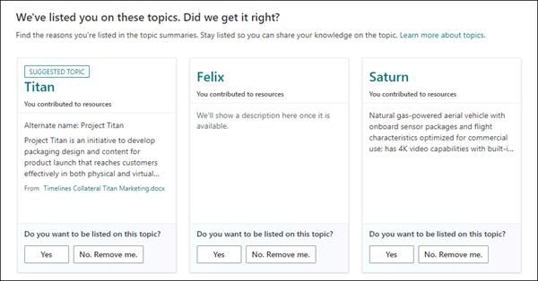

# Обзор Центра темTopic center overview

В темах Microsoft Viva центр тем — это современный сайт SharePoint, который служит центром знаний для вашей организации.In Microsoft Viva Topics, the topic center is a Modern SharePoint site that serves as a center of knowledge for your organization. Он создается во время [настройки Viva Topics](set-up-topic-experiences.md) в Центре администрирования Microsoft 365.It's created during [Viva Topics setup](set-up-topic-experiences.md) in the Microsoft 365 admin center.

В центре тем есть домашняя страница по умолчанию с веб-частью "Разделы", на которой все лицензированные пользователи могут видеть разделы, к которым у них есть подключение.The topic center has a default home page with the Topics web part where all licensed users can see the topics to which they have a connection. 

Хотя все лицензированные пользователи, которые могут просматривать разделы, будут иметь доступ  к центру тем, менеджеры по знаниям могут управлять темами на странице "Управление темами".While all licensed users who can view topics will have access to the topic center, knowledge managers can al manage topics through the **Manage topics** page. Вкладка "Управление темами" будет отображаться только для пользователей с разрешениями **на управление темами.**The Manage topics tab will only display to users who have the **Manage topics** permissions. 

## Где находится мой центр темWhere is my Topic center

Центр тем создается во время настройки Viva Topics.The topic center is created during Viva Topics setup. После завершения настройки администратор может найти URL-адрес на странице управления "Центр [тем".](https://docs.microsoft.com/microsoft-365/knowledge/topic-experiences-administration#to-access-topics-management-settings)After setup completes, an admin can find the URL on the [Topic center management page](https://docs.microsoft.com/microsoft-365/knowledge/topic-experiences-administration#to-access-topics-management-settings).

1. В Центре администрирования Microsoft 365 выберите **"Параметры"** и **"Параметры организации".**In the Microsoft 365 admin center, click **Settings**, then **Org settings**.
2. На **вкладке "Службы"** щелкните **"Темы".**On the **Services** tab, click **Topic Experiences**.

      

3. Выберите **вкладку "Центр** темы". В **разделе "Адрес сайта"** находится ссылка на центр тем.Select the **Topic center** tab. Under **Site address** is a link to your Topic center.

      

## Домашняя страницаHome page

 

> [!VIDEO https://www.microsoft.com/videoplayer/embed/RE4LAhZ]  

 

На домашней странице центра тем можно увидеть разделы в организации, к которым у вас есть подключение.On the topic center home page, you can see the topics in your organization to which you have a connection.

- Рекомендуемые подключения. Вы увидите разделы, перечисленные в статье **"Мы перечислим вас по этим темам". Правильно ли это?**Suggested connections - You will see topics listed under **We've listed you on these topics. Did we get it right?**. В этих разделах предлагается подключение к теме с помощью ИИ.These are topics in which your connection to the topic has been suggested through AI. Например, вы можете быть автором связанного файла или сайта.For example, you may be an author of a related file or site. Вам будет предложено подтвердить, что вы должны оставаться в списке связанных людей для этой темы.You are asked to confirm that you should stay listed as a related person for the topic.

     
 
- Подтвержденные подключения — это темы, в которых вы закреплены на странице темы или подтверждаете предложенное подключение к теме.Confirmed connections - These are topics in which you are pinned on the topic page or you've confirmed a suggested connection to the topic. При подтверждении предложенного подключения разделы будут переходить от предложенного к подтверждению.Topics will move from the suggested to confirmed section when you confirm a suggested connection.
 
     

После подтверждения подключения к теме пользователь может внести изменения на страницу темы, чтобы отредактировать подключение.Once a user confirms their connection to a topic, the user can make edits to the topic page to curate their connection. Например, они могут предоставить дополнительные сведения о своем под подключение к теме.For example, they can provide more information about their connection to the topic.

## Страница "Управление темами"Manage topics page

Чтобы работать в разделе **"Управление** разделами" в Центре  тем, необходимо иметь необходимые разрешения на управление разделами, необходимые для роли диспетчера знаний.To work in the **Manage Topics** section of Topic center, you need to have the required *Manage topics* permissions needed for the knowledge manager role. Администратор может назначить эти разрешения пользователям во время настройки  управления знаниями [или](set-up-topic-experiences.md)добавить новых пользователей впоследствии с помощью Центра администрирования Microsoft 365.Your admin can assign these permissions to users during [knowledge management setup](set-up-topic-experiences.md), or new users can be [added afterwards](topic-experiences-knowledge-rules.md) by an admin through the Microsoft 365 admin center.

На странице "Управление разделами" на панели мониторинга тем показаны все разделы, к которых у вас есть доступ, которые были определены из указанных исходных местоположений.On the Manage Topics page, the topic dashboard shows all the topics, you have access to, that were identified from your specified source locations. В каждом разделе будет покажите дату его обнаружения.Each topic will show the date the topic was discovered. Пользователь, которому назначены разрешения на управление **разделами,** может просмотреть неподтвержденные темы и выбрать:A user who was assigned **Manage topics** permissions can review the unconfirmed topics and choose to:
- Подтвердим раздел. Выделяет тему для пользователей, у которых есть доступ к файлам и страницам, связанным с разделом, и позволяет им увидеть связанную карточку темы и страницу темы.Confirm the topic: Highlights the topic to users who have access to the files and pages related to the topic, and lets them see the associated topic card and topic page.
- Опубликуем раздел "Изменение сведений о теме для улучшения качества первоначально определенной темы" и выделим его для всех пользователей, у которых есть доступ к темам.Publish the topic: Edit the topic information to improve the quality of the topic that was initially identified, and highlights the topic to all users who have view access to topics. 
- Отклонить тему: делает раздел недоступным для пользователей.Reject the topic: Makes the topic not available to users. Тема перемещена на вкладку **"Отклонено"** и может быть подтверждена позже при необходимости.The topic is moved to the **Rejected** tab and can be confirmed later if needed. 

> [!Note] 
> Дополнительные [сведения об](manage-topics.md) управлении разделами на странице "Управление темами" см. в разделах "Управление".See [Manage topics](manage-topics.md) for more details about topic managing topics in the Manage topics page.

## Создание или изменение темыCreate or edit a topic

Если у вас **есть разрешения на** создание и редактирование тем, вы можете:If you have **Create and edit topics** permissions, you can:

- [Редактирование существующих разделов.](edit-a-topic.md)Вы можете вносить изменения в существующие страницы тем, созданные с помощью обнаружения.[Edit existing topics](edit-a-topic.md): You can make changes to existing topic pages that were created through discovery.
- [Создайте новые разделы:](create-a-topic.md)вы можете создать новые темы для тех, которые не были найдены при обнаружении, или если инструменты ИИ не нашли достаточно свидетельств для создания темы.[Create new topics](create-a-topic.md): You can create new topics for ones that were not found through discovery, or if AI tools did not find enough evidence to create a topic.

## См. такжеSee also

  

