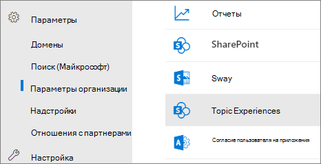
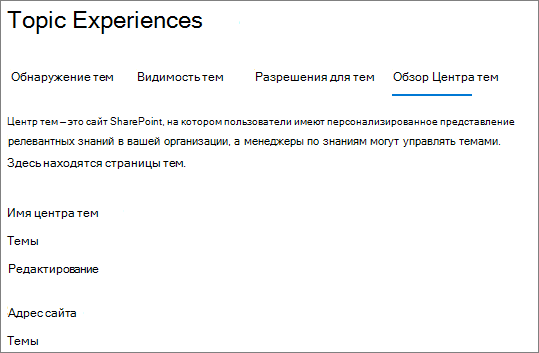

# Обзор центра темы в Microsoft Viva Темы

В Microsoft Viva Темы центре темы является современный сайт SharePoint, который служит центром знаний для вашей организации. Он создается во время [настройки Viva Topics](set-up-topic-experiences.md) в Центр администрирования Microsoft 365.

В центре темы есть домашняя страница по умолчанию с веб-частью **Topics,** где все лицензированные пользователи могут видеть темы, к которым у них есть подключение. 

Хотя все лицензированные пользователи, которые могут просматривать темы, будут иметь доступ к центру тем, менеджеры знаний также могут управлять темами через страницу **Управление темами.** Вкладка **"Управление** темами" будет отображаться только пользователям, у которых есть разрешения на управление темами. 

## Где находится мой центр тем

Центр тем создается во время установки Viva Topics. После завершения настройки администратор может найти URL-адрес на странице управления [центром темы.](./topic-experiences-administration.md#to-access-topics-management-settings)

1. В Центр администрирования Microsoft 365 **выберите** Параметры, а затем выберите **параметры Org.**
2. На **вкладке Services** выберите **раздел Experiences**.

     

3. Выберите **вкладку "Центр** темы". В **разделе Адрес сайта** — ссылка на центр темы.

     

## Домашняя страница

 

> [!VIDEO https://www.microsoft.com/videoplayer/embed/RE4LAhZ]  

 

На домашней странице центра тем можно увидеть разделы в организации, к которым у вас есть подключение.

- Предлагаемые подключения . Вы увидите темы, перечисленные в статье **Мы перечислили вас по этим темам. Правильно ли мы это сделали?** Это темы, в которых ваше подключение к теме было предложено с помощью ИИ. Например, вы можете быть автором связанного файла или сайта. Вам будет предложено подтвердить, что вы должны оставаться в списке как связанный человек для этой темы.

    
 
- Подтвержденные подключения . Это темы, в которых вы закреплены на странице темы или вы подтвердили предложенное подключение к этой теме. Темы будут перемещаться из предложенного раздела в подтвержденный, когда вы подтвердите предложенное подключение.
 
    

После подтверждения подключения к теме пользователь может внести изменения на страницу темы для кураторского подключения. Например, они могут предоставить дополнительные сведения о своем подключении к теме.

## Управление страницей тем

Чтобы работать на странице **Управление** темами центра тем, необходимо иметь необходимые разрешения на управление темами, необходимые для роли диспетчера знаний. Администратор может назначить эти разрешения пользователям во время установки [Viva Topics,](set-up-topic-experiences.md)или после этого администратор может добавить новых пользователей через Центр администрирования Microsoft 365. 

На странице **Управление темами** панель мониторинга тем показывает все темы, к которые вы имеете доступ, которые были определены из указанных исходных местоположений. В каждой теме будет отсвеяна дата обнаружения темы. Пользователь, которому назначены разрешения на управление темами, может просмотреть неподтвержденные темы и выбрать:

- Подтвердим тему. Указывает пользователям, что тема, предложенная ИИ, была проверена куратором человека.

- Публикация темы. Изменить сведения о теме, чтобы улучшить качество первоначально идентифицированной темы, и освещает эту тему для всех пользователей, которые имеют доступ к темам.
 
- Удаление темы. Делает эту тему неоткрытой для конечных пользователей. Тема перемещается на вкладку **Removed** и при необходимости может быть подтверждена позже. 

Дополнительные сведения об управлении темами на странице **Управление** темами см. в [разделе Управление темами.](manage-topics.md)

## Создание или изменение темы

Если у вас есть разрешения на создание и редактирование тем, вы можете:

- [Изменение существующих тем.](edit-a-topic.md)Можно внести изменения в существующие страницы тем, созданные с помощью обнаружения.

- [Создание новых тем.](create-a-topic.md)Можно создать новые темы для тех, которые не были найдены в результате обнаружения, или если средства ИИ не нашли достаточно доказательств для создания темы.

## См. также

[Управление темами в центре тем](manage-topics.md)

