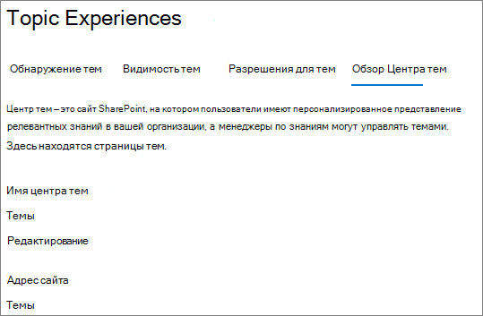
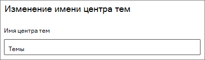

# Изменение имени центра тем в Microsoft Viva TopicsChange the name of the topic center in Microsoft Viva Topics

Вы можете изменить имя центра тем в Центре администрирования [Microsoft 365.](https://admin.microsoft.com)You can change the name of your topic center in the [Microsoft 365 admin center](https://admin.microsoft.com). Для выполнения этих задач необходимо быть глобальным администратором или администратором SharePoint.You must be a global administrator or SharePoint administrator to perform these tasks.

## Чтобы получить доступ к настройкам управления разделами:To access topics management settings:

1. В Центре администрирования Microsoft 365 выберите **"Параметры"** и **"Параметры организации".**In the Microsoft 365 admin center, click **Settings**, then **Org settings**.
2. На **вкладке "Службы"** щелкните **"Раздел".**On the **Services** tab, click **Topic experiences**.

     

3. Выберите **вкладку "Центр** темы". Сведения о каждом параметре см. в следующих разделах.Select the **Topic center** tab. See the following sections for information about each setting.

     

##  Обновление имени центра темUpdate your topic center name

Изменение имени центра темTo change the name of the topic center

1. На **вкладке "Центр темы"** в разделе **"Название центра тем"** выберите **"Изменить".**On the **Topic center** tab, under **Topic center name**, select **Edit**.
2. На странице **"Изменение имени** центра  тем" в поле "Имя центра тем" введите новое имя центра тем.On the **Edit topic center name** page, in the **Topic center name** box, type the new name for your topic center.
3. Нажмите кнопку **Сохранить**.Select **Save**

      

## См. такжеSee also

[Управление обнаружением тем в Microsoft Viva TopicsManage topic discovery in Microsoft Viva Topics](topic-experiences-discovery.md)

[Управление видимостью тем в microsoft Viva TopicsManage topic visibility in Microsoft Viva Topics](topic-experiences-knowledge-rules.md)

[Управление разрешениями тем в microsoft Viva TopicsManage topic permissions in Microsoft Viva Topics](topic-experiences-user-permissions.md)
