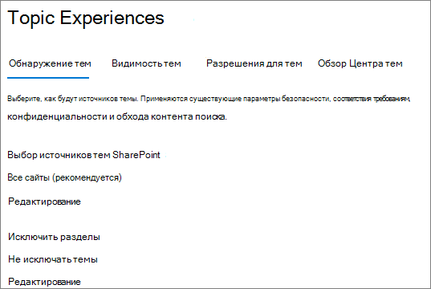
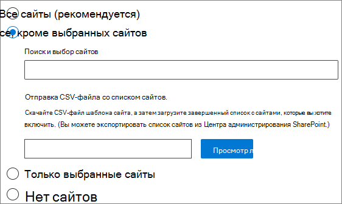
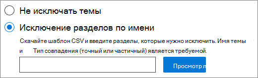

# <a name="manage-topic-discovery-in-microsoft-365"></a>Управление обнаружением тем в Microsoft 365

Вы можете управлять настройками обнаружения тем в Центре администрирования [Microsoft 365.](https://admin.microsoft.com) Для выполнения этих задач необходимо быть глобальным администратором или администратором SharePoint.

## <a name="to-access-topics-management-settings"></a>Чтобы получить доступ к настройкам управления разделами:

1. В Центре администрирования Microsoft 365 выберите **"Параметры"** и **"Параметры организации".**
2. На **вкладке "Службы"** щелкните **"Сеть знаний".**

     

3. Выберите **вкладку "Обнаружение** темы". Сведения о каждом параметре см. в следующих разделах.

     

## <a name="select-sharepoint-topic-sources"></a>Выбор источников тем SharePoint

Вы можете изменить сайты SharePoint в организации, которые будут обходиться по темам.

Если вы хотите включить или исключить определенный список сайтов, можно использовать следующий шаблон CSV:

``` csv
Site name,URL
```

При добавлении сайтов с помощью этого веб-сайта они добавляются в существующий список сайтов, которые необходимо включить или исключить. При отправке CSV-файла он переоценит любой существующий список. Если вы ранее включали или исключали определенные сайты, вы загружаете список в CSV-файл, внося изменения и загружая новый список.

Выбор сайтов для обнаружения тем

1. На **вкладке "Обнаружение тем" в** разделе "Выбор источников **темы SharePoint"** выберите "Изменить". 
2. На странице **"Выбор источников тем SharePoint"** выберите, какие сайты SharePoint будут обходиться в качестве источников для разделов во время обнаружения. К ним относятся:
    - **Все сайты**: все сайты SharePoint в клиенте. В этом случае будут фиксироваться текущие и будущие сайты.
    - **Все, кроме выбранных сайтов:** введите имена сайтов, которые нужно исключить.  Вы также можете отправить список сайтов, от обнаружения на которые вы хотите отказаться. Сайты, созданные в будущем, будут включены в качестве источников для обнаружения тем. 
    - **Только выбранные сайты:** введите имена сайтов, которые вы хотите включить. Вы также можете отправить список сайтов. Сайты, созданные в будущем, не будут включены в качестве источников для обнаружения тем.
    - **Нет сайтов:** разделы не будут автоматически созданы или обновлены с контентом SharePoint. Существующие темы остаются в центре тем.

    
   
3. Щелкните **Сохранить**.

## <a name="exclude-topics-by-name"></a>Исключение разделов по имени

Вы можете исключить темы из обнаружения, загрузив список с помощью CSV-файла. Если вы ранее исключили разделы, вы можете скачать CSV-файл, внести изменения и отправить его еще раз.

1. На **вкладке "Обнаружение тем" в** разделе **"Исключить"** выберите **"Изменить".**
2. Щелкните **"Исключить разделы по имени".**
3. Если необходимо создать список, скачайте шаблон CSV и добавьте разделы, которые нужно исключить (см. раздел "Работа с шаблоном *CSV" ниже).* Когда файл будет готов, нажмите **кнопку "Обзор"** и загрузите файл. Если существует существующий список, вы можете скачать CSV-файл, содержащий этот список.
4. Щелкните **Сохранить**.

    

### <a name="working-with-the-csv-template"></a>Работа с шаблоном CSV

Шаблон CSV можно скопировать ниже:

``` csv
Name (required),Expansion,MatchType- Exact/Partial (required)
```

В шаблоне CSV введите следующие сведения о темах, которые необходимо исключить:

- **Name**: Type the name of the topic you want to exclude. Это можно сделать двумя способами:
    - Точное совпадение: можно включить точное имя или аббревиатуру (например, *Contoso* или *ATL).*
    - Частичное совпадение: можно исключить все темы, в них есть определенное слово.  Например,  arc исключит все темы со словом *arc* в нем, такие как "Arc *circle",* *"Arc arc welding"* или *"Training arc".* Обратите внимание, что он не будет исключать темы, в которых текст включается как часть слова, например *"Архитектура".*
- **Означает (необязательно).** Если вы хотите исключить аббревиатуру, введите слова, за которые стоит аббревиатура.
- **MatchType-Exact/Partial**: Type whether the name you entered was an *exact* or *partial* match type.

     

## <a name="see-also"></a>См. также

[Управление видимостью тем в Microsoft 365](topic-experiences-knowledge-rules.md)

[Управление разрешениями тем в Microsoft 365](topic-experiences-user-permissions.md)

[Изменение имени центра тем в Microsoft 365](topic-experiences-administration.md)

