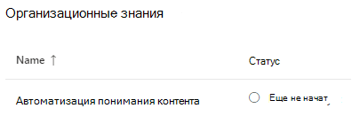
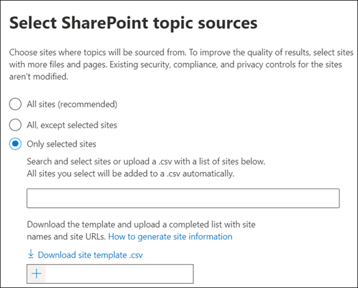
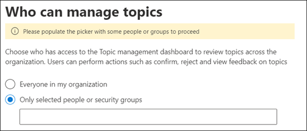
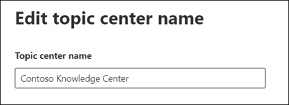

# Управление сетью управления знаниями (Предварительная версия)Manage your knowledge management network (Preview)

> [!Note] 
> Содержимое этой статьи предназначено для Кортексного предварительного просмотра Project.The content in this article is for Project Cortex Private Preview. [Узнайте больше о работе с Project Cortex](https://aka.ms/projectcortex).[Find out more about Project Cortex](https://aka.ms/projectcortex).

После [настройки управления знаниями](set-up-topic-experiences.md)в любое время администратор может внести изменения в параметры конфигурации с помощью центра администрирования Microsoft 365.After you [set up knowledge management](set-up-topic-experiences.md), at any time afterwards an admin can make adjustments to your configuration settings through the Microsoft 365 admin center.

Например, может потребоваться настроить параметры для любой из следующих компонентов:For example, you may need to adjust your settings for any of the following:
- Добавление новых источников SharePoint в разделы "мои разделы".Add new SharePoint sources to mine topics.
- Изменение пользователей, имеющих доступ к разделам.Change which users will have access to topics.
- Изменение пользователей, у которых есть разрешения на выполнение задач в центре разделов.Change which users have permissions to do tasks on the topic center.
- Изменение имени центра разделовChange the name of your topic center

## RequirementsRequirements 
Чтобы получить доступ к центру администрирования Microsoft 365 и управлять задачами организационных знаний, необходимы разрешения глобального администратора или администратора SharePoint.You must have Global Admin or SharePoint admin permissions to be able to access the Microsoft 365 admin center and manage Organizational knowledge tasks.

## Чтобы получить доступ к параметрам управления знаниями:To access knowledge management settings:

1. В центре администрирования Microsoft 365 выберите пункт **Настройка** , а затем просмотрите раздел **сведения о организации** .In the Microsoft 365 admin center, select **Setup** , and then view the **Organizational Knowledge** section.
2. В разделе " **сведения о организации** " щелкните **подключить пользователей к набору знаний**.In the **Organizational Knowledge** section, click **Connect people to knowledge**. 

      

3. На странице **подключить людей к сведениям** выберите **Управление** , чтобы открыть область **Параметры сети базы знаний** .On the **Connect people to knowledge** page, select **Manage** to open the **Knowledge network settings** pane. 

      

## Изменение сведений о том, как сеть может находить темыChange how the knowledge network can find topics

Перейдите на вкладку **Обнаружение разделов** , если хотите обновить выбранные варианты для источников разделов SharePoint.Select the **Topic discovery** tab if you want to update your choices for  for SharePoint topic sources. Этот параметр позволяет выбрать сайты SharePoint в клиенте, для которых будет выполняться обход и mined для разделов.This setting let you select the SharePoint sites in your tenant that will be crawled and mined for topics.

1. На вкладке **Обнаружение разделов** в разделе **Выбор источников разделов SharePoint** нажмите кнопку **изменить**.On the **Topic discovery** tab, under **Select SharePoint topic sources** , select **Edit**.
2. На странице " **Выбор источников разделов SharePoint** " выберите сайты SharePoint, которые будут обходиться в качестве источников для разделов во время обнаружения.On the **Select SharePoint topic sources** page, select which SharePoint sites will be crawled as sources for your topics during discovery. К ним относятся:This includes: 
    а.a. **Все сайты** : все сайты SharePoint в клиенте.**All sites** : All SharePoint sites in your tenant. Это записывает текущие и будущие сайты.This captures current and future sites. 
    б.b. **Все, кроме выбранных сайтов** : введите имена сайтов, которые вы хотите исключить.**All, except selected sites** : Type the names of the sites you want to exclude.  Вы также можете отправить список сайтов, которые вы хотите отказаться от обнаружения.You can also upload a list of sites you want to opt out from discovery. Сайты, созданные в будущем, будут включены в качестве источников для обнаружения разделов.Sites created in the future will be included as sources for topic discovery.  
    в.c. **Только выбранные сайты** : введите имена сайтов, которые необходимо включить в список.**Only selected sites** : Type the names of the sites you want to include. Вы также можете отправить список сайтов.You can also upload a list of sites. Сайты, созданные в будущем, не будут включены в качестве источников для обнаружения разделов.Sites created in the future will not be included as sources for topic discovery.  

      
   
    Если вы хотите исключить несколько сайтов (если выбрать **все, кроме выбранных сайтов** ) или включить (если выбрано **только выбранные сайты** ), можно отправить CSV-файл с именами и URL-адресами сайтов.If you have a number of sites that you want to exclude (if you select **All, except selected sites** ) or include (if you selected **Only selected sites** ), you can choose to upload a CSV file with the site names and URLs. Вы можете выбрать **скачать шаблон сайта Template. csv** , если вы хотите использовать CSV-файл шаблона.You can select **Download site template .csv** if you want to use the CSV template file.

3. Нажмите кнопку **Сохранить**.Select **Save**.

##  Изменение пользователей, которые могут просматривать темы в ОрганизацииChange who can see topics in your organization

Перейдите на вкладку **Обнаружение разделов** , чтобы обновить сведения о том, кто в вашей организации может видеть найденные темы в результатах поиска и когда темы выделяются в контенте, например на страницах SharePoint.Select the **Topic discovery** tab if you want to update who in your organization can see discovered topics in search results and when topics are highlighted in content like SharePoint pages.

1. На вкладке **Обнаружение разделов** в разделе **Пользователи, которые могут видеть разделы в сети знаний** нажмите кнопку **изменить**.On the **Topic discovery** tab, under **Who can see topics in the knowledge network** , select **Edit**.
2. Сведения о том, **кто может просматривать разделы** на странице сведения о сети, можно выбрать, кто будет иметь доступ к сведениям о теме, например подразделам, карточкам разделов, темам в поиске и страницам темы.On the **Who can see topics in the knowledge network** page, you choose who will have access to topic details, such as highlighted topics, topic cards, topic answers in search, and topic pages. Можно выбрать:You can select: 
    а.a. **Все в организации****Everyone in your organization** 
    б.b. **Только выбранные пользователи или группы безопасности****Only selected people or security groups** 
    в.c. **Никто****No one** 

       
3. Нажмите кнопку **Сохранить**.Select **Save**.  
 
> [!Note] 
> Несмотря на то, что этот параметр позволяет выбрать любого пользователя в Организации, будут доступны только те пользователи, которым назначены лицензии управления знаниями.While this setting allows you to select any user in your organization, only users who have knowledge management licenses assigned to them will be able to view topics.

## Изменение разрешений на выполнение задач в центре разделовChange who has permissions to do tasks on the topic center

Перейдите на вкладку **разрешения раздела** , если вы хотите обновить разрешения на выполнение следующих действий на странице "центр разделов":Select the **Topic permissions** tab if you want to update who has permissions to do the following in the topic center page:

- Какие пользователи могут создавать и изменять разделы: создание новых тем, которые не были найдены во время обнаружения или редактирования существующих сведений о странице темы.Which users can create and edit topics: Create new topics that were not found during discovery or edit existing topic page details.
- Какие пользователи могут управлять разделами: подтверждение или отклонение обнаруженных разделов.Which users can manage topics: Confirm or reject discovered topics.

Чтобы обновить разделы, у которых есть разрешения на создание и редактирование разделов:To update who has permissions to create and edit topics:

1. На вкладке **разрешения раздела** в разделе **Пользователи, которые могут создавать и редактировать разделы** нажмите кнопку **изменить**.On the **Topic permissions** tab, under **Who can create and edit topics** , select **Edit**. 
2. На странице **пользователи могут создавать и редактировать темы** можно выбрать:On the **Who can create and edit topics** page, you can select: 
    а.a. **Все в организации****Everyone in your organization** 
    б.b. **Только выбранные пользователи или группы безопасности****Only selected people or security groups** 

       

3. Нажмите кнопку **Сохранить**.Select **Save**. 

Чтобы обновить разрешения для управления разделами, выполните следующие действия:To update who has permissions to manage topics:

1. На вкладке **разрешения раздела** в разделе **Пользователи, которые могут управлять разделами** нажмите кнопку **изменить**.On the **Topic permissions** tab, under **Who can manage topics** , select **Edit**. 
2. На странице **пользователи могут управлять разделами** можно выбрать:On the **Who can manage topics** page, you can select: 
    а.a. **Все в организации****Everyone in your organization** 
    б.b. **Выбранные пользователи или группы безопасности****Selected people or security groups** 

       

3. Нажмите кнопку **Сохранить**.Select **Save**. 

##  Обновление названия центра справкиUpdate your topic center name

Перейдите на вкладку **центр разделов** , если хотите обновить название центра.Select the **Topic center** tab if you want to update the name of your topic center. 

1. На вкладке **центр разделов** в разделе **Название центра разделов** выберите **изменить**.On the **Topic center** tab, under **Topic center name** , select **Edit**.
2. На странице **изменение имени раздела** введите в поле **Название центра разделов** новое имя для своего центра справки.On the **Edit topic center name** page, in the **Topic center name** box, type the new name for your topic center.
3. Нажмите кнопку **Сохранить**.Select **Save**

       

## См. такжеSee also

  

