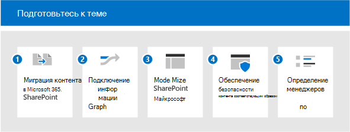

# Подготовьтесь к теме (предварительная версия)

> [!Note]
> Содержимое этой статьи для Project Cortex Private Preview. [Узнайте больше о работе с Project Cortex](https://aka.ms/projectcortex).

Чтобы максимально использовать возможности работы с разделами, необходимо включить как можно больше контента для обнаружения тем, чтобы у вас был богатый набор тем для пользователей. Но какой контент следует использовать для обнаружения тем? Как максимально увеличить индексируемую содержимого, оставаясь под контролем? Чем больше контента находится в области действия, тем лучше аналитика, которая может создаваться искусственным интеллектом. В этой статье данная статья посвящена планированию, чтобы убедиться в том, что вы добавили соответствующий контент и у вас есть подходящие люди и ресурсы для обеспечения хорошего опыта работы пользователей.

Для планирования работы с разделами (предварительная версия) необходимо:

1. [Перенос контента в SharePoint](#1-migrate-content-to-microsoft-365)
    - Майнинг тем включает только контент на сайтах SharePoint.
      - По возможности переносим ценный контент в SharePoint Online из внешних источников.
      - Расставить приоритеты источников контента с высоким потенциалом неявных знаний.
      - Выделяйте преимущества управления знаниями, чтобы побудить пользователей переместить контент из OneDrive на сайты SharePoint.

2. [Подключение информации к Microsoft Graph](#2-connect-information-to-microsoft-graph)
    - В будущем внешний контент может быть занесен в граф знаний и станет доступным.
    - Для содержимого, которое невозможно перемещено, рассмотрите возможность использования соединителю Graph для улучшения поиска и подготовки к дальнейшему включению.

3. [Модернизация страниц SharePoint](#3-modernize-sharepoint-pages)
    - Карточки темы могут быть открыто только на современных страницах.
    - Определите классические страницы с высоким профилем, которые являются кандидатами на модернизацию.

4. [Обеспечение безопасности контента соответствующим образом](#4-secure-content-appropriately)
    - Ресурсы темы обрезаются по безопасности на основе разрешений пользователя.
    - Определите любой контент, который может иметь неправильные широкие или ограничивающие разрешения:
      - Предложить владельцам сайтов использовать отчеты общего доступа для просмотра разрешений
      - Проведение администраторами аудита общего содержимого с помощью поиска
      - Предложить владельцам контента делиться контентом, который не является конфиденциальным и может иметь более широкие преимущества для организации.
    - Просмотрите конфигурацию Microsoft Graph для пользователей и контента:
      - При майнинге темы конфигурация за исключением контента из поиска или Delve. Просмотрите, актуальны ли эти конфигурации.

5. [Определение менеджеров по знаниям и тем](#5-identify-knowledge-managers-and-topics)
    - Используйте существующие таксономии для создания тем вручную.
    - Определите экспертов по темам (SMES) для предполагаемых или занесеных разделов.
    - Определите сайты, которые охватывают большой объем ценных данных, которые можно использовать для пилотного анализа тем.
    - Привлекать менеджеров по знаниям и сообщества практик.

## 1. Перенос контента в Microsoft 365

Существует несколько средств и служб, которые помогут вам с миграцией. Вы можете получить обзор и сведения о переносе содержимого в [Microsoft 365.](https://docs.microsoft.com/sharepointmigration/migrate-to-sharepoint-online) Средства миграции включают:

- [Диспетчер переноса данных](https://docs.microsoft.com/sharepointmigration/mm-get-started)
- [Средство миграции SharePoint (SPMT)](https://docs.microsoft.com/sharepointmigration/introducing-the-sharepoint-migration-tool)
- [Microsoft 365 FastTrack](https://www.microsoft.com/fasttrack/microsoft-365)
- [Средства и службы миграции партнеров](https://www.microsoft.com/solution-providers)

Сделайте большую часть миграции.

- Переходить на современный сайт, включа который включает Microsoft Teams. Хотя индексация может происходить на любом сайте SharePoint (классическом или современном), отображение тем для пользователей с помощью выделений и карточек происходит только на современных страницах.
- Поддержив имена пользователей, большинство средств миграции позволяют соедуть удостоверения пользователей во время миграции, чтобы такие свойства, как "Создано" или "Изменено", сохранялись после миграции. Это важно для тем, так как авторство файлов используется для определения экспертов, добавленных на страницу или карточку темы. 
- Описательное имя учетной записи службы. В некоторых случаях невозможно сохранить имена пользователей. Например, если вы переносим контент, созданный кем-то, который больше не является сотрудником организации. В этом случае большинство средств миграции перемещают файл, как если бы он был создан учетной записью администратора или учетной записью службы. Если это происходит часто, эта учетная запись службы может быть указана в качестве эксперта по темам. Именно в этом случае имя этой учетной записи становится действительно важным. Если вы сделаете это описательным, ваши пользователи смогут понять, какие именно учетные записи есть у пользователей.

## 2. Подключение информации к Microsoft Graph

Если вы не можете перенести какой-либо контент, подключите его к Microsoft Graph:

- Рассмотрите возможность [реализации соединители содержимого Graph.](https://docs.microsoft.com/microsoftsearch/connectors-overview) Используя соединители, внешнее содержимое можно индексировать в Microsoft Graph, где пользователи смогут найти его с помощью Поиска (Майкрософт).
- Будущие разработки привяят внешние данные к темам.

## 3. Модернизация страниц SharePoint

Так как карточки тем и выделения могут отображаться только на современных страницах, обновите все страницы, которые вы хотите включить в темы, от классических до современных. См. [раздел "Модернизация классических сайтов SharePoint".](https://docs.microsoft.com/sharepoint/dev/transform/modernize-classic-sites) Сканер модернизации [SharePoint](https://docs.microsoft.com/sharepoint/dev/transform/modernize-scanner) можно использовать для подготовки классических сайтов к модернизации.

Если у вас много классических сайтов, расставить приоритеты страниц с высоким профилем для преобразования в современные.

## 4. Защита контента соответствующим образом

Когда пользователи взаимодействуют с карточкой темы или страницей темы, они могут видеть разные ресурсы. Это связано с тем, что у них есть доступ к различным файлам, связанным с темой. Если ваши основные разрешения слишком строгие, можно уменьшить количество аспектов обнаружения информации через разделы. С другой стороны, если они слишком широкие, тема может передать содержимое пользователю, который вы не собираетесь видеть.
Хорошее управление разрешениями имеет важное значение. А хорошее управление разрешениями основано на постоянном сотрудничестве между администраторами и владельцами контента. Хотя это может быть текущим действием, существует ряд практических действий, которые можно предпринять при подготовке тем:

- Предложить владельцам сайтов просмотреть общий доступ и разрешения.

  Владельцы сайтов SharePoint могут просмотреть отчет о совместном использовании для своего сайта, в который будут показаны полные сведения о всех разрешениях и ссылках для общего доступа, настроенных на сайте, см. в отчетах [общего доступа.](https://docs.microsoft.com/sharepoint/sharing-reports) В этом списке перечислены внутренние и внешние (гостевых) пользователи.

  Владельцы сайтов также могут видеть, у кого есть разрешения для сайта, переходить на страницы "Разрешения **сайта"** и "Дополнительные **параметры** разрешений".

  1. На сайте выберите **разрешения**  >  **"Параметры сайта".** Проверьте, кто указан в списке "Владельцы сайта", "Участники сайта" и "Посетители сайта". Проверьте, нет ли гостевых пользователей.
  2. На странице **"Разрешения"** выберите **"Дополнительные параметры разрешений".** Вы можете проверить уникальные разрешения и узнать, кто имеет ограниченный доступ к любому элементу на сайте.

- Проводите аудит групп Microsoft 365 и Teams, чтобы убедиться, что они правильно настроены как общедоступные или частные группы или команды. Новые группы Teams и Группы Microsoft 365 по умолчанию являются частными, но при первом выпущении были общедоступными по умолчанию. Если вы были более ранними внедрятелями этих технологий, вам может потребоваться просмотреть их. Кроме того, функция команды часто меняется на протяжении ее жизненного цикла, и может потребоваться обновление параметра с учетом текущего использования команды.
- Просмотрите использование "все", "все, кроме внешних пользователей" или широких групп безопасности. Эти значения могут быть неправильно указаны в содержимом. Чтобы просмотреть использование этих групп, вы можете:
  - Создание учетной записи без участия в группах
  - Используйте поиск с этой учетной записью для обнаружения общего содержимого.
  - Если в этой учетной записи отображается недопустимый контент с помощью поиска, вы можете поработать с владельцами сайтов, чтобы исправить конфигурацию разрешений.

Помимо разрешений, вы также можете управлять областью обнаружения в темах. Вы всегда управляете индексам.

Администраторы могут настраивать индексацию в Центре администрирования Microsoft 365. Настроив [управление знаниями,](set-up-topic-experiences.md)вы можете:

- Разрешить обнаружение на всех сайтах SharePoint или указать сайты, которые необходимо включить или исключить в качестве источников тем.
- Если у вас есть конфиденциальные термины, вы также можете исключить темы по имени. Например, если у вас есть имя конфиденциального проекта, в котором не нужно отображать выделение или карточку, независимо от разрешений пользователя, можно исключить это имя проекта.

На уровне контента можно также управлять тем, что можно обнаружить. Любая конфигурация, которая была сделана для исключения контента из поиска, также будет использоваться при обнаружении контента. Например, если вы исключили определенную библиотеку документов из результатов поиска, эта библиотека документов не будет использоваться для обнаружения тем.

## 5. Определение менеджеров по знаниям и тем

Управление разделами включает три основные роли, включая две новые роли Azure Active Directory (AAD): администратора знаний и диспетчера знаний:

- Администратор знаний (KA) — это техническая роль, как правило, В ИТ-организации. Эта роль позволяет настроить темы в Центре администрирования M365, а также настроить функции обнаружения и видимости тем.
- Диспетчер знаний (KM) работает с самими разделами и контролирует их качество и полноту.
- Авторы тем (TCS) основаны не на роли AAD, а на разрешениях в Центре администрирования. Они — эксперты по теме, способные подытствовать контенту по темам, добавляя ресурсы и людей.

В зависимости от организации в этих ролях может быть несколько или несколько человек. В некоторых организациях это могут быть одни и те же люди.

| Администратор знаний | Диспетчер знаний | Участник темы |
|:-------|:-------|:-------|:-------|
| Роль AAD | Роль AAD | SME |
| Имеет доступ к Центру администрирования | Имеет доступ к Центру администрирования | Нет доступа к Центру администрирования |
| Настраивает темы | Владеет управлением и качеством тем | Вносит вклад в темы на основе их опыта. |
| Обеспечивает применение стандартов безопасности и соответствия требованиям и понимание лицензионного соглашения.| Выполняет задачи управления темами, такие как создание, редактирование, удаление и отклонение тем. Поддерживает участников тем с их задачами. | Курсирует информацию и содержимое на страницах тем, включая сведения о том, какие люди и ресурсы закреплены в этой теме. |

Выделения и карточки будут отображаться пользователям в контексте их работы, например при просмотре современных страниц в SharePoint. Вы управляете пользовательским интерфейсом для тем.

- Кто может видеть разделы? Видимость темы настраивается в Центре администрирования Microsoft 365. Выберите группы, которые будут разрешать просмотр разделов:
  - Все в моей организации. "Все" не включает гостей, это все внутренние пользователи в каталоге
  - Только выбранные пользователи или группы безопасности (этот вариант хорошо при развертывание темы, поэтому можно тестировать с подмножество пользователей). Если вы хотите, чтобы гости просматривали разделы, необходимо использовать параметр "Выбранные люди или группы безопасности" и предоставить им лицензию.
  - Ни к кому.

    Все пользователи, даже гостевых пользователей, должны иметь лицензию, применяемую для просмотра темы. Помните, что разрешения всегда контролируют то, что можно увидеть.

- Какие темы видны? Вы можете выбрать:
  - Показать все темы кандидатов.
  - Показывать только подтвержденные темы.

Теперь, когда у нас есть руководители, эксперты и пользователи, мы можем обсудить сами темы.

- В списке тем лучше всего засеть разделы. Качество и количество разделов основаны на вашем контенте— он будет создан как раздел, только если он включен в контент, который находится в области. Если для этого раздела достаточно информации и свидетельств, он будет создан и ИИ. В темах, где может помочь менеджер по знаниям и эксперты по предметам. Объединение знаний о человеке с ИИ — лучший способ для разделов о качестве. Поэтому если есть темы, которые вы ожидаете, вы можете вручную создать их в Центре тем. Это даст ИИ мощный сигнал о релевантности этой темы, а также определит ресурсы и людей, которых необходимо связать с этим разделом.
- Используйте существующие таксономии для планирования темы в SharePoint или в другом месте. Существующие таксономии часто включают термины организации, продукты, темы и так далее. Источники для тем также могут быть составлены из списков проектов, существующих закладок поиска и так далее.
