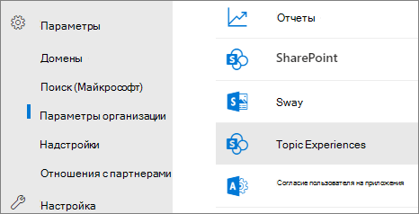
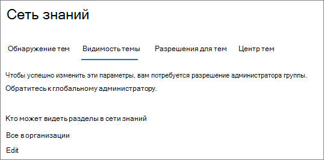
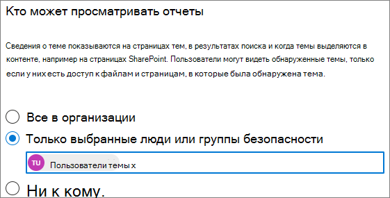

# Управление видимостью тем в microsoft Viva TopicsManage topic visibility in Microsoft Viva Topics

Вы можете управлять набором пользователей, которые могут видеть выделения тем, карточки тем и центр тем в Центре администрирования [Microsoft 365.](https://admin.microsoft.com)You can manage the set of users who can see topic highlights, topic cards, and the topic center in the [Microsoft 365 admin center](https://admin.microsoft.com). Для выполнения этих задач необходимо быть глобальным администратором или администратором SharePoint.You must be a global administrator or SharePoint administrator to perform these tasks.

## Чтобы получить доступ к настройкам управления разделами:To access topics management settings:

1. В Центре администрирования Microsoft 365 выберите **"Параметры"** и **"Параметры организации".**In the Microsoft 365 admin center, click **Settings**, then **Org settings**.
2. На **вкладке "Службы"** щелкните **"Раздел".**On the **Services** tab, click **Topic experiences**.

     

3. Выберите **вкладку "Видимость** темы". Сведения о каждом параметре см. в следующих разделах.Select the **Topic visibility** tab. See the following sections for information about each setting.

     

##  Изменение людей, которые могут видеть разделы в организацииChange who can see topics in your organization

Вы можете изменить пользователей, которые могут видеть разделы в вашей организации.You can change the users who can see topics in your organization.

1. На **вкладке "Видимость раздела" в** разделе **"Кто может видеть разделы"** выберите **"Изменить".**On the **Topic visibility** tab, under **Who can see topics**, select **Edit**.
2. На странице **"Кто может** видеть темы" вы выбираете, кто будет иметь доступ к сведениям о темах, таким как выделенная тема, карточки тем, ответы на темы в поиске и страницы тем.On the **Who can see topics** page, you choose who will have access to topic details, such as highlighted topics, topic cards, topic answers in search, and topic pages. Можно выбрать:You can select:
    - **Все в организации****Everyone in your organization**
    - **Только выбранные люди или группы безопасности****Only selected people or security groups**
    - **Никто****No one**

     

3. Нажмите **Сохранить**.Select **Save**.  
 
> [!Note] 
> Хотя этот параметр позволяет выбрать любого пользователя в организации, только пользователи, которым назначены лицензии на возможности работы с разделами, смогут просматривать разделы.While this setting allows you to select any user in your organization, only users who have Topic Experiences licenses assigned to them will be able to view topics.

## См. такжеSee also

[Управление обнаружением тем в Microsoft Viva TopicsManage topic discovery in Microsoft Viva Topics](topic-experiences-discovery.md)

[Управление разрешениями тем в microsoft Viva TopicsManage topic permissions in Microsoft Viva Topics](topic-experiences-user-permissions.md)

[Изменение имени центра тем в Microsoft Viva TopicsChange the name of the topic center in Microsoft Viva Topics](topic-experiences-administration.md)

