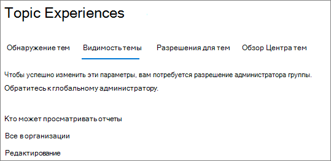

# Управление обзором тем в Разделах Microsoft VivaManage topic visibility in Microsoft Viva Topics

Вы можете управлять набором пользователей, которые могут видеть основные темы, карточки темы и центр темы в центре администрирования Microsoft 365 [администрирования.](https://admin.microsoft.com)You can manage the set of users who can see topic highlights, topic cards, and the topic center in the [Microsoft 365 admin center](https://admin.microsoft.com). Вы должны быть глобальным администратором или администратором SharePoint для выполнения этих задач.You must be a global administrator or SharePoint administrator to perform these tasks.

## Чтобы получить доступ к настройкам управления темами:To access topics management settings:

1. В центре администрирования Microsoft 365 нажмите **кнопку Параметры,** а затем **параметры Org**.In the Microsoft 365 admin center, click **Settings**, then **Org settings**.
2. На **вкладке Services** щелкните **Раздел опытом**.On the **Services** tab, click **Topic experiences**.

     

3. Выберите **вкладку Обзор темы.** Сведения о каждом параметре см. в следующих разделах.Select the **Topic visibility** tab. See the following sections for information about each setting.

     

##  Изменение тех, кто может видеть темы в организацииChange who can see topics in your organization

Вы можете изменить пользователей, которые могут видеть темы в вашей организации.You can change the users who can see topics in your organization.

1. На **вкладке Обзор Темы** в разделе **Кто см. разделы**, выберите **Изменить**.On the **Topic visibility** tab, under **Who can see topics**, select **Edit**.
2. На странице **Кто** см. разделы, которые будут иметь доступ к деталям тем, таким как выделенные темы, карточки тем, ответы на темы в поиске и страницы тем.On the **Who can see topics** page, you choose who will have access to topic details, such as highlighted topics, topic cards, topic answers in search, and topic pages. Можно выбрать:You can select:
    - **Все в организации****Everyone in your organization**
    - **Только выбранные люди или группы безопасности****Only selected people or security groups**
    - **Никто****No one**

     

3. Нажмите **Сохранить**.Select **Save**.  
 
> [!Note] 
> Хотя этот параметр позволяет выбрать любого пользователя в организации, просматривать темы смогут только пользователи, которым назначены лицензии на раздел Experiences.While this setting allows you to select any user in your organization, only users who have Topic Experiences licenses assigned to them will be able to view topics.

## См. такжеSee also

[Управление обнаружением тем в Microsoft Viva TopicsManage topic discovery in Microsoft Viva Topics](topic-experiences-discovery.md)

[Управление разрешениями тем в Разделах Microsoft VivaManage topic permissions in Microsoft Viva Topics](topic-experiences-user-permissions.md)

[Изменение имени центра темы в Разделе Microsoft Viva TopicsChange the name of the topic center in Microsoft Viva Topics](topic-experiences-administration.md)

