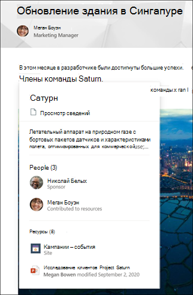

# Обзор Microsoft Viva ТемMicrosoft Viva Topics overview 

Viva Topics использует технологию Microsoft AI, Microsoft 365, Microsoft Graph, поиск и другие компоненты и службы для обеспечения знаний пользователей в приложениях Microsoft 365, которые они используют каждый день, начиная с SharePoint современных страниц, Microsoft Search и Search in Word и PowerPoint.Viva Topics uses Microsoft AI technology, Microsoft 365, Microsoft Graph, Search, and other components and services to bring knowledge to your users in Microsoft 365 apps they use everyday, starting with SharePoint modern pages, Microsoft Search, and Search in Word and PowerPoint.

 

> [!VIDEO https://www.microsoft.com/videoplayer/embed/RE4LhZP]  

 

Viva Темы помогают решить ключевую бизнес-проблему многих компаний - своевременное и оперативное предоставление пользователям нужной информации.Viva Topics helps to address a key business issue in many companies - providing the information to users when they need it. Например, новым сотрудникам необходимо быстро усвоить большой объем информации о компании, но при чтении документации они натыкаются на неизвестные им термины.For example, new employees need to learn a lot of new information quickly, and encounter terms they know nothing about when reading through company information. Поэтому пользователю иногда приходится бросать текущие дела и тратить ценное время на поиск сведений, например: что значит тот или иной термин, кто в организации является специалистом по этой теме, а также, возможно, изучать сайты и документы, связанные с данным термином.To learn more, the user might need to step away from what they are doing and spend valuable time searching for details, such as information about what the term is, who in the organization is a subject matter expert, and maybe sites and documents that are related to the term.

Viva Темы используют ИИ для автоматического поиска и идентификации **тем**, используемых в вашей организации.Viva Topics uses AI to automatically search for and identify **topics** in your organization. Приложение "Темы Viva" подбирает сведения по темам, такие как краткое описание темы, список сотрудников, работающих над ней, а также связанные с ней сайты, файлы и страницы.It compiles information about them, such as a short description, people working on the topic, and sites, files, and pages that are related to it. Менеджер знаний или специалист по теме может при необходимости обновить сведения, связаные с этой темой.A knowledge manager or contributor can choose to update the topic information as needed. Темы доступны вашим пользователям. Это значит, что для каждого экземпляра темы, которая отображается на современном сайте SharePoint в новостях и на страницах, соответствующий текст будет выделен.The topics are available to your users, which means that for every instance of the topic that appears in a modern SharePoint site in news and pages, the text will be highlighted. Пользователи могут выбрать тему, чтобы получить дополнительные сведения о ней с помощью деталей по теме.Users can choose to select the topic to learn more about it through the topic details. Темы также можно найти в поиске SharePoint.Topics can also be found in SharePoint Search.

## Показ темы пользователямHow topics are displayed to users

Когда тема упоминается в содержимом новостей и страниц SharePoint, соответствующий текст выделяется.When a topic is mentioned in content on SharePoint news and pages, you'll see it highlighted. С этого выделенного текста можно перейти в сводку темы.You can open the topic summary from the highlight. С заголовка сводки можно перейти на детали темы.Open the topic details from the title of the summary. Упомянутая тема может быть определена автоматически или добавлена на страницу с прямой ссылкой на эту тему автором страницы.The mentioned topic could be identified automatically or have been added to the page with a direct reference to the topic by the page author. 

    

При использовании поиска в Word или PowerPoint в поле поиска или  при выборе поиска в контекстной меню отображаются результаты, которые также могут отображаться в сводке темы.When you use Search in Word or PowerPoint, either through the search box, or by selecting **Search** in the context menu, the results that are displayed might also show the topic summary.

   

   

## Индексация знанийKnowledge indexing

Viva Темы используют технологию ИИ Майкрософт для определения **тем** в среде Microsoft 365.Viva Topics uses Microsoft AI technology to identify **topics** in your Microsoft 365 environment.

Тема — это фраза или термин, который является значимым или важным для организации.A topic is a phrase or term that is organizationally significant or important. Тема имеет определенное значение для организации; с ней связаны ресурсы, которые помогают понять смысл темы и найти дополнительные сведения по ней.It has a specific meaning to the organization, and has resources related to it that can help people understand what it is and find more information about it. Существует множество различных типов тем, которые будут важны для вашей организации.There are lots of different types of topics that will be important to your organization. Изначально технология ИИ Майкрософт сосредоточена на следующих типах:Initially, the Microsoft AI technology focuses on the following types:
- ПроектProject
- СобытиеEvent
- ОрганизацияOrganization
- МестонахождениеLocation
- ПродуктProduct
- Творческая работаCreative work
- Область исследованийField of study

Когда тема идентифицирована и искусственный интеллект решает, что имеется достаточно сведений, чтобы сделать тему рекомендуемой, на **странице темы** выводятся сведения, собранные с помощью индексации по теме, например:When a topic is identified and AI determines that it has enough information for it to be a suggested topic, a **topic page** displays the information that was gathered through topic indexing, such as:

- Альтернативные имена и аббревиатуры.Alternate names and acronyms.
- Краткое описание темы.A short description of the topic.
- Сотрудники, которые, возможно, хорошо знают эту тему.People who might be knowledgeable about the topic.
- Файлы, страницы и сайты, связанные с темой.Files, pages, and sites that are related to the topic.

Администраторы знаний могут задать обход всех сайтов SharePoint в клиенте для поиска сведений по темам или выбрать некоторые сайты.Your knowledge admins can choose to crawl all SharePoint sites in your tenant for topics, or to just select certain ones.

См. [Обнаружение тем и управление темами](./topic-experiences-discovery-curation.md)See [Topic discovery and curation](./topic-experiences-discovery-curation.md)

## РолиRoles

При использовании Viva Тем в среде Microsoft 365 пользователи будут иметь следующие роли:When you use Viva Topics in your Microsoft 365 environment, your users will have the following roles:

- Посетители тем: пользователи, видящие выделенные тексты по темам на современных сайтах SharePoint, к которым имеют по крайней мере *доступ на чтение*, и в Поиске (Майкрософт).Topic viewers: Users who can see topic highlights on SharePoint modern sites that they have at least *Read* access to, and in Microsoft Search. Эти пользователи могут выбрать выделенный текст по теме, чтобы увидеть сведения о теме на странице этой темы.They can select topic highlights to see topic details in topic pages. Посетители тем могут предоставлять отзывы о том, насколько полезна для них тема.Topic viewers can provide feedback on how useful a topic is to them.

- Авторы: пользователи, у которых есть права на изменение существующих тем или создание новых.Contributors: Users who have rights to edit existing topics or create new ones. Администраторы знаний назначают пользователям авторские разрешения с помощью настроек Viva Тем в Центре администрирования Microsoft 365.Knowledge admins assign contributor permissions to users through the Viva Topics settings in the Microsoft 365 admin center. Обратите внимание: можно предоставить всем посетителям тем разрешение на редактирование и создание тем, чтобы все посетители могли вносить вклад в видные им темы.Note that you can also choose to give all topic viewers the permission to edit and create topics so that everyone can contribute to topics that they see.

- Менеджеры знаний: пользователи, которые руководят жизненным циклом темы.Knowledge managers: Users who guide topics through the topic lifecycle. Менеджеры знаний используют страницу **Управление темами** в Центре тем для подтверждения тем, предлагаемых искусственным интеллектом, удаления тем, которые больше не актуальны, а также редактирования существующих тем или создания новых тем. Из всех пользователей только менеджеры знаний имеют доступ к этой странице.Knowledge managers use the **Manage Topics** page in the Topic center to confirm AI-suggested topics, remove topics that are no longer relevant, as well as edit existing topics or create new ones, and are the only users who have access to it. Администраторы знаний назначают пользователям разрешения менеджеров знаний с помощью настроек Viva Тем в Центре администрирования Microsoft 365.Knowledge admins assign knowledge manager permissions to users through the Viva Topics admin settings in the Microsoft 365 admin center. 

- Администраторы знаний: администраторы знаний настраивают модуль "Viva Темы" и управляют им с помощью элементов управления в Центре администрирования Microsoft 365.Knowledge admins: Knowledge admins set up Viva Topics and manage it through the admin controls in the Microsoft 365 admin center. В настоящее время в качестве администратора знаний может выступать глобальный администратор Microsoft 365 или администратор SharePoint.Currently, a Microsoft 365 global or SharePoint administrator can serve as a knowledge admin.

Дополнительные сведения см. в разделе[Роли Viva Тем](topic-experiences-roles.md).See [Viva Topics roles](topic-experiences-roles.md) for more information.

## Управление темамиTopic management

Управление темами производится на странице **Управление темами** в **Центре тем** организации.Topic management is done in the **Manage topics** page in your organization's **Topic center**. Центр тем создается во время настройки и служит центром знаний для организации.The Topic center is created during setup and serves as your center of knowledge for your organization. 

Все лицензированные пользователи могут просматривать темы, с которыми связаны в Центре тем, но только пользователи с разрешениями на *Управление темами* (менеджеры знаний) могут просматривать и использовать страницу "Управление темами".While all licensed users can see topics they're connected with in the Topic center, only users with *Manage topics* permissions (knowledge managers) can view and use the Manage topics page.

Менеджеры знаний могут:Knowledge managers can:

- Подтверждать или удалять темы, обнаруженные в клиенте.Confirm or remove topics that were discovered in your tenant.
- При необходимости создавать новые темы вручную (например, если было предоставлено недостаточно сведений для их обнаружения с помощью ИИ).Create new topics manually as needed (for example, if not enough information was provided for it to be discovered through AI).
- Редактировать существующие страницы тем.Edit existing topic pages. 

Дополнительные сведения можно найти в разделе[Управление темами в центре тем](manage-topics.md).See [Manage topics in the Topic center](manage-topics.md) for more information.  

## Элементы управления для администрированияAdmin controls

Элементы управления администратором Microsoft 365 центра администрирования позволяют управлять Viva Topics.Admin controls in the Microsoft 365 admin center allow you to manage Viva Topics. Они позволяют глобальному администратору Microsoft 365 или SharePoint:They allow a Microsoft 365 global or SharePoint administrator to:

- Контролировать, какие пользователи в организации могут видеть темы на современных страницах SharePoint или в результатах поиска SharePoint.Control which users in your organization are allowed to see topics in SharePoint modern pages or in SharePoint search results.
- Контролировать, какие сайты SharePoint будут проверяться для выявления тем.Control which SharePoint sites will be crawled to identify topics.
- Исключать определенные темы из поиска.Exclude specific topics from being found.
- Контролировать, какими темами в центре тем могут управлять пользователи.Control which users can manage topics in the topic center.
- Контролировать, какие пользователи могут создавать и редактировать темы.Control which users can create and edit topics.
- Контролировать, какие пользователи могут просматривать темы.Control which user can view topics.

Дополнительные сведения об администрировании см. в разделах [Назначение разрешений пользователей](./plan-topic-experiences.md#user-permissions), [управление видимостью тем](./topic-experiences-knowledge-rules.md)и [Управление обнаружением тем](./topic-experiences-discovery.md).See [assign user permissions](./plan-topic-experiences.md#user-permissions), [manage topic visibility](./topic-experiences-knowledge-rules.md), and [manage topic discovery](./topic-experiences-discovery.md) for more information about admin controls.

## Курирование тем и отзывыTopic curation & feedback

ИИ будет постоянно работать над предоставлением предложений по улучшению тем по мере того, как в вашей среде происходят изменения.AI will continually work to provide you suggestions to improve your topics as changes occur in your environment. 

Пользователи с разрешениями на изменение или создание тем могут обновлять страницы тем напрямую, чтобы внести исправления или добавить дополнительную информацию.Users with edit or create topics permissions can make updates to topic pages directly if they want to make corrections or add additional information. Они также могут добавлять новые темы, которые искусственному интеллекту не удалось обнаружить.They can also add new topics that AI wasn't able to identify. Если сведений по этим темам, добавленным вручную, достаточно, и ИИ может обнаружить этот тип темы, дополнительные предложения от ИИ могут улучшить добавленные вручную темыIf there's enough information on these manually added topics, and AI is able to identify this type of topic, additional suggestions from AI may enhance these manually added topics 

У пользователей, которым разрешен доступ к темам в повседневной работе, можно спросить, была ли эта тема полезной для них.Users that you allow access to see topics in their daily work might be asked if the topic was useful to them. Система рассматривает эти ответы и использует их для улучшения выделения текста по теме и определения того, что отображается в сводке по темам и в подробных сведениях о теме.The system looks at these responses and uses them to improve the topic highlight, and help determine what's shown on topic summaries and in topic details.

Кроме того, пользователи с соответствующими разрешениями могут помечать элементы, такие как беседы Yammer, актуальные для определенной темы, и добавлять их в определенную тему.Additionally, users with proper permissions can tag items such as Yammer conversation that are relevant to a topic, and add them to a specific topic. 

См. [Обнаружение тем и управление темами](./topic-experiences-discovery-curation.md)See [Topic discovery and curation](./topic-experiences-discovery-curation.md)

## См. такжеSee also
