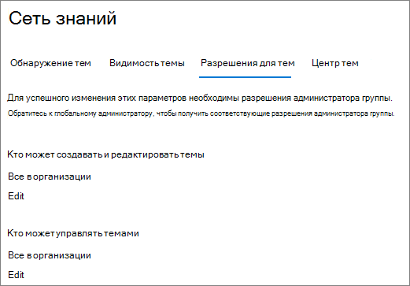
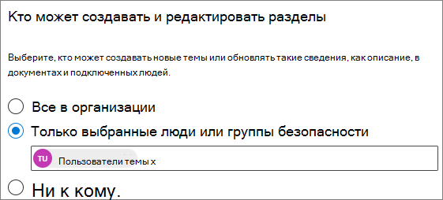
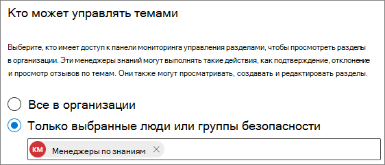

# Управление разрешениями тем в microsoft Viva Topics

Вы можете управлять настройками разрешений тем в Центре администрирования [Microsoft 365.](https://admin.microsoft.com) Для выполнения этих задач необходимо быть глобальным администратором или администратором SharePoint.

С помощью параметров разрешений темы можно выбрать:

- Какие пользователи могут создавать и редактировать темы: создавать новые темы, которые не были найдены во время обнаружения, или редактировать существующие разделы.
- Какие пользователи могут управлять темами: получать доступ к Центру управления темами и просматривать отзывы по темам, а также перемещать темы по жизненному циклу.

## Чтобы получить доступ к настройкам управления разделами:

1. В Центре администрирования Microsoft 365 выберите **"Параметры"** и **"Параметры организации".**
2. На **вкладке "Службы"** щелкните **"Раздел".**

     

3. Выберите **вкладку "Разрешения раздела".** Сведения о каждом параметре см. в следующих разделах.

     

## Изменение разрешений на обновление сведений о теме

Обновление разрешений на создание и редактирование разделов:

1. На **вкладке "Разрешения раздела"** в разделе **"Кто может создавать и редактировать** разделы" выберите **"Изменить".**
2. На странице **"Кто может создавать и редактировать темы"** можно выбрать:
    - **Все в организации**
    - **Только выбранные люди или группы безопасности**
    - **Никто**

      

3. Нажмите кнопку **Сохранить**.

Обновление разрешений на управление разделами:

1. На **вкладке "Разрешения раздела"** в разделе **"Кто может управлять темами"** выберите "Изменить". 
2. На странице **"Кто может управлять темами"** можно выбрать:
    - **Все в организации**
    - **Выбранные люди или группы безопасности**

      

3. Нажмите кнопку **Сохранить**.

## См. также

[Управление обнаружением тем в Microsoft Viva Topics](topic-experiences-discovery.md)

[Управление видимостью тем в microsoft Viva Topics](topic-experiences-knowledge-rules.md)

[Изменение имени центра тем в Microsoft Viva Topics](topic-experiences-administration.md)
