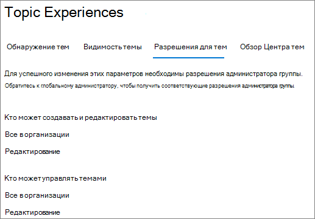

# Управление разрешениями тем в Разделах Microsoft VivaManage topic permissions in Microsoft Viva Topics

Вы можете управлять настройками разрешений тем в [центре Microsoft 365 администрирования.](https://admin.microsoft.com)You can manage topic permissions settings in the [Microsoft 365 admin center](https://admin.microsoft.com). Вы должны быть глобальным администратором или администратором SharePoint для выполнения этих задач.You must be a global administrator or SharePoint administrator to perform these tasks.

С помощью параметров разрешений тем можно выбрать:With topic permissions settings you can choose:

- Какие пользователи могут создавать и редактировать темы. Создайте новые темы, которые не были найдены во время обнаружения или редактировать существующие сведения о теме.Which users can create and edit topics: Create new topics that were not found during discovery or edit existing topic details.
- Какие пользователи могут управлять темами: Доступ к центру управления темами и просмотр отзывов по темам, а также перемещение тем в течение жизненного цикла.Which users can manage topics: Access the topic management center and view feedback on topics as well as move topics through the lifecycle.

## Чтобы получить доступ к настройкам управления темами:To access topics management settings:

1. В центре администрирования Microsoft 365 нажмите **кнопку Параметры,** а затем **параметры Org**.In the Microsoft 365 admin center, click **Settings**, then **Org settings**.
2. На **вкладке Services** щелкните **Раздел опытом**.On the **Services** tab, click **Topic experiences**.

     

3. Выберите **вкладку "Разрешения** темы". Сведения о каждом параметре см. в следующих разделах.Select the **Topic permissions** tab. See the following sections for information about each setting.

     

## Изменение тех, у кого есть разрешения на обновление сведений о темеChange who has permissions to update topic details

Чтобы обновить, у кого есть разрешения на создание и редактирование тем:To update who has permissions to create and edit topics:

1. На **вкладке Разрешения Темы,** **в разделе Кто можно создавать и редактировать** темы, выберите **Изменить**.On the **Topic permissions** tab, under **Who can create and edit topics**, select **Edit**.
2. На странице Кто можно создавать и **редактировать** темы, можно выбрать:On the **Who can create and edit topics** page, you can select:
    - **Все в организации****Everyone in your organization**
    - **Только выбранные люди или группы безопасности****Only selected people or security groups**
    - **Никто****No one**

      

3. Нажмите **Сохранить**.Select **Save**.

Чтобы обновить, у кого есть разрешения на управление темами:To update who has permissions to manage topics:

1. На **вкладке Разрешения Темы,** в **разделе Кто можно управлять темами,** выберите **Изменить**.On the **Topic permissions** tab, under **Who can manage topics**, select **Edit**.
2. На странице **Кто тем можно** выбрать:On the **Who can manage topics** page, you can select:
    - **Все в организации****Everyone in your organization**
    - **Выбранные люди или группы безопасности****Selected people or security groups**

      

3. Нажмите **Сохранить**.Select **Save**.

## См. такжеSee also

[Управление обнаружением тем в Microsoft Viva TopicsManage topic discovery in Microsoft Viva Topics](topic-experiences-discovery.md)

[Управление обзором тем в Разделах Microsoft VivaManage topic visibility in Microsoft Viva Topics](topic-experiences-knowledge-rules.md)

[Изменение имени центра темы в Разделе Microsoft Viva TopicsChange the name of the topic center in Microsoft Viva Topics](topic-experiences-administration.md)
