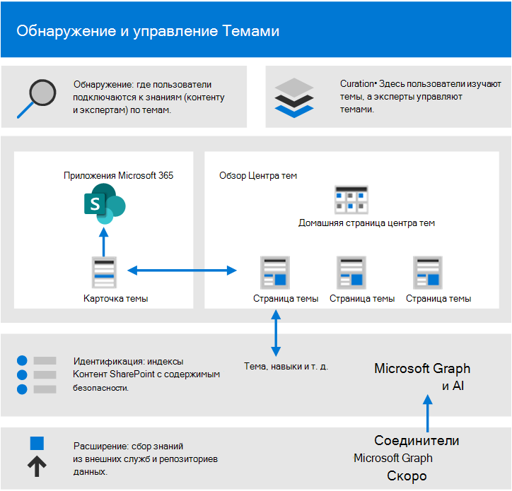
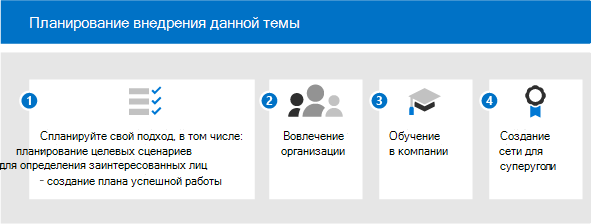

# Начало работы по внедрению microsoft Viva Topics

Перед началом внедрения необходимо понять понятия, связанные с управлением знаниями и Viva Topics. На следующей схеме показано, что происходит во время обнаружения и курирования темы:

- **Обнаружение**. Пользователи могут обнаруживать знания в приложениях, которые они используют каждый день, с помощью тематических карточек. Кроме того, они могут обнаруживать темы в Поиске (Майкрософт).
- **Управление**. Профильные специалисты Майкрософт уточняют темы с помощью тематических страниц, а искусственный интеллект учится на основе их ввода. Центр Topic содержит страницы тем, которые пользователи могут изучить, а эксперты могут управлять ими.
- **Идентификация**. С помощью Microsoft Graph и искусственного интеллекта (AI) знания и люди (темы, навыки и т. д.) идентифицируются и автоматически объединяются в связанные темы. Содержимое SharePoint индексируется с помощью содержимого безопасности.
- **Расширение.** С помощью соединители Graph microsoft (скоро) можно получить знания из внешних служб и репозиториев данных.

Дополнительные сведения можно просмотреть в [обзоре](topic-experiences-overview.md) для введения.

Имейте в виду, что:

- Обнаружение тем улучшается, когда доступно больше содержимого.
- Безопасность, конфиденциальность и расположение данных сохраняются, даже если информация представлена в новом опыте.
- Для просмотра Viva Тем пользователям нужна лицензия.
- Изначально происходит обнаружение содержимого на английском языке.

Чтобы подготовиться, подумайте над этими вопросами:

- Какой контент следует использовать для обнаружения тем?
- Кто будет управлять темами?
- Кто будет видеть тематические карточки и основные моменты?
- Какие темы ожидаются?

Просмотрите этот список предварительных условий для эффективного использования Viva Тем:

|Продукт или функция |Описание |
|:-------|:--------|
|SharePoint Online с современными страницами SharePoint |Майнинг тем включает только контент SharePoint сайтах, а карточки тем можно всплыть только на современных страницах.|
|Microsoft Graph |Вы можете управлять темами, включенными или исключенными из Поиска (Майкрософт) или Delve, с помощью параметров Microsoft Graph. |

## Планирование принятия

Чтобы спланировать принятие Viva Topics, необходимо:

1. Планирование подхода и целевых сценариев:
    - Подумайте о определении и определении [приоритетов сценариев.](#target-scenarios)
    - Подумайте о [заинтересованных лицах](#identify-stakeholders) и членах группы проектов, которые необходимо вовлекть.  
    - Выясните, какое влияние на бизнес вы хотите добиться и как вы будете [измерять успех.](#create-a-success-plan)

2. Вовлеките свою организацию:
    - Определите бизнес-группы и бизнес-группы, которые должны быть вовлечены, и получите согласование между этими группами и сценариями, которые вы планируете.
    - Начните думать о том, как привлечь некоторых ранних пользователей для получения критически важных и ранних отзывов, чтобы вы могли получить наилучшее решение с помощью повторных действий.
    - Начните создание сообщества и подумайте о том, как viva Topics можно использовать в организации этими различными группами.

3. Обучение организации. Большинство людей интуитивно понимают концепцию тем и то, как карточки тем скомпилируются соответствующие сведения, а также понимают и видят значение. Но вам может потребоваться создать обучение, адаптированное к вашей собственной культуре и организации, чтобы показать, как вы хотите использовать Viva Topics. Некоторые учебные ресурсы:
    - [Project Центр ресурсов Кортекса](https://aka.ms/projectcortex). Включает обзоры и сведения о функциях, записанные видео и презентации в час работы, а также сведения о партнерах и их предложениях.
    - В ближайшее время обучающие видео и помощь для конечных пользователей.

4. [Создание сети чемпиона:](#build-a-champion-network)
    - Возможно, у вас уже есть сообщества для обсуждения практических вопросов или уже готовы группы энтузиастов. Это отличные способы социализации, популяризации и вовлечения коллег для помощи друг другу. И они могут делиться историями успеха, которые могут быть ценными. Они могут предлагать советы и делиться энтузиазмом.

### Целевые сценарии

Определите, как использовать Viva Topics в организации, чтобы успешно использовать их. Вот несколько сценариев, в которых управление знаниями и темы могут помочь вашей организации:

- Обучение роли &: понимание терминологии новой организации, ключевых проектов и культуры являются важными шагами в области onboarding. Простое обнаружение тем поможет новым сотрудникам быстро приспособиться к новым заданиям, ролям или проектам.
- Поиск знаний и обмен информацией. Когда темы управляются и разделяются, люди в организациях могут легко найти информацию и экспертов, чтобы помочь им в их ежедневной работе.
- Расширение возможностей принятия решений и сокращение времени выхода на рынок. Если информация и эксперты легко доступны, вы можете легче принимать решения и сокращать время, затрачиваемое на проекты.

#### Пример сценария для onboarding роли

Менеджеру по персоналу необходимо предоставить сведения новым сотрудникам, которые помогут им быстро работать на борту компании и их командам. Они хотят указать им правильные ресурсы, документы и членов команды, которые им потребуется быстро и эффективно использовать на борту. Они ищут решение, которое позволяет новому сотруднику быстро находить необходимые ему сведения без поиска в нескольких репозиториях или выхода из уже использующихся приложений.

Пример.

- Сотрудник (Иордания) берет на себя новую роль, или был недавно нанят и только начинается с роли. Иордания хочет как можно быстрее вовлекаться в работу и работать продуктивно. Но Иордания также нуждается в помощи в поиске исходного места.
- Коллега (Ким), который был в роли перед Иорданией, создал страницы темы, которые могут помочь новым сотрудникам и всем, кто ищет эту информацию.
- Ким был МСП и имел разрешения на просмотр неподтвержденных страниц темы. Неподтвержденные страницы тем — это отличные отправные точки для просмотра того, что обнаружил и создал ИИ, и Сергей мог изменять их, чтобы добавлять экспертные ресурсы и определения, а также закреплять другие ресурсы.
- Когда Иордания читает новый пост в SharePoint, они видят выделение темы и наведите курсор на него, чтобы быстро получить определение термина и с кем связаться с другими вопросами. Раньше Марте приходилось выискивать эту информацию и связываться с коллегами, чтобы узнать, кому можно задать соответствующие вопросы.
- Предоставление этих сведений в темах может быть очень эффективным решением, так как несмотря на прежнюю доступность этой информации, она могла находиться в изолированных отделах и требовать усилий по поиску. Привнося его в приложения, которые использует Иордания, и помогая им найти этих экспертов, можно также привлечь внимание и сообщество. Это также помогает почувствовать дополнительные возможности в новой роли.

При автоматизации этого сценария можно убедиться, что:

- Новые сотрудники могут быстро связываться с нужными людьми в нужных проектах.
- Новые сотрудники получают мгновенный доступ к последней информации о проекте в рамках своей работы.
- Время поиска значительно сокращается.
- Время адаптации значительно сокращается.

#### Пример сценария для центра обработки вызовов клиентов

Вы можете включить службу поддержки клиентов, чтобы быстро найти файлы и экспертов, чтобы помочь с необычными налоговыми вопросами и быстро документировать ответ для других, чтобы легко получить доступ с Viva Topics.

Например, представителю службы поддержки необходимо быстро найти статьи, документы и политики базы знаний, чтобы они могли поддерживать клиентов. Они хотят найти нужные сведения в нужное время, не просеять вручную несколько баз данных, репозиториев или приложений или отправлять вызов. И они ищут решение, которое позволяет им оставаться в своих основных политиках запроса и доступе, правилах и руководствах в потоке бесед, чтобы они могли быстро отвечать на вопросы и обновлять дело.

При автоматизации этого сценария с Viva Topics можно убедиться, что:

- Время звонков в службу поддержки сокращается.
- Сокращается перевод на второй и третий уровень поддержки.
- Количество ответных вызовов по конкретному делу уменьшается.
- Повышается удовлетворенность клиентов.

#### Приоритеты сценариев

После определения сценариев можно определить приоритеты:

Один из способов определить приоритеты — построить график сценариев в сетке, который будет показывать влияние и простоту реализации. Найди сценарии, которые имеют большое влияние и просты в реализации и делают эти сценарии вашим приоритетом. Наименьший приоритет имеют сценарии с низким влиянием и трудной реализацией. Осуществление сценария с высоким уровнем влияния и простого в реализации помогает пользователям воодушевиться и увидеть возможности использования тем.

Выберите несколько ключевых сценариев, на которых нужно сосредоточиться изначально, пообщаться с первыми пользователями, чтобы получить обратную связь, а затем разверните сценарии поэтапно. Таким образом, вы можете итерировать, сделать улучшения и получить обратную связь, чтобы можно было со временем развивать внедрение.

### Определение круга заинтересованных лиц

Определите заинтересованных лиц для проекта. Ключевые роли — исполнительный спонсор, владелец успеха и чемпионы.

|Роль |Обязанности |Отдел |
|:-------|:-------|:--------|
| Исполнительный спонсор (s)   | Сообщение компании о видении и ценностях высокого уровня   |  Высшее руководство   |
| Project(ы) | Наблюдение за всем процессом запуска и развертывания | Управление проектами |
| Администраторы знаний| Настройка и конфигурация Viva Тем | ИТ-отдел |
| Руководители знаний | Управление темами и наблюдение за таксономией | Любой отдел |
| Менеджеры таксономии | Контроль таксономии | Любой отдел |
| Эксперты по темам и авторы тем | Создание и просмотр тем и описаний | Любой отдел |
| Лидеры | Помощь в работе с возражениями и управлении ими | Любой отдел (сотрудники) |
| Администратор клиента | Настройка параметров на уровне клиента | ИТ-отдел |
| Администратор Power Platform| Настройка среды служб общих данных | ИТ-отдел |
| Администратор или руководитель поиска | Настройка параметров поиска | ИТ-отдел |

В более крупной организации в этих ролях также может быть несколько человек, и вам потребуется управлять координацией между ними. В небольшой компании один человек может выполнять несколько из этих ролей. Различные роли могут быть более задействованы на различных этапах проекта. Например, администраторы клиента больше участвуют в настройке функций, а эксперты по темам и чемпионы не участвуют до тех пор, пока не начнут определять темы.
 
Хотя мы рекомендуем выполнять каждую из этих ролей на протяжении всего выполнения, вы можете обнаружить, что вам не требуется, чтобы все они начали работу с идентифицированным решением.

### Создание плана успеха

Используйте эти индикаторы для измерения успешности Viva Topics в организации. Посмотри:

1. Использование темы:
      - Впечатления от тем
      - Количество тем — подтвержденных и неподтвержденных — в списке.
      - Количество опубликованных страниц тем.
1. Отзывы пользователей из карточек тем.
1. Проводите опросы удовлетворенности сотрудников. Viva Topics должна улучшить возможности сотрудников по поиску информации, поэтому найдите способы сбора их входных данных и отзывов по этому опыту.
1. Положительное влияние на аналитику поиска. Так как темы отображаются в опытом поиска, со временем вы можете увидеть сниженные показатели заброшенных поисков, так как людям легче найти темы в поиске. 

### Создание сети чемпиона

Создайте сеть чемпионов в вашей организации. Чемпионы важны, так как могут:

- Создание круга влияния в их командах
- Управление темами & обслуживания

Вы можете набирать чемпионов из разных ролей — менеджеров знаний и специалистов по предметам.

Многие сети чемпиона используют Yammer в качестве платформы. В Yammer люди могут размещать вопросы, получать ответы и делиться историями успеха. Трудно получить слово в одиночку, поэтому вы можете полагаться на сеть людей по всей компании, чтобы предложить советы своим коллегам и показать, как их команда использует Viva Topics, чтобы другие команды могли думать о своих сценариях.

Некоторые организации используют хакатоны (формальные или неофициальные, виртуальные или лично) для сбора групп людей для работы над конкретным проектом. Например, можно собрать экспертов по предметам и совместно использовать их для кураторской работы над набором страниц темы.

Подумайте, как распознать своих чемпионов. Вознаградить их действия, дать им некоторое признание и создать видимое чувство сообщества и участие, чтобы они чувствовали, что они вносят вклад в что-то, и они также получают что-то от своих инвестиций.

Теперь, когда вы готовы к выкатке, необходимо убедиться, что вы поощряете постоянное участие.

- Ведение активных Yammer групп для чемпионов.
- Поделитесь историями успеха.
- Периодически проводятся события вовлечения для обмена историями или внедрения новых функций.
- Установите проблемы для людей и запустите конкурсы.

## Дальнейшие действия

Когда вы будете готовы развернуть Viva Темы, нужно будет вовлечь людей.

- Начните представлять набор функций и подумайте о своих сценариях.
- Соберите заинтересованных лиц и создайте сценарии.
- Мотивируйте сообщество и подумайте о том, как вы собираетесь его привлечь.
- Затем выполните этапы подготовки. Некоторые из них могут быть технической готовности, а некоторые готовности бизнеса.
- Наконец, общайтесь и продвигайте.
