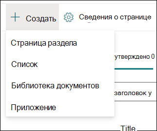
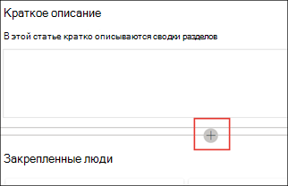

# Работать с подразделами в центре справки (Предварительная версия)

> [!Note] 
> Содержимое этой статьи предназначено для Кортексного предварительного просмотра Project. [Узнайте больше о Кортекс Project](https://aka.ms/projectcortex).

В центре знаний руководитель может просматривать темы, которые были mined и обнаружены в указанных исходных расположениях SharePoint, а также либо подтверждать их, либо отклонять. Диспетчер базы знаний также может создавать и публиковать новые темы, если они не были найдены в ходе обнаружения разделов, или редактировать существующие, если их необходимо обновить.

## Требования

Для работы в центре разделов необходимы необходимые разрешения. Администратор может добавить вас во время [установки управления знаниями](set-up-knowledge-network.md)или добавить новых пользователей [позже](give-user-permissions-to-the-topic-center.md).

Пользователям центра разделов могут быть предоставлены два набора разрешений:

- Создание и редактирование разделов: создание новых разделов или обновление содержимого разделов, таких как описание, документы и связанные лица
- Управление разделами: использование панели управления разделами для просмотра тем в Организации. Пользователи могут выполнять такие действия, как "подтвердить" и "отклонить"

## Просмотр неподтвержденных разделов

На домашней странице центра разделов темы, обнаруженные в указанных исходных расположениях SharePoint, будут перечислены на вкладке **неподтвержденные** . Пользователь с разрешениями на управление разделами может проверить неподтвержденные разделы и подтвердить или отклонить их.

Чтобы просмотреть неподтвержденный раздел, выполните следующие действия.

1. На вкладке **неподтвержденные** выберите раздел, чтобы открыть страницу раздела. 

2. На странице темы изучите страницу раздела и нажмите кнопку **изменить** , если необходимо внести какие-либо изменения на страницу.
3. На домашней странице центра знаний для выбранного раздела можно выполнить следующие действия: 
    а) Выберите проверку, чтобы подтвердить, что вы хотите сохранить раздел. 
    б) Если вы хотите отклонить тему, выберите значение " **x** ". 

    Подтвержденные темы будут удалены из **неподтвержденного** списка и теперь будут отображаться на вкладке **подтверждено** . 

    Отклоненные разделы будут удалены из **неподтвержденного** списка и теперь будут отображаться на вкладке **отклонено или исключено** . 
    
   
## Создание раздела

При необходимости пользователь с разрешениями на создание или изменение темы может создать новый раздел. Это может потребоваться, если тема не была обнаружена с помощью обнаружения, или если не удалось найти достаточное свидетельство для создания темы в результате использования AI-технологии.

Чтобы создать новый раздел, выполните следующие действия.
1. На странице "центр разделов" выберите **создать**, а затем выберите **раздел страница**. 

      

2. На странице новый раздел вы можете ввести сведения о новом шаблоне раздела: 
    а) В разделе **имя этого раздела** введите имя нового раздела. 
    б) В разделе **альтернативные имена** введите имена или акронимы, которые также используются для ссылки на раздел. 
    в. В разделе **Краткое описание** введите описание раздела с одним или двумя предложениями. Этот текст будет использоваться для связанной карточки с темой. 
    г. В разделе **люди** введите имена экспертов для темы. 
    д. В разделе **файлы и страницы** выберите **Добавить** , а затем на следующей странице можно выбрать связанные файлы OneDrive или страницы SharePoint Online. 
    f. В разделе **сайты** нажмите кнопку **Добавить**. В области **сайты** , которая отображается, выберите сайты, связанные с этим разделом. 

      
3. Если необходимо добавить на страницу другие компоненты, например текст, изображения, веб-части, ссылки и т. д., выберите значок холст в центре страницы, чтобы нахождение и добавление элементов.
       

4. Когда все будет готово, нажмите кнопку **опубликовать** , чтобы опубликовать страницу темы. Опубликованные темы страницы будут отображаться на вкладке **страницы** .

> [!Note] 
> Новая страница темы состоит из веб-частей, которые представляют собой *сведения о сети*. Это означает, что как AI собирает дополнительные сведения о теме, сведения в этих веб-частях будут обновлены с помощью предложений, чтобы сделать страницу более полезной для пользователей.

## Изменение существующей страницы раздела

Имеющиеся страницы разделов можно найти на странице **страницы** . 

1. На странице "центр разделов" выберите **страницы**. 
2. На странице **страницы** отображается список тематических страниц. Используйте поле поиска, чтобы найти страницу темы, которую необходимо обновить. Щелкните имя страницы темы, которую нужно изменить. 
3. На странице раздел нажмите кнопку **изменить**.  
4. Внесите необходимые изменения на странице. Сюда входят обновления следующих полей: 
    а) Альтернативные имена 
    б) Описание 
    в. Люди 
    г. Файлы и страницы 
    д. Сайты 
    f. Вы также можете добавить на страницу статические элементы, например текст, изображения или ссылку, выбрав значок холст. 

5. Нажмите кнопку **повторно опубликовать** , чтобы сохранить изменения.

## См. также

  

