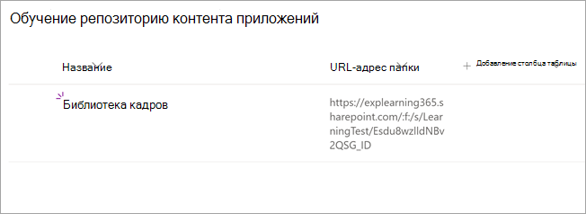

# Скоро: настройте SharePoint как источник учебного контента для Microsoft Viva Learning (Preview)

> [!NOTE]
> Сведения в этой статье относятся к продукту предварительного просмотра, который может быть существенно изменен до его коммерческого выпуска. 

Вы можете настроить SharePoint как источник контента для обучения, чтобы сделать собственный контент организации доступным в Viva Learning (Preview).

## Обзор

Администратор знаний (или глобальный администратор) предоставляет URL-адрес сайта, на котором служба обучения может создать пустое централизованное расположение — репозиторий контента обучающих приложений — в виде структурированного списка SharePoint. Этот список может использоваться организацией для использования ссылок на межкомпанийные SharePoint, содержащие обучающий контент. Администраторы отвечают за сбор и кураторирование списка URL-адресов для папок. Эти папки должны включать только содержимое, которое можно сделать доступным в Viva Learning (Preview).

Viva Learning (Preview) поддерживает следующие типы документов:

- Word, PowerPoint, Excel, PDF
- Аудио (.m4a)
- Видео (.mov, .mp4, .avi)

Дополнительные сведения см. [в SharePoint ограничения.](/office365/servicedescriptions/sharepoint-online-service-description/sharepoint-online-limits?redirectSourcePath=%252farticle%252fSharePoint-Online-limits-8f34ff47-b749-408b-abc0-b605e1f6d498) 

## Разрешения

URL-адреса папок библиотеки документов можно собирать с любого SharePoint сайта в организации. Viva Learning (Preview) следует всем существующим разрешениям на контент. Поэтому только контент, к которому пользователь имеет разрешение на доступ, можно искать и просматривать в Viva Learning (Preview). Любой контент в этих папках будет искаться, но можно использовать только контент, к которому у отдельного сотрудника есть разрешения.

Удаление контента из репозитория организации в настоящее время не поддерживается.

Чтобы удалить непреднамеренно всплыть содержимое, выполните следующие действия:

1.  Чтобы ограничить доступ к библиотеке документов, выберите параметр **Показать** действия, а затем выберите **Управление доступом.**
     
     

2.  Удаление исходного документа в библиотеке документов.

Дополнительные сведения см. в разделе Общий доступ и разрешения в [SharePoint опытом.](/sharepoint/modern-experience-sharing-permissions) 

## Служба обучения

Служба обучения использует предоставленные URL-адреса папок для получения метаданных из всего контента, хранимом в этих папках. В течение 24 часов после поставки URL-адреса папки в централизованном репозитории сотрудники могут искать и использовать содержимое организации в Viva Learning (Preview). Все изменения контента, включая обновленные метаданные и разрешения, также будут применены в службе обучения в течение 24 часов.

## Настройка SharePoint как источника

Вы должны быть глобальным администратором Microsoft 365, администратором SharePoint или администратором знаний для выполнения этих задач.

Чтобы настроить SharePoint как источники учебного контента для Viva Learning (Preview), выполните следующие действия:

1.  В левой навигации центра администрирования Microsoft 365 перейдите к **Параметры**  >  **параметров Org.**
 
2.  На странице **Параметры Org** на вкладке **Services** выберите **Viva Learning (Preview).**

     

3.  На панели **Viva Learning (Preview)** SharePoint url-адрес сайта на сайте SharePoint, где необходимо создать централизованный репозиторий Viva Learning (Preview).

     

4.  Список SharePoint создается автоматически в пределах предоставленного SharePoint сайта.

     

     В левой навигации сайта SharePoint выберите репозиторий контента  >  **обучающего приложения.** 

      

5. На странице **Репозиторий** контента обучающих приложений заполняем список SharePoint URL-адресами в папки обучающего контента.

   1. Выберите **New** для просмотра **панели New item.** 

       
 
   2. На панели **New item** в поле **Title** добавьте имя каталога по вашему выбору. В поле **URL-адрес папки** добавьте URL-адрес в папку обучающего контента. Нажмите **Сохранить**.

       

   3. Страница **Репозиторий** контента обучающих приложений обновляется новым учебным контентом.

       

> [!NOTE]
> Чтобы обеспечить более широкий доступ к репозиторию контента обучающих приложений, в интерфейсе Viva Learning (Preview) будет доступна ссылка на список, где пользователи могут запрашивать доступ и в конечном итоге помочь заполнить список. Владельцы сайтов и глобальные администраторы должны предоставить доступ к списку. Доступ относится только к списку и не применяется к сайту, на котором хранится список. Дополнительные сведения см. в [статье Provide your own organization's content](#provide-your-own-organizations-content) later in this article.

### Куратор библиотеки url-адресов папок

Метаданные по умолчанию (например, измененная дата, созданная именем документа, типом контента и именем организации) автоматически втягивается в Viva Learning (Preview) API Microsoft Graph.
 
Для улучшения общей релевантности поиска и обнаружения контента рекомендуется добавить столбец **Description.**

Чтобы добавить **столбец Описание** на страницу библиотеки документов, выполните следующие действия:

1.  На странице **Документы выберите** **столбец Добавить**.

2. Выберите параметр **Показать действия,** а затем выберите **одну строку текста.**

     

3. На панели **Создание панели столбцов** в поле **Имя** добавьте описательное имя столбца. Нажмите **Сохранить**.

     
 
4. На странице **Документы в** столбце **Описание** добавьте настраиваемые описания для каждого элемента. Если описание не предоставлено, Viva Learning (Preview) предоставит сообщение по умолчанию, в которое будет выделено содержимое из SharePoint библиотеки. 

     
 
### Предоставление контента вашей организации

Администраторы знаний могут получить доступ к репозиторию контента обучающих приложений своей организации в SharePoint, где они могут предоставлять ссылки на меж организации библиотек документов. Содержимое в этих библиотеках будет затем всплыть в качестве обучающего контента в Viva Learning (Preview).

1. В Viva Learning (Preview) выберите **дополнительные параметры** **(...),** а затем **выберите Параметры**.

     
     
2. В **Параметры** выберите **Разрешения**.

     

3. Выберите **контрольный** доступ для подключения к централизованной библиотеке организации.
     
