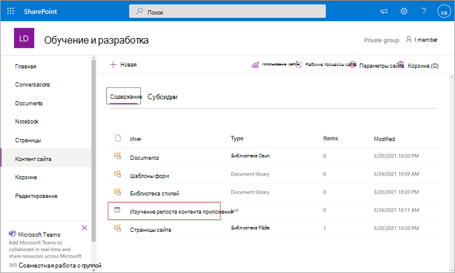

# Скоро: настройте SharePoint как источник учебного контента для Microsoft Viva Learning (Preview)Coming soon: Configure SharePoint as a learning content source for Microsoft Viva Learning (Preview)

> [!NOTE]
> Сведения в этой статье относятся к продукту предварительного просмотра, который может быть существенно изменен до его коммерческого выпуска.The information in this article relates to a preview product that may be substantially modified before it's commercially released. 

Вы можете настроить SharePoint как источник контента для обучения, чтобы сделать собственный контент организации доступным в Viva Learning (Preview).You can configure SharePoint as a learning content source to make your organization's own content available in Viva Learning (Preview).

## ОбзорOverview

Администратор знаний (или глобальный администратор) предоставляет URL-адрес сайта, на котором служба обучения может создать пустое централизованное расположение — репозиторий контента обучающих приложений — в виде структурированного списка SharePoint.The knowledge admin (or global administrator) provides a site URL to where the Learning Service can create an empty centralized location—the Learning App Content Repository—in the form of a structured SharePoint list. Этот список может использоваться организацией для использования ссылок на межкомпанийные SharePoint, содержащие обучающий контент.This list can be used by your organization to house links to cross-company SharePoint folders that contain learning content. Администраторы отвечают за сбор и кураторирование списка URL-адресов для папок.Admins are responsible for collecting and curating a list of URLs for folders. Эти папки должны включать только содержимое, которое можно сделать доступным в Viva Learning (Preview).These folders should only include content that can be made available in Viva Learning (Preview).

Viva Learning (Preview) поддерживает следующие типы документов:Viva Learning (Preview) supports the following document types:

- Word, PowerPoint, Excel, PDFWord, PowerPoint, Excel, PDF
- Аудио (.m4a)Audio (.m4a)
- Видео (.mov, .mp4, .avi)Video (.mov, .mp4, .avi)

Дополнительные сведения см. в [документации SharePoint Online.](/office365/servicedescriptions/sharepoint-online-service-description/sharepoint-online-limits?redirectSourcePath=%252farticle%252fSharePoint-Online-limits-8f34ff47-b749-408b-abc0-b605e1f6d498)For more information, see the [SharePoint Online documentation](/office365/servicedescriptions/sharepoint-online-service-description/sharepoint-online-limits?redirectSourcePath=%252farticle%252fSharePoint-Online-limits-8f34ff47-b749-408b-abc0-b605e1f6d498). 

## РазрешенияPermissions

URL-адреса папок библиотеки документов можно собирать с любого SharePoint сайта в организации.Document library folder URLs can be collected from any SharePoint site in the organization. Viva Learning (Preview) следует всем существующим разрешениям на контент.Viva Learning (Preview) follows all existing content permissions. Поэтому в Viva Learning (Preview) можно найти только контент, к которому пользователь имеет разрешение на доступ.Therefore, only content for which a user has permission to access is searchable and visable within Viva Learning (Preview). Любой контент в этих папках будет искаться, но можно использовать только контент, к которому у отдельного сотрудника есть разрешения.Any content within these folders will be searchable, but only content to which the individual employee has permissions can be used.

Удаление контента из репозитория организации в настоящее время не поддерживается.Content deletion from your organization’s repository is not currently supported.

Чтобы удалить непреднамеренно всплыть содержимое, выполните следующие действия:To remove unintentionally surfaced content, follow these steps:

1.  Чтобы ограничить доступ к библиотеке документов, выберите параметр **Показать** действия, а затем выберите **Управление доступом.**To restrict access to the document library, select the **Show actions** option, and then select **Manage access**.
     
     

2.  Удаление исходного документа в библиотеке документов.Delete the original document within the document library.

Дополнительные сведения см. в разделе Общий доступ и разрешения в [SharePoint опытом.](/sharepoint/modern-experience-sharing-permissions)For more information, see [Sharing and permissions in the SharePoint modern experience](/sharepoint/modern-experience-sharing-permissions). 

## Служба обученияLearning Service

Служба обучения использует предоставленные URL-адреса папок для получения метаданных из всего контента, хранимом в этих папках.The Learning Service uses the provided folder URLs to get metadata from all content stored in those folders. В течение 24 часов после поставки URL-адреса папки в централизованном репозитории сотрудники могут искать и использовать содержимое организации в Viva Learning (Preview).Within 24 hours of supplying the folder URL in the centralized repository, employees can search for and use your organization’s content within Viva Learning (Preview). Все изменения контента, включая обновленные метаданные и разрешения, также будут применены в службе обучения в течение 24 часов.All changes to content, including updated metadata and permissions, will also be applied in the Learning Service within 24 hours.

## Настройка SharePoint как источникаConfigure SharePoint as a source

Вы должны быть глобальным администратором Microsoft 365, администратором SharePoint или администратором знаний для выполнения этих задач.You must be a Microsoft 365 global administrator, SharePoint administrator, or knowledge admin to perform these tasks.

Чтобы настроить SharePoint как источники учебного контента для Viva Learning (Preview), выполните следующие действия:To configure SharePoint as a learning content sources in for Viva Learning (Preview), follow these steps:

1.  В левой навигации центра администрирования Microsoft 365 перейдите к **Параметры**  >  **параметров Org.**In the left navigation of the Microsoft 365 admin center, go to **Settings** > **Org settings**.
 
2.  На странице **Параметры Org** на вкладке **Services** выберите **приложение Learning (Preview).**On the **Org settings** page, on the **Services** tab, select **Learning app (Preview)**.

     

3.  На панели **Learning app (Preview)** SharePoint url-адрес сайта на сайте SharePoint, где вы хотите, чтобы Viva Learning создал централизованный репозиторий.On the **Learning app (Preview)** panel, under SharePoint, provides the site URL to the SharePoint site where you want Viva Learning to create a centralized repository.

     

4.  Список SharePoint создается автоматически в пределах предоставленного SharePoint сайта.A SharePoint list is created automatically within the provided SharePoint site.

     

     В левой навигации сайта SharePoint выберите репозиторий контента  >  **обучающего приложения.**In the left navigation of the SharePoint site, select **Site contents** > **Learning App Content Repository**. 

      

5. На странице **Репозиторий** контента обучающих приложений заполняем список SharePoint URL-адресами в папки обучающего контента.On the **Learning App Content Repository** page, populate the SharePoint list with URLs to the learning content folders.

   1. Выберите **New** для просмотра **панели New item.**Select **New** to view the **New item** panel. 

       
 
   2. На панели **New item** в поле **Title** добавьте имя каталога по вашему выбору.On the **New item** panel, in the **Title** field, add a directory name of your choice. В поле **URL-адрес папки** добавьте URL-адрес в папку обучающего контента.In the **Folder URL** field, add the URL to the learning content folder. Нажмите **Сохранить**.Select **Save**.

       

   3. Страница **Репозиторий** контента обучающих приложений обновляется новым учебным контентом.The **Learning App Content Repository** page is updated with the new learning content.

       

> [!NOTE]
> Чтобы обеспечить более широкий доступ к репозиторию контента обучающих приложений, в интерфейсе Viva Learning (Preview) будет доступна ссылка на список, где пользователи могут запрашивать доступ и в конечном итоге помочь заполнить список.To allow for broader access to the Learning App Content Repository, a link to the list soon will be available in the Viva Learning (Preview) interface where users can request access and ultimately help populate the list. Владельцы сайтов и глобальные администраторы должны предоставить доступ к списку.Site owners and global administrators will be required to grant access to the list. Доступ относится только к списку и не применяется к сайту, на котором хранится список.Access is specific to the list only and does not apply to the site where the list is stored. Дополнительные сведения см. в [статье Provide your own organization's content](#provide-your-own-organizations-content) later in this article.For more information, see [Provide your own organization's content](#provide-your-own-organizations-content) later in this article.

### Куратор библиотеки url-адресов папокFolder URL document library curation

Метаданные по умолчанию (например, измененная дата, созданная именем документа, типом контента и именем организации) автоматически втягивается в Viva Learning (Preview) API Microsoft Graph.Default metadata (such as modified date, created by, document name, content type, and organization name) is automatically pulled into Viva Learning (Preview) by the Microsoft Graph API.
 
Для улучшения общей релевантности поиска и обнаружения контента рекомендуется добавить столбец **Description.**To improve overall discovery and search relevance of the content, we recommend adding a **Description** column.

Чтобы добавить **столбец Описание** на страницу библиотеки документов, выполните следующие действия:To add a **Description** column to the document library page, follow these steps:

1.  На странице **Документы выберите** **столбец Добавить**.On the **Documents** page, select **Add column**.

2. Выберите параметр **Показать действия,** а затем выберите **одну строку текста.**Select the **Show actions** option, and then select **Single line of text**.

     

3. На панели **Создание панели столбцов** в поле **Имя** добавьте описательное имя столбца.On the **Create a column** panel, in the **Name** field, add a descriptive name for the column. Нажмите **Сохранить**.Select **Save**.

     
 
4. На странице **Документы в** столбце **Описание** добавьте настраиваемые описания для каждого элемента.On the **Documents** page, in the **Description** column, add custom descriptions for each item. Если описание не предоставлено, Viva Learning (Preview) предоставит сообщение по умолчанию, в которое будет выделено содержимое из SharePoint библиотеки.If no description is supplied, Viva Learning (Preview) will provide a default message that highlights the content as being from your own SharePoint library. 

     
 
### Предоставление контента вашей организацииProvide your own organization's content

Администраторы знаний могут получить доступ к репозиторию контента обучающих приложений своей организации в SharePoint, где они могут предоставлять ссылки на меж организации библиотек документов.Knowledge admins can access their organization’s Learning App Content Repository in SharePoint, where they can provide references to cross-organization document libraries. Содержимое в этих библиотеках будет затем всплыть в качестве обучающего контента в Viva Learning (Preview).Content within these libraries will be then surfaced as learning content in Viva Learning (Preview).

1. В Viva Learning (Preview) выберите **дополнительные параметры** **(...),** а затем **выберите Параметры**.In Viva Learning (Preview), select **More options** (**...**), and then select **Settings**.

     
     
2. В **Параметры** выберите **Разрешения**.Under **Settings**, select **Permissions**.

     

3. Выберите **контрольный** доступ для подключения к централизованной библиотеке организации.Select **Check access** to connect to your organization’s centralized library.
     
