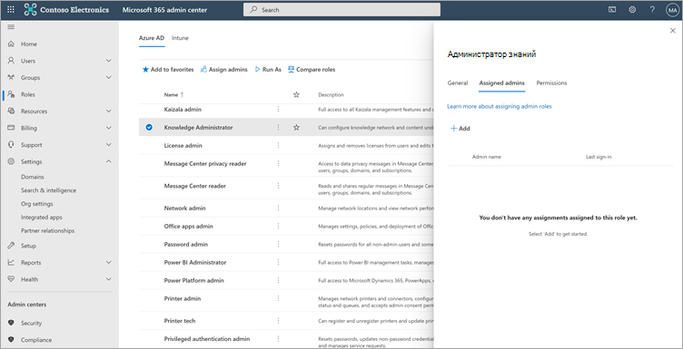
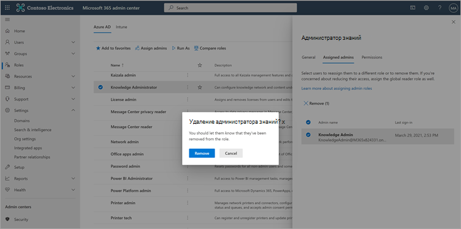
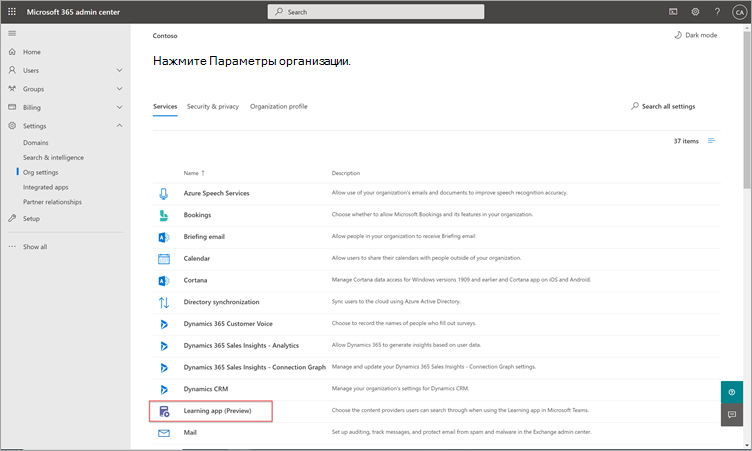
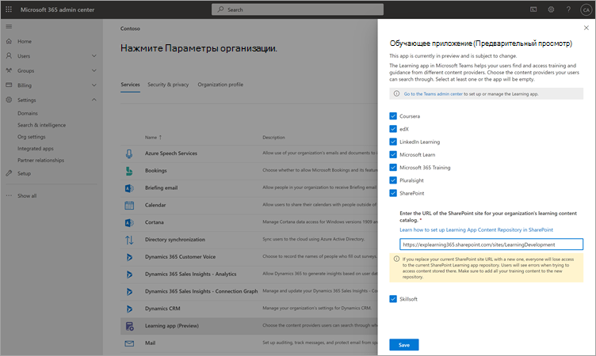

# Настройка источников учебного контента для Microsoft Viva Learning (Preview) в центре администрирования Microsoft 365Configure learning content sources for Microsoft Viva Learning (Preview) in the Microsoft 365 admin center

> [!NOTE]
> Сведения в этой статье относятся к продукту предварительного просмотра, который может быть существенно изменен до его коммерческого выпуска.The information in this article relates to a preview product that may be substantially modified before it's commercially released. 

Администраторы центра администрирования Microsoft 365 самостоятельно или назначив роль администратора знаний отдельным лицам в организации, могут управлять настройками, связанными с viva Learning (Preview) и настраивать источники контента для обучения.The administrators for the Microsoft 365 admin center—either by themselves or by assigning the knowledge admin role to selected individuals in your organization—can manage settings related to Viva Learning (Preview) and can configure the learning content sources.

Администратор выбирает, какие другие источники обучающего контента (например, SharePoint или поддерживаемые сторонние источники поставщиков контента) будут доступны пользователям Viva Learning (Preview).The administrator selects which other learning content sources (for example, SharePoint or supported third-party content provider sources) will be available to users of Viva Learning (Preview). Затем администратор настраивает эти источники, чтобы убедиться, что содержимое доступно для поиска и обнаружения и может просматриваться сотрудниками, которые используют Viva Learning (Preview).The admin then configures those sources to make sure the content is available for search and discovery and can be browsed by the employees who use Viva Learning (Preview).

> [!NOTE]
>  Пользователи во время регистрации в не microsoft и LinkedIn Learning Pro в браузере или встроенном пользователе.Users sign in to non-Microsoft and LinkedIn Learning Pro learnings in a browser or embedded viewer. Это настраиваемое обучение подлежит раздельным условиям лицензии, конфиденциальности и службы между организацией и третьей стороной, а не условиям Viva Learning (Preview).This configured learning is subject to the separate license, privacy and service terms between your organization and the third party, and not the Viva Learning (Preview) terms. Прежде чем выбирать этот тип обучения, убедитесь, что у вас есть соглашение для вашей организации и пользователей.Before selecting this type of learning, verify you have an agreement in place for your organization and users.

## Назначение роли администратора знаний (необязательный)Assign the knowledge admin role (Optional)

Вы должны быть глобальным администратором Microsoft 365 для выполнения этих задач.You must be a Microsoft 365 global administrator to perform these tasks.

> [!TIP]
> Администратор знаний должен быть в меру техническим и иметь существующие SharePoint учетные данные администратора, желательно тех, кто хорошо разбирается в образовании, обучении, обучении или опыте сотрудников в организации.The knowledge admin should be moderately technical and have existing SharePoint admin credentials, preferably someone who is well-versed in the education, learning, training, or employee experience part of the organization.

### Добавление администратора знанийAdd a knowledge admin

Чтобы добавить администратора знаний для Viva Learning (Preview), выполните следующие действия:To add a knowledge admin for Viva Learning (Preview), follow these steps:

1.  В левой навигации центра администрирования Microsoft 365 перейти к **ролям**.In the left navigation of the Microsoft 365 admin center, go to **Roles**.

2.  На странице **Роли** на вкладке **Azure AD** выберите **Администратор знаний.**On the **Roles** page, on the **Azure AD** tab, select **Knowledge Administrator**.
 
3.  На панели **Администратор знаний** выберите **назначенного администратора,** а затем выберите **Добавить**.On the **Knowledge Administrator** panel, select **Assigned admins**, and then select **Add**.

     

3.  На панели **Добавить администраторов** выберите выбранного вами человека для роли, а затем выберите **Добавить**.On the **Add admins** panel, select the person you choose for the role, and then select **Add**.

     

### Удаление администратора знанийRemove a knowledge admin

Чтобы удалить администратор знаний для Viva Learning (Preview), выполните следующие действия:To remove a knowledge admin for Viva Learning (Preview), follow these steps:

1.  В левой навигации центра администрирования Microsoft 365 перейти к **ролям**.In the left navigation of the Microsoft 365 admin center, go to **Roles**.

2.  На странице **"Роли"** на **вкладке Azure AD** выберите **администратора знаний.**On the **Roles** page, on the **Azure AD** tab, and then select **Knowledge Administrator**.
 
3.  На панели **Администратор знаний** на вкладке **Назначены** администраторы выберите **Удалить,** а затем выберите человека, которого необходимо удалить из роли.On the **Knowledge Administrator** panel, on the **Assigned Admins** tab, select **Remove**, and then select the person you want to remove from the role. Чтобы подтвердить, выберите **Удалить**.To confirm, select **Remove**.

     

## Настройка параметров для источников учебного контентаConfigure settings for the learning content sources

Вы должны быть глобальным администратором Microsoft 365 или администратором знаний для выполнения этих задач.You must be a Microsoft 365 global administrator or knowledge admin to perform these tasks.

Чтобы настроить параметры для учебных источников контента в Viva Learning, выполните следующие действия:To configure settings for learning content sources in Viva Learning, follow these steps:

1.  В левой навигации центра администрирования Microsoft 365 перейдите к **Параметры**  >  **параметров Org.**In the left navigation of the Microsoft 365 admin center, go to **Settings** > **Org settings**.

2.  На странице **Параметры Org** на вкладке **Services** выберите **Viva Learning (Preview).**On the **Org settings** page, on the **Services** tab, select **Viva Learning (Preview)**.

     

3.  На панели **Viva Learning (Preview)** выберите источники контента для обучения, которые необходимо настроить для организации, а затем выберите **Сохранить**.On the **Viva Learning (Preview)** panel, select the learning content sources you want to configure for the organization, and then select **Save**.

     

Среди всех источников обучения, которые существуют, некоторые из них будут включены по умолчанию.Among all the learning sources that exist, some will be enabled by default. Эти источники обучения включают в себя:These learning sources include:

- Обучение LinkedIn (бесплатный контент)LinkedIn Learning (free content)
- Microsoft LearnMicrosoft Learn
- Microsoft 365 ОбучениеMicrosoft 365 Training

> [!NOTE]
> Бесплатный контент LinkedIn предоставляется пользователям в соответствии с политиками конфиденциальности и пользовательским соглашением LinkedIn.LinkedIn free content is provided to users under the LinkedIn privacy policies and user agreement. LinkedIn получит IP-адрес пользователя, любые файлы cookie, ранее установленные LinkedIn, и застроит новый файл cookie для отслеживания использования бесплатного контента.LinkedIn will receive the user’s IP address, any cookies previously set by LinkedIn, and will set a new cookie to track use of free content. Для получения бесплатного контента пользователям не требуется вход в LinkedIn.Users are not required to sign in with LinkedIn to receive free content.  
Для премиум-контента LinkedIn вашей организации нужна подписка для вашей команды, чтобы получить доступ к этому контенту.For LinkedIn premium content, your organization needs a subscription for your team to access that content. Пользователи должны будут войти в LinkedIn, чтобы получить доступ к этому обучению, которое предоставляется в соответствии с условиями организации и условиями пользователей с LinkedIn.Users will need to sign into LinkedIn to access that learning, which is provided under the terms of your organization’s and user terms with LinkedIn.   Для контента, не связанного с Microsoft (за исключением бесплатного контента LinkedIn), убедитесь, что ваша организация имеет подписку на доступ к этому контенту с помощью учетной записи перед подключением к Viva Learning (Preview).For non-Microsoft content (except free LinkedIn content), ensure your organization has a subscription for your users to access that content using a work account before connecting it to Viva Learning (Preview). Личные подписки пользователей на поставщиков обучения, не в microsoft, не будут интегрированы с Viva Learning (Preview).Users’ personal subscriptions to non-Microsoft learning providers will not be integrated with Viva Learning (Preview). Пользователи во время регистрации в не microsoft и LinkedIn Learning Pro в браузере или встроенном пользователе.Users sign in to non-Microsoft and LinkedIn Learning Pro learnings in a browser or embedded viewer. Если пользователи переходят к контенту, где у них нет организационной подписки, они могут увидеть страницу поставщика, на которой они могут зарегистрироваться для отдельной подписки.If users navigate to content where they do not have an organizational subscription, they may see a provider page where they could sign up for an individual subscription. Все обучение, не в рамках Microsoft, предоставляется в соответствии с условиями поставщика, не в рамках Viva Learning.All non-Microsoft learning is provided under the non-Microsoft provider’s terms and not as part of Viva Learning. 

Чтобы включить или отключить источник контента для обучения, выберите контрольный ящик рядом с источником.To enable or disable a learning content source, select the check box next to the source. Если включен источник, будет виден контрольный знак.If a source is enabled, a check mark will be visible.

## Сторонние поставщики контентаThird-party content providers 

Набор доступных подключенных поставщиков обучения может измениться в любое время.The set of available connected learning providers might change at any time. По мере роста программы к нему присоединятся все больше поставщиков.More providers will join as the program grows. Доступные поставщики также могут отказаться от подключения к Viva Learning (Preview).Available providers might also choose to discontinue their connection with Viva Learning (Preview).

### Skillsoft как источник контентаSkillsoft as a content source  

Для Viva Learning (Preview) пользователи, у которых включена и включена возможность просмотра контента Skillsoft, посадят на страницу Percipio, в которую будет вводиться имя сайта Percipio организации.For Viva Learning (Preview), users who have Skillsoft enabled and choose to view Skillsoft content will land on a Percipio page that asks them to input your organization's Percipio site name. После ввода имени сайта организации пользователи будут направлены на страницу для входа на сайт Percipio организации.After users input your organization's site name, they will be directed to page to sign in to your organization's Percipio site. Пользователи впишутся с помощью существующих учетных данных и увидят содержимое, которое они изначально выбрали.Users will sign in by using their existing credentials and see the content they originally selected. Пользователям будет предложено ввести имя сайта Percipio только один раз, пока кэш браузера не будет очищен.Users will be asked to input the Percipio site name only once, until their browser cache is cleared. Чтобы упростить этот процесс для пользователей, рекомендуется включить имя сайта Percipio во внутренние сообщения, которые вы отправляете о Viva Learning (Preview).To streamline this experience for your users, we recommend including your Percipio site name in internal communications you send about Viva Learning (Preview).

Это будет временный опыт предварительного просмотра, и мы работаем с Skillsoft, чтобы включить интеграцию с клиентом для общей доступности, которая позволит обойти шаг, который требует, чтобы пользователи предоставили имя сайта Percipio вашей организации.This is intended to be a temporary experience for preview, and we are working with Skillsoft to enable tenant-specific integration for general availability, which will bypass the step that requires users to provide your organization's Percipio site name. 

### Сведения о субстрате MicrosoftDetails on Microsoft substrate  

Для данных, которые вы копируете в Viva Learning (Preview) из службы, не в microsoft (поставщик обучения или система управления обучением), вы не можете напрямую извлекать, исправлять или удалять эти данные в Viva Learning (Preview).For data that you copy to Viva Learning (Preview) from a non-Microsoft service (learning provider or learning management system), you are not able to directly extract, correct, or delete that data in Viva Learning (Preview). Мы обновляем данные, которые вы импортируете из поставщиков, не в корпорации Майкрософт, для отражения изменений и удалений в исходных данных, не в microsoft.We refresh the data you import from non-Microsoft providers promptly to reflect changes and deletions in the non-Microsoft source data.

Вам необходимо работать с поставщиком службы, не входя в Корпорацию Майкрософт, для доступа, исправления, удаления или извлечения данных в соответствии с условиями лицензии, службы или конфиденциальности службы, не входя в Корпорацию Майкрософт.You need to work with the supplier of the non-Microsoft service to access, correct, delete or extract data under the license, service, or privacy terms of the non-Microsoft service. Внесенные изменения будут отражены в данных, обработанных для использования в Viva Learning (Preview) после завершения циклов обновления данных службы не Microsoft и Viva Learning (Preview).The changes made there will be reflected in the data processed for your use in Viva Learning (Preview) upon completion of the data update cycles of the non-Microsoft service and Viva Learning (Preview). Если вы отключите подключение между Viva Learning (Preview) и службой, не в microsoft, все данные, ранее импортируемые из этой службы, будут удалены.If you turn off the connection between Viva Learning (Preview) and a non-Microsoft service, all data you had previously imported from that service will be deleted. 

## Следующий этапNext step

[Настройка SharePoint в качестве источника учебного контента для Microsoft Viva Learning (Preview)Configure SharePoint as a learning content source for Microsoft Viva Learning (Preview)](configure-sharepoint-content-source.md)