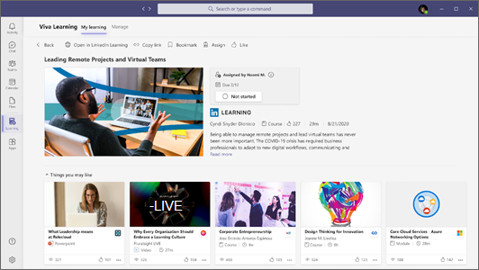

# Обзор обучения Microsoft Viva (Предварительная версия) 

> [!NOTE]
> Сведения в этой статье относятся к продукту предварительного просмотра, который может быть существенно изменен до его коммерческого выпуска. 

Viva Learning (Preview) — центр централизованного обучения в Microsoft Teams, который позволяет легко интегрировать навыки обучения и создания в свой день. В Viva Learning (Preview) ваша команда может открывать, делиться, назначать и учиться в библиотеках контента, предоставляемых как вашей организацией, так и партнерами. Они могут сделать все это, не покидая Microsoft Teams.

   
 
Сотрудники с большей вероятностью сообщают о том, что они удовлетворены и дольше остаются в организации, если у них есть возможность учиться и расти. Viva Learning (Preview) упрощает создание этих возможностей для организации без необходимости отходить от средств коммуникации, которые вы уже используете.

## Узнайте во время работы

### Все

Viva Learning (Preview) упрощает включение обучения в ваш день. Когда вы откроете Viva Learning (Preview) в Microsoft Teams, вы увидите персонализированное представление обучающего контента как от вашей организации, так и от партнеров, таких как LinkedIn Learning. По мере продолжения поиска и выполнения дополнительных учебных занятий рекомендуемый контент будет обновляться с учетом ваших интересов.

- Легко найти возможности обучения, предоставляемые вашей организацией.
- Просмотрите курсы из LinkedIn Learning, Microsoft Learn, Microsoft 365 training, Skillsoft, Coursera, edX, Pluralsight и других сторонних партнеров по обучению.
- Поиск определенного обучающего контента, который обращается к вам или поддерживает ваши карьерные цели.
- Делитесь релевантным, интересным и важным обучающим контентом с членами группы или группами в Microsoft Teams чате или канале.
- Организуйте настраиваемые выборы обучающего контента в Microsoft Teams каналах и вкладок.
- Нравится и сохраняет интересуемые курсы.
- Играйте курсы обучения LinkedIn во встроенном плеере, не покидая Microsoft Teams.

### Managers

Держите свою команду в курсе и в курсе необходимых навыков без необходимости координировать обучение на платформах. Вы можете назначить обучающий контент отдельным лицам или группам, поделиться контентом с командой и отслеживать состояние завершения назначенного обучения.

## Роли администраторов

Администраторы устанавливают разрешения и позволяют использовать источники контента для Viva Learning (Preview). Чтобы настроить Viva Learning (Preview), вам потребуется разрешение:

- Microsoft Teams администратора
- Microsoft 365 глобального администратора или SharePoint администратора
- Администратор базы знаний

### Администратор базы знаний

Администратор знаний — это новая роль Azure Active Directory Azure AD в центре администрирования Microsoft 365, которая может быть назначена любому члену организации. Эта роль управляет источниками учебного контента организации Microsoft 365 центра администрирования. Дополнительные сведения см. в [видеоролике Azure AD built-in roles.](/azure/active-directory/roles/permissions-reference#knowledge-administrator)

Администратор знаний должен быть в меру техническим и иметь существующие SharePoint учетные данные администратора. Администратор знаний должен хорошо разбираться в части образования, обучения, обучения или опыта сотрудников организации.

## Начало работы

Когда вы будете готовы к настройке и настройке Viva Learning (Preview) в Microsoft 365 среде:

- Используйте центр администрирования Microsoft Teams для [управления обучением Viva (Preview) в организации.](set-up-teams-admin-center.md)
- Используйте центр администрирования Microsoft 365 для [настройки источников обучения, доступных для определенных групп.](content-sources-365-admin-center.md)
- Используйте центр администрирования SharePoint для управления и хранения собственного [обучающего контента.](configure-sharepoint-content-source.md)

