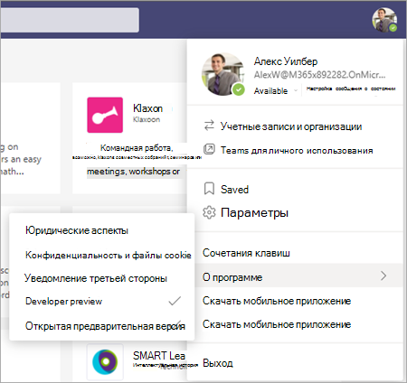
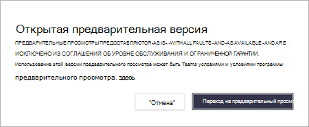
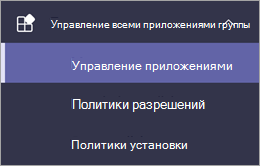
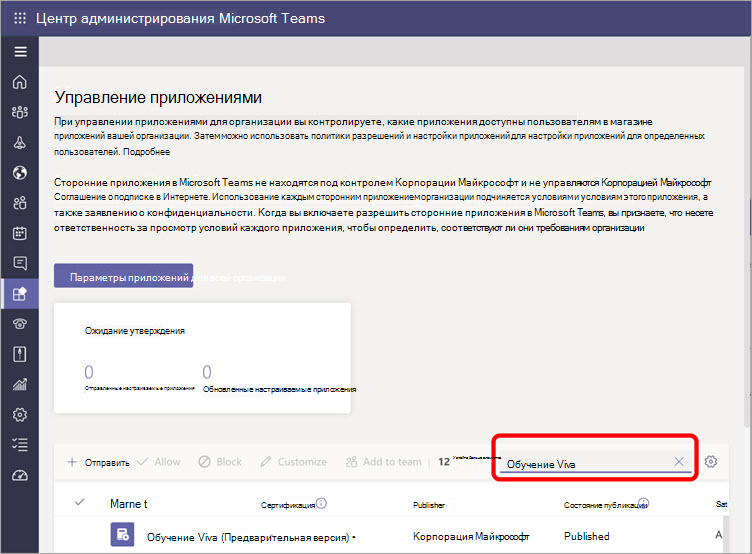
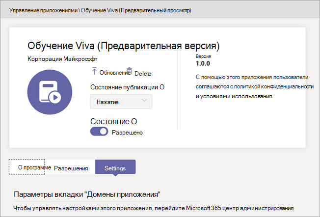

# Настройка microsoft Viva Learning (Preview) в центре администрирования Teams

> [!NOTE]
> Сведения в этой статье относятся к продукту предварительного просмотра, который может быть существенно изменен до его коммерческого выпуска. 

Администратор Teams Viva Learning (Preview) и применяет политики разрешений Teams центра администрирования.

1. Для Viva Learning (Preview) сначала необходимо установить политику обновления в Teams. Дополнительные сведения см. [в Microsoft Teams Public Preview.](/MicrosoftTeams/public-preview-doc-updates)

    1. Во входе в Teams центр администрирования.

    2. Выберите **Teams**  >  **обновления**.

    3. Нажмите **Добавить**. 

    4. Назови политику обновления, добавьте политику и включите **функции предварительного просмотра show.**

2. Администратор должен уведомить пользователей об обновлении политики, чтобы они перемещали сборку в общедоступный предварительный просмотр для Teams. 

    1. Пользователи должны выбрать свое изображение профиля > **о просмотре**  >  **общего просмотра**.
   
        
    
    2. Пользователи должны принимать **общедоступные условия** предварительного просмотра.

        
 
3. Для организаций, которые имеют ограничительные политики и должны включить Viva Learning (Preview), выполните этот процесс в следующем разделе.

## Управление настройками для обучения Viva (Предварительная версия)

Для выполнения этих задач необходимо быть администратором Teams центра администрирования.

Чтобы сделать Viva Learning (Preview) доступной для пользователей в организации, выполните следующие действия:

1. В левой навигации центра администрирования Teams перейдите к Teams   >  **приложениям Управление приложениями.**

   

2. На странице **Управление приложениями** в поле поиска введите *обучение Viva* и выберите **Viva Learning (Preview).**

   

3. На странице **Обучение Viva (Предварительный просмотр):**

   1. В **статье Состояние** выберите **Разрешено** включить Обучение Viva (Предварительная версия).

   2. На **вкладке Параметры** в настройках **Приложения** перейдите в центр администрирования Microsoft 365 для настройки источников контента [для обучения.](content-sources-365-admin-center.md)

   

4. После **управления настройками** приложений  перейдите  к политикам разрешений и политикам установки, чтобы предоставить разрешения сотрудникам, которые должны иметь доступ к viva Learning (Preview) в рамках участия вашей организации в предварительном просмотре.

> [!NOTE]
>  Если ваша организация находится в кольце 4.0 в рамках Teams TAP100, может потребоваться включить утвержденных пользователей в Ring 3.0 для доступа к Viva Learning (Preview).   В рамках предварительного просмотра в Ring 3.0 выпущена версия Viva Learning (Preview). Если ваша организация находится в кольце 4.0, вы не увидите Viva Learning (Preview) на странице **Управление приложениями.** Чтобы протестировать приложение, необходимо создать настраиваемую политику разрешений приложений, задать ее для всех приложений **и** назначить ее утвержденным пользователям Ring 3.0.      

## Следующий шаг

[Настройка источников обучающего контента для Viva Learning (Preview) в центре администрирования Microsoft 365](content-sources-365-admin-center.md)
