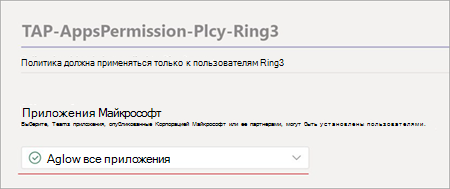

# Настройка microsoft Viva Обучение (Preview) в центре администрирования Teams

> [!NOTE]
> Сведения в этой статье относятся к продукту предварительного просмотра, который может быть существенно изменен до его коммерческого выпуска. 

Администратору Teams выполнить определенные действия, чтобы включить viva Обучение (Preview) для своих пользователей в клиенте. Эти действия зависят от того, как включен клиент: [*public Preview*](set-up-teams-admin-center.md#public-preview-tenants) или [ *Private Preview* (или бета-версия).](set-up-teams-admin-center.md#private-preview-tenants)

## Клиенты public Preview

### Действия администратора для клиентов public Preview

Так как viva Обучение (Preview) еще не доступна, необходимы определенные действия, чтобы включить функции и установить разрешения для определенных пользователей или групп. 

1. Включить функции public Preview для пользователей Viva Обучение (Preview).

    а. Измените Teams обновления, чтобы включить функции public Preview. Просмотреть [Microsoft Teams просмотра.](/microsoftteams/public-preview-doc-updates)

    б. Включить политику обновления для пользователей или групп, которые будут выполнять тестирование Viva Обучение (Preview). См. [назначение политик пользователям и группам.](/microsoftteams/assign-policies-users-and-groups)

2. Измените политику разрешений на приложения для пользователей Viva Обучение (Preview).

    а. Если в настоящее время она не является частью глобальной политики, разрешить все приложения Майкрософт в политике разрешений приложений. Управление [политиками разрешений приложений см.](/microsoftteams/teams-app-permission-policies)в Microsoft Teams. 

    б. Включить политику разрешений приложений для пользователей или групп, которые будут выполнять тестирование Viva Обучение (Preview). См. [назначение политик пользователям и группам.](/microsoftteams/assign-policies-users-and-groups)

3. Уведомите пользователей, которые будут тестировать Viva Обучение (Preview), чтобы переключить их клиент [сборки](set-up-teams-admin-center.md#user-steps-for-public-preview-tenants)на общедоступный предварительный просмотр для Teams .

> [!IMPORTANT]
> Для клиентов предварительного просмотра viva Обучение (Preview) не будет  отображаться в управляемых приложениях в центре администрирования Teams до окончательного выпуска продукта. Однако пользователи с включенным общедоступным предварительным просмотром могут найти viva Обучение (Preview) в Teams магазине приложений и использовать его, как только будут настроены правильные политики и разрешения.

### Действия пользователей для клиентов предварительного просмотра общего просмотра

Пользователям, которые были включены для тестирования общедоступных предварительных просмотров,  включив описанные ранее [политики,](set-up-teams-admin-center.md#administrator-steps-for-public-preview-tenants) необходимо перейти на общедоступный предварительный просмотр в Teams клиенте.

1. Пользователи должны выбрать свое изображение профиля > **о просмотре**  >  **общего просмотра**.

    

2. Пользователи должны принимать общедоступные условия предварительного просмотра.

    

3. Теперь пользователи могут найти viva Обучение (Preview) в Teams и приступить к его использованию.

## Частные клиенты предварительного просмотра

### Действия администратора для частных клиентов предварительного просмотра (или бета-версии)

Для частных клиентов предварительного просмотра дополнительные политики, которые необходимо включить, не требуется. Однако viva Обучение (Preview) должна быть доступна пользователям в вашей организации.

1. В левой навигации центра администрирования Teams перейдите к Teams   >  **приложениям Управление приложениями.**

   

2. На странице **Управление приложениями** в поле поиска введите *Viva Обучение,* а затем выберите **Viva Обучение (Preview)**.

   

3. На странице **Viva Обучение (Preview)** в статье  **Состояние** выберите Разрешено включить Viva Обучение (Preview).

   

<!---
The Teams admin installs Viva Learning (Preview) and applies permission policies through the Teams admin center.

1. For Viva Learning (Preview), you must first set the Update policy in Teams. For more information, see [Microsoft Teams Public Preview](/MicrosoftTeams/public-preview-doc-updates).

    1. Sign in to the Teams admin center.

    2. Select **Teams** > **Update policies**.

    3. Select **Add**. 

    4. Name the update policy, add a policy, and turn on **Show preview features**.

2. The admin must notify users of the policy update so that they move their build into the Public Preview for Teams. 

    1. Users must select their profile image > **About** > **Public Preview**.
   
        
    
    2. Users must accept the **Public preview** terms and conditions.

        
 
3. For organizations that have restrictive policies and need to enable Viva Learning (Preview), follow the process in the next section.

## Manage settings for Viva Learning (Preview)

You must be an administrator in the Teams admin center to perform these tasks.

To make Viva Learning (Preview) available for users in your organization, follow these steps:

1. In the left navigation of the Teams admin center, go to **Teams apps** > **Manage apps**.

   

2. On the **Manage apps** page, in the search box, type *Viva learning*, and then select **Viva Learning (Preview)**.

   

3. On the **Viva Learning (Preview)** page:

   1. Under **Status**, select **Allowed** to turn on Viva Learning (Preview).

   2. On the **Settings** tab, under **App settings**, go to the Microsoft 365 admin center to [configure learning content sources](content-sources-365-admin-center.md).

   

4. After **Manage app** settings, go to **Permission policies** and **Setup policies** to grant permission to employees who should have access to Viva Learning (Preview) as part of your organization's participation in the preview.

> [!NOTE]
>  If your organization is in Ring 4.0 as part of Teams TAP100 program, you might need to enable approved users in Ring 3.0 to access Viva Learning (Preview).   As part of the preview, Viva Learning (Preview) is released in Ring 3.0. If your organization is in Ring 4.0, you won’t see Viva Learning (Preview) on the **Manage apps** page. To test the app, you need to create a custom apps permission policy, set it to **Allow all apps**, and assign it to Ring 3.0 approved users.      

--->

## Следующий этап

[Настройка источников обучающего контента для Viva Обучение (Preview) в Центр администрирования Microsoft 365](content-sources-365-admin-center.md)
