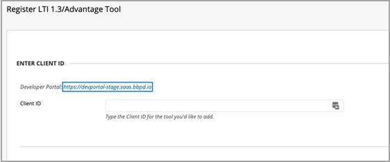

# Использование Microsoft Teams классов с blackboard

> [!IMPORTANT]
> Некоторые сведения относятся к предварительным выпускам продуктов, которые могут быть существенно изменены до коммерческого выпуска. Корпорация Майкрософт не дает никаких гарантий, явных или подразумеваемых, относительно предоставленных здесь сведений.

Microsoft Teams классов — это приложение для взаимодействия средств обучения (LTI), которое помогает преподавателям и учащимся легко перемещаться между своей системой управления обучением (LMS) и Teams. Пользователи могут получать доступ к группам классов, связанным с их курсом непосредственно из LMS.

## Утверждение приложения в клиенте Microsoft Azure

Следующие задачи завершались администратором Microsoft Office 365 и администратором Blackboard Learn Ultra.

Перед управлением интеграцией в Blackboard Learn Ultra администратор Microsoft Office 365 должен утвердить приложение Blackboard **MSFT Teams** для приложения Learn Ultra Azure для клиента Microsoft Azure учреждения.

1. Найдите свой microsoft Tenant ID. Узнайте, [как найти клиента.](/azure/active-directory/fundamentals/active-directory-how-to-find-tenant)

2. Перенаправляем конечную точку согласия администратора платформы администрирования Майкрософт в следующем примере:

   `https://login.microsoftonline.com/{tenant}/adminconsent?client\_id=2d94989f-457a-47c1-a637-e75acdb11568`

   > [!NOTE]
   > Замените {tenant} на ID клиента Майкрософт вашей организации.

## Регистрация приложений интеграции

В качестве администратора Blackboard Learn Ultra необходимо зарегистрировать 2 приложения интеграции LTI 1.3 в тестовой среде:

- Интеграция класса learn Teams для поддержки синхронизации реестра

- Приложение группы Microsoft Teams класса LTI

1. Обратите внимание на следующие ITI-ID клиента для обоих приложений:

    - Blackboard - f1561daa-1b21-4693-ba90-6c55f1a0eb41

    - Microsoft - 027328b7-c2e3-4c9e-aaa1-07802dae6c89

2. Доступ к панели администрирования и в **рамках интеграции** найдите поставщики средств LTI.

   

3. Выберите **средство Регистрация LTI1.3/Advantage.**

4. Введите первый из предоставленных клиентских ИД (blackboard или Microsoft) и выберите **Отправка**.

   

5. Просмотрите предварительно заполненные параметры и убедитесь, что состояние средства помечено как утвержденное.

6. Прокрутите вниз, а затем выберите **Отправить**.

7. Повторите предыдущие действия, чтобы зарегистрировать вторую часть приложений LTI в среде.

## Настройка приложения REST и совместного доступа к ресурсам cross origin

Администратору Blackboard Learn Ultra также потребуется настроить приложение REST и конфигурацию совместного использования ресурсов cross origin.

Выполните следующее, чтобы настроить приложение REST

1. Доступ к средствам администрирования Learn, а затем выберите **интеграции API REST** из раздела **Интеграции.**

2. Выберите **Создание интеграций** и введите тот же ID приложения и клиента, который вы ввели для средства Blackboard Learn Class Teams интеграции LTI.

3. Введите пользователь Learn (это может быть ваше собственное имя пользователя администрирования), или выберите **Просмотр,** чтобы найти.

4. Выберите **Да** для **доступа к конечным пользователям.**

5. Выберите **Да** для **авторизованной для действий в качестве пользователя**

6. Выберите **Отправка** после завершения.

## Настройка совместного доступа к ресурсам попереме происхождения

1. Вы можете получить доступ к средствам администрирования Learn и выберите **раздел "Совместное** использование ресурсов по пересеченным ресурсам" из раздела **Интеграция.**

2. Выберите **создание конфигурации.**

3. Введите `https://bb-ms-teams-ultra-ext.api.blackboard.com` в начале.

4. Добавьте слово **Авторизация** в **разрешенных загонах**.

5. Set **Available** to **Yes**.

6. Выберите **Отправка** после завершения.

## Включить класс Teams в blackboard Learn

После включения средств LTI следующим шагом будет настройка интеграции microsoft Class Teams из Microsoft Office 365 клиента. Это можно сделать, следуя этим шагам в качестве администратора Blackboard Learn Ultra.

1. В **learn Admin** Tools and  >  **Utilities** выберите Microsoft Teams **администрирования интеграции.**

   

2. Выберите почтовый ящик **для включить Microsoft Teams.**

3. Введите свой ID клиента в разделе Microsoft O365 Admin

 > [!NOTE]
 > Вы не сможете сохранить параметры до тех пор, пока приложение не будет утверждено администратором O365. См. [утверждение приложения в Microsoft Azure клиенте](#approve-the-app-in-the-microsoft-azure-tenant).

4. Когда глобальный администратор O365 утвердил приложение blackboard Teams в клиенте Microsoft, выберите **Отправить**.
