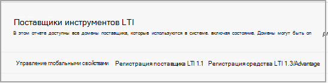

# Использование Microsoft Teams классов с blackboardUse Microsoft Teams classes with Blackboard

> [!IMPORTANT]
> Некоторые сведения относятся к предварительным выпускам продуктов, которые могут быть существенно изменены до коммерческого выпуска.Some information relates to prereleased product which may be substantially modified before it's commercially released. Корпорация Майкрософт не дает никаких гарантий, явных или подразумеваемых, относительно предоставленных здесь сведений.Microsoft makes no warranties, express or implied, with respect to the information provided here.

Microsoft Teams классов — это приложение Обучение Tools Interoperability (LTI), которое помогает преподавателям и учащимся легко перемещаться между Обучение системой управления (LMS) и Teams.Microsoft Teams classes is a Learning Tools Interoperability (LTI) app that helps educators and students easily navigate between their Learning Management System (LMS) and Teams. Пользователи могут получать доступ к группам классов, связанным с их курсом непосредственно из LMS.Users can access their class teams associated with their course directly from within their LMS.

## Утверждение приложения в клиенте Microsoft AzureApprove the app in the Microsoft Azure tenant

Следующие задачи завершались администратором Microsoft Office 365 и администратором Blackboard Learn Ultra.The following tasks are completed by the Microsoft Office 365 admin and the Blackboard Learn Ultra admin.

Перед управлением интеграцией в Blackboard Learn Ultra администратор Microsoft Office 365 должен утвердить приложение Blackboard **MSFT Teams** для приложения Learn Ultra Azure для клиента Microsoft Azure учреждения.Before managing the integration within Blackboard Learn Ultra, the Microsoft Office 365 admin must approve the Blackboard **MSFT Teams for Learn Ultra Azure** app for the institution’s Microsoft Azure tenant.

1. Найдите свой microsoft Tenant ID.Find your Microsoft Tenant ID. Узнайте, [как найти клиента.](/azure/active-directory/fundamentals/active-directory-how-to-find-tenant)See [how to find the tenant](/azure/active-directory/fundamentals/active-directory-how-to-find-tenant).

2. Перенаправляем конечную точку согласия администратора платформы администрирования Майкрософт в следующем примере:Redirect the Microsoft Identity Platform Admin Consent Endpoint according to the following example:

   `https://login.microsoftonline.com/{tenant}/adminconsent?client_id=2d94989f-457a-47c1-a637-e75acdb11568`

   > [!NOTE]
   > Замените {tenant} на ID клиента Майкрософт вашей организации.Replace {tenant} with your organization’s Microsoft tenant ID.

## Регистрация приложений интеграцииRegister the integration apps

В качестве администратора Blackboard Learn Ultra необходимо зарегистрировать 2 приложения интеграции LTI 1.3 в тестовой среде:As a Blackboard Learn Ultra admin, you'll need to register 2 LTI 1.3 integration apps within your Test environment:

- Интеграция класса learn Teams для поддержки синхронизации реестраThe Blackboard Learn Class Teams integration to support the roster sync

- Приложение группы Microsoft Teams класса LTIThe Microsoft Teams class team LTI app

1. Обратите внимание на следующие ITI-ID клиента для обоих приложений:Make a note of the following LTI Client IDs for both Apps:

    - Blackboard - f1561daa-1b21-4693-ba90-6c55f1a0eb41Blackboard - f1561daa-1b21-4693-ba90-6c55f1a0eb41

    - Microsoft - 027328b7-c2e3-4c9e-aaa1-07802dae6c89Microsoft - 027328b7-c2e3-4c9e-aaa1-07802dae6c89

2. Доступ к панели администрирования и в **рамках интеграции** найдите поставщики средств LTI.Access the Admin Panel, and under **Integrations**, locate the LTI Tool Providers.

   

3. Выберите **средство Регистрация LTI1.3/Advantage.**Select **Register LTI1.3/Advantage Tool**.

4. Введите первый из предоставленных клиентских ИД (blackboard или Microsoft) и выберите **Отправка**.Enter the first of the Client IDs provided (either Blackboard or Microsoft), and select **Submit**.

5. Просмотрите предварительно заполненные параметры и убедитесь, что состояние средства помечено как утвержденное.Review the pre-populated settings and ensure that the tool status is marked as approved.

6. Прокрутите вниз, а затем выберите **Отправить**.Scroll to the bottom, and then select **Submit**.

7. Повторите предыдущие действия, чтобы зарегистрировать вторую часть приложений LTI в среде.Repeat the previous steps to register the second of the LTI apps within your environment.

## Настройка приложения REST и совместного доступа к ресурсам cross originSet up the REST Application and Cross Origin Resource Sharing

Администратору Blackboard Learn Ultra также потребуется настроить приложение REST и конфигурацию совместного использования ресурсов cross origin.The Blackboard Learn Ultra admin will also need to configure the REST Application and the Cross Origin Resource Sharing configuration.

Выполните следующее, чтобы настроить приложение RESTComplete the following to set up the REST Application

1. Доступ к средствам администрирования Learn, а затем выберите **интеграции API REST** из раздела **Интеграции.**Access the Learn Administration Tools, and then select **REST API Integrations** from the **Integrations** section.

2. Выберите **Создание интеграций** и введите тот же ID приложения и клиента, который вы ввели для средства Blackboard Learn Class Teams интеграции LTI.Select **Create integrations** and enter the same Application/Client ID that you entered for the Blackboard Learn Class Teams Integration LTI tool.

3. Введите пользователь Learn (это может быть ваше собственное имя пользователя администрирования), или выберите **Просмотр,** чтобы найти.Enter the Learn User (this could be your own learn admin username), or select **Browse** to locate.

4. Выберите **Да** для **доступа к конечным пользователям.**Select **Yes** for **End User Access**.

5. Выберите **Да** для **авторизованной для действий в качестве пользователя**Select **Yes** for **Authorized to Act as User**

6. Выберите **Отправка** после завершения.Select **Submit** once complete.

## Настройка совместного доступа к ресурсам попереме происхожденияSet up Cross-Origin Resource Sharing

1. Вы можете получить доступ к средствам администрирования Learn и выберите **раздел "Совместное** использование ресурсов по пересеченным ресурсам" из раздела **Интеграция.**Access the Learn Administration Tools, and select **Cross-Origin Resource Sharing** from the **Integrations** section.

2. Выберите **создание конфигурации.**Select **Create Configuration**.

3. Введите `https://bb-ms-teams-ultra-ext.api.blackboard.com` в начале.Enter `https://bb-ms-teams-ultra-ext.api.blackboard.com` in the origin.

4. Добавьте слово **Авторизация** в **разрешенных загонах**.Add the word **Authorization** in the **Allowed Headers**.

5. Set **Available** to **Yes**.Set **Available** to **Yes**.

6. Выберите **Отправка** после завершения.Select **Submit** once complete.

## Включить класс Teams в blackboard LearnEnable Class Teams in Blackboard Learn

После включения средств LTI следующим шагом будет настройка интеграции microsoft Class Teams из Microsoft Office 365 клиента.Once you've enabled the LTI tools, your next step will be to set up the Microsoft Class Teams integration from your own Microsoft Office 365 tenant. Это можно сделать, следуя этим шагам в качестве администратора Blackboard Learn Ultra.You can do this by following these steps as the Blackboard Learn Ultra admin.

1. В **learn Admin** Tools and  >  **Utilities** выберите Microsoft Teams **администрирования интеграции.**In **Learn Admin** > **Tools and Utilities**, select **Microsoft Teams Integration Admin**.

   

2. Выберите почтовый ящик **для включить Microsoft Teams.**Select the checkbox for **Enable Microsoft Teams**.

3. Введите свой ID клиента в разделе Microsoft O365 AdminEnter your tenant ID as referenced in the section under Microsoft O365 Admin

 > [!NOTE]
 > Вы не сможете сохранить параметры до тех пор, пока приложение не будет утверждено администратором O365. См. [утверждение приложения в Microsoft Azure клиенте](#approve-the-app-in-the-microsoft-azure-tenant).You won't be able to save the settings until the app has been approved by the O365 admin. See [Approve the app in Microsoft Azure tenant](#approve-the-app-in-the-microsoft-azure-tenant).

4. Когда глобальный администратор O365 утвердил приложение blackboard Teams в клиенте Microsoft, выберите **Отправить**.When the global O365 admin has approved the Blackboard Teams application in your Microsoft Tenant, select **Submit**.
