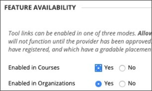

# Использование Microsoft Teams классов с помощью Blackboard Learn UltraUse Microsoft Teams classes with Blackboard Learn Ultra

Командная работа является основой каждой современной организации.Teamwork is at the core of every modern organization. Поощряя совместную работу, это определяющая характеристика каждого успешного учреждения.By fostering collaboration, it’s a defining characteristic of every successful institution. Вы можете расширить все возможности и функции Blackboard Learn Ultra, соеряду их с Microsoft Teams классами.You can enhance all the capabilities and features of Blackboard Learn Ultra by pairing them up with Microsoft Teams classes.

Ваши классы могут включать беседы в режиме реального времени, видео-собрания или асинхронные взаимодействия.Your classes might include real-time conversations, video meetings, or asynchronous interactions. Вы можете добавить обмен файлами и совместное использование файлов для учащихся в одном месте.You can add file sharing and cocreation experiences for your students, all in one place. Microsoft Teams с помощью Learn Ultra переопределяет динамику обучения и то, что означает эффективное обучение.Microsoft Teams classes with Learn Ultra redefine the dynamics of teaching and what effective learning means.

> [!IMPORTANT]
> Убедитесь, что вы успешно создали поле электронной почты учебного заведения в [учебной информационной системе (SIS)](https://help.blackboard.com/Learn/Administrator/SaaS/Integrations/Student_Information_System/SIS_Planning)Ensure that you have successfully set up the Institution Email field in your [Student Information System (SIS)](https://help.blackboard.com/Learn/Administrator/SaaS/Integrations/Student_Information_System/SIS_Planning)
>
>Интеграция Microsoft Teams классов зависит от поля электронной почты учреждения в вашем SIS, чтобы соедитировать правильное имя пользователя Microsoft Azure Active Directory (AAD) пользователя [(UPN).](/azure/active-directory/hybrid/howto-troubleshoot-upn-changes)The Microsoft Teams classes integration relies on the institution email field in your SIS to map to the correct Microsoft Azure Active Directory’s (AAD) [User Principle Name (UPN)](/azure/active-directory/hybrid/howto-troubleshoot-upn-changes). Если электронная почта учреждения не была предусмотрена, это будет по умолчанию для существующей электронной почты.If no institution email has been provisioned, this will default to the existing email. Рекомендуется установить это поле для каждого пользователя, чтобы обеспечить правильную синхронизацию данных и отсутствие конфликта данных электронной почты между AAD и Blackboard Learn Ultra.It’s recommended that this field be set for every user to ensure their data is synchronized correctly and that there is no conflict of email data between AAD and Blackboard Learn Ultra.
>
> Если в сопоставлении SIS это поле не установлено надлежащим образом, интеграция будет продолжать работать, но пользователи могут не отображаться в созданных классах Teams и могут возникать ошибки.If you haven’t set this field appropriately in your SIS mapping, the integration will continue to work, but users might not appear in the Teams classes created, and errors could occur.

## Поддержка институционального сопоставления данных — поле SIS электронной почты учрежденияSupporting Institutional Data Mapping – Institution Email SIS Field

В рамках эволюции с интеграцией поставщиков облачных решений Blackboard Learn Ultra создала новое поле электронной почты для учреждений в интеграции системы студенческих информационных систем и общедоступных API REST, позволяя учреждениям эффективно управлять процессом синхронизации данных между Blackboard Learn Ultra и AAD. As part of the evolution with Cloud provider integrations, Blackboard Learn Ultra has created a new **Institution Email** field, in both the Student Information System Framework integration and public REST APIs, allowing institutions to manage the data synchronization process effectively between Blackboard Learn Ultra and AAD.

### Что означает электронная почта учреждения и что она поддерживает?What does the Institution Email mean and what does it support?

Поле **электронной почты** institution позволяет настраивать сопоставления полей между внешними источниками данных клиента и Blackboard Learn Ultra.The **Institution Email** field allows customized field mappings between a client’s externally supported data sources and Blackboard Learn Ultra. Если источниками данных являются облачные поставщики, такие как Microsoft, имя принципа пользователя (UPN) является основным уникальным идентификатором для каждого пользователя, состоящим из префикса UPN (имя учетной записи пользователя) и суффикса upN (доменное имя DNS), соединяемого вместе с символом @.If data sources are cloud providers, such as Microsoft, the User Principle Name (UPN) is a primary unique identifier for each user consisting of a UPN prefix (the user’s account name) and a UPN suffix (a DNS domain name) joined together with an @ symbol. Это создает уникальный адрес электронной почты для каждого конкретного пользователя в Microsoft Azure Active Directory.This creates a unique email address for each specific user within the Microsoft Azure Active Directory.

Чтобы обеспечить точность данных и правильность регистрации или членства между классами Learn Ultra и Microsoft Teams, адрес электронной почты пользователя должен совпадать между обеими системами.To ensure data is accurate and enrollments or memberships between Blackboard Learn Ultra and Microsoft Teams classes are correctly achieved, a user’s email address must match between both systems. В Blackboard Learn Ultra пользователи могут изменять или переопределять существующий адрес электронной почты в пользовательском интерфейсе, что может привести к ошибкам синхронизации и неправильному добавлению пользователя в команду классов.In Blackboard Learn Ultra, users can change or override their existing email address in the user interface, which could result in sync errors occurring and the user not being correctly added to a Class Team. **Сопоставление полей** электронной почты учреждения обеспечивает правильное управление этим уровнем проверки безопасности и проверки проверки, независимо от того, изменили ли пользователи электронную почту в Blackboard Learn Ultra или нет.The **Institution Email** field mapping ensures this level of security and validation checking can be correctly managed, regardless if users have changed their email within Blackboard Learn Ultra or not.

 Если два адреса электронной почты отличаются, либо:When two email addresses are different, either:

- Необходимо принять решение о том, какой источник имеет приоритет и будет приниматься в качестве электронной почты человека и учреждения.A decision must be made as to which source has precedence and will be taken as both the Person and Institution Emails.
  илиOr
- Учреждение может установить настраиваемую сопоставление полей в своей электронной почте institution, что может разрешить потенциальный конфликт.An institution can set a custom field mapping in its Institution Email, which can resolve a potential conflict.

**Сопоставление полей электронной** почты учреждения теперь доступно для всех существующих типов интеграции SIS в **Advanced Configuration Параметры** Пользователи узнают сопоставление полей типа  >    >  **объекта.**The **Institution Email** field mapping is now available for all existing SIS integration types at **Advanced Configuration Settings** > **Users Learn Object Type** > **Field Mapping**.

> [!NOTE]
> Важно отметить, что по умолчанию электронная почта учреждения  устанавливается для электронной почты человека для всех форматов SIS и должна быть уникальной для каждого человека. It’s important to note that, by default, the **Institution Email** is set to the **Person Email** for all SIS formats and must be unique for each person. Все существующие интеграции, которые настроены и запущены, будут иметь это сопоставление данных, так как SIS не сможет импортировать пользователей, если их электронная почта будет дублироваться.All existing integrations that are set up and running will have this data mapping in place, as SIS will fail to import users if their email is duplicated. Если учреждению требуется возможность изменить электронную почту учреждения на настраиваемую,  им потребуется управлять этим с помощью расширенных Параметры в SIS.If an institution requires the ability to change the Institution Email to **custom**, they'll need to manage this through the **Advanced Configuration Settings** in the SIS.

## ТребованияRequirements

Интеграция Microsoft Teams классов доступна только для **курсов Ultra Course View.**The Microsoft Teams classes integration is available for **Ultra Course View courses only**. Чтобы использовать его, вашему учреждению необходимо выполнить эти требования:Your institution needs to complete these requirements to use it:

- Have Blackboard Learn Ultra Learn SaaS with Ultra Base Navigation enabledHave Blackboard Learn Ultra Learn SaaS with Ultra Base Navigation enabled

  

- Включить LTI для использования в курсах.Enable LTI for use in courses.

  a.a. Перейдите в **группу администраторов**  >  **поставщиков инструментов LTI**  >  **Manage Global Properties.**Go to the **Administrator Panel** > **LTI Tool Providers** > **Manage Global Properties**.

  b.b. Выберите **включенную LTI в курсах** и необязательно выберите **Включено в организациях.**Select **LTI Enabled in Courses**, and optionally, select **Enabled in Organizations**.

  c.c. Выберите **Отправить**.Select **Submit**.

- Должно быть настроено LTIMust have LTI configured

- Добавление blackboard Learn Ultra Teams LTI IntegrationAdd Blackboard Learn Ultra Teams Classes LTI Integration

- Добавление Microsoft Teams классов LTI 1.3Add Microsoft Teams Classes LTI 1.3 Tool

- Добавление инструмента API REST и совместного использования ресурсов поперек происхожденияAdd the REST API Tool and Cross-Origin Resource Sharing

- Настройка и утверждение интеграции Microsoft Teams классовConfigure and approve Microsoft Teams classes Integration

## Добавление средства Blackboard Learn Ultra Teams классов LTI 1.3Add the Blackboard Learn Ultra Teams Classes LTI 1.3 Tool

1. Из панели **администраторов** выберите **поставщиков инструментов LTI.**From the **Administrator Panel**, select **LTI Tool Providers**.

2. Выберите **средство реестра LTI 1.3.**Select **register LTI 1.3 Tool**.

3. В поле **Client ID** введите или скопируйте и введите этот ID:In the **Client ID** field, type or copy and paste this ID:

   `f1561daa-1b21-4693-ba90-6c55f1a0eb41`

4. Просмотрите все параметры, которые были предварительно заполнены и в **состоянии инструмента,** а затем выберите **Включено**.Review all settings that have been pre-populated and in **Tool Status**, and then select **Enabled**.

5. В **политиках учреждений** выберите **роль в курсе,** имени и адресе электронной почты, а затем выберите **Да** для обоих. In **Institution Policies**, select **Role in Course, Name,** and **Email Address**, and then select **Yes** for both.

6. Выберите **разрешить доступ к службе класса** и разрешить доступ к **службе членства.**Select **Allow grade service access** and **Allow Membership Service Access**.

## Добавление средства Microsoft Teams классов LTI 1.3Add the Microsoft Teams Classes LTI 1.3 Tool

1. Из панели **администраторов** выберите **поставщиков инструментов LTI.**From the **Administrator Panel**, select **LTI Tool Providers**.

2. Выберите **средство реестра LTI 1.3.**Select **register LTI 1.3 Tool**.

3. В поле **Client ID** введите или скопируйте и введите этот ID:In the **Client ID** field, type or copy and paste this ID:

   `027328b7-c2e3-4c9e-aaa1-07802dae6c89`

4. Просмотрите все параметры, которые были предварительно заполнены и в состоянии *инструмента и* выберите *Включено.*Review all settings that have been pre-populated and in *Tool Status* and select *Enabled.*

5. В **политиках учреждений** выберите **роль в курсе, имени и** **адресе электронной почты.**In **Institution Policies**, select **Role in Course, Name,** and **Email Address**. Выберите **Да** для обоих.Select **Yes** for both.

6. Выберите **разрешить доступ к службе класса** и разрешить доступ к **службе членства.**Select **Allow grade service access** and **Allow Membership Service Access**.

## Добавление инструмента API RESTAdd the REST API tool

1. Из панели **администраторов** перейдите к **интеграциям** и выберите **интеграции API rest.**From the **Administrator Panel**, navigate to **Integrations** and select **Rest API Integrations**.

2. Выберите **Создание интеграции.**Select **Create Integration**.

3. В поле **Application ID** введите или скопируйте и введите этот ID:In the **Application ID** field, type or copy and paste this ID:

   `f1561daa-1b21-4693-ba90-6c55f1a0eb41`

4. Введите пользователя для этой интеграции.Type a user for this integration.

   Этот пользователь будет иметь доступ к домашнему API, с которым связано приложение.This user will be the one with home API access from which the application is associated.

5. Выберите **Отправить**.Select **Submit**.

## Добавление совместного доступа к ресурсам по пересеченным ресурсамAdd the Cross-Origin Resource Sharing

1. Из панели **администратора** перейдите к **интеграции** и выберите \**Cross-origin Resource Sharing*.From the **Administrator panel**, navigate to **Integrations** and select \**Cross-origin Resource Sharing*.

2. Выберите **создание конфигурации.**Select **Create Configuration**.

3. В поле **Origin** тип копирования и вклейки этого URL-адреса:In the **Origin** field, type of copy and paste this URL:

   `https://bb-ms-teams-ultra-ext.api.blackboard.com`

4. В поле **Разрешенные главы** введите **авторизацию**.In the **Allowed Headers** field, type **Authorization**.

5. Set **Available** to **Yes**.Set **Available** to **Yes**.

6. Выберите **Отправить**.Select **Submit**.

## Настройка и утверждение интеграции Microsoft Teams классовConfigure and Approve Microsoft Teams classes Integration

Чтобы успешно интегрировать экземпляр Blackboard Learn Ultra с Microsoft Teams классами, необходимо убедиться, что приложение Blackboard Learn Ultra утверждено для доступа в Microsoft Azure клиенте.To successfully integrate your Blackboard Learn Ultra instance with Microsoft Teams classes, you'll need to make sure the Blackboard Learn Ultra application is approved for access within your Microsoft Azure tenant. Это процесс, который должен быть завершен глобальным администратором Microsoft 365 учреждения.This is a process that will need to be completed by your institution’s Microsoft 365 Global Admin.

Этот процесс можно сделать до или после настройки приложений LTI в вашей blackboard Learn Ultra Instance.This process can be done either before or after you have configured the LTI applications in your Blackboard Learn Ultra Instance.

### Перед настройкой приложений LTIBefore Configuring the LTI Applications

Если вы решите утвердить приложение Blackboard Learn Ultra Teams Classes Azure перед настройкой интеграции LTI, вам потребуется перенаправить в конечную точку согласия администратора платформы администрирования Microsoft **Identity.**If you choose to approve the Blackboard Learn Ultra Teams Classes Azure app before configuring the LTI integrations, you'll need to redirect to the **Microsoft Identity Platform Admin Consent Endpoint**. Показан URL-адрес:The URL is shown:

`https://login.microsoftonline.com/{tenant}/adminconsent?client\_id=2d94989f-457a-47c1-a637-e75acdb11568`

> [!NOTE]
> Вы замените **{Tenant}** определенным Microsoft Azure клиентом.You’ll replace **{Tenant}** with your specific institutional Microsoft Azure tenant ID.

Вы увидите окно разрешений, которое объясняет, что вы даете разрешение blackboard Learn Ultra для доступа к Microsoft Teams.You'll see a permissions window that explains you're giving permission to Blackboard Learn Ultra to access Microsoft Teams.

### После настройки приложений LTIAfter Configuring the LTI Applications

1. На панели **администратора** перейдите к средствам и **утилитам** и выберите **администратор Microsoft Teams интеграции.**On the **Administrator Panel**, navigate to **Tools and Utilities** and select **Microsoft Teams Integration Admin**.

2. Выберите **Включить Microsoft Teams.**Select **Enable Microsoft Teams**.

3. Добавьте свой **microsoft Tenant ID** в доступное текстовое поле.Add your **Microsoft Tenant ID** into the available text field.

4. Выберите один из следующих вариантов:Choose one of the following options:

   - Если приложение имеет предварительное согласие, оно будет показывать небольшой контрольный знак.If the app has pre-consent, it will show a small checkmark. Если закладки появляются, выберите **Отправить**.If the checkmark appears, select **Submit**.

   - Если согласие не утверждено, выполните описанные действия по генерации URL-адреса для согласия и отправьте его в глобальный администратор Microsoft 365 для утверждения.If consent hasn’t been approved, follow the steps described to generate the URL for consent and send it to the Microsoft 365 Global Admin for approval.

5. После подтверждения утверждения выберите **retry,** чтобы подтвердить, а затем выберите **Отправить**.Once you've confirmation of approval, select **Retry** to confirm, and then select **Submit**.

   