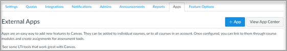

# Использование Microsoft Teams классов с CanvasUse Microsoft Teams classes with Canvas

> [!IMPORTANT]
> Некоторые сведения относятся к предварительным выпускам продуктов, которые могут быть существенно изменены до коммерческого выпуска.Some information relates to prereleased product which may be substantially modified before it's commercially released. Корпорация Майкрософт не дает никаких гарантий, явных или подразумеваемых, относительно предоставленных здесь сведений.Microsoft makes no warranties, express or implied, with respect to the information provided here.

Microsoft Teams классов — это приложение для взаимодействия средств обучения (LTI), которое помогает преподавателям и учащимся легко перемещаться между своей системой управления обучением (LMS) и Teams.Microsoft Teams classes is a Learning Tools Interoperability (LTI) app that helps educators and students easily navigate between their Learning Management System (LMS) and Teams. Пользователи могут получать доступ к группам классов, связанным с их курсом непосредственно из LMS.Users can access their class teams associated with their course directly from within their LMS.

## Microsoft Office 365 AdminMicrosoft Office 365 Admin

Перед управлением интеграцией Microsoft Teams в Instructure Canvas важно, чтобы приложение **Microsoft-Teams-Sync-for-Canvas** Azure было одобрено администратором Microsoft Office 365 учреждения в клиенте Microsoft Azure, прежде чем завершить установку администрирования Canvas.Before managing the Microsoft Teams integration within Instructure Canvas, it is important to have Canvas’s **Microsoft-Teams-Sync-for-Canvas** Azure app approved by your institution’s Microsoft Office 365 admin in your Microsoft Azure tenant before completing the Canvas admin setup.

1. Во входе в Canvas.Sign in to Canvas.
 
2. Выберите **ссылку Администратор** в глобальной навигации, а затем выберите учетную запись.Select the **Admin** link in the global navigation, and then select your account.

3. В навигации администратора выберите **ссылку Параметры,** а затем вкладку **Интеграции.**In the admin navigation, select the **Settings** link, and then the **Integrations** tab. 

4. Введите имя клиента Майкрософт и атрибут входа.Enter your Microsoft tenant name and login attribute. 

   Атрибут входа будет использоваться для связи пользователя Canvas с Azure Active Directory пользователем.The login attribute will be used for associating the Canvas user with an Azure Active Directory user. 

5. Выберите **обновление Параметры** один раз.Select **Update Settings** once done.

6. Чтобы утвердить доступ к приложению **Microsoft-Teams-Sync-for-Canvas** Azure, выберите ссылку на доступ к **клиенту Grant.**To approve access for Canvas’s **Microsoft-Teams-Sync-for-Canvas** Azure app, select the **Grant tenant access** link. Вы будете перенаправлены в конечную точку согласия администратора платформы администрирования Майкрософт.You'll be redirected to the Microsoft Identity Platform Admin Consent Endpoint.

   

7. Выберите **Accept**.Select **Accept**.
 
8. Включи Microsoft Teams синхронизацию, включив очки.Enable the Microsoft Teams sync by turning the toggle on.

   

## Администрирование CanvasCanvas Admin

Настройка интеграции Microsoft Teams LTI 1.3.Set up the Microsoft Teams LTI 1.3 Integration.

В качестве администратора Canvas необходимо добавить приложение LTI Microsoft Teams классов в вашей среде.As a Canvas Admin, you'll need to add the Microsoft Teams classes LTI app within your environment. Обратите внимание на ID клиента LTI для приложения.Make a note of the LTI Client ID for the app.

 - Microsoft Teams - 170000000000570Microsoft Teams classes - 170000000000570

1. Access **Admin settings**  >  **Apps**.Access **Admin settings** > **Apps**.

2. Выберите **+ Приложение,** чтобы добавить Teams приложения LTI.Select **+ App** to add the Teams LTI apps. 
 
   

3. Выберите **по client ID** для типа конфигурации.Select **By Client ID** for configuration type.

   

4. Введите предоставленный клиентский ID и выберите **Отправить**.Enter the Client ID provided, and then select **Submit**.
   
   Вы заметите имя приложения Microsoft Teams классов LTI для client ID для подтверждения.You'll notice the Microsoft Teams classes LTI app name for the Client ID for confirmation. 

5. Нажмите кнопку **Установить**.Select **Install**.

   Приложение Microsoft Teams классов LTI будет добавлено в список внешних приложений.The Microsoft Teams classes LTI app will be added to the list of external apps.
