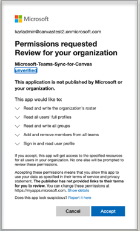
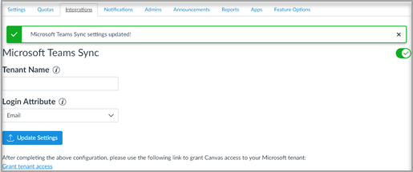
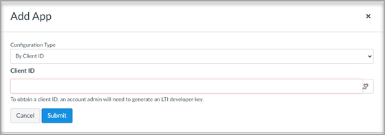

# Использование Microsoft Teams собраний с Canvas

> [!IMPORTANT]
> Некоторые сведения относятся к предварительным выпускам продуктов, которые могут быть существенно изменены до коммерческого выпуска. Корпорация Майкрософт не дает никаких гарантий, явных или подразумеваемых, относительно предоставленных здесь сведений.

Microsoft Teams собрания — это приложение для взаимодействия средств обучения (LTI), которое помогает преподавателям и учащимся легко перемещаться между их системой управления обучением (LMS) и Teams. Пользователи могут получать доступ к группам классов, связанным с их курсом непосредственно из LMS.

## Microsoft Office 365 Admin

Перед управлением интеграцией Microsoft Teams в Instructure Canvas важно, чтобы приложение **Microsoft-Teams-Sync-for-Canvas** Azure было одобрено администратором Microsoft Office 365 учреждения в клиенте Microsoft Azure, прежде чем завершить установку администрирования Canvas.

1. Во входе в Canvas.
 
2. Выберите **ссылку Администратор** в глобальной навигации, а затем выберите учетную запись.

3. В навигации администратора выберите **ссылку Параметры,** а затем вкладку **Интеграции.** 

4. Введите имя клиента Майкрософт и атрибут входа. 

   Атрибут входа будет использоваться для связи пользователя Canvas с Azure Active Directory пользователем. 

5. Выберите **обновление Параметры** один раз.

6. Чтобы утвердить доступ к приложению **Microsoft-Teams-Sync-for-Canvas** Azure, выберите ссылку на доступ к **клиенту Grant.** Вы будете перенаправлены в конечную точку согласия администратора платформы администрирования Майкрософт.

   

7. Выберите **Accept**.
 
8. Включи Microsoft Teams синхронизацию, включив очки.

   

## Администрирование Canvas

Настройка интеграции Microsoft Teams LTI 1.3.

В качестве администратора Canvas необходимо добавить приложение LTI Microsoft Teams собраний в вашей среде. Обратите внимание на ID клиента LTI для приложения.

 - Microsoft Teams - 170000000000703

1. Access **Admin settings**  >  **Apps**.

2. Выберите **+ Приложение,** чтобы добавить Teams приложения LTI. 
 
   

3. Выберите **по client ID** для типа конфигурации.

   

4. Введите предоставленный клиентский ID и выберите **Отправить**.
   
   Вы заметите имя приложения Microsoft Teams собраний LTI для client ID для подтверждения. 

5. Нажмите кнопку **Установить**.

   Приложение Microsoft Teams собраний LTI будет добавлено в список внешних приложений.
