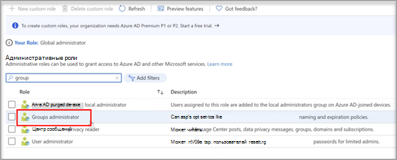
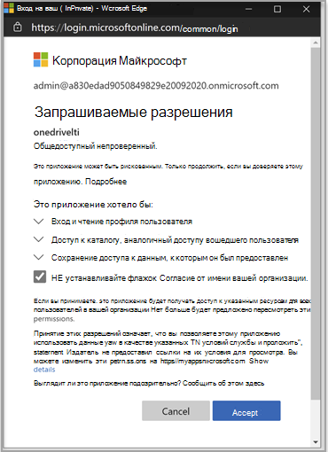

# Используйте Microsoft OneDrive с помощью системы управления обучениемUse Microsoft OneDrive with your Learning Management System

> [!IMPORTANT]
> Некоторые сведения относятся к предварительным выпускам продуктов, которые могут быть существенно изменены до коммерческого выпуска.Some information relates to prereleased product which may be substantially modified before it's commercially released. Корпорация Майкрософт не дает никаких гарантий, явных или подразумеваемых, относительно предоставленных здесь сведений.Microsoft makes no warranties, express or implied, with respect to the information provided here.

Узнайте преимущества использования Microsoft OneDrive с помощью системы управления обучением (LMS).Learn the benefits of using Microsoft OneDrive with your Learning Management System (LMS).

**Приносит Microsoft Office 365 непосредственно в рабочий процесс****Brings Microsoft Office 365 directly into your workflows**

Приложение microsoft OneDrive learning Tools Interoperability (LTI) интегрируется с вашим LMS, чтобы непосредственно ввести Microsoft OneDrive и Microsoft Office 365 в наиболее важные процессы, которые включают:The Microsoft OneDrive Learning Tools Interoperability (LTI) App integrates with your LMS to bring Microsoft OneDrive and Microsoft Office 365 directly into your most important workflows that include:

- Присоединение ресурсов и организация контента.Attaching resources and organizing content.
- Начало совместной работы документов.Starting collaborative documents.
- Создание и классификация назначений.Creating and grading assignments.

**Безопасность и полное соответствие последним стандартам LTI****Secure and fully compliant with latest LTI standards**

Приложение Microsoft OneDrive LTI совместимо с LTI 1.3 и LTI Advantage.The Microsoft OneDrive LTI App is compatible with LTI 1.3 and LTI Advantage. Это преимущество позволяет обеспечить высокую безопасность и тесное интегрирование пользовательского интерфейса.This advantage allows for a highly secure and tightly integrated user experience.

**Современный и богатый пользовательский опыт****Modern and Rich User Experience**

Приложение Microsoft OneDrive LTI обеспечивает лучшее из microsoft right в вашем LMS-опыте.The Microsoft OneDrive LTI App brings the best of Microsoft right into your LMS experience. Мы улучшаем существующую интеграцию Office 365 в вашем LMS путем предоставления более современного пользовательского интерфейса, в комплекте с новым и расширенным выборщиком файлов Microsoft OneDrive и более богатыми опытом редактирования файлов Office.We're improving upon the existing Office 365 integration in your LMS by delivering a more modern user experience, complete with a new and expanded Microsoft OneDrive file picker and richer editing experiences for Office files. Корпорация Майкрософт также полностью будет владеть приложением Microsoft OneDrive LTI, что означает, что вы всегда будете получать последнюю и самую последнюю версию от Microsoft автоматически.Microsoft will also fully own the Microsoft OneDrive LTI App going forward, which means you’ll always get the latest and greatest from Microsoft automatically.

Приложение Microsoft OneDrive LTI позволяет:The Microsoft OneDrive LTI App allows you to:

- Прикрепить файлы Office 365, включая документы Word, презентации PowerPoint и Excel из редактора богатого контента.Attach Office 365 files including Word documents, PowerPoint presentations, and Excel from the Rich Content Editor.

- Распространение облачных назначений Office 365.Distribute Office 365 cloud assignments.

- Просмотр и организация личных и конечно файлов Microsoft OneDrive.View and organize your personal and course Microsoft OneDrive files.

- Создание совместной работы, в которой участники курсов могут работать вместе над общими документами в режиме реального времени.Create collaborations where course members can work together on shared documents in real time.

- Доступ к нескольким учетным записям Microsoft OneDrive, включая личные и школьные.Access multiple Microsoft OneDrive accounts, including personal and school accounts.

- Интеграция файлов Office 365 с модулями курсов.Integrate Office 365 files with your course modules.

- Использование учетной записи Майкрософт для единой регистрации с помощью службы LMS.Use your Microsoft account for single sign-on with your LMS.

## Интеграция с CanvasIntegrate with Canvas

Человек, который выполняет эту интеграцию, должен быть администратором Canvas и администратором клиента Microsoft 365.The person who performs this integration should be an admin of Canvas and an admin of the Microsoft 365 tenant.

1. Вопишитесь на портал Microsoft Azure с учетной записью администратора клиента.Sign in to the Microsoft Azure portal with the tenant admin account. Администратор клиента Azure также должен иметь роль администратора Группы.The Azure tenant administrator should also have the Group administrator role.

    

2. Во входе на портал [Microsoft OneDrive LTI](https://odltiappnl.azurewebsites.net/admin).Sign in to the Microsoft [OneDrive LTI portal](https://odltiappnl.azurewebsites.net/admin).

3. Примите разрешения для завершения регистрации.Accept the permissions to complete the sign-in.

    

4. Выберите **Добавить клиента LTI**.Select **Add LTI Tenant**.

     

5. Выберите **потребительскую платформу LTI в** **качестве Canvas** из отсева.Select **LTI Consumer Platform** as **Canvas** from the dropdown.

6. Выберите **URL-адрес базы Canvas** и выберите **Далее**.Select **Canvas Base URL** and then select **Next**.

    

   На следующем экране показаны конфиденциальные для вас поля.The next screen shows fields that are confidential to you.

7. Выберите **Далее** от ??Select **Next** from ?? (Почти готово!).page. МОГУТ ЛИ РЕЦЕНЗЕНТЫ ЗАПОЛНИТЬ ПРОБЕЛ ЗДЕСЬ?CAN REVIEWERS FILL IN THE BLANK HERE?

8. Выберите **Далее** на экране, где показаны конфиденциальные сведения.Select **Next** in the screen that shows information that's confidential to you.

   На заключительном экране портала Azure показаны следующие действия для добавления экземпляра Canvas.The final screen of the Azure portal shows the next steps for adding your Canvas instance.

9. Скопируйте клавиши разработчика с этого экрана.Copy the Developer Keys from this screen. Вы будете использовать при создании экземпляра Canvas.You'll use when you create the Canvas instance.

## Добавление экземпляра CanvasAdd the Canvas instance

1. В экземпляре Canvas высеките **клавиши**  >  **разработчика администрирования.**In your Canvas instance, deselect **Admin** > **Developer Keys**.

2. Выберите **клавишу LTI в** отсеве в **ключе разработчика.**Choose **LTI Key** in the dropdown on **Developer Key**.

   

3. Вклеить ключи разработчика здесь.Paste the developer keys here.

     

   Ключ создается в **режиме OFF**The key gets created in **OFF** mode

   

4. Скопируйте выделенный текст.Copy the highlighted text.
    Это служит в качестве клиентского ИД на портале Microsoft OneDrive LTI.This serves as Client ID in Microsoft OneDrive LTI portal.

5. Вклеить текст в **поле client ID** на портале Microsoft OneDrive LTI, а затем выберите **Далее**.Paste the text into the **Client ID** field in Microsoft OneDrive LTI portal, and then select **Next**.

6. Нажмите **Сохранить**.Select **Save**.

7. Просмотр параметров, выбрав **View LTI Tenants**.View the settings by selecting **View LTI Tenants**.
