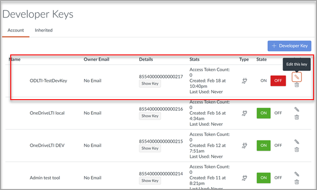

# Используйте Microsoft OneDrive с помощью системы управления обучением

> [!IMPORTANT]
> Некоторые сведения относятся к предварительным выпускам продуктов, которые могут быть существенно изменены до коммерческого выпуска. Корпорация Майкрософт не дает никаких гарантий, явных или подразумеваемых, относительно предоставленных здесь сведений.

Узнайте преимущества использования Microsoft OneDrive с помощью системы управления обучением (LMS).

**Приносит Microsoft Office 365 непосредственно в рабочий процесс**

Приложение microsoft OneDrive learning Tools Interoperability (LTI) интегрируется с вашим LMS, чтобы непосредственно ввести Microsoft OneDrive и Microsoft Office 365 в наиболее важные процессы, которые включают:

- Присоединение ресурсов и организация контента.
- Начало совместной работы документов.
- Создание и классификация назначений.

**Безопасность и полное соответствие последним стандартам LTI**

Приложение Microsoft OneDrive LTI совместимо с LTI 1.3 и LTI Advantage. Это преимущество позволяет обеспечить высокую безопасность и тесное интегрирование пользовательского интерфейса.

**Современный и богатый пользовательский опыт**

Приложение Microsoft OneDrive LTI обеспечивает лучшее из microsoft right в вашем LMS-опыте. Мы улучшаем существующую интеграцию Office 365 в вашем LMS путем предоставления более современного пользовательского интерфейса, в комплекте с новым и расширенным выборщиком файлов Microsoft OneDrive и более богатыми опытом редактирования файлов Office. Корпорация Майкрософт также полностью будет владеть приложением Microsoft OneDrive LTI, что означает, что вы всегда будете получать последнюю и самую последнюю версию от Microsoft автоматически.

Приложение Microsoft OneDrive LTI позволяет:

- Прикрепить файлы Office 365, включая документы Word, презентации PowerPoint и Excel из редактора богатого контента.

- Распространение облачных назначений Office 365.

- Просмотр и организация личных и конечно файлов Microsoft OneDrive.

- Создание совместной работы, в которой участники курсов могут работать вместе над общими документами в режиме реального времени.

- Доступ к нескольким учетным записям Microsoft OneDrive, включая личные и школьные.

- Интеграция файлов Office 365 с модулями курсов.

- Использование учетной записи Майкрософт для единой регистрации с помощью службы LMS.

## Интеграция с Canvas

Человек, который выполняет эту интеграцию, должен быть администратором Canvas и администратором клиента Microsoft 365.

1. Вопишитесь на портал Microsoft Azure с учетной записью администратора клиента. Администратор клиента Azure также должен иметь роль администратора Группы.

    

2. Во входе на портал [Microsoft OneDrive LTI](https://odltiappnl.azurewebsites.net/admin).

3. Примите разрешения для завершения регистрации.

    

4. Выберите **Добавить клиента LTI**.

     

5. Выберите **потребительскую платформу LTI в** **качестве Canvas** из отсева.

6. Выберите **URL-адрес базы Canvas** и выберите **Далее**.

    

   На следующем экране показаны конфиденциальные для вас поля.

7. Выберите **Далее** от ?? (Почти готово!). МОГУТ ЛИ РЕЦЕНЗЕНТЫ ЗАПОЛНИТЬ ПРОБЕЛ ЗДЕСЬ?

8. Выберите **Далее** на экране, где показаны конфиденциальные сведения.

   На заключительном экране портала Azure показаны следующие действия для добавления экземпляра Canvas.

9. Скопируйте клавиши разработчика с этого экрана. Вы будете использовать при создании экземпляра Canvas.

## Добавление экземпляра Canvas

1. В экземпляре Canvas высеките **клавиши**  >  **разработчика администрирования.**

2. Выберите **клавишу LTI в** отсеве в **ключе разработчика.**

   

3. Вклеить ключи разработчика здесь.

     

   Ключ создается в **режиме OFF**

   

4. Скопируйте выделенный текст.
    Это служит в качестве клиентского ИД на портале Microsoft OneDrive LTI.

5. Вклеить текст в **поле client ID** на портале Microsoft OneDrive LTI, а затем выберите **Далее**.

6. Нажмите **Сохранить**.

7. Просмотр параметров, выбрав **View LTI Tenants**.
