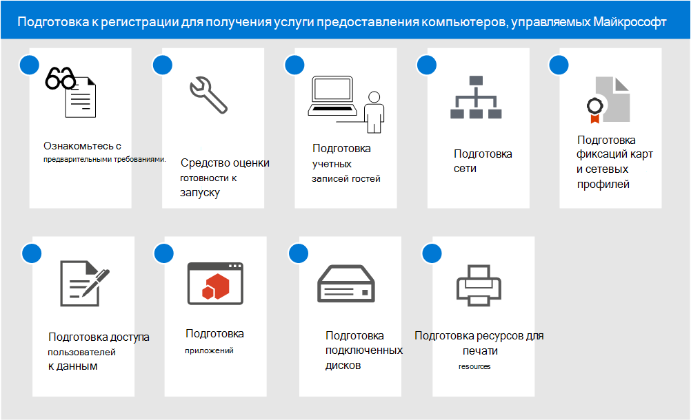

# Подготовка к регистрации для получения услуги предоставления компьютеров, управляемых Майкрософт

В этих разделах описаны действия, которые требуется выполнить в организации для подготовки к регистрации, в том числе проверка соответствия вашей среды основным предварительным условиям, настройка сетей, настройка сертификатов и подготовка приложений к включению в службу. После запуска средств оценки готовности вы можете выполнять другие действия в любом порядке или одновременно. В зависимости от вашей среды некоторые действия могут не требоваться.

1. См. [предварительные условия для компьютеров, управляемых Майкрософт](prerequisites.md).
2. Используйте [средства оценки готовности](readiness-assessment-tool.md).
3. [Предварительные требования для гостевых учетных записей](guest-accounts.md)
4. [Конфигурация сети для компьютеров, управляемых Майкрософт](network.md)
5. [Подготовка сертификатов и сетевых профилей для компьютеров, управляемых Майкрософт](certs-wifi-lan.md)
6. [Подготовка доступа к локальным ресурсам для компьютеров, управляемых Майкрософт](authentication.md)
7. [Приложения на компьютерах, управляемых Майкрософт](apps.md)
8. [Подготовка подключенных дисков для компьютеров, управляемых Майкрософт](mapped-drives.md)
9. [Подготовка ресурсов печати для компьютеров, управляемых Майкрософт](printing.md)
