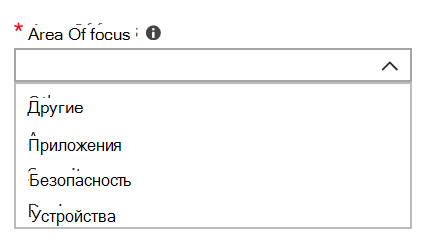

# Добавление и проверка контактов администратора на портале администрирования

Существует несколько способов, компьютеры, управляемые Майкрософт служба взаимодействует с клиентами. Чтобы упростить связь и убедиться, что мы проверяем нужных людей, необходимо предоставить набор контактов администратора. компьютеры, управляемые Майкрософт It Operations will contact these people for assistance troubleshooting issues for your tenant.

> [!IMPORTANT]
> Возможно, вы уже добавили эти контакты на портале Admin. Если да, удостоверимся, что список контактов является точным,  так как компьютеры, управляемые Майкрософт должны быть в состоянии связаться с ними в случае серьезного инцидента.

## Azure Active Directory доступа для компьютеры, управляемые Майкрософт администратора

компьютеры, управляемые Майкрософт Портал администрирования требует, чтобы у людей, которые имеют доступ к порталу, одна из Azure Active Directory (AD):

- Глобальный администратор
- Администратор службы Intune
- Глобальный читатель
- Администратор службы поддержки

Глобальный администратор должен зарегистрировать организацию в компьютеры, управляемые Майкрософт. Все пять ролей имеют одинаковый доступ на портале Администрирование для инициировать и просматривать задачи. Дополнительные сведения о назначении этих ролей в Azure AD см. в [Azure Active Directory.](/azure/active-directory/users-groups-roles/directory-assign-admin-roles)

## Области контактов администратора

Контакты администратора должны быть лучшими людьми или группой, которые могут отвечать на вопросы и принимать решения для различных областей внимания. **компьютеры, управляемые Майкрософт Операции будут обращаться к этим контактам администратора для вопросов, связанных с запросами поддержки, поданных клиентом.** Эти контакты администратора будут получать уведомления об обновлениях запросов на поддержку и новых сообщениях. К этим областям относятся:

Область фокуса | Вопросы о
--- | ---
Упаковка приложений | Устранение неполадок при упаковке приложений
Устройства | Состояние устройства, устранение неполадок с помощью компьютеры, управляемые Майкрософт устройств
Безопасность | Устранение неполадок с безопасностью с компьютеры, управляемые Майкрософт устройствами
ИТ-службы | в тех случаях, когда сотрудники компьютеры, управляемые Майкрософт службы поддержки совме- 
Другое | Для проблем, не охваченных другими областями

**Тот, кто выбирает для этих контактов, должен иметь знания и полномочия для принятия решений для компьютеры, управляемые Майкрософт среды.** Когда вы на компьютеры, управляемые Майкрософт среде, вам будет предложено добавить контакты для локальной службы helpdesk и Security. 

Контакты администратора необходимы при отправке [запроса на поддержку.](../service-description/support.md) Вам потребуется связаться с администратором для области фокусии запроса поддержки.

**Добавление контактов администратора**

1. Во входе [в Microsoft Endpoint Manager](https://endpoint.microsoft.com).

2. В **разделе Администрирование** клиента выберите раздел **компьютеры, управляемые Майкрософт,** а затем выберите **контакты администратора.**

3. Нажмите **Добавить**.

4. Выберите область **фокуса** и введите сведения для контакта. 

    

5. Повторите для каждой области фокуса.

## Шаги для начала работы с компьютеры, управляемые Майкрософт

1. Добавление и проверка контактов администратора на портале Admin (этот раздел)
2. [Настройка условного доступа](conditional-access.md)
3. [Назначение лицензий](assign-licenses.md)
4. [Установка корпоративного портала Intune на устройствах](company-portal.md)
5. [Включение службы Enterprise State Roaming](enterprise-state-roaming.md)
6. [Настройка компьютеров, управляемых Майкрософт](set-up-devices.md)
7. [Подготовка пользователей к работе с устройствами](get-started-devices.md)
8. [Развертывание приложений на устройствах](deploy-apps.md)
