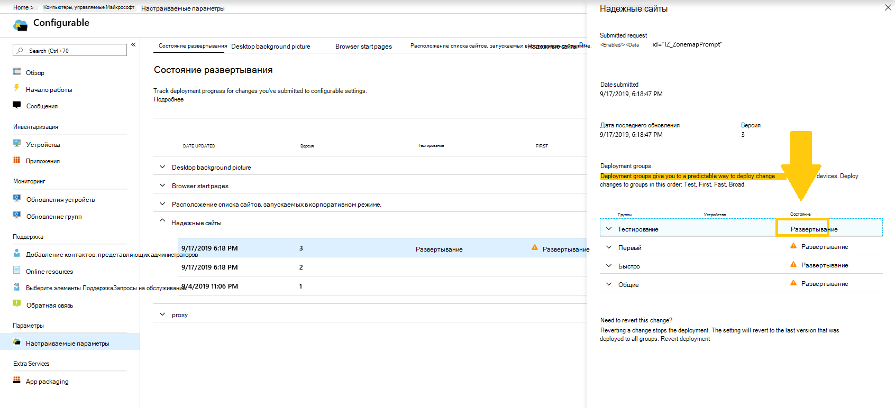

# Развертывание и отслеживание настраиваемых параметров — компьютеры, управляемые МайкрософтDeploy and track configurable settings - Microsoft Managed Desktop

После внесения изменений в категории параметров и стадии развертывания страница состояния развертывания позволяет начать развертывание параметров в группах.After you make changes to your setting categories and stage a deployment, the Deployment status page allows you to begin deploying your settings to groups. На этой странице показана сводка по каждому настраиваемому параметру.This page shows a summary of each configurable setting. Открыв категорию параметров, можно развернуть параметры в группах и отслеживать ход развертывания.By opening a setting category you can deploy settings to groups and track the progress of these deployments.

## Состояния развертыванияDeployment statuses 

Это состояния, которые вы увидите для каждого развертывания.These are the statuses you’ll see for each deployment.

StatusStatus  | ОбъяснениеExplanation 
--- | --- 
РазвертываниеDeploy | Изменения ожидают развертывания в этой группе.Your change is waiting to be deployed to this group.
В процессе выполненияIn progress | Изменение применяется к активным устройствам в этой группе.The change is being applied to active devices in this group. 
ЗавершениеComplete | Изменение выполнено на всех активных устройствах в этой группе.The change completed on all active devices in this group. 
Не выполненоFailed | Сбой изменения на 10 % активных устройств в группе, поэтому развертывание было остановлено.The change failed on a 10 percent of active devices in the group, so the deployment was stopped.   Запрос в службу поддержки будет автоматически открыт с помощью операций microsoft Managed Desktop для устранения неполадок развертывания.A support request will be automatically opened with Microsoft Managed Desktop operations to troubleshoot the deployment. 
RevertedReverted | Изменение было отменено до последнего изменения, которое было успешно развернуто во всех группах развертывания.The change was reverted to the last change that was successfully deployed to all deployment groups.

## Развертывание измененийDeploy changes

В этих инструкциях мы откажемся от фонового рисунка рабочего стола.We’ll show Desktop background picture in these instructions. После поэтапного развертывания изменения развертываются со страницы состояния развертывания.After you’ve staged a deployment, you deploy changes from the Deployment status page. 

**Развертывание изменений****To deploy changes**

1. Войдите в [Microsoft Endpoint Manager и](https://endpoint.microsoft.com/) перейдите в меню **"Устройства"**Sign in to [Microsoft Endpoint Manager](https://endpoint.microsoft.com/) and navigate to the **Devices** menu
2. Наберем раздел "Рабочий стол, управляемый Майкрософт", выберите **"Параметры".**Look for the Microsoft Managed Desktop section, select **Settings**.
3. В **рабочей области** состояния развертывания выберите параметр, который требуется развернуть, а затем выберите поэтапное развертывание для развертывания.In **Deployment status** workspace, select the setting you want to deploy, and then select the staged deployment to deploy.
4. Выберите  "Развернуть", чтобы развернуть изменение в одной из групп развертывания.Select **Deploy** to deploy the change to one of the deployment groups.

> [!NOTE] 
> Оранжевый значок предупреждения указывает, что для развертывания доступна предыдущая группа, так как ее рекомендуется развертывать по порядку.The orange caution icon indicates there is a previous group available for deployment as it’s recommended to roll out in order. 

<!-- Needs picture updated to show MEM  -->

Рекомендуется развертывать развертывание в группах развертывания в таком порядке: Test, First, Fast, and then Broad.We recommend deploying to deployment groups in this order: Test, First, Fast, and then Broad. 

После завершения изменений в каждой группе состояние меняется на **"Завершено".**When changes complete in each group, the status changes to **Complete**.

<!-- Needs picture updated to show MEM  -->

## Отовращать развертываниеRevert deployment

После развертывания изменения можно вернуться к статусу **развертывания.**After you’ve deployed a change, you can revert from **Deployment status**. При отращении изменения, которое находится **в** процессе выполнения или **завершения,** текущее развертывание останавливается.When you revert a change that is **In progress** or **Complete**, the current deployment stops. Этот параметр вернется к последней версии, развернутой для всех групп.The setting will revert to the last version that was deployed to all groups. 

В качестве примера мы покажем, как отменить изменение с помощью фонового рисунка рабочего стола.We’ll show the steps to revert a change using the Desktop background picture as an example. 

**Как отменить изменение****To revert a change**
1. Войдите в [Microsoft Endpoint Manager и](https://endpoint.microsoft.com/) перейдите в меню **"Устройства"**Sign in to [Microsoft Endpoint Manager](https://endpoint.microsoft.com/) and navigate to the **Devices** menu
2. Наберем раздел "Рабочий стол, управляемый Майкрософт", выберите **"Параметры".**Look for the Microsoft Managed Desktop section, select **Settings**.
3. В **рабочей области состояния** развертывания выберите параметр, который требуется отовращать, а затем выберите поэтапное развертывание, для чего требуется вернуться.In **Deployment status** workspace, select the setting you want to revert, and then select the staged deployment to revert.
4. Under **Need to revert this change?**, select **Revert deployment**.Under **Need to revert this change?**, select **Revert deployment**.

<!-- Needs picture updated to show MEM  -->

## Дополнительные ресурсыAdditional resources
- [Обзор настраиваемых параметровConfigurable settings overview](config-setting-overview.md)
- [Справочник по настраиваемым параметрамConfigurable settings reference](config-setting-ref.md) 
