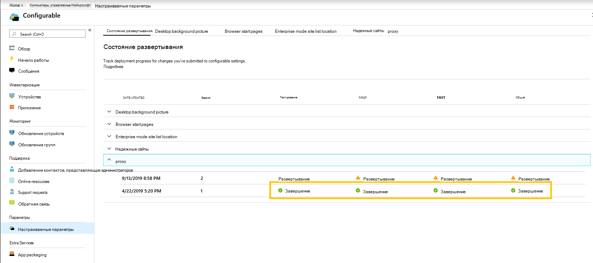
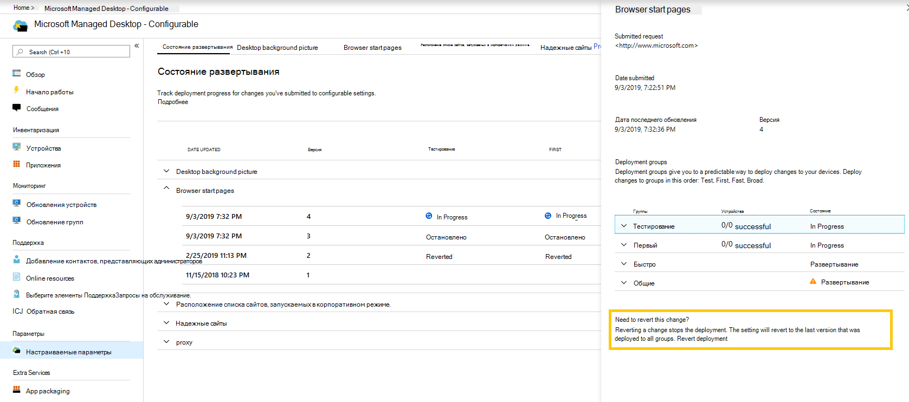

# Развертывание и отслеживание настраиваемых параметров — Рабочий стол, управляемый корпорацией МайкрософтDeploy and track configurable settings - Microsoft Managed Desktop

После внесения изменений в категории параметров и поэтапного развертывания на странице состояния развертывания можно приступить к развертыванию параметров в группах.After you make changes to your setting categories and stage a deployment, the Deployment status page allows you to begin deploying your settings to groups. На этой странице приведены сводные сведения о настраиваемых параметрах.This page shows a summary of each configurable setting. Открыв категорию параметров, вы можете развернуть параметры для групп и отслеживать ход выполнения этих развертываний.By opening a setting category you can deploy settings to groups and track the progress of these deployments.

## Состояния развертыванияDeployment statuses 

Ниже приведены состояния, которые будут отображаться для каждого развертывания.These are the statuses you’ll see for each deployment.

СостояниеStatus  | ОбъяснениеExplanation 
--- | --- 
РазвертываниеDeploy | Ваше изменение ожидает развертывания в этой группе.Your change is waiting to be deployed to this group.
ВыполняетсяIn progress | Изменение применяется к активным устройствам в этой группе.The change is being applied to active devices in this group. 
ЗавершениеComplete | Изменение завершено для всех активных устройств в этой группе.The change completed on all active devices in this group. 
FailedFailed | Изменение не удалось выполнить на 10 процентов активных устройств в группе, поэтому развертывание было остановлено.The change failed on a 10 percent of active devices in the group, so the deployment was stopped.   Запрос в службу поддержки будет автоматически открыт с помощью управляемых операций на рабочем столе Майкрософт для устранения неполадок в развертывании.A support request will be automatically opened with Microsoft Managed Desktop operations to troubleshoot the deployment. 
ВозвращаютсяReverted | Изменено Последнее изменение, которое было успешно развернуто во всех группах развертывания.The change was reverted to the last change that was successfully deployed to all deployment groups.

## Развертывание измененийDeploy changes

В этих инструкциях мы будем показывать фоновый рисунок рабочего стола.We’ll show Desktop background picture in these instructions. После поэтапного развертывания вы развертываете изменения на странице состояния развертывания.After you’ve staged a deployment, you deploy changes from the Deployment status page. 

**Развертывание изменений****To deploy changes**

1. Вход на [портал администрирования рабочих столов с управляемыми Майкрософт](https://aka.ms/mwaasportal)Sign in to [Microsoft Managed Desktop Admin portal](https://aka.ms/mwaasportal)
2. В разделе **Параметры**выберите пункт **Настраиваемая**.Under **Settings**, select **Configurable**.
3. В рабочей области **состояния развертывания** выберите параметр, который необходимо развернуть, а затем выберите поэтапное развертывание для развертывания.In **Deployment status** workspace, select the setting you want to deploy, and then select the staged deployment to deploy.
4. Нажмите кнопку **развернуть** , чтобы развернуть изменения в одной из групп развертывания.Select **Deploy** to deploy the change to one of the deployment groups.

> [!NOTE] 
> Оранжевый значок предупреждения указывает, что существует доступ к предыдущей группе, так как ее рекомендуется развертывать по порядку.The orange caution icon indicates there is a previous group available for deployment as it’s recommended to roll out in order. 

![Рабочая область состояния развертывания.![Deployment status workspace. Область надежных сайтов справа.Trusted sites pane on the right. В разделе группы развертывания три столбца: группы развертывания, устройства и состояние.In the Deployment groups section are three columns: deployment groups, devices, and status. В столбце Состояние выделено значение "развернуть".](../../media/1deployedit.png)In the status column, "deploy" is highlighted.](../../media/1deployedit.png)
Мы рекомендуем развертывать в группах развертывания в следующем порядке: Test, First, Fast, а затем широком.We recommend deploying to deployment groups in this order: Test, First, Fast, and then Broad. 

По завершении изменений в каждой группе состояние изменится на " **завершено**".When changes complete in each group, the status changes to **Complete**.

## Отмена развертыванияRevert deployment

После развертывания изменения можно вернуться к **состоянию развертывания**.After you’ve deployed a change, you can revert from **Deployment status**. При возвращении изменения, которое выполняется **или** завершено, текущее развертывание перестает быть **завершенным**.When you revert a change that is **In progress** or **Complete**, the current deployment stops. Этот параметр вернется к последней версии, которая была развернута для всех групп.The setting will revert to the last version that was deployed to all groups. 

Мы покажем, как вернуть изменения, используя фоновый рисунок рабочего стола в качестве примера.We’ll show the steps to revert a change using the Desktop background picture as an example. 

**Отмена изменения****To revert a change**
1. Вход на [портал администрирования рабочих столов с управляемыми Майкрософт](https://aka.ms/mwaasportal)Sign in to [Microsoft Managed Desktop Admin portal](https://aka.ms/mwaasportal)
2. В разделе **Параметры**выберите пункт **Настраиваемая**.Under **Settings**, select **Configurable**.
3. В рабочей области **состояния развертывания** выберите параметр, который требуется восстановить, а затем выберите поэтапное развертывание для отмены.In **Deployment status** workspace, select the setting you want to revert, and then select the staged deployment to revert.
4. В разделе **требуется отменить это изменение**нажмите кнопку **вернуть развертывание**.Under **Need to revert this change?**, select **Revert deployment**.

 

## Дополнительные ресурсыAdditional resources
- [Общие сведения о настраиваемых параметрахConfigurable settings overview](config-setting-overview.md)
- [Справочник по настраиваемым параметрамConfigurable settings reference](config-setting-ref.md) 
