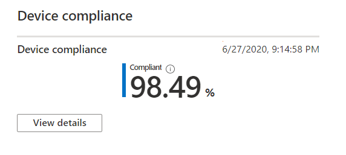

# Отчет о соответствии устройств требованиямDevice compliance report

В этом представлении отображается процент управляемых устройств для настольных компьютеров Майкрософт, которые соответствуют политикам соответствия, установленным в Microsoft Intune.This view shows the percentage of your Microsoft Managed Desktop devices that conform to compliance policies set in Microsoft Intune.

Выберите **Просмотреть сведения** , чтобы просмотреть конкретные сведения для всех настольных устройств, управляемых Майкрософт, или только устройств, которые не соответствуют политикам соответствия требованиям.Select **View details** to view specific information for either all of your Microsoft Managed Desktop devices or only devices that do not conform to compliance policies. Чтобы переключаться между этими представлениями, используйте меню раскрывающемся меню.Use the pulldown menu to switch between these views. Для отображения в этом представлении устройство должно быть физическим компьютером и синхронизировано с Intune за последние 30 дней.To appear in this view, a device must be a physical machine and have synced with Intune in the last 30 days.

В этом представлении выберите **загружать полные данные** , чтобы экспортировать файл с разделителями запятыми и теми же сведениями.From this view, select **Download full data** to export a comma-delimited file with the same information. В файле экспорта области, отображаемые как **схема** , отображаются как столбцы.In the export file, the areas displayed as **Schema** appear as columns.