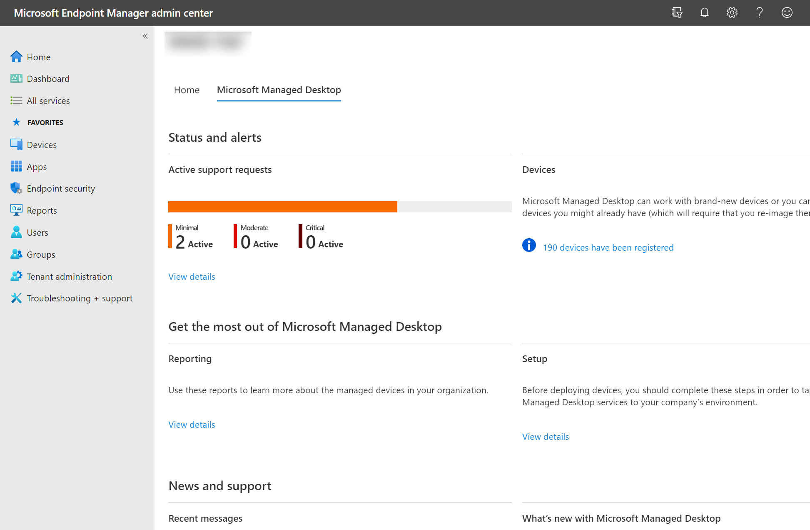

# Работа с аналитикой

Компьютеры, управляемые Майкрософт, предоставляют ряд панелей мониторинга, которые ИТ-администраторы в клиенте могут использовать для понимания различных аспектов работы устройств. Доступ к ним можно получить напрямую в Центре администрирования [Microsoft 365.](https://admin.microsoft.com/adminportal/home?previewoff=false#/microsoftmanageddesktop)

С помощью этих панелей мониторинга можно найти ответы на такие вопросы:

- Сколько устройств активно и когда они использовались в последний раз?
- Какие приложения чаще всего используются и в какое время?
- Какие приложения вызывают проблемы из-за сбоя или зависания?
- Как операции Microsoft Managed Desktop Operations по устранению или устранению таких проблем?
- Какие приложения потребляют больше всего энергии?
- Каков прогнозируемый срок работы батареи на устройствах?
- Каково текущее состояние обновлений для системы безопасности на устройствах?
- Сколько времени у 95% устройств было в курсе последних обновлений для системы безопасности?

Чтобы получить доступ к этим представлениям из [Microsoft Endpoint Manager,](https://endpoint.microsoft.com/)перейдите на вкладку "Управляемый рабочий стол Майкрософт" на домашней странице и выберите "Просмотреть **сведения"** в области **"Отчеты":**

## Аналитика использования
В этом представлении метрики использования для настольных устройств, управляемых Майкрософт. 

Чтобы просмотреть данные об использовании, выберите **вкладку "Использование".**

Дополнительные сведения об [использовании.](usage-insights.md)

## Аналитика надежности
В этом представлении содержится сводка по состоянию здоровья управляемых устройств. Чтобы просмотреть данные о надежности, выберите **вкладку "Надежность".**

Узнайте больше о [статистике надежности.](reliability-insights.md)

## Аналитика аккумулятора
В этом представлении показаны сведения о потреблении энергии приложений и прогнозируемых время работы батареи для устройств в вашей среде. Чтобы просмотреть эти сведения, выберите вкладку **"Аккумулятор".**

Дополнительные сведения о [батарее.](battery-insights.md)

## Аналитика центра безопасности Windows
В этом представлении показаны сведения о состоянии обновлений системы безопасности для настольных устройств, управляемых Майкрософт. Чтобы просмотреть эти сведения, выберите вкладку **"Обновления для системы безопасности Windows".**

Дополнительные сведения об [обновлениях системы безопасности.](security-update-insights.md)
