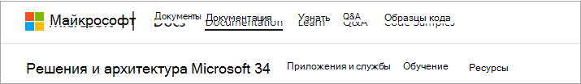
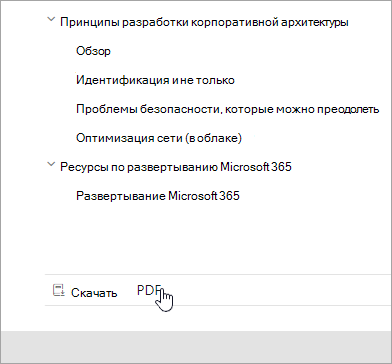
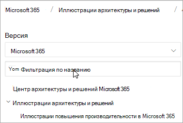
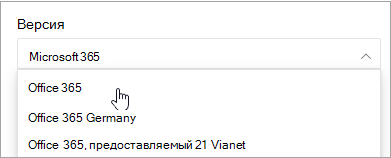
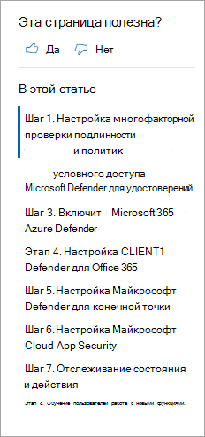
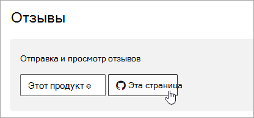

# Microsoft 365 руководства по навигации по docsMicrosoft 365 docs navigation guide

В этом разделе содержится несколько советов и приемов для навигации по Microsoft 365 области технической документации.This topic provides some tips and tricks for navigating the Microsoft 365 technical documentation space.  

## Страница КонцентраторHub page

Страница Microsoft 365 может быть найдена на странице и является точкой входа для поиска соответствующего [https://aka.ms/microsoft365docs](./index.yml) Microsoft 365 контента.The Microsoft 365 hub page can be found at [https://aka.ms/microsoft365docs](./index.yml) and is the entry point for finding relevant Microsoft 365 content.

Вы всегда можете вернуться на эту  страницу, выбрав Microsoft 365 из загона в верхней части каждой страницы в Microsoft 365 наборе технической документации:You can always navigate back to this page by selecting **Microsoft 365** from the header at the top of every page within the Microsoft 365 technical documentation set:

## Документация в автономном режимеOffline documentation

Если вы хотите просмотреть документацию Microsoft 365 в автономной системе, вы можете создать PDF, где бы вы ни Microsoft 365 технической документации.If you would like to view the Microsoft 365 documentation on an offline system, you can create a PDF wherever you are in the Microsoft 365 technical documentation.

Если вы хотите создать PDF, выберите ссылку **Download PDF,** найденную в нижней части каждой таблицы содержимого.If you'd like to create a PDF, select the **Download PDF** link found at the bottom of every table of contents.

## Поиск TOCTOC search 
В docs.microsoft.com вы можете искать содержимое в таблице содержимого с помощью окна поиска фильтра в верхней части:On docs.microsoft.com, you can search the content in the table of contents by using the filter search box at the top:

## Фильтр версииVersion filter
Техническая документация Microsoft 365 содержит контент для дополнительных продуктов, в том числе Office 365 Германии и Office 365 21 Vianet (Китай).The Microsoft 365 technical documentation provides content for additional products, including Office 365 Germany and Office 365 operated by 21 Vianet (China). Функции могут различаться между этими версиями, и как таковой иногда сам контент может отличаться.Features can vary between these versions, and as such, sometimes the content itself can vary.

Фильтр версии можно использовать для просмотра контента для соответствующей версии Microsoft 365:You can use the version filter to ensure that you are seeing content for the appropriate version of Microsoft 365:

## BreadcrumbsBreadcrumbs

Сухаря можно найти под заглавной и над таблицей содержимого, а также указать, где текущая статья расположена в таблице содержимого.Breadcrumbs can be found below the header and above the table of contents, and indicate where the current article is located in the table of contents.  Это не только помогает настроить контекст к типу содержимого, которое вы читаете, но и позволяет перемещаться по таблице дерева контента:Not only does this help set the context to what type of content you're reading, but it also allows you to navigate back up the table of contents tree:

## Навигация раздела статьиArticle section navigation

На правой области навигации можно быстро перемещаться по разделам в статье, а также определять свое расположение в статье.The right-hand navigation pane allows you to quickly navigate to sections within an article, as well as identify your location within the article.  

## Отправка отзывов о работе с документымиSubmit docs feedback

Если в статье что-то не так, вы можете отправить отзывы в команду SQL контента для этой статьи, прокрутки вниз к нижней части страницы и выбора отзывов **контента.**If you find something wrong within an article, you can submit feedback to the SQL Content team for that article by scrolling down to the bottom of the page and selecting **Content feedback**.

## Внести вклад в Microsoft 365 документацииContribute to Microsoft 365 documentation

Знаете ли вы, что вы можете изменить контент на docs.microsoft.com самостоятельно?Did you know that you could edit the content on docs.microsoft.com yourself? Если вы это сделаете, наша документация не только улучшится, но и будет засчет в качестве участника страницы.If you do so, not only will our documentation improve, but you'll also be credited as a contributor to the page. Чтобы начать работу, см.:To get started, see:

- [Руководство по вкладчикам Microsoft DocsMicrosoft Docs contributor guide](/contribute/)

## Дальнейшие действияNext steps

- Начало работы с технической [документацией Microsoft 365.](index.yml)Get started with the [Microsoft 365 technical documentation](index.yml).