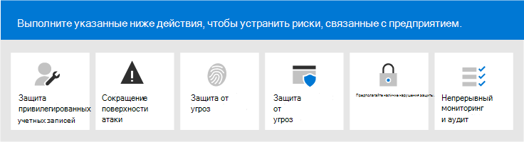

# Microsoft 365 Security for Business Decision Makers (BDM)

В этой статье обсуждаются некоторые из наиболее распространенных сценариев угроз и атак, с которыми в настоящее время сталкиваются организации в своих средах Microsoft 365, а также рекомендуемые действия для снижения этих рисков. Хотя Microsoft 365 поставляется с широким набором предварительно настроенных функций безопасности, он также требует, чтобы вы как клиент несете ответственность за защиту ваших удостоверений, данных и устройств, используемых для доступа к облачным службам. Это руководство было разработано Коретой Корета (Microsoft Cloud Security Architect) и ФрягараджОм Сундарайяном (старший консультант Майкрософт).

Эта статья организована по приоритету работы, начиная с защиты учетных записей, используемых для администрирования наиболее важных служб и активов, таких как клиент, электронная почта и SharePoint. Он предоставляет методический способ обеспечения безопасности и работает вместе со следующей таблицой, чтобы вы могли отслеживать ход выполнения с заинтересованными лицами и группами в организации: [безопасность Microsoft 365 для электронных таблиц BDM.](https://github.com/MicrosoftDocs/microsoft-365-docs/raw/public/microsoft-365/downloads/Microsoft-365-BDM-security-recommendations-spreadsheet.xlsx) 

Корпорация Майкрософт предоставляет вам средство оценки безопасности в клиенте для автоматического анализа состояния безопасности на основе ваших обычных действий, назначения оценки и предоставления рекомендаций по улучшению безопасности. Перед тем как принять меры, рекомендуемые в этой статье, заметьте текущую оценку и рекомендации. Действия, рекомендуемые в этой статье, увеличивают вашу оценку. Цель состоит не в достижении максимального результата, а в том, чтобы иметь возможность защитить среду таким образом, чтобы это не негативно повлияло на производительность пользователей. См. ["Оценка безопасности (Майкрософт)".](mtp/microsoft-secure-score.md)

Еще один момент перед началом работы. . . не забудьте [включить журнал аудита.](../compliance/search-the-audit-log-in-security-and-compliance.md) Эти данные потребуется позже, в случае, если вам потребуется исследовать инцидент или нарушение безопасности. 

## Защита привилегированных учетных записей

В качестве первого шага мы рекомендуем обеспечить для критически важных учетных записей в среде дополнительный уровень защиты, так как эти учетные записи имеют доступ и разрешения для управления и изменения критически важных служб и ресурсов, которые могут отрицательно сказаться на всей организации в случае компрометации. Защита привилегированных учетных записей — один из наиболее эффективных способов защиты от злоумышленника, который пытается повысить уровень разрешений скомпрометированной учетной записи до административного. 

|Рекомендация  |E3 |E5  |
|---------|---------|---------|
|Применять многофакторную проверку подлинности (MFA) для всех административных учетных записей.||| 
|Реализуем Azure Active Directory (Azure AD) Privileged Identity Management (PIM), чтобы применить к ресурсам Azure AD и Azure права на доступ к ресурсам Azure в срок. Вы также можете узнать, кто имеет доступ и просмотреть привилегированный доступ.|         | |
|Реализация управления привилегированным доступом для управления детализированной функцией управления доступом над привилегированными задачами администратора в Office 365. |         | |
|Настройка и использование рабочих станций privileged Access (PAW) для администрирования служб. Не используйте одинаковые рабочие станции для просмотра Интернета и проверки электронной почты, не связанной с вашей административной учетной записью.|  | | 

На следующей схеме эти возможности иллюстрируют эти возможности.

Дополнительные рекомендации:
- Убедитесь, что учетным записям, синхронизированным из локальной службы, не назначены роли администратора для облачных служб. Это помогает предотвратить использование злоумышленником локальной учетной записи для получения административного доступа к облачным службам. 
- Убедитесь, что учетным записям служб не назначены роли администратора. Эти учетные записи часто не отслеживаются и устанавливаются с паролями, срок действия которых не истекает. Начните с того, что учетные записи служб AADConnect и ADFS не являются глобальными администраторами по умолчанию.
- Удалите лицензии из учетных записей администраторов. Если для назначения лицензий определенным учетным записям администраторов не существует конкретного случая, удалите лицензии из этих учетных записей. 

## Уменьшение поверхности атаки

Следующая область фокуса — уменьшение поверхности атаки. Это можно сделать с минимальными усилиями и воздействием на пользователей и службы. Уменьшая зону атаки, злоумышленники имеют меньше способов для атаки на вашу организацию.

Ниже приводятся примеры:
- Отключать протоколы POP3, IMAP и SMTP. Большинство современных организаций больше не используют эти старые протоколы. Их можно безопасно отключить и разрешить исключения только при необходимости. 
- Уменьшите число глобальных администраторов в клиенте и сохраняем его до необходимого минимума. Это напрямую сокращает область атаки для всех облачных приложений. 
- Утихите серверы и приложения, которые больше не используются в вашей среде. 
- Реализуют процесс отключения и удаления учетных записей, которые больше не используются. 

## Защита от известных угроз

К известным угрозам относятся вредоносное ПО, скомпрометированная учетная запись и фишинг. Некоторые средства защиты от этих угроз можно быстро реализовать без прямого воздействия на пользователей, а для других требуется больше планирования и обучения пользователей. 

|Рекомендация  |E3  |E5  |
|---------|---------|---------|
|**Настройка многофакторной проверки** подлинности и использование рекомендуемых политик условного доступа, включая политики риска для входов. Корпорация Майкрософт рекомендует и протестировали набор политик, которые вместе защищают все облачные приложения, включая Office 365 и службы Microsoft 365. См. [конфигурации доступа к удостоверениям и устройствам.](./office-365-security/microsoft-365-policies-configurations.md) | ||
|**Требовать многофакторную проверку подлинности для всех пользователей.** Если у вас нет лицензий, необходимых для реализации рекомендуемых политик условного доступа, как минимум, требуется многофакторная проверка подлинности для всех пользователей.|||
|**Повышение уровня защиты от вредоносных программ в почте.** Среда Office 365 или Microsoft 365 включает защиту от вредоносных программ, но вы можете повысить эту защиту, блокируя вложения с типами файлов, которые обычно используются для защиты от вредоносных программ.|||
|**Защита электронной почты от целевых фишинговых атак.** Если вы настроили один или несколько пользовательских доменов для среды Office 365 или Microsoft 365, вы можете настроить целевую защиту от фишинга. Защита от фишинга , часть Защитника для Office 365, может помочь защитить вашу организацию от вредоносных фишинговых атак на основе фишинга на основе фишинга и других фишинговых атак. Если настраиваемый домен не настроен, это не требуется.| ||
|**Защита от атак программы-вымогателя в сообщениях электронной почты.** Программа-программа-вымогаатель отбирает доступ к вашим данным путем шифрования файлов или блокировки экранов компьютера. Затем он пытается вымогать деньги у пострадавших, запрашивая "выкуп", как правило, в виде майлипов, таких как "Жижий", в обмен на возврат доступа к вашим данным. Вы можете защититься от программ-вымогателей, создав одно или несколько правил потока почты для блокировки расширений файлов, которые обычно используются для программ-вымогателей, или для предупреждения пользователей, которые получают эти вложения по электронной почте.|||
|**Блокировать подключения из стран,** с которые вы не имеете дело. Создайте политику условного доступа Azure AD, чтобы заблокировать любые подключения из этих стран, фактически создав геосетевой брандмауэр вокруг клиента.| ||

На следующей схеме эти возможности иллюстрируют эти возможности.

## Защита от неизвестных угроз

После добавления дополнительной защиты к привилегированным учетным записям и защиты от известных атак переместите внимание на защиту от неизвестных угроз. Более полные и продвинутые злоумышленники используют инновационные и новые неизвестные методы для атак на организации. Благодаря большой телеметрии данных, собранных корпорацией Майкрософт свыше миллионов устройств, приложений и служб, мы можем выполнять Defender для Office 365 в Windows, Office 365 и Azure для предотвращения атак нулевого дня, использования сред песочниц и проверки действительности перед разрешением доступа к вашему контенту. 

|Рекомендация  |E3  |E5  |
|---------|---------|---------|
|**Настройка Microsoft Defender для Office 365:** * Безопасные вложения * Безопасные ссылки * ATP для SharePoint, OneDrive и Microsoft Teams * Защита от фишинга в Защитнике office 365|         | |
|**Настройка возможностей конечных точек** в Microsoft Defender: * Защитник Windows антивирусной программы  * Защита от эксплойтов   * Уменьшение поверхности атаки   * Аппаратная изоляция  * Управляемый доступ к папок     |         | |
|**Используйте Microsoft Cloud App Security для** обнаружения приложений SaaS и использования анализа поведения и обнаружения аномалий. |         | |

На следующей схеме эти возможности иллюстрируют эти возможности.

Дополнительные рекомендации:
- Защита каналов партнеров, таких как сообщения электронной почты с использованием TLS.
- Откройте федерацию Teams только для партнеров, с которые вы общаетесь.
- Не добавляйте в список запрещенных доменов отправителей, отдельных отправителей или исходных IPS, так как это позволяет им обходить проверки нежелательной почты и вредоносных программ. Обычно клиенты добавляют собственные принятые домены или ряд других доменов, где о проблемах с потоком электронной почты могли быть заданы в списке. Не добавляйте домены в список фильтрации нежелательной почты и подключений, так как это может обойти все проверки нежелательной почты. 
- Включить исходящие уведомления о нежелательной почте— включить уведомления о нежелательной почте для списка рассылки внутри службы справки или ИТ-администратора, чтобы сообщить, отправляет ли кто-либо из внутренних пользователей сообщения нежелательной почты извне. Это может быть индикатором компрометации учетной записи.
- Отключение удаленной powerShell для всех пользователей. Удаленная powerShell в основном используется администраторами для доступа к службам для административных целей или программного доступа к API. Мы рекомендуем отключить этот параметр для пользователей, не относиющихся к администратору, чтобы избежать перегрузок, если у них нет бизнес-требований для доступа к нему. 
- Заблокируют доступ к порталу управления Microsoft Azure для всех администраторов. Это можно сделать, создав правило условного доступа для блокировки всех пользователей, за исключением администраторов. 

## Предположим, что нарушение безопасности

Хотя Корпорация Майкрософт принимает все возможные меры для предотвращения угроз и атак, мы рекомендуем всегда работать в соответствии с подходом "Предполагать нарушение безопасности". Даже если злоумышленнику удалось влиться в среду, необходимо убедиться, что он не может выслать данные или данные удостоверений из среды. По этой причине рекомендуется обеспечить защиту от утечки конфиденциальных данных, таких как номера социального страхования, номера кредитных карт, дополнительные персональные данные и прочие конфиденциальные сведения на уровне организации. 

Подход "Предполагать нарушение безопасности" требует реализации сетевой стратегии нулевого доверия, что означает, что пользователи не являются полностью доверенными только потому, что они являются внутренними по сети. Вместо этого в рамках авторизации того, что могут делать пользователи, заданы наборы условий и при их с соблюдением применяются определенные средства контроля. Условия могут включать состояние устройства, доступ к приложению, выполняемые операции и риск для пользователей. Например, действие регистрации устройства всегда должно запускать проверку подлинности MFA, чтобы убедиться, что в среду не добавлены устройства с rouge. 

Стратегия сети с нулевой доверием также требует, чтобы вы знали, где хранятся ваши данные, и применяли соответствующие элементы управления для классификации, защиты и хранения. Для эффективной защиты наиболее важных и конфиденциальных активов необходимо сначала определить их местонахождение и провести инвентаризацию, что может быть сложной задачей. Затем определите стратегию управления вместе с организацией. Определение схемы классификации для организации и настройка политик, меток и условий требует тщательного планирования и подготовки. Важно понимать, что это не ИТ-процесс. При разработке соответствующей схемы классификации и маркировки для данных вашей организации обязательно поработайте с юридическим обеспечением и соответствием требованиям.

Возможности защиты информации Microsoft 365 помогут вам узнать, какие сведения у вас есть, где они хранятся и какие сведения требуют дополнительной защиты. Защита информации — это непрерывный процесс, а возможности Microsoft 365 обеспечивают наглядность использования и распространения конфиденциальной информации, места хранения вашей информации и ее потоков. Кроме того, вы можете увидеть, как пользователи, которые будут обрабатывать информацию, которая регулируется, чтобы убедиться, что применяются соответствующие метки и меры защиты.

|Рекомендация |E3|E5 |
|---------|---------|---------|
|**Просмотрите и оптимизируйте условный доступ** и связанные политики в соответствие с вашими целями для сети с нулевой доверием. Защита от известных угроз включает реализацию набора [рекомендуемых политик.](./office-365-security/microsoft-365-policies-configurations.md) Просмотрите реализацию этих политик, чтобы убедиться, что вы защищаете свои приложения и данные от злоумышленников, которые получили доступ к вашей сети. Обратите внимание, что рекомендуемая политика защиты приложений Intune для Windows 10 включает Windows Information Protection (WIP). WIP защищает от случайных утечек данных организации через приложения и службы, такие как электронная почта, социальные сети и общедоступные облака. |         ||
|**Отключать внешнюю переадружение электронной почты.** Злоумышленники, которые получают доступ к почтовому ящику пользователя, могут украсть вашу почту, написав в почтовом ящике параметр автоматической пересылки электронной почты. Это может произойти даже без информирования пользователя. Это можно предотвратить, настроив правило потока почты.| ||
|**Отключить анонимный общий доступ к внешнему календарю.** По умолчанию разрешен внешний анонимный общий доступ к календарю. [Отключать общий доступ к календарю,](https://docs.microsoft.com/exchange/sharing/sharing-policies/modify-a-sharing-policy) чтобы уменьшить потенциальные утечки конфиденциальной информации.| ||
|**Настройте политики защиты от потери данных для конфиденциальных данных.** Создайте политику защиты от потери данных в Центре соответствия требованиям безопасности для обнаружения и защиты конфиденциальных данных, таких как номера кредитных карт, номеров социального страхования и &amp; банковских счетов. Microsoft 365 включает множество предопределяемых типов конфиденциальной информации, которые можно использовать в политиках защиты от потери данных. Вы также можете создавать собственные типы конфиденциальной информации для конфиденциальных данных, настраиваемые для вашей среды. |||
|**Реализация политик классификации данных и защиты информации.** Внедрить метки конфиденциальности и использовать их для классификации и применения защиты к конфиденциальным данным. Эти метки также можно использовать в политиках защиты от потери данных. Если вы используете метки Azure Information Protection, рекомендуем избегать создания новых меток в других центрах администрирования.|         ||
|**Защита данных в сторонних приложениях** и службах с помощью Cloud App Security. Настройте политики Cloud App Security для защиты конфиденциальной информации в сторонних облачных приложениях, таких как Salesforce, Box или Dropbox. Вы можете использовать типы конфиденциальной информации и метки конфиденциальности, созданные в политиках Cloud App Security, и применять их к приложениям SaaS.   Microsoft Cloud App Security позволяет применять широкий спектр автоматизированных процессов. Политики можно настроить для обеспечения непрерывной проверки соответствия требованиям, юридических задач по обнаружению электронных данных, DLP для конфиденциального содержимого, к доступу к который открыт общий доступ, и многого другое. Cloud App Security может отслеживать любой тип файлов на основе более чем 20 фильтров метаданных (например, уровень доступа, тип файла). |         ||
|**Используйте [Microsoft Defender для конечной точки,](https://docs.microsoft.com/windows/security/threat-protection/microsoft-defender-atp/information-protection-in-windows-overview) чтобы определить, хранят ли пользователи конфиденциальную информацию на своих устройствах с Windows.** |         ||
|**Используйте [сканер AIP для](https://docs.microsoft.com/azure/information-protection/deploy-aip-scanner) идентификации и классификации информации между серверами и файлами.** Используйте средство отчетов AIP, чтобы просмотреть результаты и принять соответствующие меры.|         ||

На следующей схеме эти возможности иллюстрируют эти возможности.

## Непрерывный мониторинг и аудит

Последний, но не менее непрерывный мониторинг и аудит среды Microsoft 365 наряду с Windows и устройствами критически важны для быстрого обнаружения и устранения любых вторжений. Такие средства, как "Оценка безопасности", "Центр безопасности" и расширенные аналитические данные Microsoft Intelligent Graph, предоставляют ценные сведения в клиенте и связывают большие объемы данных аналитики угроз и безопасности для обеспечения надежной защиты и обнаружения угроз.

|Рекомендация |E3 |E5 |
|---------|---------|---------|
|**Убедитесь, что журнал аудита** включен.|||
|**Еженедельно проверяйте** оценку безопасности . Оценка безопасности — это центральное место для доступа к статусу безопасности вашей компании и действий, основанных на рекомендациях по оценке безопасности. Рекомендуется выполнять эту проверку еженедельно.|||
|Используйте **Microsoft Defender для средств Office 365:** * Возможности исследования угроз и реагирования на них  * Автоматизированное исследование и реагирование на них |         ||
|Использование **Microsoft Defender для конечной точки:**  *    [Обнаружение конечных точек и реагирование на них](https://docs.microsoft.com/windows/security/threat-protection/microsoft-defender-atp/overview-endpoint-detection-response)   * Автоматизированное исследование и оценка безопасности для исправлений  *    [Расширенный поиск](https://docs.microsoft.com/windows/security/threat-protection/microsoft-defender-atp/advanced-hunting-overview)  |         ||
|Используйте **Microsoft Cloud App Security,** чтобы обнаруживать необычные действия в облачных приложениях, чтобы выявлять программы-вымогателя, скомпрометировать пользователей или мошеннические приложения, анализировать использование с высоким уровнем риска и автоматически устранять их, чтобы ограничить риск для вашей организации.|         ||
|Используйте **Microsoft Azure Sentinel** или текущее средство SIEM для отслеживания угроз в вашей среде. |         ||
|**Развертывание [Microsoft Defender для удостоверений](https://docs.microsoft.com/azure-advanced-threat-protection/what-is-atp)** для отслеживания и защиты от угроз, нацеленных на вашу локальной среде Active Directory.   |         | |
|Используйте **Azure Defender** _ для отслеживания угроз в гибридных и облачных рабочих нагрузках. Azure Defender_ включает бесплатный уровень возможностей и стандартный уровень возможностей, которые оплачиваются на основе часов ресурсов или транзакций.|         |         |

На следующей схеме эти возможности иллюстрируют эти возможности.

Рекомендуемые действия мониторинга:
- **Еженедельно проверяйте** оценку безопасности (Майкрософт). Оценка безопасности — это центральное расположение для доступа к состоянии безопасности вашего клиента и для нахождения действий на основе рекомендаций. Рекомендуется выполнять эту проверку еженедельно. Оценка безопасности включает рекомендации в Azure AD, Intune, Cloud App Security и Microsoft Defender для конечной точки, а также Office 365. 
- **Еженедельно проверять рискованные входы** в систему с помощью Центра администрирования Azure AD для еженедельной проверки рискованных входов. Рекомендуемый список правил доступа к удостоверениям и устройствам включает политику для принудительного изменения паролей при рискованных входах.  
- Еженедельно проверяют наиболее частое вредоносное ПО и фишинговых **пользователей.** Используйте Microsoft Defender для обозревателя угроз Office 365, чтобы просмотреть самых часто захотений и фишинговых пользователей, а также выяснить их причину.
