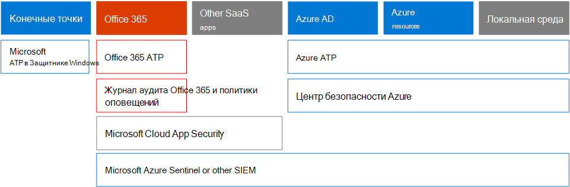

# Microsoft 365 Security для лиц, принимающих решения в Организации (вариантах развертывания)Microsoft 365 Security for Business Decision Makers (BDMs)

В этой статье описываются некоторые из наиболее распространенных сценариев угроз и атак, которые в настоящее время встречаются в организациях для своих сред Microsoft 365, а также Рекомендуемые действия по устранению этих рисков.This article discusses some of the most common threat and attack scenarios currently faced by organizations for their Microsoft 365 environments, and recommended actions for mitigating these risks. Несмотря на то что Microsoft 365 поставляется с широким набором предварительно настроенных функций безопасности, он также требует от пользователя ответственности за обеспечение безопасности собственных удостоверений, данных и устройств, используемых для доступа к облачным службам.While Microsoft 365 comes with a wide array of pre-configured security features, it also requires you as the customer to take responsibility to secure your own identities, data, and devices used to access cloud services. Это руководство было создано с помощью Козетаной системы безопасности (архитектор Microsoft Cloud Cloud архитектора) и Сиагараж Сундараражан (старший консультант Майкрософт).This guidance was developed by Kozeta Beam (Microsoft Cloud Security Architect) and Thiagaraj Sundararajan (Microsoft Senior Consultant).

Эта статья упорядочена по приоритету работы, начиная с защиты учетных записей, используемых для администрирования самых важных служб и ресурсов, таких как клиент, электронная почта и SharePoint.This article is organized by priority of work, starting with protecting those accounts used to administer the most critical services and assets, such as your tenant, e-mail, and SharePoint. Он предоставляет методичному способ для обеспечения безопасности и работает вместе со следующей таблицей, чтобы можно было отслеживать ход выполнения в рамках своей организации с помощью заинтересованных лиц и teams: [Microsoft 365 Security for вариантах развертывания электронной таблицы](https://github.com/MicrosoftDocs/microsoft-365-docs/raw/public/microsoft-365/downloads/Microsoft-365-BDM-security-recommendations-spreadsheet.xlsx).It  provides a methodical way for approaching security and works together with the following spreadsheet so you can track your progress with stakeholders and teams across your organization: [Microsoft 365 security for BDMs spreadsheet](https://github.com/MicrosoftDocs/microsoft-365-docs/raw/public/microsoft-365/downloads/Microsoft-365-BDM-security-recommendations-spreadsheet.xlsx). 

Корпорация Майкрософт предоставляет вам средство безопасного оценки в рамках клиента для автоматического анализа уровня безопасности на основе регулярных действий, назначения оценки и предоставления рекомендаций по улучшению безопасности.Microsoft provides you with the Secure Score tool within your tenant to automatically analyze your security posture based on your regular activities, assign a score, and provide security improvement recommendations. Прежде чем приступать к действиям, рекомендуемым в этой статье, запишите текущие оценки и рекомендации.Before taking the actions recommended in this article, take note of your current score and recommendations. Рекомендуемые действия, описанные в этой статье, увеличивают рейтинг.The actions recommended in this article will increase your score. Цель не допустить максимальной оценки, но знать о возможностях защиты среды не так, чтобы они не влияли на производительность ваших пользователей.The goal is not to achieve the max score, but to be aware of opportunities to protect your environment in a way that do not negatively affect productivity for your users. Просмотр [оценки безопасности Майкрософт](mtp/microsoft-secure-score.md).See [Microsoft Secure Score](mtp/microsoft-secure-score.md).

Еще одну вещь, прежде чем начать работу.One more thing before we get started . .. .. обязательно [включите журнал аудита Office 365](../compliance/search-the-audit-log-in-security-and-compliance.md).be sure to [turn on the Office 365 audit log](../compliance/search-the-audit-log-in-security-and-compliance.md). Эти данные понадобятся позже, в случае необходимости изучения инцидента или нарушения.You’ll need this data later, in the event you need to investigate an incident or a breach. 

## Защита привилегированных учетных записейProtect privileged accounts

На первом этапе мы рекомендуем гарантировать, что критические учетные записи в среде получают дополнительный уровень защиты, так как эти учетные записи имеют доступ и разрешения на управление и изменение критически важных служб и ресурсов, которые могут негативно повлиять на всю организацию. Если она скомпрометирована.As a first step, we recommend ensuring critical accounts in the environment are given an extra layer of protection as these accounts have access and permissions to manage and alter critical services and resources which can negatively impact the entire organization, if compromised. Защита привилегированных учетных записей является одним из наиболее эффективных способов защиты от злоумышленника, пытающегося повысить уровень разрешений скомпрометированной учетной записи до администратора.Protecting privileged accounts is one of the most effective ways to protect against an attacker who seeks to elevate the permissions of a compromised account to an administrative one. 

|РекомендацияRecommendation  |E3E3 |E5E5  |
|---------|---------|---------|
|Применение многофакторной проверки подлинности (MFA) для всех учетных записей администраторов.Enforce multi-factor authentication (MFA) for all administrative accounts.||| 
|Реализуйте управление привилегированными удостоверениями Azure Active Directory (Azure AD), чтобы применить привилегированный доступ к ресурсам Azure AD и Azure.Implement Azure Active Directory (Azure AD) Privileged Identity Management (PIM) to apply just-in-time privileged access to Azure AD and Azure resources. Вы также можете узнать, у кого есть доступ, и проверить привилегированный доступ.You can also discover who has access and review privileged access.|         | |
|Реализуйте управление привилегированным доступом в Office 365 для управления детализированным доступом к задачам привилегированного администрирования в Office 365.Implement privileged access management in Office 365 to manage granular access control over privileged admin tasks in Office 365. |         | |
|Настройка и использование привилегированных рабочих станций доступа (PAW) для управления службами.Configure and use Privileged Access Workstations (PAW) to administer services. Не используйте одни рабочие станции для просмотра Интернета и проверки электронной почты, не связанной с учетной записью администратора.Do not use the same workstations for browsing the Internet and checking email not related to your administrative account.|  | | 

Эти возможности показаны на следующей схеме.The following diagram illustrates these capabilities.

Дополнительные рекомендации:Additional recommendations:
- Убедитесь, что учетные записи, синхронизированные из локальной службы, не назначены ролям администратора для облачных служб.Ensure accounts that are synchronized from on-premises are not assigned admin roles for cloud services. Это помогает предотвратить использование локальных учетных записей злоумышленниками для получения административного доступа к облачным службам.This helps prevent an attacker from leveraging on-premises accounts to gain administrative access to cloud services. 
- Убедитесь, что учетным записям служб не назначены роли администратора.Ensure service accounts are not assigned admin roles. Эти учетные записи часто не отслеживаются и не устанавливаются с использованием паролей, срок действия которых не ограничен.These accounts are often not monitored and set with passwords that do not expire. Для начала убедитесь, что учетные записи служб AADConnect и ADFS не являются глобальными администраторами по умолчанию.Start by ensuring the AADConnect and ADFS services accounts are not Global Admins by default.
- Удаление лицензий из учетных записей администраторов.Remove licenses from admin accounts. Если нет определенного варианта использования для назначения лицензий определенным учетным записям администраторов, удалите лицензии из этих учетных записей.Unless there is a specific use case to assign licenses to specific admin accounts, remove licenses from these accounts. 

## Сокращение поверхности атакиReduce the surface of attack

Следующая область фокуса уменьшает область атаки.The next focus area is reducing the surface of attack. Это может быть выполнено с минимальными усилиями и влиянием на пользователей и службы.This can be accomplished with minimal effort and impact to your users and services. Благодаря снижению контактной зоны атаке злоумышленники имеют меньше способов запустить атаку в Организации.By reducing the surface area of attack, attackers have fewer ways to launch an attack against your organization.

Ниже приводятся примеры:Here are some examples:
- Отключите протоколы POP3, IMAP и SMTP.Disable POP3, IMAP, and SMTP protocols. Большинство современных организаций больше не используют устаревшие протоколы.Most modern organizations no longer use these older protocols. Вы можете безопасно отключить эти и разрешить исключения только по мере необходимости.You can safely disable these and allow exceptions only as needed. 
- Сократите и сохраните число глобальных администраторов в клиенте до минимального минимального необходимого значения.Reduce and keep the number of Global Admins in the tenant to the absolute minimum required. Это позволяет немедленно уменьшить контактную зону для всех облачных приложений.This directly reduces the surface area of attack for all Cloud applications. 
- Выснятие с учета серверов и приложений, которые больше не используются в вашей среде.Retire servers and applications that are no longer used in your environment. 
- Реализуйте процесс отключения и удаления учетных записей, которые больше не используются.Implement a process for disabling and deleting accounts that are no longer used. 

## Защита от известных угрозProtect against known threats

Известные угрозы включают вредоносные программы, скомпрометированные учетные записи и фишинг.Known threats include malware, compromised accounts, and phishing. Некоторые средства защиты от этих угроз можно быстро реализовать без прямого воздействия на пользователей, в то время как другие требуют больше планирования и обучения пользователей.Some protections against these threats can be implemented quickly with no direct impact to your users, while others require more planning and user training. 

|РекомендацияRecommendation  |E3E3  |E5E5  |
|---------|---------|---------|
|**Настройка многофакторной проверки подлинности и использование рекомендуемых политик условного доступа, в том числе политик риска входа**.**Setup multi-factor authentication and use recommended conditional access policies, including sign-in risk policies**. Корпорация Майкрософт рекомендует и проверила набор политик, которые совместно работают для защиты всех облачных приложений, в том числе Office 365 и Microsoft 365 Services.Microsoft recommends and has tested a set of policies that work together to protect all cloud apps, including Office 365 and Microsoft 365 services. Просмотр [конфигураций доступа для удостоверений и устройств](../enterprise/microsoft-365-policies-configurations.md).See [Identity and device access configurations](../enterprise/microsoft-365-policies-configurations.md). | ||
|**Требовать многофакторную проверку подлинности для всех пользователей**.**Require multi-factor authentication for all users**. Если у вас нет лицензирования, необходимого для реализации рекомендуемых политик условного доступа, по меньшей мере требуется многофакторная проверка подлинности для всех пользователей.If you don’t have the licensing required to implement the recommended conditional access policies, at a minimum require multi-factor authentication for all users.|||
|**Повышение уровня защиты от вредоносных программ в почте**.**Raise the level of protection against malware in mail**. Ваша среда Office 365 или Microsoft 365 включает защиту от вредоносных программ, но вы можете повысить эту защиту, блокируя вложения с типами файлов, которые часто используются для вредоносных программ.Your Office 365 or Microsoft 365 environment includes protection against malware, but you can increase this protection by blocking attachments with file types that are commonly used for malware.|||
|**Защитите электронную почту от целевых фишинговых атак**.**Protect your email from targeted phishing attacks**. Если вы настроили один или несколько пользовательских доменов для вашей среды Office 365 или Microsoft 365, вы можете настроить эту антифишинговую защиту.If you've configured one or more custom domains for your Office 365 or Microsoft 365 environment, you can configure targeted anti-phishing protection. Функция защиты от фишинга ATP, которая входит в состав Office 365 Advanced Threat Protection, поможет защитить организацию от атак фишинга и других фишинговых атак на основе олицетворения злоумышленников.ATP anti-phishing protection, part of Office 365 Advanced Threat Protection, can help protect your organization from malicious impersonation-based phishing attacks and other phishing attacks. Если вы еще не настроили личный домен, это не требуется.If you haven't configured a custom domain, you do not need to do this.| ||
|**Защита от атак программой "почта" в сообщении электронной почты**.**Protect against ransomware attacks in email**. Отменяет доступ к данным с помощью шифрования файлов или блокировки экранов компьютера.Ransomware takes away access to your data by encrypting files or locking computer screens. Затем он предпринимает попытку ексторт денег от жертв, запросив "Рансом", как правило, в виде криптокурренЦиес, например биткоин, в Exchange для возвращения доступа к данным.It then attempts to extort money from victims by asking for "ransom," usually in form of cryptocurrencies like Bitcoin, in exchange for returning access to your data. Можно защититься от атаки с помощью атаки путем создания одного или нескольких правил обработки почты, чтобы заблокировать расширения файлов, которые обычно используются для атаки программой «почта», или предупредить пользователей, которые получают эти вложения, в электронном письме.You can help defend against ransomware by creating one or more mail flow rules to block file extensions that are commonly used for ransomware, or to warn users who receive these attachments in email.|||
|**Блокировать подключения из стран, с которыми вы не работают**.**Block connections from countries that you don’t do business with**. Создайте политику условного доступа Azure AD, чтобы заблокировать все подключения, поступающие из этих стран, с помощью эффективного создания географического брандмауэра для клиента.Create an Azure AD conditional access policy to block any connections coming from these countries, effectively creating a geo firewall around your tenant.| ||

Эти возможности показаны на следующей схеме.The following diagram illustrates these capabilities.

## Защита от неизвестных угрозProtect against unknown threats

Добавив дополнительные меры защиты к привилегированным учетным записям и защищая их от известных атак, вы перемещаете внимание на защиту от неизвестных угроз.After adding extra protections to your privileged accounts and protecting against known attacks, shift your attention to protecting against unknown threats. Чем определено и расширено адверсариес использовать инновационные и новые неизвестные методы для атак организаций.The more determined and advanced adversaries use innovative and new, unknown methods to attack organizations. Благодаря обширной телеметрии данных корпорации Майкрософт, собранных на основе миллиардов устройств, приложений и служб, мы можем выполнить расширенную защиту от угроз для Windows, Office 365 и Azure, чтобы предотвратить атаки с нулевым сроком действия, используя среды Санд и Проверка допустимости перед предоставлением доступа к контенту.With Microsoft’s vast telemetry of data gathered over billions of devices, applications, and services, we are able to perform Advanced Threat Protection on Windows, Office 365, and Azure to prevent against Zero Day attacks, utilizing sand box environments, and checking validity before allowing access to your content. 

|РекомендацияRecommendation  |E3E3  |E5E5  |
|---------|---------|---------|
|**Настройка Office 365 Advanced Threat protection (ATP)**:**Configure Office 365 Advanced Threat Protection (ATP)**: • Безопасные вложения ATP•    ATP Safe Attachments • Безопасные ссылки ATP•   ATP Safe Links • ATP для SharePoint, OneDrive и Microsoft Teams• ATP for SharePoint, OneDrive, and Microsoft Teams • Защита от фишинга ATP•  ATP anti-phishing protection|         | |
|**Настройка функций Advanced Threat Protection в защитнике Майкрософт**:**Configure Microsoft Defender Advanced Threat Protection capabilities**: • Антивирусная программа "Защитник Windows"• Windows Defender Antivirus  • Защита от эксплойтов•    Exploit protection   • Сокращение уязвимой зоны•   Attack surface reduction   • Изоляция на основе оборудования• Hardware-based isolation  • Контролируемый доступ к папкам•  Controlled folder access     |         | |
|**Используйте Microsoft Cloud App Security** для обнаружения приложений SaaS и начните использовать анализ поведения и обнаружение аномалий.**Use Microsoft Cloud App Security** to discover SaaS apps and begin to use behavior analytics and anomaly detection. |         | |

Эти возможности показаны на следующей схеме.The following diagram illustrates these capabilities.

Дополнительные рекомендации:Additional recommendations:
- Обеспечение безопасности канала связи в виде электронных сообщений с помощью протокола TLS.Secure partner channel communications like Emails using TLS.
- Откройте Федерацию Teams только для партнеров, с которыми вы обмениваетесь данными.Open Teams Federation only to Partners you communicate with.
- Не белом домены отправителей, отдельные отправители или исходные IP-адреса, так как это позволяет обходить проверки нежелательной почты и вредоносных программ — общедоступные клиенты вхителистинг свои собственные обслуживаемые домены или другие домены, в которых могут возникнуть проблемы с нагрузкой электронной почты. регистрируют.Do not whitelist sender domains, individual senders, or source IPs as this allows these to bypass spam and malware checks — A common practice with customers is whitelisting their own accepted domains or a number of other domains where email flow issues may have been reported. Не добавляйте домены в список фильтров нежелательной почты и подключений, так как они могут обходить все проверки нежелательной почты.Do not add domains in the Spam and Connection Filtering list as this potentially bypasses all spam checks. 
- Включите уведомления об исходящих сообщениях о нежелательной почте — включите уведомления об исходящих сообщениях нежелательной почты в список рассылки, чтобы сообщить о том, что любой из внутренних пользователей отправляет нежелательную почту извне.Enable outbound spam notifications — Enable outbound spam notifications to a distribution list internally to the Helpdesk or IT Admin team to report if any of the internal users are sending out Spam emails externally. Это может быть индикатором того, что учетная запись была скомпрометирована.This could be an indicator that the account has been compromised.
- Отключить удаленную оболочку PowerShell для всех пользователей — удаленная оболочка PowerShell в основном используется администраторами для доступа к службам Office 365 для административных целей или доступа к программным API.Disable Remote PowerShell for all users — Remote PowerShell is mainly used by Admins to access Office 365 services for administrative purposes or programmatic API access. Мы рекомендуем отключить этот параметр для пользователей, не являющихся администраторами, чтобы избежать реконнаиссанце, если у них нет бизнес-требований для доступа к нему.We recommended disabling this option for non-Admin users to avoid reconnaissance unless they have a business requirement to access it. 
- Заблокируйте доступ к порталу управления Microsoft Azure для всех, не являющихся администраторами.Block access to the Microsoft Azure Management portal to all non-administrators. Это можно сделать, создав правило условного доступа, чтобы заблокировать всех пользователей, за исключением администраторов.You can accomplish this by creating a conditional access rule to block all users, with the exception of admins. 

## Считать нарушениеAssume breach

Несмотря на то, что корпорация Майкрософт принимает все возможные меры по предотвращению угроз и атак, мы рекомендуем всегда работать в соответствии с размышлениям "нарушение безопасности".While Microsoft takes every possible measure to prevent against threats and attacks, we recommend always working under the “Assume Breach” mindset. Даже если злоумышленнику удается получить доступ к среде, необходимо убедиться, что они не могут ексфилтрате данные или идентификационные данные из среды.Even if an Attacker has managed to intrude into the environment, we need to make sure they are unable to exfiltrate data or identity information from the environment. По этой причине мы рекомендуем включать защиту от потерь конфиденциальных данных, таких как номера социального страхования, номера кредитных карт, дополнительные персональные данные и другие конфиденциальные сведения об уровне Организации.For this reason, we recommend enabling protection against sensitive data leaks such as Social Security numbers, credit cards numbers, additional personal information, and other organizational level confidential information. 

Для установки "нарушение безопасности" требуется реализация стратегии сети с нулевым доверием, то есть пользователи не являются полностью доверенными только потому, что они являются внутренними по отношению к сети.The “Assume Breach” mindset requires implementing a zero trust network strategy, which means users are not fully trusted just because they are internal to the network. Вместо этого в рамках авторизации действий, которые могут выполнять пользователи, задаются наборы условий, а при выполнении таких условий применяются определенные элементы управления.Instead, as part of authorization of what users can do, sets of conditions are specified, and when such conditions are met, certain controls are enforced. Условия могут включать состояние работоспособности устройства, доступное приложение, выполняемые операции и риск для пользователей.Conditions may include device health status, application being accessed, operations being performed and user risk. Например, действие регистрации устройства всегда должно запускать проверку подлинности MFA, чтобы не допустить добавления устройств рауже в среду.For example, a device enrollment action should always trigger MFA authentication to ensure no rouge devices are added to your environment. 

Стратегия сети с нулевым доверием также требует, чтобы вы знали, где хранятся ваши данные, и применяет соответствующие элементы управления для классификации, защиты и хранения.A zero trust network strategy also requires that you know where your information is stored and apply appropriate controls for classification, protection, and retention. Чтобы эффективно защитить наиболее важные и конфиденциальные ресурсы, необходимо сначала определить, где они находятся, и принять участие в инвентаризации, что может быть непростой задачей.To effectively protect your most critical and sensitive assets you need to first identify where these are located and take inventory, which can be challenging. После этого работайте с Организацией, чтобы определить стратегию управления.Next, work with your organization to define a governance strategy. Определение схемы классификации для Организации и Настройка политик, меток и условий требует тщательного планирования и подготовки.Defining a classification schema for an organization and configuring policies, labels, and conditions requires careful planning and preparation. Важно понимать, что это не процесс, управляемый ИТ-процессом.It is important to realize that this is not an IT driven process. Обязательно работайте с юридическими и юридическими командами, чтобы разработать соответствующую классификацию и схему маркировки для данных вашей организации.Be sure to work with your legal and compliance team to develop an appropriate classification and labeling schema for your organization’s data.

Microsoft 365 Information Protection поможет вам определить, какая информация у вас есть, где она хранится, и какую информацию требует дополнительная защита.Microsoft 365 information protection capabilities can help you discover what information you have, where it is stored, and which information requires additional protection. Информационная защита — непрерывный процесс, а возможности Microsoft 365 предоставляют представление о том, как пользователи используют и отправляют конфиденциальную информацию, в которой в настоящее время хранятся данные, и где они передаются.Information protection is a continuous process and Microsoft 365 capabilities provide you with visibility into how users are using and distributing sensitive information, where your information is currently stored, and where it flows. Вы также можете узнать, как пользователи обрабатывают данные, поднадзорные, чтобы убедиться, что применяются соответствующие метки и системы защиты.You can also see how users handling information that is regulated to be sure the appropriate labels and protections are applied.

|РекомендацияRecommendation |E3E3|E5E5 |
|---------|---------|---------|
|**Проверьте и оптимизируйте условный доступ и связанные с ними политики, чтобы они соответствовали целям для сети с нулевым доверием**.**Review and optimize your conditional access and related policies to align with your objectives for a zero trust network**. Защита от известных угроз включает реализацию набора [рекомендуемых политик](../enterprise/microsoft-365-policies-configurations.md).Protecting against known threats includes implementing a set of [recommended policies](../enterprise/microsoft-365-policies-configurations.md). Изучите реализацию этих политик, чтобы убедиться, что ваши приложения и данные защищены от хакеров, получивших доступ к вашей сети.Review your implementation of these policies to ensure you’re protecting your apps and data against hackers who have gained access to your network. Обратите внимание, что рекомендуемая политика защиты приложений Intune для Windows 10 включает Windows Information Protection (WIP).Note that the recommended Intune app protection policy for Windows 10 enables Windows Information Protection (WIP). НЗП обеспечивает защиту от случайных потерь данных Организации с помощью приложений и служб, таких как электронная почта, социальные сети и общедоступное облако.WIP protects against accidental leaks of your organization data through apps and services, like email, social media, and the public cloud. |         ||
|**Отключить внешнюю переадресацию электронной почты**.**Disable external email forwarding**. Хакеры, которые получают доступ к почтовому ящику пользователя, могут украсть свою почту, настроив почтовый ящик на автоматическую пересылку электронной почты.Hackers who gain access to a user's mailbox can steal your mail by setting the mailbox to automatically forward email. Это может произойти даже без информирования пользователя.This can happen even without the user's awareness. Вы можете предотвратить возникновение этой ситуации, настроив правило для процесса обработки почты.You can prevent this from happening by configuring a mail flow rule.| ||
|**Отключить общий доступ к анонимному внешнему календарю**.**Disable anonymous external calendar sharing**. По умолчанию разрешен общий доступ к внешним анонимным календарям.By default external anonymous calendar sharing is allowed. [Запретите общий доступ к календарю](https://docs.microsoft.com/exchange/sharing/sharing-policies/modify-a-sharing-policy) , чтобы снизить вероятность потери конфиденциальной информации.[Disable calendar sharing](https://docs.microsoft.com/exchange/sharing/sharing-policies/modify-a-sharing-policy) to reduce potential leaks of sensitive information.| ||
|**Настройка политик защиты от потери данных для конфиденциальных данных**.**Configure data loss prevention policies for sensitive data**. Создайте политику защиты от потери данных в центре безопасности и соответствия требованиям Office 365 для обнаружения и защиты конфиденциальных данных, таких как номера кредитных карт, номера социального страхования и номера банковских счетов.Create a Data Loss Prevention Policy in the Office 365 Security and Compliance center to discover and protect sensitive data such as credit card numbers, Social Security numbers and bank account numbers. Office 365 включает множество предопределенных типов конфиденциальной информации, которые можно использовать в политиках защиты от потери данных.Office 365 includes many predefined sensitive information types you can use in data loss prevention policies. Вы также можете создавать собственные типы конфиденциальной информации для конфиденциальных данных, которые являются настраиваемыми для вашей среды.You can also create your own sensitive information types for sensitive data that is custom to your environment. |||
|**Реализуйте политики классификации данных и защиты информации**.**Implement data classification and information protection policies**. Реализуйте метки конфиденциальности в Office 365 и используйте их для классификации и применения защиты к конфиденциальным данным.Implement sensitivity labels in Office 365 and use these to classify and apply protection to sensitive data. Вы также можете использовать эти метки в политиках защиты от потери данных.You can also use these labels in data loss prevention policies. Если вы используете метки Azure Information Protection, рекомендуем не создавать новые метки в других центрах администрирования.If you are using Azure Information Protection labels, we recommend that you avoid creating new labels in other admin centers.|         ||
|**Защита данных в сторонних приложениях и службах с помощью Cloud App Security**.**Protect data in third-party apps and services by using Cloud App Security**. Настройте политики Cloud App Security для защиты конфиденциальной информации среди сторонних облачных приложений, таких как Salesforce, Box или Dropbox.Configure Cloud App Security policies to protect sensitive information across third-party cloud apps, such as Salesforce, Box, or Dropbox. Вы можете использовать типы конфиденциальной информации и метки конфиденциальности, созданные в Office 365, в политиках Cloud App Security и применять их к своим приложениям SaaS.You can use sensitive information types and the sensitivity labels you created in Office 365 in Cloud App Security policies and apply these across your SaaS apps.   Microsoft Cloud App Security позволяет применять широкий спектр автоматизированных процессов.Microsoft Cloud App Security allow you to enforce a wide range of automated processes. Политики можно настроить для обеспечения непрерывных проверок соответствия требованиям, юридических задач обнаружения электронных данных, DLP для конфиденциального контента, доступного общедоступного и т. д.Policies can be set to provide continuous compliance scans, legal eDiscovery tasks, DLP for sensitive content shared publicly, and more. Cloud App Security может отслеживать любой тип файлов на основе более 20 фильтров метаданных (например, уровень доступа, тип файла).Cloud App Security can monitor any file type based on more than 20 metadata filters (for example, access level, file type). |         ||
|**Используйте [пакет ATP для защитника Майкрософт](https://docs.microsoft.com/windows/security/threat-protection/microsoft-defender-atp/information-protection-in-windows-overview) , чтобы определить, хранят ли пользователи конфиденциальные данные на своих устройствах Windows**.**Use [Microsoft Defender ATP](https://docs.microsoft.com/windows/security/threat-protection/microsoft-defender-atp/information-protection-in-windows-overview) to identify if users store sensitive information on their Windows devices**. |         ||
|**Использование [сканера административной](https://docs.microsoft.com/azure/information-protection/deploy-aip-scanner) установки для определения и классификации данных на серверах и общих файловых ресурсах**.**Use [AIP Scanner](https://docs.microsoft.com/azure/information-protection/deploy-aip-scanner) to identify and classify information across servers and file shares**. Используйте средство создания отчетов точка административной установки для просмотра результатов и выполнения соответствующих действий.Use the AIP reporting tool to view the results and take appropriate actions.|         ||

Эти возможности показаны на следующей схеме.The following diagram illustrates these capabilities.

## Непрерывный мониторинг и аудитContinuous monitoring and auditing

Последний, но не самый минимум постоянный мониторинг и Аудит среды Microsoft 365 вместе с окнами и устройствами очень важно, чтобы убедиться в том, что вы можете быстро обнаруживать и устранять любые вторжения.Last, but not least Continuous Monitoring and Auditing of the Microsoft 365 environment along with the Windows and Devices is critical to making sure you are able to quickly detect and remediate any intrusions. Такие средства, как "Оценка безопасности", "Центр безопасности" и "интеллектуальный анализ интеллектуального анализа Microsoft интеллектуального анализа" содержат неважную информацию о клиенте и связывают значительные объемы данных системы защиты от угроз и безопасности для обеспечения непараллельной защиты от угроз и обнаружение.Tools such as Secure Score, Security Center, and Microsoft Intelligent Graph’s advanced analytics provide invaluable information into your tenant and link massive amounts of threat intelligence and security data to provide you unparalleled threat protection and detection.

|РекомендацияRecommendation |E3E3 |E5E5 |
|---------|---------|---------|
|Убедитесь, что **журнал аудита Office 365** включен.Ensure the **Office 365 audit log** is turned on.|||
|Проанализируйте контрольный **рейтинг еженедельно** — надежный показатель — это центральное расположение для доступа к состоянию безопасности клиента Office 365 и выполнения действий на основе рекомендаций по обеспечению безопасности.**Review Secure Score weekly** — Secure score is a central location to access the Security status of your Office 365 tenant and take actions based on Secure score recommendations. Эту проверку рекомендуется выполнять еженедельно.It is recommended to perform this check weekly.|||
|Использование средств **Office 365 ATP** :Use **Office 365 ATP** tools: • Исследование угроз и возможности реагирования• Threat investigation and response capabilities  • Автоматическое исследование и ответ•    Automated investigation and response |         ||
|Использование **пакета ATP для защитника Майкрософт**:Use **Microsoft Defender ATP**:  • [Обнаружение конечных точек и ответ](https://docs.microsoft.com/windows/security/threat-protection/microsoft-defender-atp/overview-endpoint-detection-response)•  [Endpoint detection and response](https://docs.microsoft.com/windows/security/threat-protection/microsoft-defender-atp/overview-endpoint-detection-response)   • Оценка безопасности автоматического исследования и исправления• Automated investigation and remediation Secure score  • [Расширенный](https://docs.microsoft.com/windows/security/threat-protection/microsoft-defender-atp/advanced-hunting-overview) Поиск•  [Advanced hunting](https://docs.microsoft.com/windows/security/threat-protection/microsoft-defender-atp/advanced-hunting-overview)  |         ||
|Используйте **Microsoft Cloud App Security** для обнаружения нетипичного поведения в облачных приложениях, чтобы определить, скомпрометированные пользователи или мошеннические приложения, проанализировать использование высокой степени риска и исправить его автоматически, чтобы ограничить риск для Организации.Use **Microsoft Cloud App Security** to detect unusual behavior across cloud apps to identify ransomware, compromised users or rogue applications, analyze high-risk usage and remediate automatically to limit the risk to your organization.|         ||
|Используйте **Microsoft Azure Sentinel** или текущее средство SIEM для отслеживания угроз в среде.Use **Microsoft Azure Sentinel** or your current SIEM tool to monitor for threats across your environment. |         ||
|\*\*Разверните [Azure ATP](https://docs.microsoft.com/azure-advanced-threat-protection/what-is-atp) \*\* для мониторинга и защиты от угроз, предназначенных для локальной среды Active Directory.**Deploy [Azure ATP](https://docs.microsoft.com/azure-advanced-threat-protection/what-is-atp)** to monitor and protect against threats targeted to your on-premises Active Directory environment.   |         | |
|Используйте **Центр безопасности Azure** для отслеживания угроз между гибридными и облачными рабочими нагрузками.Use the **Azure Security Center** to monitor for threats across hybrid and cloud workloads. Центр безопасности Azure включает в себя бесплатный уровень возможностей и стандартный уровень возможностей, которые оплачиваются на основе рабочих часов или транзакций.Azure Security Center includes a free tier of capabilities and a standard tier of capabilities that are paid for based on resource hours or transactions.|         |         |

Эти возможности показаны на следующей схеме.The following diagram illustrates these capabilities.

Основные Рекомендуемые действия по мониторингу:Top recommended monitoring actions:
- **Ознакомьтесь с оценочным показателем корпорации Майкрософт** по ценным показателям — центр безопасности — это центральное расположение для доступа к состоянию безопасности клиента Office 365 и выполнения действий с учетом самых популярных рекомендаций.**Review Microsoft Secure Score weekly** — Secure score is a central location to access the security status of your Office 365 tenant and to take actions based on top recommendations. Эту проверку рекомендуется выполнять еженедельно.It is recommended to perform this check weekly. Показатель безопасности включает рекомендации по использованию Azure AD, Intune, Cloud App Security и Advanced Threat Protection в защитнике Майкрософт, а также Office 365.Secure Score includes recommendations from across Azure AD, Intune, Cloud App Security, and Microsoft Defender Advanced Threat Protection, as well as Office 365. 
- **Еженедельное рассмотрение нерискованных учетных записей** — используйте центр администрирования Azure AD для еженедельного просмотра рискованных входов.**Review risky logins weekly** — Use the Azure AD admin center to review risky sign-ins weekly. Рекомендуемый набор правил идентификации и доступа к устройствам содержит политику, обеспечивающую изменение паролей для рискованных входов.The recommended identity and device access ruleset includes a policy to enforce password change on risky sign-ins.  
- **Еженедельно изучите самые популярные вредоносные и фишинговые пользователи** — используйте проводник угроз Office Advanced Threat Protection, чтобы просмотреть основные пользователи, которым назначены вредоносные программы и фишинга, и узнать, почему эти пользователи подвержены воздействию этой проблемы.**Review top malware and phished users weekly** — Use Office Advanced Threat Protection Threat Explorer to review top users targeted with malware and phish and to find out the root cause of why these users are affected.
