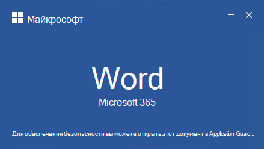
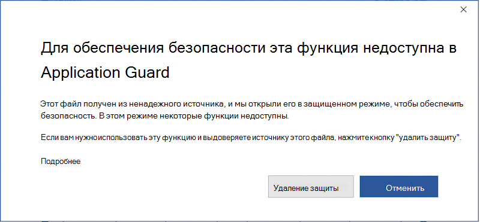

# <a name="application-guard-for-office-for-admins"></a><span data-ttu-id="1e7d5-105">Охрана приложений для Office для администраторов</span><span class="sxs-lookup"><span data-stu-id="1e7d5-105">Application Guard for Office for admins</span></span>

<span data-ttu-id="1e7d5-106">**Применяется к:** Word, Excel и PowerPoint для Microsoft 365, Windows 10 Enterprise</span><span class="sxs-lookup"><span data-stu-id="1e7d5-106">**Applies to:** Word, Excel, and PowerPoint for Microsoft 365, Windows 10 Enterprise</span></span>

<span data-ttu-id="1e7d5-107">Охрана приложений Microsoft Defender для Office (Application Guard for Office) помогает предотвратить доступ к доверенным ресурсам ненарушенного файла, а также защитить ваше предприятие от новых и новых атак.</span><span class="sxs-lookup"><span data-stu-id="1e7d5-107">Microsoft Defender Application Guard for Office (Application Guard for Office) helps prevent untrusted files from accessing trusted resources, keeping your enterprise safe from new and emerging attacks.</span></span> <span data-ttu-id="1e7d5-108">В этой статье администраторы проходят настройку устройств для предварительного просмотра приложения Guard для Office.</span><span class="sxs-lookup"><span data-stu-id="1e7d5-108">This article walks admins through setting up devices for a preview of Application Guard for Office.</span></span> <span data-ttu-id="1e7d5-109">В нем содержится информация о требованиях к системе и шагах по установке, чтобы включить application Guard для Office на устройстве.</span><span class="sxs-lookup"><span data-stu-id="1e7d5-109">It provides information about system requirements and installation steps to enable Application Guard for Office on a device.</span></span>

## <a name="prerequisites"></a><span data-ttu-id="1e7d5-110">Предварительные требования</span><span class="sxs-lookup"><span data-stu-id="1e7d5-110">Prerequisites</span></span>

### <a name="minimum-hardware-requirements"></a><span data-ttu-id="1e7d5-111">Минимальные требования к оборудованию</span><span class="sxs-lookup"><span data-stu-id="1e7d5-111">Minimum hardware requirements</span></span>

* <span data-ttu-id="1e7d5-112">**ЦП:** 64-битные, 4 ядра (физические или виртуальные), расширения виртуализации (Intel VT-x ИЛИ AMD-V), эквивалент Core i5 или более высокие рекомендуемые</span><span class="sxs-lookup"><span data-stu-id="1e7d5-112">**CPU**: 64-bit, 4 cores (physical or virtual), virtualization extensions (Intel VT-x OR AMD-V), Core i5 equivalent or higher recommended</span></span>
* <span data-ttu-id="1e7d5-113">**Физическая память**: 8-ГБ оперативной памяти</span><span class="sxs-lookup"><span data-stu-id="1e7d5-113">**Physical memory**: 8-GB RAM</span></span>
* <span data-ttu-id="1e7d5-114">**Жесткий диск:** 10 ГБ свободного пространства на системных дисках (рекомендуется SSD)</span><span class="sxs-lookup"><span data-stu-id="1e7d5-114">**Hard disk**: 10 GB of free space on the system drive (SSD recommended)</span></span>

### <a name="minimum-software-requirements"></a><span data-ttu-id="1e7d5-115">Минимальные требования к программному обеспечению</span><span class="sxs-lookup"><span data-stu-id="1e7d5-115">Minimum software requirements</span></span>

* <span data-ttu-id="1e7d5-116">**Windows 10**: Windows 10 Enterprise edition, client Build version 2004 (20H1) build 19041 or later</span><span class="sxs-lookup"><span data-stu-id="1e7d5-116">**Windows 10**: Windows 10 Enterprise edition, Client Build version 2004 (20H1) build 19041 or later</span></span>
* <span data-ttu-id="1e7d5-117">**Office:** Office Current Channel Build version 2011 16.0.13530.10000 или более поздней версии.</span><span class="sxs-lookup"><span data-stu-id="1e7d5-117">**Office**: Office Current Channel Build version 2011 16.0.13530.10000 or later.</span></span> <span data-ttu-id="1e7d5-118">Поддерживаются как 32-битные, так и 64-битные версии Office.</span><span class="sxs-lookup"><span data-stu-id="1e7d5-118">Both 32-bit and 64-bit versions of Office are supported.</span></span>
* <span data-ttu-id="1e7d5-119">**Пакет обновления:** Накопительное ежемесячное обновление безопасности Windows 10 [KB4571756](https://support.microsoft.com/help/4571756/windows-10-update-KB4571756)</span><span class="sxs-lookup"><span data-stu-id="1e7d5-119">**Update package**: Windows 10 cumulative monthly security update [KB4571756](https://support.microsoft.com/help/4571756/windows-10-update-KB4571756)</span></span>

<span data-ttu-id="1e7d5-120">Подробные требования к системе обратитесь к системным требованиям [для Microsoft Defender Application Guard.](/windows/security/threat-protection/microsoft-defender-application-guard/reqs-md-app-guard)</span><span class="sxs-lookup"><span data-stu-id="1e7d5-120">For detailed system requirements, refer to [System requirements for Microsoft Defender Application Guard](/windows/security/threat-protection/microsoft-defender-application-guard/reqs-md-app-guard).</span></span> <span data-ttu-id="1e7d5-121">Дополнительные сведения о каналах обновления Office см. в [обзоре каналов обновления для Microsoft 365.](/deployoffice/overview-update-channels)</span><span class="sxs-lookup"><span data-stu-id="1e7d5-121">To learn more about Office update channels, see [Overview of update channels for Microsoft 365](/deployoffice/overview-update-channels).</span></span>

### <a name="licensing-requirements"></a><span data-ttu-id="1e7d5-122">Требования к лицензированию</span><span class="sxs-lookup"><span data-stu-id="1e7d5-122">Licensing requirements</span></span>

* <span data-ttu-id="1e7d5-123">Безопасность Microsoft 365 E5 или Microsoft 365 E5</span><span class="sxs-lookup"><span data-stu-id="1e7d5-123">Microsoft 365 E5 or Microsoft 365 E5 Security</span></span>

## <a name="deploy-application-guard-for-office"></a><span data-ttu-id="1e7d5-124">Развертывание Службы защиты приложений для Office</span><span class="sxs-lookup"><span data-stu-id="1e7d5-124">Deploy Application Guard for Office</span></span>

### <a name="enable-application-guard-for-office"></a><span data-ttu-id="1e7d5-125">Включить охрану приложений для Office</span><span class="sxs-lookup"><span data-stu-id="1e7d5-125">Enable Application Guard for Office</span></span>

1. <span data-ttu-id="1e7d5-126">Скачайте и **установите накопительные ежемесячные обновления безопасности Windows 10 KB4571756.**</span><span class="sxs-lookup"><span data-stu-id="1e7d5-126">Download and install **Windows 10 cumulative monthly security updates KB4571756**.</span></span>

2. <span data-ttu-id="1e7d5-127">Выберите **защитника microsoft Defender Application Guard** под функциями Windows и выберите **ОК.**</span><span class="sxs-lookup"><span data-stu-id="1e7d5-127">Select **Microsoft Defender Application Guard** under Windows Features and  select **OK**.</span></span> <span data-ttu-id="1e7d5-128">Включение функции Application Guard поможет перезагрудить систему.</span><span class="sxs-lookup"><span data-stu-id="1e7d5-128">Enabling the Application Guard feature will prompt a system reboot.</span></span> <span data-ttu-id="1e7d5-129">Вы можете выбрать перезагрузку сейчас или после шага 3.</span><span class="sxs-lookup"><span data-stu-id="1e7d5-129">You can choose to reboot now or after step 3.</span></span>

   

   <span data-ttu-id="1e7d5-131">Эта функция также может быть включена при запуске следующей команды PowerShell в качестве администратора:</span><span class="sxs-lookup"><span data-stu-id="1e7d5-131">The feature can also be enabled by running the following PowerShell command as administrator:</span></span>

   ```powershell
   Enable-WindowsOptionalFeature -online -FeatureName Windows-Defender-ApplicationGuard
   ```

3. <span data-ttu-id="1e7d5-132">Поиск **защитника Microsoft Defender Application Guard в управляемом** режиме , групповой политики в компьютерной конфигурации Административные шаблоны **Windows \\ \\ Components \\ Microsoft Defender Application Guard**.</span><span class="sxs-lookup"><span data-stu-id="1e7d5-132">Search for **Microsoft Defender Application Guard in Managed Mode**, a group policy in **Computer Configuration\\Administrative Templates\\Windows Components\\Microsoft Defender Application Guard**.</span></span> <span data-ttu-id="1e7d5-133">Включи эту политику, установив значение в параметре **Параметры 2** или **3,** а затем выбрав **ОК** или **Применить**.</span><span class="sxs-lookup"><span data-stu-id="1e7d5-133">Turn on this policy by setting the value under Options as **2** or **3**, and then selecting **OK** or **Apply**.</span></span>

   

   <span data-ttu-id="1e7d5-135">Вместо этого можно установить соответствующую политику CSP:</span><span class="sxs-lookup"><span data-stu-id="1e7d5-135">Instead, you can set the corresponding CSP policy:</span></span>

   > <span data-ttu-id="1e7d5-136">OMA-URI: **./Device/Vendor/MSFT/WindowsDefenderApplicationGuard/Settings/AllowWindowsDefenderApplicationGuard**</span><span class="sxs-lookup"><span data-stu-id="1e7d5-136">OMA-URI: **./Device/Vendor/MSFT/WindowsDefenderApplicationGuard/Settings/AllowWindowsDefenderApplicationGuard**</span></span> <br> <span data-ttu-id="1e7d5-137">Тип данных: **integer**</span><span class="sxs-lookup"><span data-stu-id="1e7d5-137">Data type: **Integer**</span></span> <br> <span data-ttu-id="1e7d5-138">Значение: **2**</span><span class="sxs-lookup"><span data-stu-id="1e7d5-138">Value: **2**</span></span>

4. <span data-ttu-id="1e7d5-139">Перезапустите систему.</span><span class="sxs-lookup"><span data-stu-id="1e7d5-139">Restart the system.</span></span>

### <a name="set-diagnostics--feedback-to-send-full-data"></a><span data-ttu-id="1e7d5-140">Настройка обратной связи & диагностики для отправки полных данных</span><span class="sxs-lookup"><span data-stu-id="1e7d5-140">Set Diagnostics & feedback to send full data</span></span>

<span data-ttu-id="1e7d5-141">Этот шаг гарантирует, что данные, необходимые для выявления и устранения проблем, достигают Корпорации Майкрософт.</span><span class="sxs-lookup"><span data-stu-id="1e7d5-141">This step ensures that the data necessary to identify and fix problems is reaching Microsoft.</span></span> <span data-ttu-id="1e7d5-142">Выполните следующие действия, чтобы включить диагностику на устройстве Windows:</span><span class="sxs-lookup"><span data-stu-id="1e7d5-142">Follow these steps to enable diagnostics on your Windows device:</span></span>

1. <span data-ttu-id="1e7d5-143">Откройте **параметры** из меню "Пуск".</span><span class="sxs-lookup"><span data-stu-id="1e7d5-143">Open **Settings** from the Start menu.</span></span>

   

2. <span data-ttu-id="1e7d5-145">В **параметрах Windows** выберите **конфиденциальность.**</span><span class="sxs-lookup"><span data-stu-id="1e7d5-145">On **Windows Settings**, select **Privacy**.</span></span>

   

3. <span data-ttu-id="1e7d5-147">В статье Конфиденциальность выберите **диагностические & отзывы и** выберите **необязательные диагностические данные.**</span><span class="sxs-lookup"><span data-stu-id="1e7d5-147">Under Privacy, select **Diagnostics & feedback** and select **Optional diagnostic data**.</span></span>

   

<span data-ttu-id="1e7d5-149">Дополнительные сведения о настройке параметров диагностики Windows можно найти в [настройках диагностических данных Windows в организации.](/windows/privacy/configure-windows-diagnostic-data-in-your-organization#enterprise-management)</span><span class="sxs-lookup"><span data-stu-id="1e7d5-149">For more on configuring Windows diagnostic settings, refer to [Configuring Windows diagnostic data in your organization](/windows/privacy/configure-windows-diagnostic-data-in-your-organization#enterprise-management).</span></span>

### <a name="confirm-that-application-guard-for-office-is-enabled-and-working"></a><span data-ttu-id="1e7d5-150">Подтверждение того, что служба защиты приложений для Office включена и работает</span><span class="sxs-lookup"><span data-stu-id="1e7d5-150">Confirm that Application Guard for Office is enabled and working</span></span>

<span data-ttu-id="1e7d5-151">Прежде чем подтвердить, что служба охраны приложений для Office включена, запустите Word, Excel или PowerPoint на устройстве, где развернуты политики.</span><span class="sxs-lookup"><span data-stu-id="1e7d5-151">Before confirming that Application Guard for Office is enabled, launch Word, Excel, or PowerPoint on a device where the policies have been deployed.</span></span> <span data-ttu-id="1e7d5-152">Убедитесь, что Office активирован.</span><span class="sxs-lookup"><span data-stu-id="1e7d5-152">Make sure Office is activated.</span></span> <span data-ttu-id="1e7d5-153">Для активации продукта Office сначала может потребоваться использовать удостоверение работы.</span><span class="sxs-lookup"><span data-stu-id="1e7d5-153">You may need to use your work identity to activate the Office product first.</span></span>

<span data-ttu-id="1e7d5-154">Чтобы подтвердить, что служба защиты приложений для Office включена, запустите Word, Excel или PowerPoint, а затем откройте ненавязчивый документ.</span><span class="sxs-lookup"><span data-stu-id="1e7d5-154">To confirm that Application Guard for Office is enabled, launch Word, Excel, or PowerPoint, and then open an untrusted document.</span></span> <span data-ttu-id="1e7d5-155">Например, вы можете открыть документ, скачаный из Интернета, или вложение электронной почты у кого-либо за пределами организации.</span><span class="sxs-lookup"><span data-stu-id="1e7d5-155">For example, you can open a document that was downloaded from the internet or an email attachment from someone outside your organization.</span></span>

<span data-ttu-id="1e7d5-156">При первом открываемом ненарушеченном файле может появиться экран всплеска Office, как в следующем примере.</span><span class="sxs-lookup"><span data-stu-id="1e7d5-156">When you first open an untrusted file, you may see an Office splash screen like the following example.</span></span> <span data-ttu-id="1e7d5-157">Он может отображаться в течение некоторого времени, пока активируется служба охраны приложений для Office и откроется файл.</span><span class="sxs-lookup"><span data-stu-id="1e7d5-157">It might be displayed for some time while Application Guard for Office is being activated and the file is being opened.</span></span> <span data-ttu-id="1e7d5-158">Последующие открытия ненарушимые файлы должны быть быстрее.</span><span class="sxs-lookup"><span data-stu-id="1e7d5-158">Subsequent openings of untrusted files should be faster.</span></span>



<span data-ttu-id="1e7d5-160">После открытия в файле должны отображаться несколько визуальных индикаторов того, что файл был открыт внутри Application Guard для Office:</span><span class="sxs-lookup"><span data-stu-id="1e7d5-160">Upon being opened, the file should display a few visual indicators that the file was opened inside Application Guard for Office:</span></span>

* <span data-ttu-id="1e7d5-161">Вызов в ленте</span><span class="sxs-lookup"><span data-stu-id="1e7d5-161">A callout in the ribbon</span></span>

  

* <span data-ttu-id="1e7d5-163">Значок приложения со щитом в панели задач</span><span class="sxs-lookup"><span data-stu-id="1e7d5-163">The application icon with a shield in the taskbar</span></span>

  

## <a name="configure-application-guard-for-office"></a><span data-ttu-id="1e7d5-165">Настройка охраны приложений для Office</span><span class="sxs-lookup"><span data-stu-id="1e7d5-165">Configure Application Guard for Office</span></span>

<span data-ttu-id="1e7d5-166">Office поддерживает следующие политики, позволяющие настроить возможности Службы безопасности приложений для Office.</span><span class="sxs-lookup"><span data-stu-id="1e7d5-166">Office supports the following policies to enable you to configure the capabilities of Application Guard for Office.</span></span> <span data-ttu-id="1e7d5-167">Эти политики можно настроить с помощью групповых политик или службы облачной политики Office.</span><span class="sxs-lookup"><span data-stu-id="1e7d5-167">These policies can be configured through Group policies or through the Office cloud policy service.</span></span>

> [!NOTE]
> <span data-ttu-id="1e7d5-168">Настройка этих политик может отключить некоторые функции для файлов, открытых в Application Guard для Office.</span><span class="sxs-lookup"><span data-stu-id="1e7d5-168">Configuring these policies can disable some functionalities for files opened in Application Guard for Office.</span></span>

|<span data-ttu-id="1e7d5-169">Политика</span><span class="sxs-lookup"><span data-stu-id="1e7d5-169">Policy</span></span>|<span data-ttu-id="1e7d5-170">Описание</span><span class="sxs-lookup"><span data-stu-id="1e7d5-170">Description</span></span>|
|---|---|
|<span data-ttu-id="1e7d5-171">Не используйте application Guard для Office</span><span class="sxs-lookup"><span data-stu-id="1e7d5-171">Don't use Application Guard for Office</span></span>|<span data-ttu-id="1e7d5-172">Включение этой политики заставит Word, Excel и PowerPoint использовать контейнер изоляции Protected View вместо Application Guard для Office.</span><span class="sxs-lookup"><span data-stu-id="1e7d5-172">Enabling this policy will force Word, Excel, and PowerPoint to use the Protected View isolation container instead of Application Guard for Office.</span></span> <span data-ttu-id="1e7d5-173">Эта политика может быть использована для временной отключения службы охраны приложений для Office, если существуют проблемы с ее поддержкой для Microsoft Edge.</span><span class="sxs-lookup"><span data-stu-id="1e7d5-173">This policy can be used to temporarily disable Application Guard for Office when there are issues in leaving it enabled for Microsoft Edge.</span></span>|
|<span data-ttu-id="1e7d5-174">Настройка предварительного создания контейнера Application Guard для контейнера Office</span><span class="sxs-lookup"><span data-stu-id="1e7d5-174">Configure Application Guard for Office container pre-creation</span></span>|<span data-ttu-id="1e7d5-175">Эта политика определяет, создан ли контейнер Application Guard для Office для изоляции ненарушимых файлов для повышения производительности выполнения.</span><span class="sxs-lookup"><span data-stu-id="1e7d5-175">This policy determines if the Application Guard for Office container, for isolating untrusted files, is pre-created for improved run-time performance.</span></span> <span data-ttu-id="1e7d5-176">Если вы включаете этот параметр, можно указать количество дней для продолжения предварительного создания контейнера или позволить встроенной постройки Office предварительно создать контейнер.</span><span class="sxs-lookup"><span data-stu-id="1e7d5-176">If you enable this setting, you can specify the number of days to continue pre-creating a container or let the Office built-in heuristic pre-create the container.</span></span>
|<span data-ttu-id="1e7d5-177">Не разрешайте копирование и вклейку документов Office, открытых в Службе безопасности приложений для Office</span><span class="sxs-lookup"><span data-stu-id="1e7d5-177">Don't allow copy/paste for Office documents opened in Application Guard for Office</span></span>|<span data-ttu-id="1e7d5-178">Включение этой политики не позволит пользователю копировать и вклеить содержимое из документа, открытого в Службе приложений для Office, на документ, открытый вне него.</span><span class="sxs-lookup"><span data-stu-id="1e7d5-178">Enabling this policy will prevent a user from copying and pasting content from a document opened in Application Guard for Office to a document opened outside of it.</span></span>|
|<span data-ttu-id="1e7d5-179">Отключение ускорения аппаратного обеспечения в Application Guard для Office</span><span class="sxs-lookup"><span data-stu-id="1e7d5-179">Disable hardware acceleration in Application Guard for Office</span></span>|<span data-ttu-id="1e7d5-180">Эта политика контролирует, использует ли служба application Guard для Office аппаратное ускорение для отрисовки графики.</span><span class="sxs-lookup"><span data-stu-id="1e7d5-180">This policy controls whether Application Guard for Office uses hardware acceleration to render graphics.</span></span> <span data-ttu-id="1e7d5-181">Если включить этот параметр, Служба защиты приложений для Office использует визуализацию на основе программного обеспечения (ЦП) и не загружает сторонние драйверы графики или не взаимодействует с подключенным графическим оборудованием.</span><span class="sxs-lookup"><span data-stu-id="1e7d5-181">If you enable this setting, Application Guard for Office uses software-based (CPU) rendering and won't load any third-party graphics drivers or interact with any connected graphics hardware.</span></span>
|<span data-ttu-id="1e7d5-182">Отключение защиты неподтвердимых типов файлов в Application Guard для Office</span><span class="sxs-lookup"><span data-stu-id="1e7d5-182">Disable unsupported file types protection in Application Guard for Office</span></span>|<span data-ttu-id="1e7d5-183">Эта политика контролирует, будет ли служба application Guard для Office блокировать неподтвердимые типы файлов от открытия или же она позволит перенаправление в защищенный вид.</span><span class="sxs-lookup"><span data-stu-id="1e7d5-183">This policy controls whether Application Guard for Office will block unsupported file types from being opened or if it will enable the redirection to Protected View.</span></span>
|<span data-ttu-id="1e7d5-184">Отключите доступ к камере и микрофону для документов, открытых в Application Guard для Office</span><span class="sxs-lookup"><span data-stu-id="1e7d5-184">Turn off camera and microphone access for documents opened in Application Guard for Office</span></span>|<span data-ttu-id="1e7d5-185">Включение этой политики позволит удалить доступ Office к камере и микрофону внутри Application Guard для Office.</span><span class="sxs-lookup"><span data-stu-id="1e7d5-185">Enabling this policy will remove Office access to the camera and microphone inside Application Guard for Office.</span></span>|
|<span data-ttu-id="1e7d5-186">Ограничение печати документов, открытых в службе Application Guard для Office</span><span class="sxs-lookup"><span data-stu-id="1e7d5-186">Restrict printing from documents opened in Application Guard for Office</span></span>|<span data-ttu-id="1e7d5-187">Включение этой политики ограничит принтеры, которые пользователь может распечатать из файла, открытого в Application Guard для Office.</span><span class="sxs-lookup"><span data-stu-id="1e7d5-187">Enabling this policy will limit the printers that a user can print to from a file opened in Application Guard for Office.</span></span> <span data-ttu-id="1e7d5-188">Например, эту политику можно использовать, чтобы ограничить пользователей только печатью в ФОРМАТЕ PDF.</span><span class="sxs-lookup"><span data-stu-id="1e7d5-188">For example, you can use this policy to restrict users to only print to PDF.</span></span>|
|<span data-ttu-id="1e7d5-189">Запретить пользователям удалять защиту Application Guard для Office в файлах</span><span class="sxs-lookup"><span data-stu-id="1e7d5-189">Prevent users from removing Application Guard for Office protection on files</span></span>|<span data-ttu-id="1e7d5-190">Включение этой политики позволит удалить параметр (в рамках приложения Office), чтобы отключить application Guard для защиты Office или открыть файл за пределами Application Guard для Office.</span><span class="sxs-lookup"><span data-stu-id="1e7d5-190">Enabling this policy will remove the option (within the Office application experience) to disable Application Guard for Office protection or to open a file outside Application Guard for Office.</span></span> <p> <span data-ttu-id="1e7d5-191">**Примечание:** Пользователи по-прежнему могут обойти эту политику вручную, удалив свойство mark-of-the-web из файла или перемещая документ в надежное расположение.</span><span class="sxs-lookup"><span data-stu-id="1e7d5-191">**Note:** Users can still bypass this policy by manually removing the mark-of-the-web property from the file or by moving a document to a Trusted location.</span></span>|
|

> [!NOTE]
> <span data-ttu-id="1e7d5-192">Следующие политики потребуют, чтобы пользователь зарегистрировался и снова вступает в силу в Windows:</span><span class="sxs-lookup"><span data-stu-id="1e7d5-192">The following policies will require the user to sign out and sign in again to Windows to take effect:</span></span>
>
> * <span data-ttu-id="1e7d5-193">Отключение копирования и вклейки документов, открытых в application Guard for Office</span><span class="sxs-lookup"><span data-stu-id="1e7d5-193">Disable copy/paste for documents opened in Application Guard for Office</span></span>
> * <span data-ttu-id="1e7d5-194">Ограничение печати документов, открытых в application Guard для Office</span><span class="sxs-lookup"><span data-stu-id="1e7d5-194">Restrict printing for documents opened in Application Guard for Office</span></span>
> * <span data-ttu-id="1e7d5-195">Отключение доступа камеры и микрофона к документам, открываемой в Application Guard for Office</span><span class="sxs-lookup"><span data-stu-id="1e7d5-195">Turn off camera and mic access to documents opened in Application Guard for Office</span></span>

## <a name="submit-feedback"></a><span data-ttu-id="1e7d5-196">Отправить отзыв</span><span class="sxs-lookup"><span data-stu-id="1e7d5-196">Submit feedback</span></span>

### <a name="submit-feedback-via-feedback-hub"></a><span data-ttu-id="1e7d5-197">Отправка отзывов через центр отзывов</span><span class="sxs-lookup"><span data-stu-id="1e7d5-197">Submit feedback via Feedback Hub</span></span>

<span data-ttu-id="1e7d5-198">Если при запуске службы Application Guard для Office возникнут какие-либо проблемы, рекомендуется отправить свои отзывы через Центр отзывов:</span><span class="sxs-lookup"><span data-stu-id="1e7d5-198">If you encounter any issues when launching Application Guard for Office, you're encouraged to submit your feedback via Feedback Hub:</span></span>

1. <span data-ttu-id="1e7d5-199">Откройте приложение **Концентратор отзывов и** вопишитесь.</span><span class="sxs-lookup"><span data-stu-id="1e7d5-199">Open the **Feedback Hub app** and sign in.</span></span>

2. <span data-ttu-id="1e7d5-200">Если при запуске службы Application Guard вы получаете диалоговое окно об ошибке, выберите **Отчет Корпорации Майкрософт** в диалоговом окте об ошибке, чтобы начать новую отправку отзывов.</span><span class="sxs-lookup"><span data-stu-id="1e7d5-200">If you get an error dialog while launching Application Guard, select **Report to Microsoft** in the error dialog to start a new feedback submission.</span></span> <span data-ttu-id="1e7d5-201">В противном случае перейдите, чтобы выбрать правильную категорию для Application Guard, а затем <https://aka.ms/mdagoffice-fb> выберите **+ &nbsp; Добавить новые** отзывы в правом верхнем справа.</span><span class="sxs-lookup"><span data-stu-id="1e7d5-201">Otherwise, navigate to <https://aka.ms/mdagoffice-fb> to select the correct category for Application Guard, then select **+&nbsp;Add new feedback** near the top right.</span></span>

3. <span data-ttu-id="1e7d5-202">Введите сводку в поле **Сводка** отзывов, если она еще не заполнена для вас.</span><span class="sxs-lookup"><span data-stu-id="1e7d5-202">Enter a summary in the **Summarize your feedback** box if it isn't already filled in for you.</span></span>

4. <span data-ttu-id="1e7d5-203">Введите подробное описание проблемы, которую вы испытали, и какие действия вы приняли в поле **Объяснить** более подробно, а затем выберите **Далее**.</span><span class="sxs-lookup"><span data-stu-id="1e7d5-203">Enter a detailed description of the issue that you experienced and what steps you took in the **Explain in more detail** box, then select **Next**.</span></span>

5. <span data-ttu-id="1e7d5-204">Выберите пузырь рядом с **проблемой**.</span><span class="sxs-lookup"><span data-stu-id="1e7d5-204">Select the bubble next to **Problem**.</span></span> <span data-ttu-id="1e7d5-205">Убедитесь, что выбранная категория является безопасность и конфиденциальность **Microsoft Defender Application Guard — \> Office**, а затем выберите **Далее**.</span><span class="sxs-lookup"><span data-stu-id="1e7d5-205">Make sure the category selected is **Security and Privacy \> Microsoft Defender Application Guard – Office**, then select **Next**.</span></span>

6. <span data-ttu-id="1e7d5-206">Выберите **новые отзывы,** а затем **далее**.</span><span class="sxs-lookup"><span data-stu-id="1e7d5-206">Select **New feedback**, then **Next**.</span></span>

7. <span data-ttu-id="1e7d5-207">Сбор следов проблемы:</span><span class="sxs-lookup"><span data-stu-id="1e7d5-207">Collect traces about the issue:</span></span>

   1. <span data-ttu-id="1e7d5-208">**Расширь плитку "Воссоздать** проблемы".</span><span class="sxs-lookup"><span data-stu-id="1e7d5-208">Expand the **Recreate my problem** tile.</span></span>

   2. <span data-ttu-id="1e7d5-209">Если проблема возникает во время работы Службы защиты приложений, откройте экземпляр Application Guard.</span><span class="sxs-lookup"><span data-stu-id="1e7d5-209">If the issue you're experiencing occurs while Application Guard is running, open an Application Guard instance.</span></span> <span data-ttu-id="1e7d5-210">Открытие экземпляра позволяет собирать дополнительные следы из контейнера Application Guard.</span><span class="sxs-lookup"><span data-stu-id="1e7d5-210">Opening an instance allows additional traces to be collected from within the Application Guard container.</span></span>

   3. <span data-ttu-id="1e7d5-211">Выберите **начало записи** и подождите, пока плитка не будет вращаться, и скажите *Остановить запись.*</span><span class="sxs-lookup"><span data-stu-id="1e7d5-211">Select **Start recording**, and wait for the tile to stop spinning and say *Stop recording*.</span></span>

   4. <span data-ttu-id="1e7d5-212">Полностью воспроизводят проблему с application Guard.</span><span class="sxs-lookup"><span data-stu-id="1e7d5-212">Fully reproduce the issue with Application Guard.</span></span> <span data-ttu-id="1e7d5-213">Воспроизведение может включать попытку запуска экземпляра Application Guard и ожидание сбой или воспроизведение проблемы в запущенной экземпляре Application Guard.</span><span class="sxs-lookup"><span data-stu-id="1e7d5-213">Reproduction might include attempting to launch an Application Guard instance and waiting until it fails, or reproducing an issue in a running Application Guard instance.</span></span>

   5. <span data-ttu-id="1e7d5-214">Выберите **плитку Stop recording.**</span><span class="sxs-lookup"><span data-stu-id="1e7d5-214">Select the **Stop recording** tile.</span></span>

   6. <span data-ttu-id="1e7d5-215">Держите все экземпляры application Guard открытыми даже в течение нескольких минут после отправки, чтобы также можно было собирать диагностику контейнеров.</span><span class="sxs-lookup"><span data-stu-id="1e7d5-215">Keep any running Application Guard instance(s) open, even for a few minutes after submission, so that container diagnostics can also be collected.</span></span>

8. <span data-ttu-id="1e7d5-216">Прикрепить все соответствующие скриншоты или файлы, связанные с проблемой.</span><span class="sxs-lookup"><span data-stu-id="1e7d5-216">Attach any relevant screenshots or files related to the problem.</span></span>

9. <span data-ttu-id="1e7d5-217">Выберите **Отправить**.</span><span class="sxs-lookup"><span data-stu-id="1e7d5-217">Select **Submit**.</span></span>

### <a name="submit-feedback-via-office-customer-voice"></a><span data-ttu-id="1e7d5-218">Отправка отзывов с помощью голосовой связи клиента Office</span><span class="sxs-lookup"><span data-stu-id="1e7d5-218">Submit feedback via Office Customer Voice</span></span>

<span data-ttu-id="1e7d5-219">Вы также можете отправить отзывы из Office, если проблема произойдет, когда документы Office открываются в Application Guard.</span><span class="sxs-lookup"><span data-stu-id="1e7d5-219">You may also submit feedback from within Office if the issue happens when Office documents are opened in Application Guard.</span></span> <span data-ttu-id="1e7d5-220">Для отправки [отзывов обратитесь](https://insider.office.com/handbook) в руководство по инсайдерской службе Office.</span><span class="sxs-lookup"><span data-stu-id="1e7d5-220">Refer to the [Office Insider Handbook](https://insider.office.com/handbook) for submitting feedback.</span></span>

## <a name="integration-with-microsoft-defender-for-endpoint-and-microsoft-defender-for-office-365"></a><span data-ttu-id="1e7d5-221">Интеграция с Microsoft Defender для конечной точки и Microsoft Defender для Office 365</span><span class="sxs-lookup"><span data-stu-id="1e7d5-221">Integration with Microsoft Defender for Endpoint and Microsoft Defender for Office 365</span></span>

<span data-ttu-id="1e7d5-222">Служба охраны приложений для Office интегрирована с Microsoft Defender для конечной точки, чтобы обеспечить мониторинг и оповещение о вредоносных действиях, которые происходят в изолированной среде.</span><span class="sxs-lookup"><span data-stu-id="1e7d5-222">Application Guard for Office is integrated with Microsoft Defender for Endpoint to provide monitoring and alerting on malicious activity that happens in the isolated environment.</span></span>

<span data-ttu-id="1e7d5-223">Microsoft Defender for Endpoint — это платформа безопасности, призванная помочь корпоративным сетям предотвращать, обнаруживать, исследовать и реагировать на расширенные угрозы.</span><span class="sxs-lookup"><span data-stu-id="1e7d5-223">Microsoft Defender for Endpoint is a security platform designed to help enterprise networks prevent, detect, investigate, and respond to advanced threats.</span></span> <span data-ttu-id="1e7d5-224">Дополнительные сведения об этой платформе см. в [материале Microsoft Defender for Endpoint.](https://www.microsoft.com/microsoft-365/windows/microsoft-defender-atp)</span><span class="sxs-lookup"><span data-stu-id="1e7d5-224">For more details about this platform, see [Microsoft Defender for Endpoint](https://www.microsoft.com/microsoft-365/windows/microsoft-defender-atp).</span></span> <span data-ttu-id="1e7d5-225">Дополнительные информацию об устройстве для этой платформы см. в таблице [Onboard devices to the Microsoft Defender for Endpoint service.](/windows/security/threat-protection/microsoft-defender-atp/onboard-configure)</span><span class="sxs-lookup"><span data-stu-id="1e7d5-225">To learn more about onboarding devices to this platform, see [Onboard devices to the Microsoft Defender for Endpoint service](/windows/security/threat-protection/microsoft-defender-atp/onboard-configure).</span></span>

<span data-ttu-id="1e7d5-226">Вы также можете настроить Microsoft Defender для Office 365 для работы с Defender для конечной точки.</span><span class="sxs-lookup"><span data-stu-id="1e7d5-226">You can also configure Microsoft Defender for Office 365 to work with Defender for Endpoint.</span></span> <span data-ttu-id="1e7d5-227">Дополнительные сведения можно найти в [ссылке Интеграция Defender для Office 365 с Microsoft Defender для конечной точки.](integrate-office-365-ti-with-mde.md)</span><span class="sxs-lookup"><span data-stu-id="1e7d5-227">For more info, refer to [Integrate Defender for Office 365 with Microsoft Defender for Endpoint](integrate-office-365-ti-with-mde.md).</span></span>

## <a name="limitations-and-considerations"></a><span data-ttu-id="1e7d5-228">Ограничения и соображения</span><span class="sxs-lookup"><span data-stu-id="1e7d5-228">Limitations and considerations</span></span>

* <span data-ttu-id="1e7d5-229">Application Guard for Office — это ограниченный режим, который изолирует неподтверждированные документы, чтобы они не могли получить доступ к доверенным корпоративным ресурсам, интрасети, удостоверению пользователя и произвольным файлам на компьютере.</span><span class="sxs-lookup"><span data-stu-id="1e7d5-229">Application Guard for Office is a restricted mode that isolates untrusted documents so that they can't access trusted corporate resources, an intranet, the user's identity, and arbitrary files on the computer.</span></span> <span data-ttu-id="1e7d5-230">В результате, если пользователь попытается получить доступ к функции, зависимой от такого доступа, например, вставив изображение из локального файла на диске, доступ не удастся и даст подсказку, как в следующем примере.</span><span class="sxs-lookup"><span data-stu-id="1e7d5-230">As a result, if a user tries to access a feature that has a dependency on such access—for example, inserting a picture from a local file on disk—the access will fail and produce a prompt like the following example.</span></span> <span data-ttu-id="1e7d5-231">Чтобы включить ненадверенный документ для доступа к доверенным ресурсам, пользователи должны удалить защиту application Guard из документа.</span><span class="sxs-lookup"><span data-stu-id="1e7d5-231">To enable an untrusted document to access trusted resources, users must remove Application Guard protection from the document.</span></span>

  

  > [!NOTE]
  > <span data-ttu-id="1e7d5-233">Советую пользователям удалять защиту только в том случае, если они доверяют файлу и его источнику или его источнику.</span><span class="sxs-lookup"><span data-stu-id="1e7d5-233">Advise users to only remove protection if they trust the file and its source or where it came from.</span></span>

* <span data-ttu-id="1e7d5-234">Активное содержимое в документах, таких как макрос и ActiveX, отключено в Application Guard для Office.</span><span class="sxs-lookup"><span data-stu-id="1e7d5-234">Active content in documents like macros and ActiveX controls are disabled in Application Guard for Office.</span></span> <span data-ttu-id="1e7d5-235">Чтобы включить активный контент, пользователям необходимо удалить защиту application Guard.</span><span class="sxs-lookup"><span data-stu-id="1e7d5-235">Users need to remove Application Guard protection to enable active content.</span></span>

* <span data-ttu-id="1e7d5-236">Ненарушимые файлы из сетевых акций или файлов, общих из OneDrive, OneDrive для бизнеса или SharePoint Online из другой организации, открытые только для чтения в Application Guard.</span><span class="sxs-lookup"><span data-stu-id="1e7d5-236">Untrusted files from network shares or files shared from OneDrive, OneDrive for Business, or SharePoint Online from a different organization open as read-only in Application Guard.</span></span> <span data-ttu-id="1e7d5-237">Пользователи могут сохранить локализованную копию таких файлов, чтобы продолжить работу в контейнере или удалить защиту для непосредственной работы с исходным файлом.</span><span class="sxs-lookup"><span data-stu-id="1e7d5-237">Users can save a local copy of such files to continue working in the container or remove protection to directly work with the original file.</span></span>

* <span data-ttu-id="1e7d5-238">Файлы, защищенные управлением правами на информацию (IRM), заблокированы по умолчанию.</span><span class="sxs-lookup"><span data-stu-id="1e7d5-238">Files that are protected by Information Rights Management (IRM) are blocked by default.</span></span> <span data-ttu-id="1e7d5-239">Если пользователи хотят открыть такие файлы в защищенном представлении, администратор должен настроить параметры политики для неподтверченных типов файлов для организации.</span><span class="sxs-lookup"><span data-stu-id="1e7d5-239">If users want to open such files in Protected View, an administrator must configure policy settings for unsupported file types for the organization.</span></span>

* <span data-ttu-id="1e7d5-240">Любые настройки приложений Office в Application Guard для Office не будут сохраняться после того, как пользователь снова запишется и запишется, или после перезапуска устройства.</span><span class="sxs-lookup"><span data-stu-id="1e7d5-240">Any customizations to Office applications in Application Guard for Office won't persist after a user signs out and signs in again or after the device restarts.</span></span>

* <span data-ttu-id="1e7d5-241">Только средства доступности, которые используют базу UIA, могут обеспечить доступ к файлам, открытым в Application Guard для Office.</span><span class="sxs-lookup"><span data-stu-id="1e7d5-241">Only Accessibility tools that use the UIA framework can provide an accessible experience for files opened in Application Guard for Office.</span></span>

* <span data-ttu-id="1e7d5-242">Подключение к сети необходимо для первого запуска application Guard после установки.</span><span class="sxs-lookup"><span data-stu-id="1e7d5-242">Network connectivity is required for the first launch of Application Guard after installation.</span></span> <span data-ttu-id="1e7d5-243">Для проверки лицензии службе Application Guard требуется подключение.</span><span class="sxs-lookup"><span data-stu-id="1e7d5-243">Connectivity is required for Application Guard to validate the license.</span></span>

* <span data-ttu-id="1e7d5-244">В разделе Информация документа свойство *Last Modified By* может отображать **WDAGUtilityAccount** в качестве пользователя.</span><span class="sxs-lookup"><span data-stu-id="1e7d5-244">In the document's info section, the *Last Modified By* property may display **WDAGUtilityAccount** as the user.</span></span> <span data-ttu-id="1e7d5-245">WDAGUtilityAccount — анонимный пользователь, настроенный в Application Guard.</span><span class="sxs-lookup"><span data-stu-id="1e7d5-245">WDAGUtilityAccount is the anonymous user configured in Application Guard.</span></span> <span data-ttu-id="1e7d5-246">Удостоверение пользователя рабочего стола не является общим в контейнере Application Guard.</span><span class="sxs-lookup"><span data-stu-id="1e7d5-246">The desktop user's identity isn't shared inside the Application Guard container.</span></span>

## <a name="performance-optimizations-for-application-guard-for-office"></a><span data-ttu-id="1e7d5-247">Оптимизация производительности для Application Guard для Office</span><span class="sxs-lookup"><span data-stu-id="1e7d5-247">Performance optimizations for Application Guard for Office</span></span>

<span data-ttu-id="1e7d5-248">В этом разделе представлен обзор оптимизации производительности, используемой в Application Guard для Office.</span><span class="sxs-lookup"><span data-stu-id="1e7d5-248">This section provides an overview of the performance optimizations used in Application Guard for Office.</span></span> <span data-ttu-id="1e7d5-249">Эти сведения могут помочь администраторам диагностировать отчеты пользователей, связанные с производительностью Office или общей системой при включенной службе Application Guard.</span><span class="sxs-lookup"><span data-stu-id="1e7d5-249">This information can help administrators diagnose reports from users related to the performance of Office or the overall system when Application Guard is enabled.</span></span>

<span data-ttu-id="1e7d5-250">Application Guard использует виртуализированный контейнер, чтобы изолировать ненарушимые документы от системы.</span><span class="sxs-lookup"><span data-stu-id="1e7d5-250">Application Guard uses a virtualized container to isolate untrusted documents away from the system.</span></span> <span data-ttu-id="1e7d5-251">Процесс создания контейнера и настройки контейнера Application Guard для открытия документов Office имеет накладные расходы на производительность, которые могут отрицательно повлиять на работу пользователей при открываемом пользователем ненарушеченном документе.</span><span class="sxs-lookup"><span data-stu-id="1e7d5-251">The process of creating a container and setting up the Application Guard container to open Office documents has a performance overhead that might negatively affect user experience when users open an untrusted document.</span></span>

<span data-ttu-id="1e7d5-252">Чтобы обеспечить пользователей ожидаемым опытом открытия файлов, Application Guard использует логику для предварительного создания контейнера при встрече в системе: пользователь открыл файл в защищенном представлении или службе application Guard за последние 28 дней.</span><span class="sxs-lookup"><span data-stu-id="1e7d5-252">To provide users with the expected file-opening experience, Application Guard uses logic to pre-create a container when the following heuristic is met on a system: A user has opened a file in either Protected View or Application Guard in the past 28 days.</span></span>

<span data-ttu-id="1e7d5-253">При этом, office предварительно создаст контейнер Application Guard для пользователя после его внесения в Windows.</span><span class="sxs-lookup"><span data-stu-id="1e7d5-253">When this heuristic is met, Office will pre-create an Application Guard container for the user after they sign in to Windows.</span></span> <span data-ttu-id="1e7d5-254">Пока эта предварительная операция продолжается, у системы может быть низкая производительность, но эффект будет устраняться, как только операция завершится.</span><span class="sxs-lookup"><span data-stu-id="1e7d5-254">While this pre-create operation is in progress, the system may experience slow performance, but the effect will resolve as soon as the operation completes.</span></span>

> [!NOTE]
> <span data-ttu-id="1e7d5-255">Подсказки, необходимые для создания контейнера, создаются приложениями Office при их применении пользователем.</span><span class="sxs-lookup"><span data-stu-id="1e7d5-255">The hints needed for the heuristic to pre-create the container are generated by Office applications as a user uses them.</span></span> <span data-ttu-id="1e7d5-256">Если пользователь установит Office в новой системе, в которой включена служба охраны приложений, Office не будет предварительно создавать контейнер до тех пор, пока пользователь не откроет ненавязаный документ в системе.</span><span class="sxs-lookup"><span data-stu-id="1e7d5-256">If a user installs Office on a new system where Application Guard is enabled, Office will not pre-create the container until after the first time a user opens an untrusted document on the system.</span></span> <span data-ttu-id="1e7d5-257">Пользователь будет наблюдать, что этот первый файл занимает больше времени, чтобы открыть в Application Guard.</span><span class="sxs-lookup"><span data-stu-id="1e7d5-257">The user will observe that this first file takes longer to open in Application Guard.</span></span>

## <a name="known-issues"></a><span data-ttu-id="1e7d5-258">Известные проблемы</span><span class="sxs-lookup"><span data-stu-id="1e7d5-258">Known issues</span></span>

* <span data-ttu-id="1e7d5-259">Выбор веб-ссылок `http` `https` (или) не открывает браузер.</span><span class="sxs-lookup"><span data-stu-id="1e7d5-259">Selecting web links (`http` or `https`) doesn't open the browser.</span></span>
* <span data-ttu-id="1e7d5-260">В настоящее время не поддерживается вклейка контента или изображений в формате RTF в документах Office, открытых с помощью Application Guard.</span><span class="sxs-lookup"><span data-stu-id="1e7d5-260">Pasting rich text format (RTF) content or images in Office documents opened with Application Guard isn't supported at this time.</span></span>
* <span data-ttu-id="1e7d5-261">Обновления файлов .NET вызывают сбой в открываемой службе Application Guard.</span><span class="sxs-lookup"><span data-stu-id="1e7d5-261">Updates to .NET cause files to fail to open in Application Guard.</span></span> <span data-ttu-id="1e7d5-262">Как обходное решение, пользователи могут перезапустить свое устройство, когда они наткнулись на этот сбой.</span><span class="sxs-lookup"><span data-stu-id="1e7d5-262">As a workaround, users can restart their device when they come across this failure.</span></span> <span data-ttu-id="1e7d5-263">Узнайте больше о проблеме при получении сообщения об ошибке при попытке открыть Защитник Windows [или песочницу Windows.](https://support.microsoft.com/help/4575917/receiving-an-error-message-when-attempting-to-open-windows-defender-ap)</span><span class="sxs-lookup"><span data-stu-id="1e7d5-263">Learn more about the issue at [Receiving an error message when attempting to open Windows Defender Application Guard or Windows Sandbox](https://support.microsoft.com/help/4575917/receiving-an-error-message-when-attempting-to-open-windows-defender-ap).</span></span>