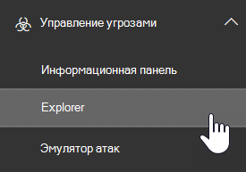
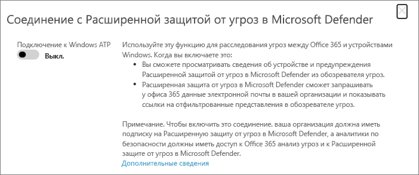

# Используйте Microsoft Defender для Office 365 вместе с Microsoft Defender для конечной точкиUse Microsoft Defender for Office 365 together with Microsoft Defender for Endpoint

[!INCLUDE [Microsoft 365 Defender rebranding](../includes/microsoft-defender-for-office.md)]

[Microsoft Defender для Office 365](defender-for-office-365.md) можно настроить для работы с [Microsoft Defender для конечной точки.](/windows/security/threat-protection)[Microsoft Defender for Office 365](defender-for-office-365.md) can be configured to work with [Microsoft Defender for Endpoint](/windows/security/threat-protection).

Интеграция Microsoft Defender для Office 365 с Microsoft Defender для конечной точки может помочь группе безопасности отслеживать и быстро принимать меры, если устройства пользователей находятся под угрозой.Integrating Microsoft Defender for Office 365 with Microsoft Defender for Endpoint can help your security operations team monitor and take action quickly if users' devices are at risk. Например, после включения интеграции группа операций безопасности сможет видеть устройства, которые потенциально затронуты обнаруженным сообщением электронной почты, а также количество последних оповещений для этих устройств в Microsoft Defender для Endpoint.For example, once integration is enabled, your security operations team will be able to see the devices that are potentially affected by a detected email message, as well as how many recent alerts were generated for those devices in Microsoft Defender for Endpoint.

На следующем изображении изображено, как выглядит вкладка **Devices** при включенной интеграции Microsoft Defender для конечной точки:The following image depicts what the **Devices** tab looks like when you have Microsoft Defender for Endpoint integration enabled:

В этом примере можно увидеть, что получатели обнаруженного сообщения электронной почты имеют четыре устройства и одно имеет оповещение.In this example, you can see that the recipients of the detected email message have four devices and one has an alert. Щелкнув ссылку для устройства, откроет свою страницу в центре безопасности Microsoft Defender <https://securitycenter.windows.com> ().Clicking the link for a device opens its page in the Microsoft Defender Security Center (<https://securitycenter.windows.com>).

> [!TIP]
> **[Дополнительные информацию о Центре безопасности защитника](/windows/security/threat-protection/microsoft-defender-atp/use)** Майкрософт (также именуемом порталом Microsoft Defender для конечных точек).)**[Learn more about the Microsoft Defender Security Center](/windows/security/threat-protection/microsoft-defender-atp/use)** (also referred to as the Microsoft Defender for Endpoint portal.)

## ТребованияRequirements

- В организации должны быть Microsoft Defender для Office 365 (или Office 365 E5) и Microsoft Defender для конечной точки.Your organization must have Microsoft Defender for Office 365 (or Office 365 E5) and Microsoft Defender for Endpoint.

- Вы должны быть глобальным администратором или иметь роль администратора безопасности (например, администратора безопасности), назначенную в Центре & [безопасности.](https://protection.office.com)You must be a global administrator or have a security administrator role (such as Security Administrator) assigned in the [Security & Compliance Center](https://protection.office.com). (См. разрешения в центре [& безопасности)](permissions-in-the-security-and-compliance-center.md)(See [Permissions in the Security & Compliance Center](permissions-in-the-security-and-compliance-center.md))

- Вы должны иметь доступ как [к Explorer (так](threat-explorer.md) и к обнаружениям в режиме реального времени) в Центре & безопасности и Центре безопасности Microsoft Defender.You must have access to both [Explorer (or real-time detections)](threat-explorer.md) in the Security & Compliance Center and the Microsoft Defender Security Center.

## Интеграция Microsoft Defender для Office 365 с Microsoft Defender для конечной точкиTo integrate Microsoft Defender for Office 365 with Microsoft Defender for Endpoint

Интеграция Microsoft Defender для Office 365 с Microsoft Defender для конечной точки создана с помощью Центра & безопасности и Центра безопасности Microsoft Defender.Integrating Microsoft Defender for Office 365 with Microsoft Defender for Endpoint is set up by using both the Security & Compliance Center AND the Microsoft Defender Security Center.

1. В качестве глобального администратора или администратора безопасности <https://protection.office.com> войдите и войдите.As a global administrator or a security administrator, go to <https://protection.office.com> and sign in. (Это делает вас в Центре безопасности Office 365 & соответствия требованиям.)(This takes you to the Office 365 Security & Compliance Center.)

2. В области навигации выберите **Обозреватель управления** \> **угрозами.**In the navigation pane, choose **Threat management** \> **Explorer**.

   

3. В правом верхнем углу экрана выберите Параметры защитника для конечных точек **(параметры MDE).**In the upper right corner of the screen, choose **Defender for Endpoint Settings (MDE Settings)**.

4. В диалоговом окне Microsoft Defender для подключения к конечной точке включите подключение к **Microsoft Defender для конечной точки.**In the Microsoft Defender for Endpoint connection dialog box, turn on **Connect to Microsoft Defender for Endpoint**.

   

5. Перейдите в Центр безопасности защитника Майкрософт <https://securitycenter.windows.com> ().Go to the Microsoft Defender Security Center (<https://securitycenter.windows.com>).

6. В панели навигации выберите **Параметры**.In the navigation bar, choose **Settings**. Затем в **статье General** выберите **расширенные функции**.Then, under **General**, choose **Advanced features**.

7. Прокрутите **вниз до подключения к Office 365 Threat Intelligence** и включите подключение.Scroll down to **Office 365 Threat Intelligence connection**, and turn the connection on.

   

## Связанные статьиRelated articles

[Возможности расследования и реагирования на угрозы в Office 365Threat investigation and response capabilities in Office 365](office-365-ti.md)

[Microsoft Defender для Office 365Microsoft Defender for Office 365](defender-for-office-365.md)

[Microsoft Defender для конечной точкиMicrosoft Defender for Endpoint](/windows/security/threat-protection)