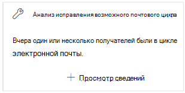
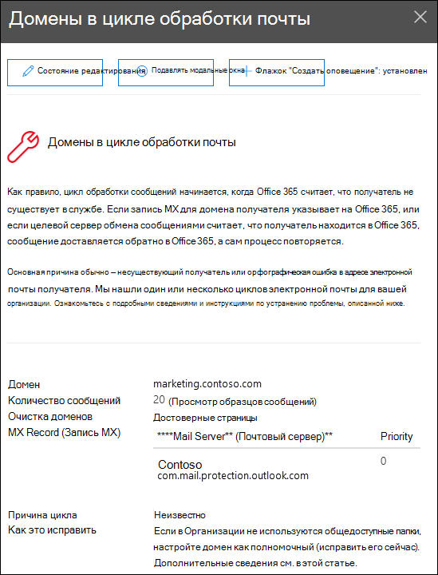

# Исправление возможного анализа циклов почты в Центре & безопасностиFix possible mail loop insight in the Security & Compliance Center

[!INCLUDE [Microsoft 365 Defender rebranding](../includes/microsoft-defender-for-office.md)]

**Область применения****Applies to**
- [Exchange Online ProtectionExchange Online Protection](exchange-online-protection-overview.md)
- [Microsoft Defender для Office 365 (план 1 и план 2)Microsoft Defender for Office 365 plan 1 and plan 2](defender-for-office-365.md)
- [Microsoft 365 DefenderMicrosoft 365 Defender](../defender/microsoft-365-defender.md)

Циклы почты являются плохими, так как:Mail loops are bad because:

- Они растратяют системные ресурсы.They waste system resources.
- Они потребляют квоту объема почты организации.They consume your organization's mail volume quota.
- Они отправляют запутанные отчеты о невывозе (также известных как NDRs или сообщения отказов) отправителям исходных сообщений.They send confusing non-delivery reports (also known as NDRs or bounce messages) to the original message senders.

Сведения о **возможном** выполнении циклов почты  в рекомендуемой  для вас области панели мониторинга потока почты в Центре соответствия требованиям безопасности & о том, когда в организации обнаружен цикл почты. The **Fix possible mail loop** insight in the **Recommended for you** area of the [Mail flow dashboard](mail-flow-insights-v2.md) in the [Security & Compliance Center](https://protection.office.com) notifies you when a mail loop is detected in your organization.

Это представление появляется только после обнаружения условия (если у вас нет каких-либо циклов почты, вы не увидите представление).This insight appears only after the condition is detected (if you don't have any mail loops, you won't see the insight).

При **нажатии сведений о** просмотре на виджете появляется флажок с дополнительными сведениями:When you click **View details** on the widget, a flyout appears with more information:

- **Домен****Domain**
- **Количество сообщений.** Вы можете щелкнуть **просмотреть** примеры сообщений, чтобы просмотреть результаты трассировки сообщений для примера сообщений, затронутых циклом. **Number of messages**: You can click **View sample messages** to see the [message trace](message-trace-scc.md) results for a sample of the messages that were affected by the loop.
- **Тип домена**" Например, авторитетный или неавтетный.**Domain type**" For example, Authoritative or Non-authoritative.
- **Запись MX:** хост **(почтовый сервер)** и значения приоритета записи MX для домена. **MX record**: The host (**Mail server**) and **Priority** values of the MX record for the domain.
- **Причина цикла** **и исправление.** Мы определяем наиболее распространенные сценарии циклов почты и предоставляем рекомендуемые действия для исправления цикла.**Loop reason** and **How to fix**: We'll identify the most common mail loop scenarios and provide recommended actions to fix the loop.

## См. такжеSee also

Сведения о других сведениях в панели мониторинга потока почты см. в странице Анализ потока почты в Центре [& соответствия](mail-flow-insights-v2.md)требованиям.For information about other insights in the Mail flow dashboard, see [Mail flow insights in the Security & Compliance Center](mail-flow-insights-v2.md).
