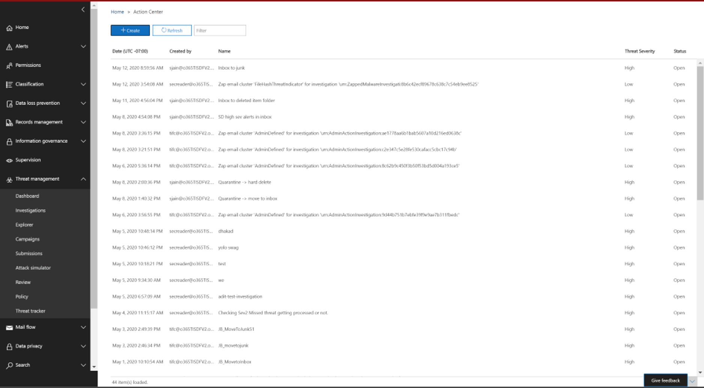

# Исправление вредоносной электронной почты, доставленной в Office 365

[!INCLUDE [Microsoft 365 Defender rebranding](../includes/microsoft-defender-for-office.md)]

**Область применения**
- [Microsoft Defender для Office 365 (план 2)](defender-for-office-365.md)

Исправление означает принятие предписанных действий против угрозы. Вредоносные сообщения электронной почты, отправленные в организацию, могут быть очищены системой, с помощью автоматической очистки нулевого часа (ZAP), или группами безопасности с помощью действий по исправлению, таких как переход в почтовый *ящик,* переход к нежелательной *,* перейти к удаленным элементов,  *мягкое* удаление или жесткое удаление *.* Microsoft Defender для Office 365 P2/E5 позволяет группам безопасности устранять угрозы в функциях электронной почты и совместной работы с помощью ручного и автоматического расследования.

> [!NOTE]
> Чтобы устранять вредоносные сообщения электронной почты, группам безопасности требуется назначенная им роль поиска и очистки.  Назначение ролей делается с помощью разрешений в центре безопасности и соответствия требованиям.

## Что нужно знать перед началом работы

Администраторы могут принимать необходимые меры для сообщений электронной почты,  но для утверждения этих действий им должна быть назначена роль поиска и очистки с помощью разрешений центра **&** \> безопасности. Без роли "поиск и очистка", добавленной в одну из групп ролей, они не смогут выполнить действие.

## Ручное и автоматическое исправление

*Ручная охота* происходит, когда группы безопасности определяют угрозы вручную с помощью возможностей поиска и фильтрации в Обозревателе угроз. Ручное исправление электронной почты может быть вызвано с помощью любого представления электронной почты *(вредоносные* *программы,* фишинг или все сообщения *электронной* почты) после определения набора сообщений электронной почты, которые необходимо устранять.

> [!div class="mx-imgBorder"]
> 

Группы безопасности могут использовать Обозреватель угроз для выбора электронных писем несколькими способами:

- Выберите электронные письма вручную: используйте фильтры в различных представлениях. Выберите до 100 сообщений электронной почты для устранения последствий.

- Выбор запросов. Выберите весь запрос, используя верхнюю **кнопку выберите все.** Этот же запрос также отображается в сведениях о отправке почты центра действий.

- Выбор запросов с исключением. Иногда группам операций безопасности может потребоваться исправление сообщений электронной почты, выбрав весь запрос и исключив определенные сообщения из запроса вручную. Для этого администратор может использовать поле **Выбор** всех проверок и прокручивать вниз, чтобы вручную исключить сообщения электронной почты. В запросе может быть не более 1000 сообщений электронной почты. Максимальное число исключений — 100.

После выбора электронной почты с помощью Обозревателя угроз можно приступить к исправлению путем принятия прямых действий или очереди в очереди на действия:

- Прямое утверждение. Когда действия, такие как переход в почтовый  *ящик,* переход к нежелательной *почте,* переход к удаленным пунктам, мягкое удаление или жесткое удаление, выбираются сотрудниками службы безопасности, которые имеют соответствующие разрешения, а затем выполняются следующие действия по исправлению, процесс восстановления начинает выполнять выбранное действие.  Временное вылет показывает исправление в процессе.

- Двухшаговая утверждение. Действие "добавление к исправлению" может быть принято администраторами, у которых нет соответствующих разрешений или которым необходимо дождаться выполнения действия. В этом случае целевые сообщения электронной почты добавляются в контейнер для восстановления. Утверждение необходимо до выполнения исправлений.

**Автоматические действия по расследованию** и реагированию вызываются оповещениями или группами операций безопасности из Threat Explorer. Они могут включать рекомендуемые действия по исправлению, которые должны быть утверждены командой операций безопасности. Эти действия включены на вкладке **Action** в автоматическом расследовании.

> [!div class="mx-imgBorder"]
> 

Все действия по исправлению (либо прямое утверждение, либо двухшаговая проверка), созданные в Обозревателе угроз, а также утвержденные действия, созданные в результате автоматических расследований, отображаются в Центре действий. Доступ к ним через левую панель навигации в **центре** \> **действий review.**

> [!div class="mx-imgBorder"]
> 

Центр действий показывает все действия по исправлению за последние 30 дней. Действия, принятые через Обозреватель угроз, перечислены по имени, которое группа операций безопасности предоставила при работе с исправлением. Действия, предпринятые с помощью автоматических расследований, имеют заголовки, которые начинаются с связанного оповещения, которое вызвало расследование, например "Кластер электронной почты Zap...".

Откройте любой элемент восстановления, чтобы просмотреть сведения о нем, включая его имя, дату создания, описание, серьезность угрозы и состояние. В нем также показаны следующие две вкладки.

- **Вкладка** отправки почты: отображает количество сообщений электронной почты, отправленных с помощью обозревателя угроз или автоматических расследований, которые необходимо устранять. Эти сообщения могут быть действий или не действий.

  > [!div class="mx-imgBorder"]
  > 

  - **Actionable:** Сообщения электронной почты в следующих расположениях облачных почтовых ящиков можно использовать и перемещать:
    - Inbox;
    - Нежелательное
    - Удалена папка
    - Папка с мягким удалением

      > [!NOTE]
      > В настоящее время только пользователь с доступом к почтовому ящику может восстановить элементы из папки с мягким удалением.

  - **Не может быть** действий: сообщения электронной почты в следующих расположениях не могут быть отдействовать или перемещены в действиях по исправлению:
    - Карантин
    - Папка с жесткой удаляемой папкой
    - Локальное или внешнее
    - Failed/dropped

  Подозрительные сообщения классифицируются как исправленные или неремедиализные. В большинстве случаев исправление и непоправимые сообщения совмещают общие сообщения, отправленные. Но в редких случаях это может быть не так. Это может произойти из-за системных задержек, периодов времени или просроченных сообщений. Срок действия сообщений истекает в зависимости от периода хранения Threat Explorer для организации.

  Если после периода хранения обозревателя угроз в организации не будут исправлены старые сообщения, рекомендуется повторить исправление элементов, если вы видите несоответствия номеров. Для системных задержек обновления исправлений обычно обновляются в течение нескольких часов.

  Если период хранения электронной почты вашей организации в Обозревателе угроз составляет 30 дней, а вы устраняете сообщения, возвращаясь через 29-30 дней, количество отправлений почты может не всегда складываться. Сообщения электронной почты, возможно, уже начали выдвигаться из периода хранения.

  Если исправление на некоторое время застряло в состоянии "В процессе", это, скорее всего, связано с задержками системы. Исправление может занять до нескольких часов. Вы можете увидеть изменения в подсчетах отправки почты, так как некоторые сообщения электронной почты, возможно, не были включены в запрос в начале восстановления из-за системных задержек. В таких случаях необходимо повторить исправление.

  > [!NOTE]
  > Для наилучших результатов исправление должно быть сделано пакетами в 50 000 или меньше.

  При исправлении действуют только исправленные сообщения электронной почты. Немедленные сообщения электронной почты не могут быть исправлены системой электронной почты Office 365, так как они не хранятся в облачных почтовых ящиках.

  Администраторы могут принимать меры по электронной почте в карантине, если это необходимо, но эти сообщения истекают из карантина, если они не будут вручную проглинены. Сообщения электронной почты, на карантин из-за вредоносного контента, недоступны пользователям, поэтому сотрудникам службы безопасности не нужно принимать никаких действий, чтобы избавиться от угроз в карантине. Если сообщения электронной почты являются локальной или внешней, можно связаться с пользователем для устранения подозрительной электронной почты. Или администраторы могут использовать отдельные средства электронной почты или средства безопасности для удаления. Эти сообщения можно определить, применяя расположение доставки *=* внешний фильтр на предварительном основе в Обозревателе угроз. В случае сбоя или сбоя электронной почты или недоступной пользователями электронной почты не будет никакого сообщения, которое можно было бы смягчить, так как эти сообщения не доходят до почтового ящика.

  На следующем изображении показано, как выглядит отправка в Центре действий. Исправление может содержать несколько представлений. Если несколько действий получают одобрение с помощью одного автоматизированного расследования, каждое действие кластера электронной почты или электронной почты отображается в том же исправлении, что и другая отправка.

  > [!div class="mx-imgBorder"]
  > 

  Выберите элемент отправки почты, чтобы показать сведения о том, что исправление, например запрос (когда исправление запускается с помощью автоматизированных расследований или Обозреватель угроз путем выбора запроса) и время начала и окончания исправлений. Он также отображает список сообщений, отправленных на исправление. По мере перемещения сообщений из периода хранения Threat Explorer эти сообщения исчезают из этого списка. В списке также показаны отдельные сообщения, которые исправлены.

- **Журналы** действий. На этой вкладке показаны исправленные сообщения, в том числе утвержденная дата, администратор, утвердивший действие, действие, состояние и количество.

  Состояние может быть:

  - **Начало:** срабатывает исправление.
  - **Очереди.** Исправление в очереди для смягчения последствий сообщений электронной почты.
  - **В процессе.** Продолжается смягчение последствий.
  - **Завершено:** устранение всех исправлений сообщений электронной почты, успешно завершенных или с некоторыми сбоями.
  - **Failed:** Никакие исправлений не были успешными.

  Поскольку можно использовать только исправленные сообщения электронной почты, очистка каждой электронной почты отображается как успешная или неудачная. Из общего количества исправлений сообщений электронной почты сообщается об успешных и неудачных устранениях.

  - **Успех:** было выполнено необходимое действие по исправлению сообщений электронной почты. Например: администратор хочет удалить сообщения электронной почты из почтовых ящиков, поэтому администратор принимает меры по мягкому удалению электронных сообщений. Если исправление электронной почты не найдено в исходной папке после принятия решения, состояние будет показываться как успешное.

  - **Сбой.** Желаемое действие по исправлению сообщений электронной почты не удалось. Например: администратор хочет удалить сообщения электронной почты из почтовых ящиков, поэтому администратор принимает меры по мягкому удалению электронных сообщений. Если исправление электронной почты по-прежнему находится в почтовом ящике после принятия решения, состояние будет показываться как неудалось.
  
  - **Уже в пункте** назначения. Необходимое действие уже было принято по электронной почте или электронной почте, уже существовав в пункте назначения. Например: сообщение электронной почты было удалено администратором через Explorer в первый день. Затем аналогичные сообщения электронной почты покажут на 2-й день, которые снова являются мягкими, удаленными администратором. При выборе этих электронных писем администратор в итоге выбирает некоторые электронные сообщения с первого дня, которые уже удалены. Теперь эти сообщения не будут действовать снова, они будут просто показываться как "уже в пункте назначения", так как никаких действий по ним не было принято, так как они существовали в месте назначения.

  Выберите любой элемент в журнале действий, чтобы отобразить сведения о исправлении. Если сведения говорят "успешно" или "не найдено в почтовом ящике", этот элемент уже был удален из почтового ящика. Иногда при исправлении имеется системная ошибка. В таких случаях лучше повторить исправление.

  В случае устранения больших пакетов можно также экспортировать сообщения, отправленные для устранения, через отправку почты и сообщения, которые были исправлены с помощью журналов действий. Ограничение экспорта увеличивается до 100 тыс. записей.

Группа безопасности может принимать до 50 одновременно исправлений вручную; однако для автоматических действий по расследованию и реагированию не установлено никаких ограничений.

  Исправление является мощным средством для смягчения угроз и устранения подозрительных сообщений электронной почты. Это помогает обеспечить безопасность организации.
