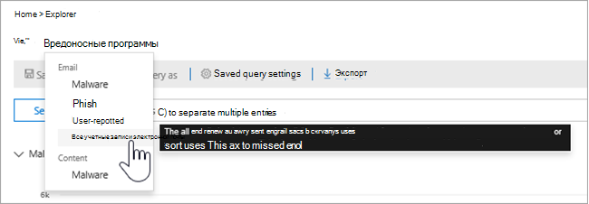
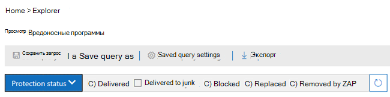
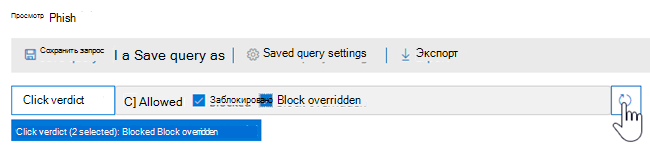
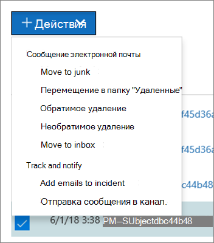

# Представления в Обозревателе угроз и обнаружения в режиме реального времени

[!INCLUDE [Microsoft 365 Defender rebranding](../includes/microsoft-defender-for-office.md)]

**Область применения**
- [Microsoft Defender для Office 365 (план 1 и план 2)](defender-for-office-365.md)
- [Microsoft 365 Defender](../defender/microsoft-365-defender.md)

[Обозреватель](threat-explorer.md) угроз (и отчет об обнаружении в режиме реального времени) — это мощное средство в режиме реального времени, помогая группам по операциям безопасности исследовать и реагировать на угрозы в Центре & соответствия требованиям. Explorer (и отчет об обнаружении в режиме реального времени) отображает сведения о подозрительных вредоносных программах и фишинге в электронной почте и файлах в Office 365, а также о других угрозах и рисках для вашей организации.

- Если у вас [есть Microsoft Defender для Office 365](defender-for-office-365.md) Plan 2, у вас есть Explorer.
- Если у вас есть Microsoft Defender для Office 365 Plan 1, у вас есть обнаружения в режиме реального времени.

Когда вы впервые откроете Explorer (или отчет об обнаружении в режиме реального времени), в представлении по умолчанию показано обнаружение вредоносных программ по электронной почте в течение последних 7 дней. В этом отчете также могут быть обнаружены обнаружения Microsoft Defender для Office 365, такие как вредоносные URL-адреса, обнаруженные службами безопасных ссылок, и вредоносные файлы, обнаруженные в безопасных [вложениях.](safe-attachments.md) Этот отчет можно изменить, чтобы показать данные за последние 30 дней (с платной подпиской Microsoft Defender для Office 365 P2). Пробные подписки будут включать данные только за последние семь дней.

****

|Подписка|Служебная программа|Дни данных|
|---|---|---|
|Пробная версия Microsoft Defender для Office 365 P1|Обнаружение в режиме реального времени|7 |
|Microsoft Defender для Office 365 P1 платная|Обнаружение в режиме реального времени|30|
|Microsoft Defender для Office 365 P1 оплатил тестирование Defender для пробной пробной программы Office 365 P2|Обозреватель угроз|7 |
|Пробная версия Microsoft Defender для Office 365 P2|Обозреватель угроз|7 |
|Microsoft Defender для Office 365 P2 платная|Обозреватель угроз|30|
|

> [!NOTE]
> В ближайшее время мы расширяем ограничение хранения и поиска данных Explorer (и обнаружения в режиме реального времени) для пробных клиентов с 7 до 30 дней. Это изменение отслеживается в рамках элемента дорожной карты No 70544 и в настоящее время находится на этапе выкатки.

Чтобы изменить отображаемую информацию, используйте меню **Просмотр.** Инструменты помогают определить, какой вид использовать.

После выбора представления можно применить фильтры и настроить запросы для дальнейшего анализа. В следующих разделах представлен краткий обзор различных представлений, доступных в Explorer (или обнаружения в режиме реального времени).

## Вредоносные программы > электронной почты

Чтобы просмотреть этот отчет, в Explorer (или обнаружения в режиме реального времени) выберите **Просмотр вредоносных** программ \> **электронной** \> **почты**. В этом представлении показаны сведения о сообщениях электронной почты, которые были определены как содержащие вредоносные программы.

Щелкните **Отправитель,** чтобы открыть список параметров просмотра. Используйте этот список для просмотра данных отправительством, получателями, доменом отправитель, предметом, технологией обнаружения, состоянием защиты и более.

Например, чтобы узнать, какие действия были приняты при обнаружении сообщений электронной почты, выберите **состояние защиты** в списке. Выберите параметр, а затем нажмите кнопку Обновить, чтобы применить этот фильтр к отчету.

Ниже диаграммы см. дополнительные сведения о конкретных сообщениях. При выборе элемента в списке открывается поле для вылетов, где можно узнать больше о выбранном элементе.

## Фишинг > электронной почты

Чтобы просмотреть этот отчет, в Explorer (или обнаружения в режиме реального времени) выберите **Просмотр** \> **фишинга** \> **электронной почты**. В этом представлении показаны сообщения электронной почты, идентифицированные как попытки фишинга.

Щелкните **Отправитель,** чтобы открыть список параметров просмотра. Используйте этот список для просмотра данных отправив, получателей, домена отправитель, IP-адрес отправитель, URL-адрес, щелкните вердикт и другие.

Например, чтобы узнать, какие действия были предприняты при нажатии на  URL-адреса, которые были идентифицированы как попытки фишинга, выберите нажмите кнопку Нажмите кнопку Вердикт в списке, выберите один или несколько параметров, а затем нажмите кнопку Обновить.

Ниже диаграммы см. дополнительные сведения о конкретных сообщениях, url-адресах, URL-адресах и происхождении электронной почты.

При выборе элемента в списке, например обнаруженного URL-адреса, открывается флайер, где можно узнать больше о выбранном элементе.

## Отправка > электронной почты

Чтобы просмотреть этот отчет, в Explorer (или обнаружения в режиме реального времени) выберите **Просмотр** \>  \> **отправки электронной почты**. В этом представлении показано сообщение электронной почты, которое пользователи сообщали как нежелательное, а не нежелательное или фишинговое.

Щелкните **Отправитель,** чтобы открыть список параметров просмотра. Используйте этот список для просмотра сведений отправив, получателей, типа отчетов (определение пользователя о том, что электронная почта является нежелательной, а не нежелательной или фишинговой) и другие.

Например, чтобы просмотреть сведения о сообщениях электронной почты, которые сообщались как попытки фишинга, щелкните тип **отчетов** отправитель, выберите Фишинг, а затем нажмите \> кнопку Обновить.

Ниже диаграммы см. дополнительные сведения о конкретных сообщениях электронной почты, таких как строка темы, IP-адрес отправитель, пользователь, который сообщил сообщение как нежелательное, а не нежелательное или фишинговое, и другие.

Выберите элемент в списке, чтобы просмотреть дополнительные сведения.

## Электронная > Вся электронная почта

Чтобы просмотреть этот отчет, в Проводнике выберите **Просмотр** \>  \> **электронной почты вся почта**. В этих представлениях показано представление об активности электронной почты, включая сообщения электронной почты, идентифицированные как вредоносные из-за фишинга или вредоносных программ, а также все не вредоносные сообщения (обычная электронная почта, спам и массовая почта).

> [!NOTE]
> Если вы получаете ошибку, которая читает слишком много данных для **отображения,** добавьте фильтр и, при необходимости, сузить диапазон дат, который вы просматриваете.

Чтобы применить фильтр, выберите **отправитель,** выберите элемент в списке и нажмите кнопку Обновить. В нашем примере в качестве фильтра используется технология **Detection** (доступно несколько вариантов). Просмотр сведений по отправителю, домену отправитель, получателям, субъекту, имени файла вложения, семейство вредоносных программ, состояние защиты (действия, предпринятые функциями и политиками защиты от угроз в Office 365), технологии обнаружения (как было обнаружено вредоносное ПО) и другие.

Ниже диаграммы см. дополнительные сведения о конкретных сообщениях электронной почты, таких как строка темы, получатель, отправитель, состояние и так далее.

## Вредоносные программы > контента

Чтобы просмотреть этот отчет, в Explorer (или обнаружения в режиме реального времени) выберите **Просмотр** \> **вредоносных программ** \> **содержимого**. В этом представлении показаны файлы, которые были идентифицированы microsoft [Defender для Office 365 в SharePoint Online, OneDrive для](mdo-for-spo-odb-and-teams.md)бизнеса и Microsoft Teams.

Просмотр сведений семейства вредоносных программ, технологии обнаружения (как было обнаружено вредоносное ПО) и рабочей нагрузки (OneDrive, SharePoint или Teams).

Ниже диаграммы см. дополнительные сведения о конкретных файлах, таких как имя файла вложения, рабочая нагрузка, размер файла, которые в последний раз изменили файл и другие.

## Возможности "Щелкнуть на фильтр"

С помощью Explorer (и обнаружения в режиме реального времени) можно применить фильтр одним щелчком мыши. Щелкните элемент в легенде, и этот элемент станет фильтром для отчета. Например, предположим, что мы рассматриваем представление вредоносных программ в Explorer:

**Щелкнув atP Detonation** на этой диаграмме, вы можете увидеть это:

В этом представлении мы сейчас рассматриваем данные для файлов, которые были взорваны с помощью [безопасных вложений.](safe-attachments.md) Ниже диаграммы приведены сведения о конкретных сообщениях электронной почты, которые были обнаружены вложениями, обнаруженными в безопасных вложениях.

Выбор одного или нескольких элементов активирует меню **Действия,** которое предлагает несколько вариантов выбора для выбранного элемента(ы).

Возможность фильтрации в щелчке мыши и переход к конкретным деталям может сэкономить много времени при расследовании угроз.

## Запросы и фильтры

Explorer (а также отчет о обнаружениях в режиме реального времени) имеет несколько мощных фильтров и возможностей запроса, которые позволяют подробно и подробно и подробно, например, топовых пользователей, семейства вредоносных программ, технологию обнаружения и другие. Каждый вид отчета предлагает различные способы просмотра и изучения данных.

> [!IMPORTANT]
> Не используйте символы подтекста, такие как звездочка или знак вопроса, в панели запросов для Explorer (или обнаружения в режиме реального времени). При поиске в поле **Subject** сообщений электронной почты Explorer (или обнаружения в режиме реального времени) выполнит частичное соответствие и результаты, аналогичные поиску подтекстов.
